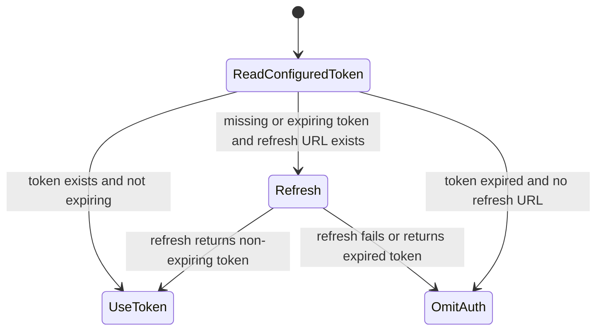
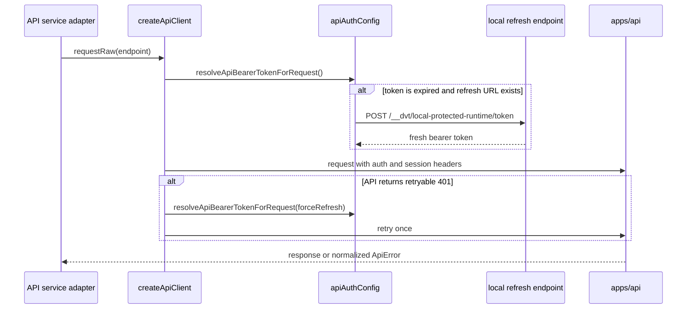

# API Client Auth Component

## Purpose

This guide defines the local frontend component that supplies bearer-token
posture to `createApiClient()` without moving authentication policy into route
views.

The component is intentionally narrow:

- production auth remains owned by the protected runtime and OIDC posture;
- the coordinated local dev stack may expose a bounded refresh endpoint for
  local protected-runtime sessions;
- frontend API calls must not send a JWT that is already expired or inside the
  refresh skew.

## Public API

| API                                 | Owner                            | Responsibility                                                        |
| ----------------------------------- | -------------------------------- | --------------------------------------------------------------------- |
| `resolveApiBearerToken(...)`        | `apiAuthConfig.ts`               | Read the configured bearer token from the active environment.         |
| `resolveApiBearerTokenRefreshUrl`   | `apiAuthConfig.ts`               | Read `VITE_API_BEARER_TOKEN_REFRESH_URL` when present.                |
| `canRefreshApiBearerToken(...)`     | `apiAuthConfig.ts`               | Tell transport code whether a refresh path is available.              |
| `resolveApiBearerTokenForRequest`   | `apiAuthConfig.ts`               | Return a fresh usable token or omit auth when a token is expired.     |
| `createApiClient().requestRaw(...)` | `createApiClient.ts`             | Attach auth/session headers and retry one retryable `401` request.    |
| `startLocalProtectedRuntimeAuth`    | `scripts/run-dev-stack.auth.cjs` | Start the local JWKS posture and refresh endpoint for `pnpm dev:app`. |

## Invariants

- Views, route controllers, and service adapters do not decode JWTs.
- `apiAuthConfig.ts` owns token expiration inspection and refresh URL lookup.
- `createApiClient.ts` owns transport retry policy and must retry at most once
  after a `401`.
- Request bodies are retryable only when absent or string-backed.
- Expired tokens are omitted when no refresh endpoint is available.
- The local refresh endpoint is a dev-stack bootstrap aid. It is not a product
  login flow and must not be documented as one.
- Session headers remain attached by `createApiClient()` when requested; token
  refresh must not bypass tenant/project scoping.

## Transitions

### Request auth resolution

### Protected request retry

## Consumers

Direct consumers:

- `createApiClient.ts`
- API-mode workspace, plans, runs, capabilities, and plugin services
- `scripts/run-dev-stack.auth.cjs`
- `scripts/run-selected-closure-live-proof.cjs`

Indirect consumers:

- Canvas protected draft reads and saves
- startup capability and backend-health checks
- live browser proof lanes that run through `pnpm dev:app`

## Fowler Reading

| Pattern             | Local expression            | Maturity rule                                                 |
| ------------------- | --------------------------- | ------------------------------------------------------------- |
| Gateway             | `createApiClient()`         | One transport boundary owns auth/session headers.             |
| Policy Object       | `apiAuthConfig.ts`          | Token expiry and refresh eligibility are testable outside UI. |
| Circuit Breaker     | one retry after `401`       | Retry is bounded and only runs when the body is safe.         |
| Application Service | local dev-stack auth server | Dev bootstrap satisfies the real protected-runtime contract.  |

## Negative Coverage

Primary tests:

- `apps/web/src/app/services/api/createApiClient.test.ts`
- `scripts/run-dev-stack.auth.test.cjs`
- `apps/web/src/app/views/canvas/canvasStartupAndDraftRecovery.architecture.test.ts`

The guard verifies that auth refresh remains in the API client component and
does not drift into Canvas route code.

## Drift To Watch

- Do not add route-level JWT decoding as a Canvas workaround.
- Do not make the local refresh endpoint a product login or permission model.
- Do not retry non-replayable request bodies after `401`.
- Do not let a stale token produce a "draft denied" UI when a dev-stack refresh
  endpoint can issue a fresh token.
