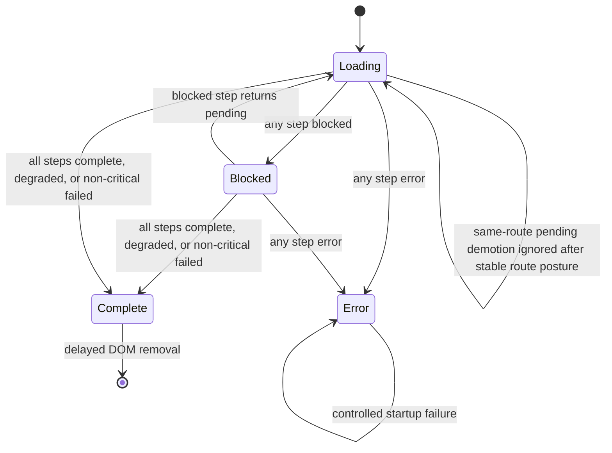
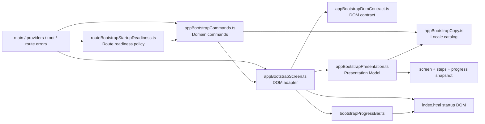
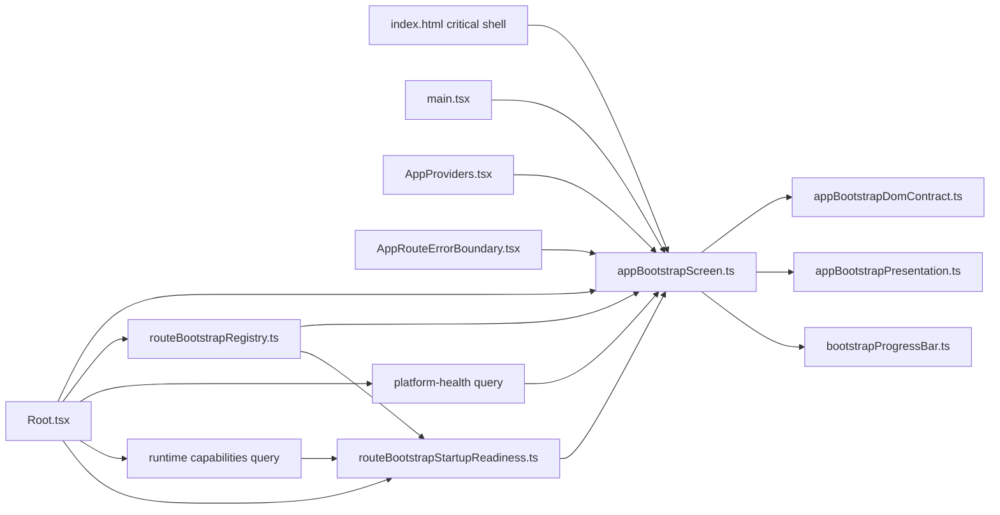

# App Bootstrap Screen Component

## Owned Concern

The app bootstrap screen owns the pre-React Raven startup gate. It keeps a
single visible startup surface alive while the browser shell mounts, services
compose, runtime capabilities settle, platform health resolves, and the active
route publishes operability.

The component is split into a pure Presentation Model and a DOM adapter:

- `appBootstrapPresentation.ts` owns startup copy, step ordering, aggregate
  state transitions, completion rules, progress snapshots, and build-date
  formatting.
- `appBootstrapCopy.ts` owns the locale catalog used by bootstrap presentation
  and shell-publisher command factories.
- `appBootstrapCommands.ts` owns the domain command objects emitted by shell,
  provider, health, capability, and route publishers.
- `appBootstrapDomContract.ts` owns the critical HTML IDs, selectors, and
  static ARIA contract shared by the adapter and tests.
- `appBootstrapScreen.ts` owns DOM lookup, ARIA writes, metadata writes, and
  the exported control API used by the rest of the app.
- `routeBootstrapStartupReadiness.ts` owns the route readiness read model that
  adapts active-route publication and runtime capability cold-start posture into
  the single route-step command accepted by the bootstrap screen.

It does not own route-specific readiness, backend contract semantics, or Canvas
draft truth. Those concerns publish into this component through typed route and
health/bootstrap adapters.

## Public API

| API                               | Owned behavior                                                              |
| --------------------------------- | --------------------------------------------------------------------------- |
| `startBootstrapScreen()`          | Resets step state, writes initial detail copy, metadata, progress, and ARIA |
| `setBootstrapStepStatus(command)` | Applies one typed startup-step command and re-derives aggregate state       |
| `completeBootstrapScreen()`       | Removes the screen only after every step reaches an allowed terminal state  |
| `showBootstrapFailure(command)`   | Converts startup exceptions into the single controlled error screen         |
| `isBootstrapScreenVisible()`      | Allows route error boundaries to avoid stacking a second error surface      |
| `renderBootstrapProgress()`       | Renders progress from an already resolved bootstrap snapshot                |
| `BootstrapStepStatusCommand`      | Public command object for step, status, and optional detail copy            |
| `BootstrapFailureCommand`         | Public command object for controlled startup failure copy                   |

## Route Readiness Policy API

| API                                                  | Owned behavior                                                                |
| ---------------------------------------------------- | ----------------------------------------------------------------------------- |
| `RouteBootstrapStartupReadinessState`                | Browser-local read model for same-route stable route posture                  |
| `createInitialRouteBootstrapStartupReadinessState()` | Creates an empty route-readiness state before the active route publishes      |
| `resolveRouteBootstrapStartupReadiness(args)`        | Resolves the effective route command and can-complete posture for `RootShell` |

## Domain Command API

| Factory                                        | Domain event represented                                 |
| ---------------------------------------------- | -------------------------------------------------------- |
| `createHydrationCompleteBootstrapCommand()`    | React shell hydration settled                            |
| `createServicesReadyBootstrapCommand()`        | App services and query client are available              |
| `createCapabilitiesPendingBootstrapCommand()`  | Runtime-capability bootstrap is still loading            |
| `createCapabilitiesFallbackBootstrapCommand()` | Runtime capabilities failed and shell fallback is active |
| `createCapabilitiesReadyBootstrapCommand()`    | Runtime capabilities are available                       |
| `createHealthPendingBootstrapCommand()`        | Platform health bootstrap is still loading               |
| `createHealthFailedBootstrapCommand()`         | Platform health failed without blocking route render     |
| `createHealthDegradedBootstrapCommand()`       | Platform health settled in degraded posture              |
| `createHealthReadyBootstrapCommand()`          | Platform health is settled                               |
| `createRouteBootstrapStepCommand()`            | Active route published its bootstrap posture             |
| `createBootstrapFailureCommand()`              | React route startup raised a controlled failure          |

Publishers call these factories instead of assembling localized strings or
positional tuples directly.

## Presentation Model API

| API                                    | Owned behavior                                                                |
| -------------------------------------- | ----------------------------------------------------------------------------- |
| `BOOTSTRAP_STEP_ORDER`                 | Canonical order for startup step rendering and aggregate readiness            |
| `createInitialBootstrapStepState()`    | Produces the initial pending state with default details                       |
| `createBootstrapStepState()`           | Resolves one typed step state with caller detail or default presentation copy |
| `resolveBootstrapScreenPresentation()` | Derives screen copy, announcement state, step presentations, and progress     |
| `canCompleteBootstrapSteps()`          | Validates the terminal-state invariant before DOM removal                     |
| `formatBootstrapBuildDate()`           | Normalizes build metadata for the critical startup shell                      |

## Invariants

- The startup screen remains visible while any critical step is `pending`,
  `blocked`, or `error`.
- `blocked` and `error` states do not reveal the workbench behind the startup
  gate.
- A transport-level health failure is a visible failed startup check, not a
  degraded check. It is non-blocking for shell reveal when the active route can
  render a governed failure state.
- Backend/offline readiness in API runtime blocks unsafe Canvas interactions
  inside the Canvas route, but it does not keep the pre-React startup gate
  visible once the route can render that blocker as its first useful surface.
- Once a platform-health probe has failed, automatic retries must not demote
  the visible startup posture back to cold-start `pending`; retries update
  detail copy in place while the gate stays settled.
- A route `complete` publication must not appear as route-ready while runtime
  capabilities are still in cold-start `pending`.
- A same-route stable route posture, including `complete`, `failed`, `blocked`,
  or `error`, must not regress to `pending` just because a route seam republishes
  its initial posture.
- Route-readiness stability is scoped to the active route id. Navigating to a
  different route resets the stable route posture.
- `completeBootstrapScreen()` is a guard, not a command override; it cannot
  remove the screen until all steps are terminally allowed.
- ARIA state is owned by the bootstrap state machine: `aria-busy="true"` before
  completion and `aria-busy="false"` after completion.
- The HTML shell provides critical markup and CSS before React loads; React
  components do not need to mount before users see deterministic startup status.
- Visual posture stays operational: compact brand, ordered status flow,
  readiness segments, and build metadata instead of a decorative hero image or
  a misleading percentage bar.

## Transitions

## Component Boundary

## Consumer Topology

## Consumers

- `apps/web/index.html` owns the critical HTML and CSS shell.
- `apps/web/src/main.tsx` starts the screen and completes the hydration step.
- `apps/web/src/app/AppProviders.tsx` publishes service/provider readiness.
- `apps/web/src/app/Root.tsx` publishes capability, platform health, and active
  route posture.
- `apps/web/src/app/AppRouteErrorBoundary.tsx` uses visibility state to avoid a
  second failure surface while bootstrap is still visible.

## Test Coverage

- `apps/web/src/app/bootstrap/appBootstrapPresentation.test.ts` covers
  presentation-model defaults, completion rules, blocked/error precedence,
  non-critical health failure, and build metadata formatting.
- `apps/web/src/app/bootstrap/appBootstrapScreen.test.ts` covers blocked,
  failure, production HTML shell contract, centralized DOM contract ownership,
  metadata, completion, and ARIA busy-state semantics.
- `apps/web/src/app/Root.bootstrapFlow.test.tsx` covers root-to-bootstrap
  integration for health, capabilities, route blocks, route completion, and
  route completion suppression while capabilities are pending.
- `apps/web/src/app/bootstrap/routeBootstrapStartupReadiness.test.ts` covers
  policy-level negative paths for capability ordering, same-route pending
  demotion, failure recovery, and route-id reset.
- `apps/web/src/app/bootstrap/routeBootstrapStartupReadiness.architecture.test.ts`
  guards policy ownership, Root wiring, and documentation alignment.
- `apps/web/cypress/e2e/shell/startup-route-readiness.cy.ts` proves the
  user-visible startup gate does not show the fifth check as ready before
  runtime capabilities settle.

## Command/Query Rail

| Rail                                | Type    | DDD owner                                        | Consumers               |
| ----------------------------------- | ------- | ------------------------------------------------ | ----------------------- |
| `ObserveAppBootstrapRouteReadiness` | query   | `RouteBootstrapStartupReadinessState` read model | `RootShell`             |
| `PublishAppBootstrapStepStatus`     | command | `BootstrapStepStatusCommand` value object        | `appBootstrapScreen.ts` |
| `CompleteAppBootstrapScreen`        | command | `BootstrapScreenState` presentation aggregate    | `appBootstrapScreen.ts` |

## Governance Drift Guard

- `tools/ci/planning-truth-sync.test.mjs` protects the planning truth for the
  related Canvas runtime-policy closure that feeds route startup posture.
