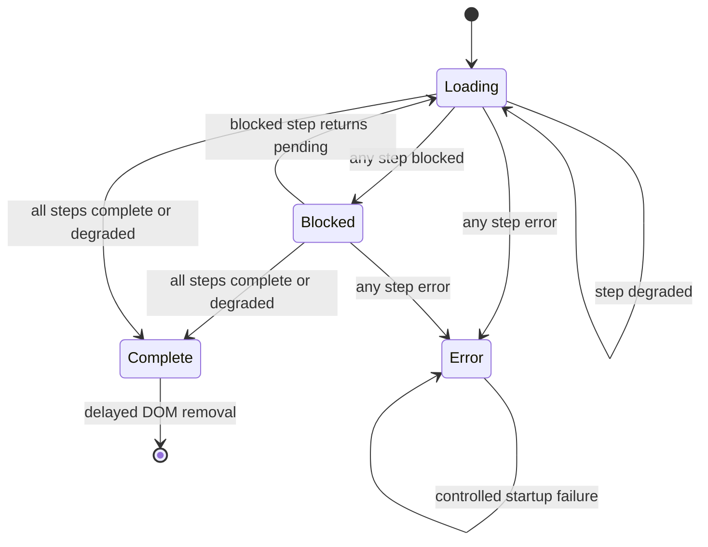
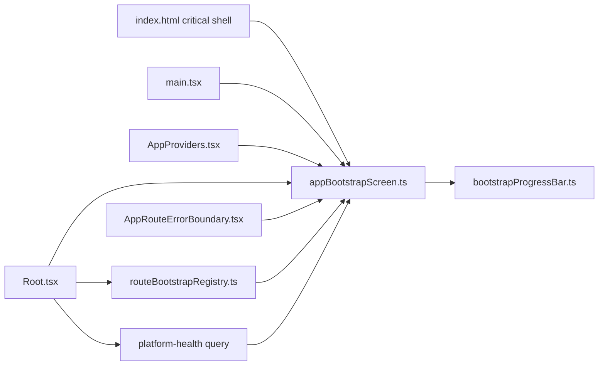

# App Bootstrap Screen Component

## Owned Concern

The app bootstrap screen owns the pre-React Raven startup gate. It keeps a
single visible startup surface alive while the browser shell mounts, services
compose, runtime capabilities settle, platform health resolves, and the active
route publishes operability.

It does not own route-specific readiness, backend contract semantics, or Canvas
draft truth. Those concerns publish into this component through typed route and
health/bootstrap adapters.

## Public API

| API                          | Owned behavior                                                              |
| ---------------------------- | --------------------------------------------------------------------------- |
| `startBootstrapScreen()`     | Resets step state, writes initial detail copy, metadata, progress, and ARIA |
| `setBootstrapStepStatus()`   | Updates one startup step and re-derives the aggregate screen state          |
| `completeBootstrapScreen()`  | Removes the screen only after every critical step is complete or degraded   |
| `showBootstrapFailure()`     | Converts startup exceptions into the single controlled error screen         |
| `isBootstrapScreenVisible()` | Allows route error boundaries to avoid stacking a second error surface      |
| `renderBootstrapProgress()`  | Renders progress from an already resolved bootstrap snapshot                |

## Invariants

- The startup screen remains visible while any critical step is `pending`,
  `blocked`, or `error`.
- `blocked` and `error` states do not reveal the workbench behind the startup
  gate.
- `completeBootstrapScreen()` is a guard, not a command override; it cannot
  remove the screen until all steps are terminally allowed.
- ARIA state is owned by the bootstrap state machine: `aria-busy="true"` before
  completion and `aria-busy="false"` after completion.
- The HTML shell provides critical markup and CSS before React loads; React
  components do not need to mount before users see deterministic startup status.
- Visual posture stays operational: compact brand, ordered status flow, progress
  evidence, and build metadata instead of a decorative hero image.

## Transitions

## Consumer Topology

## Consumers

- `apps/web/index.html` owns the critical HTML and CSS shell.
- `apps/web/src/main.tsx` starts the screen and completes the hydration step.
- `apps/web/src/app/AppProviders.tsx` publishes service/provider readiness.
- `apps/web/src/app/Root.tsx` publishes capability, platform health, and active
  route posture.
- `apps/web/src/app/AppRouteErrorBoundary.tsx` uses visibility state to avoid a
  second failure surface while bootstrap is still visible.

## Test Coverage

- `apps/web/src/app/bootstrap/appBootstrapScreen.test.ts` covers blocked,
  failure, metadata, completion, and ARIA busy-state semantics.
- `apps/web/src/app/Root.bootstrapFlow.test.tsx` covers root-to-bootstrap
  integration for health, capabilities, route blocks, and route completion.
- `tools/ci/planning-truth-sync.test.mjs` protects the planning truth for the
  related Canvas runtime-policy closure that feeds route startup posture.
