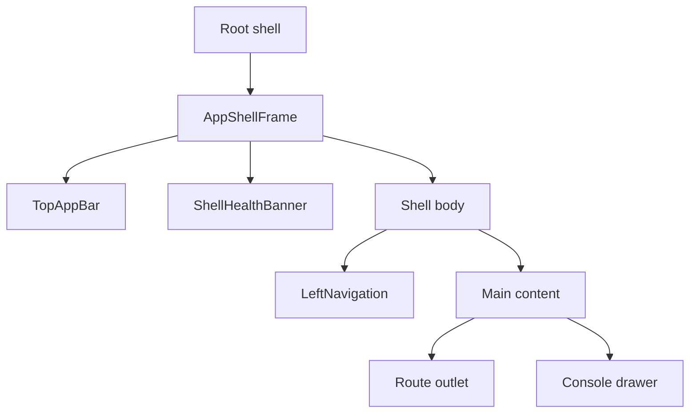
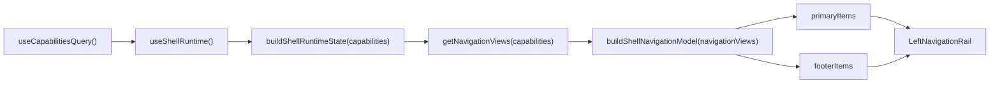
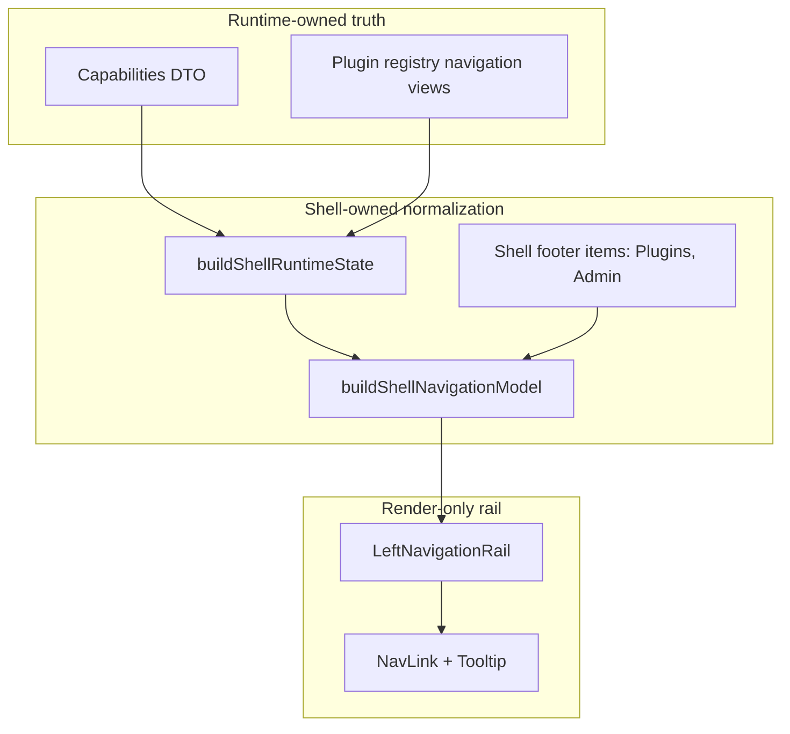

# App Shell

## Purpose

The App Shell is the persistent runtime frame of the DVT frontend.

It owns app bootstrap, route framing, top-level navigation, health visibility,
and the shared layout around every routed view.

## Current Implementation

Primary code anchors:

- [App.tsx](../../../../../apps/web/src/app/App.tsx)
- [Root.tsx](../../../../../apps/web/src/app/Root.tsx)
- [routes.ts](../../../../../apps/web/src/app/routes.ts)
- [AppShellFrame.tsx](../../../../../apps/web/src/app/components/shell/AppShellFrame.tsx)
- [TopAppBar.tsx](../../../../../apps/web/src/app/components/TopAppBar.tsx)
- [LeftNavigation.tsx](../../../../../apps/web/src/app/components/LeftNavigation.tsx)

Current shell regions:

## Shell Service Composition

The shell is also the composition boundary for frontend data source mode and
service wiring.

`Root` mounts `AppServicesProvider`, which resolves `VITE_DATA_SOURCE` once and
composes typed service instances for views and plugins through hooks.

This prevents route-level components from instantiating mode-aware services or
reading `resolveDataSource()` directly.

## Shell Navigation Ownership

The left rail now follows the same boundary rule as the rest of the shell:

- runtime capability data decides which plugin-contributed views are available;
- the shell normalizes those runtime views into a render-ready navigation model;
- the rail renders plain navigation items and does not know plugin manifest
  structure, label resolution, or shell footer ownership.

Current flow:

Responsibility split:

Rules for this seam:

- `LeftNavigation.tsx` must not import `resolveString`, plugin manifests, or
  fixed shell footer item definitions;
- plugin-contributed views become `primaryItems` inside the shell model;
- shell-owned routes such as `Plugins` and `Admin` stay in `footerItems`;
- the rail consumes render-ready `{ to, label, icon }` items and stays focused
  on navigation chrome and routing behavior.

## UX Rules

- the top bar stays visible across all routed views;
- platform-health state must be visible without entering a diagnostic route;
- focus mode hides secondary chrome but keeps the active view intact;
- route switches should not remount the entire shell frame.

## Mature Libraries And References

- base shell primitives:
  [Radix Primitives](https://www.radix-ui.com/primitives),
  [shadcn/ui](https://ui.shadcn.com/)
- workbench precedent:
  [VS Code](https://github.com/microsoft/vscode)

## Current Constraints

- the shell store still carries too much non-shell state through `appStore.ts`;
- some shell quick actions are placeholders and not yet connected to governed
  behavior;
- the console drawer exists as a shell primitive, but the product-level console
  story is not yet fully hardened.

## Current-To-Target Mapping

The shell already exists in working form. The current step is to keep making
the extracted primitives honest and small.

| Target primitive      | Current anchor                                                                                                                                                                        | Decision                                                                  |
| --------------------- | ------------------------------------------------------------------------------------------------------------------------------------------------------------------------------------- | ------------------------------------------------------------------------- |
| `AppShellFrame`       | [`AppShellFrame.tsx`](../../../../../apps/web/src/app/components/shell/AppShellFrame.tsx) plus [`Root.tsx`](../../../../../apps/web/src/app/Root.tsx)                                 | keep the extracted shell frame small and behavior-preserving              |
| `ShellTopBar`         | [`TopAppBar.tsx`](../../../../../apps/web/src/app/components/TopAppBar.tsx)                                                                                                           | keep the global context behavior, narrow the contract, and token-clean it |
| `LeftNavigationRail`  | [`LeftNavigation.tsx`](../../../../../apps/web/src/app/components/LeftNavigation.tsx) plus [`shellNavigationModel.ts`](../../../../../apps/web/src/app/shell/shellNavigationModel.ts) | keep render-only rail plus shell-owned navigation model                   |
| `ShellHealthBanner`   | [`ShellHealthBanner.tsx`](../../../../../apps/web/src/app/components/ShellHealthBanner.tsx)                                                                                           | keep and restyle through semantic tokens                                  |
| `BottomConsoleDrawer` | [`Console.tsx`](../../../../../apps/web/src/app/components/Console.tsx) rendered through [`AppShellFrame.tsx`](../../../../../apps/web/src/app/components/shell/AppShellFrame.tsx)    | keep the drawer pattern, harden content model later                       |

## Shell Organization Rules

The shell layer should become explicit in code structure:

- `components/ui`: low-level library primitives only;
- `components/shell`: top bar, navigation rail, health banner, console drawer,
  and shell-only helpers;
- `components/workbench`: route-level shared layout primitives used by multiple
  views;
- `views/<route>`: route composition and route-only components.

This matters because the current shell pieces are real, but they still live as
standalone feature files instead of as an intentional shell package boundary.

## Store Boundary Rule

The current [`appStore.ts`](../../../../../apps/web/src/app/stores/appStore.ts)
mixes shell state, route state, execution state, and graph state.

Target direction:

- shell store: focus mode, shell drawer visibility, nav state, health display
  preferences;
- canvas/workbench store: route-local selection, viewport, and panel state;
- server state: queries stay in TanStack Query, not in Zustand;
- execution state: current run and run detail should not stay coupled to shell
  layout concerns.

Legacy warning:

- [`stores/index.ts`](../../../../../apps/web/src/app/stores/index.ts) is a
  duplicate store surface from an older architecture path and should not be the
  basis for new shell work.

## Related Pages

- [Main Workspace Views And UX](../main-workspace-views-and-ux.md)
- [UX Implementation Guide](../ux-implementation-guide.md)
- [Workbench UI Contract And Component Inventory](../workbench-ui-contract-and-component-inventory.md)
- [Data Source Service Boundary](./data-source-service-boundary.md)
- [Library And Open-Source Reference Stack](../library-and-open-source-reference-stack.md)
