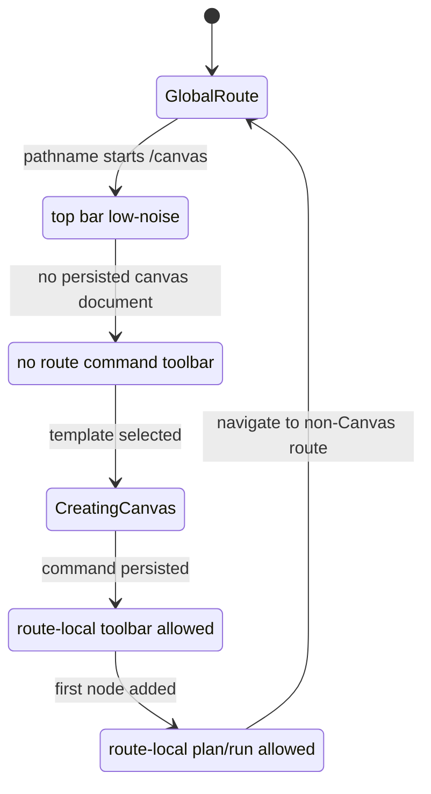
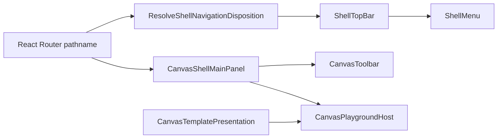
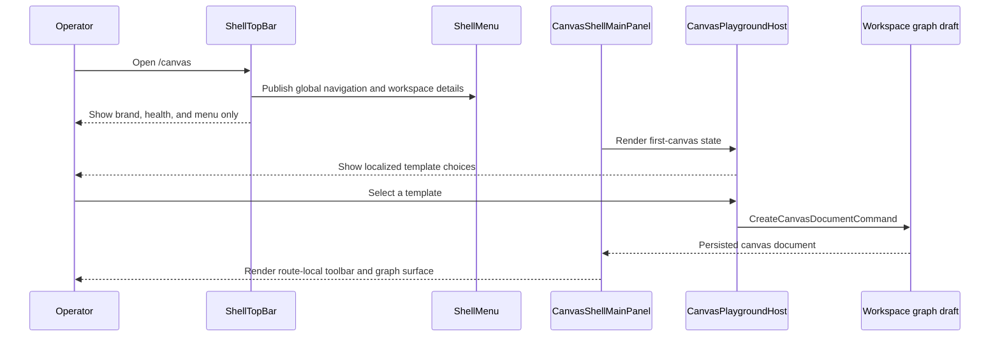

# Canvas Workbench Screen Composition Component

## Owned Concern

This component owns the whole `/canvas` workbench screen composition at the
boundary between persistent shell chrome and Canvas route chrome. It decides
where global navigation, workspace context, Canvas commands, first-document
copy, and visual preferences are presented.

It does not own graph persistence, protected draft semantics, Admin route
behavior, Plugins route behavior, or backend contracts.

## Public API

| API                          | Kind                   | Responsibility                                                                                                  |
| ---------------------------- | ---------------------- | --------------------------------------------------------------------------------------------------------------- |
| `ShellTopBar`                | shell renderer         | Renders low-noise global chrome and delegates hidden route-family controls to `ShellMenu`.                      |
| `ShellMenu`                  | shell renderer         | Renders global navigation, workspace context, view controls, and active Canvas view contributions.              |
| `CanvasShellMainPanel`       | Canvas route renderer  | Places Canvas tabs, route-local toolbar, banners, viewport, and center-surface states.                          |
| `CanvasToolbar`              | Canvas route renderer  | Renders graph/document commands only inside the Canvas workbench.                                               |
| `CanvasTemplatePresentation` | presentation model     | Resolves route-visible first-canvas template title and description from a `CanvasKindRegistration` plus locale. |
| `CanvasPlaygroundHost`       | Canvas host controller | Builds `CreateCanvasDocumentCommand` from the selected template presentation.                                   |

## Invariants

- Canvas workbench routes do not mount a permanent left navigation rail.
- Canvas route commands must not render inside the persistent global top bar.
- `ShellTopBar` may show global health and the menu trigger; route-local Canvas
  command controls belong in Canvas workbench chrome.
- `Admin` and `Plugins` remain reachable when the rail is hidden.
- The first-canvas state must not show disabled Plan, Run, Export, or Import
  controls before a canvas document exists.
- Workspace context is read-only on the Canvas entry screen. Switching project,
  tenant, or environment belongs to a separate governed flow.
- Visible first-canvas template title and description are resolved by a
  presentation model, not by leaking raw plugin registry strings directly into
  the route.
- The selected first-canvas command continues through `CreateCanvasDocumentCommand`;
  no parallel first-canvas rail is introduced.
- Shell copy and Canvas entry copy must not mix locale families on the same
  first viewport.

## Transitions

## Shell And Route Flow

## Sequence

## Consumers

| Consumer                              | Use                                                                     |
| ------------------------------------- | ----------------------------------------------------------------------- |
| `RootShell`                           | Resolves route family and passes shell navigation model to the top bar. |
| `ShellTopBar`                         | Applies low-noise Canvas posture and owns the menu trigger.             |
| `ShellMenu`                           | Provides hidden-rail global navigation and workspace details.           |
| `CanvasShellMainPanel`                | Applies Canvas route-local command placement.                           |
| `CanvasPlaygroundHost`                | Resolves first-canvas template presentation and command title.          |
| `CanvasToolbar.architecture.test.tsx` | Guards route-local toolbar ownership.                                   |
| `Root.shellChrome.test.tsx`           | Guards no-rail and hidden-rail global navigation.                       |

## Command And Query Rails

| Rail                                 | Type    | Owner                         | Use                                                             |
| ------------------------------------ | ------- | ----------------------------- | --------------------------------------------------------------- |
| `ResolveShellNavigationDisposition`  | query   | Frontend shell                | Decides whether Canvas hides the rail.                          |
| `ListShellNavigationItems`           | query   | Frontend shell                | Supplies global route destinations for rail and menu rendering. |
| `ResolveCanvasWorkbenchContext`      | query   | Canvas workbench presentation | Supplies read-only workspace and draft posture labels.          |
| `CreateCanvasDocumentCommand`        | command | Canvas document               | Persists the first canvas document after template selection.    |
| `VerifyCanvasWorkbenchVisualPosture` | query   | Browser/test read model       | Proves screen composition without creating product behavior.    |

No backend command/query rail changes are introduced by this component.

## Drift To Prevent

- Reintroducing `shell-top-bar-canvas-controls`.
- Rendering `CanvasToolbar` through a global top-bar portal.
- Showing disabled Canvas route commands in the first-canvas state.
- Hiding Admin or Plugins when the Canvas rail is hidden.
- Rendering raw English plugin template copy inside a Spanish Canvas route.
- Replacing command/query rails with component-local ad hoc actions.
