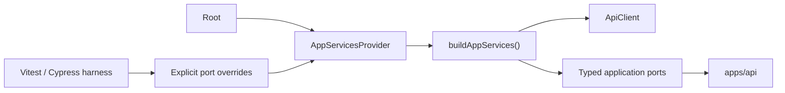

# API Service Boundary

## Purpose

This document defines the current frontend service boundary in `apps/web`.
The API is the single product data authority. Product runtime has no selectable
data-source strategy, local-data mode, or fallback adapter.

## Operational Contract

`AppServicesProvider` creates one `AppServices` graph through
`buildAppServices()`. That graph contains the API client and the typed ports
used by workspace, plans, runs, capabilities, session, feedback, and Canvas
features.

Views and plugins consume typed hooks. They do not select transports, construct
API clients, or infer availability from a runtime mode.

## Public Composition Surface

- `buildAppServices(overrides?)`
- `AppServicesProvider`
- typed hooks such as `useWorkspaceGraphSnapshotQueryPort()`,
  `useRunsService()`, `usePlansService()`, and `useCapabilitiesPort()`
- explicit `AppServicesOverrides` for tests

There is deliberately no `DataSourceMode`, mode hook, environment selector, or
mutable transport singleton.

## Responsibility Matrix

| Owner                 | Responsibility                                             | Forbidden responsibility                    |
| --------------------- | ---------------------------------------------------------- | ------------------------------------------- |
| Views and plugins     | Render state and submit user intent through typed hooks    | Transport selection or service construction |
| `AppServicesProvider` | Publish one stable service graph                           | Product behavior or route decisions         |
| `buildAppServices`    | Compose API-backed ports and apply explicit test overrides | Selecting among product data authorities    |
| API adapters          | HTTP transport and DTO mapping                             | UI state or test-fixture semantics          |
| Test harnesses        | Inject explicit port doubles                               | Enabling a product runtime branch           |

## Readiness And Capability Truth

API transport is fixed, but feature availability is not assumed. Routes use
the existing capability, authorization, and platform-readiness queries. Missing
or unavailable backend behavior remains explicit and fail-closed.

Canvas mutation posture therefore depends on platform readiness and granted
capabilities, never on a data-source label.

## Command And Query Rails

This boundary is internal composition and introduces no command or query rail.
Each injected port continues to implement its existing domain-owned command or
query. Removing the exhausted strategy does not rename or duplicate those
rails.

## Test Boundary

Tests inject port doubles through `AppServicesOverrides`. Product source must
not import test doubles or expose a switch that enables them. Architecture
tests enforce both the API-only composition boundary and the absence of the
removed strategy symbols.

## Invariants

- API is the single product data authority.
- Product composition has no one-value strategy abstraction.
- Views and plugins cannot select or construct transports.
- Test doubles are explicit dependencies, never runtime modes.
- Workspace defaults and Canvas readiness remain independent of transport
  selection.
- Platform diagnostics may state the literal transport fact `API`; they do not
  expose it as a configurable mode.
