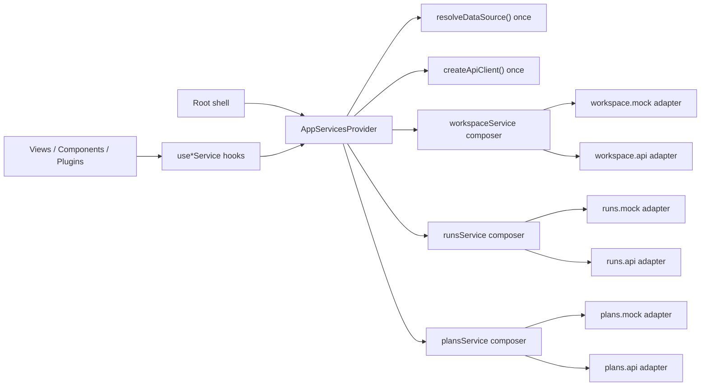
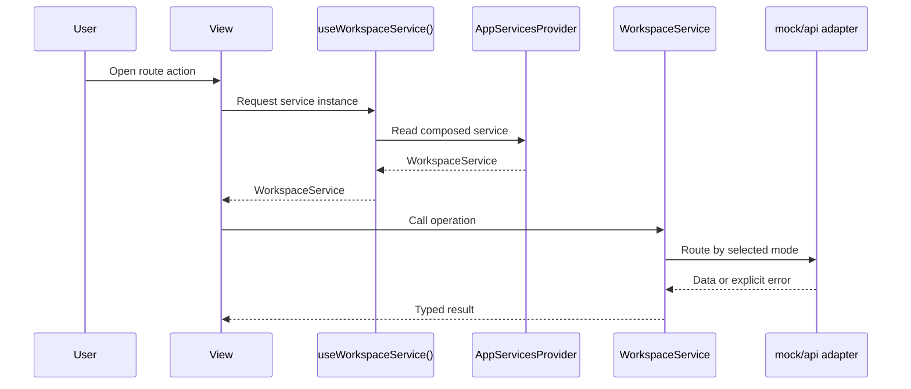

# Data Source Service Boundary

## Purpose

This document defines the current `F-04` frontend boundary for
`VITE_DATA_SOURCE` in `apps/web`.

It is the technical source of truth for:

- where mode selection happens;
- how views consume services;
- which dependencies are allowed;
- how tests inject seams without global module mutation.

## Operational Contract

`VITE_DATA_SOURCE` remains a shell-level switch with two valid values:

- `mock`
- `api`

Mode resolution for service consumption happens once inside shell composition
through `AppServicesProvider`. Views and plugins do not resolve mode directly.

## Composition Rule

`Root` mounts one provider that composes:

- `dataSourceMode`
- `apiClient`
- `workspaceService`
- `runsService`
- `plansService`

Consumers use only typed hooks:

- `useAppDataSourceMode()`
- `useWorkspaceService()`
- `useRunsService()`
- `usePlansService()`

This rule applies to view-facing service composition. It does not claim that
every configuration or capability helper in the entire frontend now reads the
mode only through the provider.

Route operability and adapter capability are related but not identical:

- the composition root decides which adapter family is active
- service capability seams decide which operations that adapter family can
  truthfully advertise
- routes must combine those capabilities with their own startup posture before
  exposing mutation affordances

## Ownership Matrix

| Layer                        | Owns                                                     | Must not own                                        |
| ---------------------------- | -------------------------------------------------------- | --------------------------------------------------- |
| Views / components / plugins | UI state, query orchestration, route behavior            | mode resolution, service construction, mock imports |
| Service hooks / provider     | mode selection, service composition, test override seams | view-local UI decisions                             |
| Service composers            | mode routing `mock` vs `api`                             | view logic, direct React state                      |
| `*.mock.*` adapters          | mock data behavior for local/demo mode                   | API transport concerns                              |
| `*.api.*` adapters           | API transport and DTO mapping                            | local mock datasets                                 |

## Dependency Rules

Allowed:

- `views -> services/AppServicesContext hooks`
- `AppServicesContext -> service composers`
- `service composers -> *.mock.* and *.api.*`
- `*.api.* -> ApiClient`
- `*.mock.* -> app/data/mock*`

Forbidden:

- `views/components/plugins -> resolveDataSource()`
- `views/components/plugins -> createWorkspaceService/createRunsService/createPlansService`
- non-mock files importing `app/data/mock*`

## Runtime Behavior

Both modes remain bootable, but they are not semantically equivalent for every
route:

- `mock`: services return local mock-backed behavior and remain valid for
  isolated UI or adapter work. Under the Canvas hard-cut, this mode is not the
  active product-authoring runtime.
- `api`: services call backend endpoints. Unsupported operations fail
  explicitly from the service layer with clear error messages instead of
  pretending the route can still mutate successfully.

Current governed capability example:

- `workspaceService.importSources()` is explicitly unavailable in `api` mode
  until the backend endpoint exists
- the Canvas route therefore must hide `Add data` in the active `api` path
  instead of implying a missing button or failed wizard is a transient issue

## Capability Matrix

The route must consume explicit capability seams rather than infer them from
copy or transport failures.

| Mode   | Workspace adapter                      | `sourceImportAvailable` | Active Canvas authoring posture                           |
| ------ | -------------------------------------- | ----------------------- | --------------------------------------------------------- |
| `mock` | `createMockWorkspaceService()`         | `true`                  | blocked as canonical authoring runtime under the hard-cut |
| `api`  | `createApiWorkspaceService(apiClient)` | `false`                 | active runtime if readiness passes, but import hidden     |

Interpretation rule:

- adapter capability answers "can this adapter perform the operation?"
- route posture answers "may the active route expose the operation now?"
- the route may only expose a mutation when both answers are true

## Test Seam And Injection Strategy

Tests use provider overrides, not global `resolveDataSource` monkey patching.

`AppServicesProvider` accepts:

- explicit `mode` override;
- optional `apiClient` override;
- optional per-service overrides for focused tests.

This allows:

- route or component tests to inject deterministic service fakes;
- service tests to validate composer routing by mode;
- shared canvas-controller harnesses to mount the real provider with explicit
  service overrides instead of globally mocking `AppServicesContext` exports;
- no module-level implicit coupling in consumer tests.

For the workspace mock adapter specifically, instance-local mutable state is
now part of the boundary contract:

- `createMockWorkspaceService()` allocates isolated workspace state by default;
- mutable graph imports, editable file contents, and discoverable file-tree
  paths do not bleed across service instances;
- deliberate shared state requires an explicit test seam via
  `createMockWorkspaceState()`.

## Affected Frontend Surfaces

This boundary now governs consumers that previously created mode-aware services
locally, including:

- canvas controller;
- runs and operational views;
- source import and console surfaces;
- plugin history panels that query run data.

For Canvas specifically, the boundary now governs two separate truths:

- route startup still belongs to the Canvas route contract
- source-import affordances must be driven by explicit workspace-service
  capabilities, not by mode folklore or outdated copy

## Explicit Non-Goals

This slice does not:

- standardize query-key ownership or invalidation rules;
- align runtime route drift such as `/runs` versus `/runs/start`;
- deliver real live logs in the bottom console.

## Current Residual Gaps

After `F-04`, the boundary is cleaner, but some work remains intentionally
outside this slice:

- the retired `GraphCanvas` path has been removed from active source; future
  graph changes must use the governed Canvas route.
- `sessionStore`, `workspaceConfig`, and platform-health metadata still read
  data-source configuration outside the shell provider because they are config
  or capability surfaces rather than route consumers.
- API-mode console output is now explicitly non-live instead of pretending mock
  logs are real; true run-event and log convergence remains future work.
