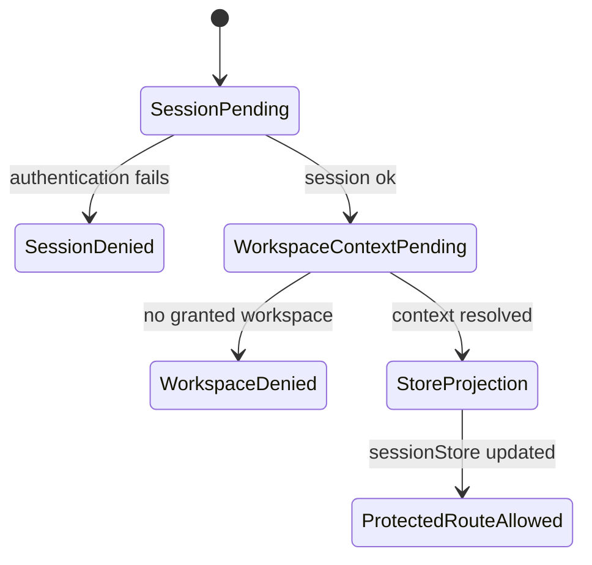
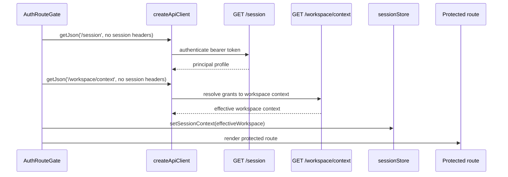

# Effective Workspace Context Component

## Purpose

The effective workspace context component gives API-mode web routes a
server-owned tenant, project, and environment scope before they render protected
product surfaces.

It complements the shell workspace context component. The shell component
renders read-only context. This component resolves the authoritative context
projection that the shell and runtime services may display or send back to
protected routes.

## Owned Concern

Owns server-granted workspace context resolution for protected web API mode.

It does not own authentication, login, tenant administration, project creation,
environment switching UI, graph draft persistence, run execution, or
workspace-file content.

## Public API

| API                                   | Kind                    | Rail                                                    | Responsibility                                                     |
| ------------------------------------- | ----------------------- | ------------------------------------------------------- | ------------------------------------------------------------------ |
| `GET /workspace/context`              | HTTP query              | `GetEffectiveWorkspaceContext`                          | Return effective workspace context for authenticated principal.    |
| `IWorkspaceContextQuery`              | API port                | `GetEffectiveWorkspaceContext`                          | Resolve granted workspaces from backend grant storage.             |
| `EmbeddedWorkspaceContextQuery`       | API adapter             | `GetEffectiveWorkspaceContext`                          | Read `principal_grants` and project effective workspace options.   |
| `resolveProtectedRouteSessionContext` | web application service | `GetRuntimeSession` then `GetEffectiveWorkspaceContext` | Resolve session and context before protected route render.         |
| `sessionStore.setSessionContext`      | projection update       | `GetEffectiveWorkspaceContext`                          | Store the server-owned scope for downstream API headers and views. |

## Invariants

- `GET /session` does not return effective workspace context.
- `GET /workspace/context` requires authentication.
- `GET /workspace/context` fails closed when no workspace is granted.
- API mode protected route rendering waits for both session and workspace
  context.
- `sessionStore` is a projection of backend-granted context in API mode.
- `createApiClient` may send session headers only after the protected route
  gate has applied server-owned context.
- Mock mode may keep local demo scope, but must not be documented as product
  authority.

## Transitions

## Sequence

## Consumers

| Consumer                | Rule                                                                                 |
| ----------------------- | ------------------------------------------------------------------------------------ |
| `AuthRouteGate`         | Resolves session and effective workspace context before rendering protected routes.  |
| `sessionStore`          | Stores backend-granted scope as a projection, not as independent authority.          |
| `createApiClient`       | Reads projected scope for `X-Tenant-Id` and `X-Project-Id` headers.                  |
| Canvas                  | Reads session context through existing route/controller seams after gate resolution. |
| Runs                    | Reads session context through existing route/controller seams after gate resolution. |
| Shell workspace context | Displays current scope read-only.                                                    |

## Semantic Fitness Function

The architecture guard in
`apps/web/src/app/services/session/protectedRouteSessionContext.architecture.test.ts`
validates:

- session and workspace context remain separate rails;
- `AuthRouteGate` delegates route startup semantics to the resolver;
- the resolver calls `/session` before `/workspace/context`;
- `/workspace/context` is applied to `sessionStore`;
- `/session` does not import or mention workspace context.

## Drift Guard

Update this guide and the user stories when a change alters:

- the route surface for effective workspace context;
- the session/workspace responsibility split;
- when protected routes are allowed to render;
- how granted workspace options are represented;
- whether local storage may influence API-mode scope.
