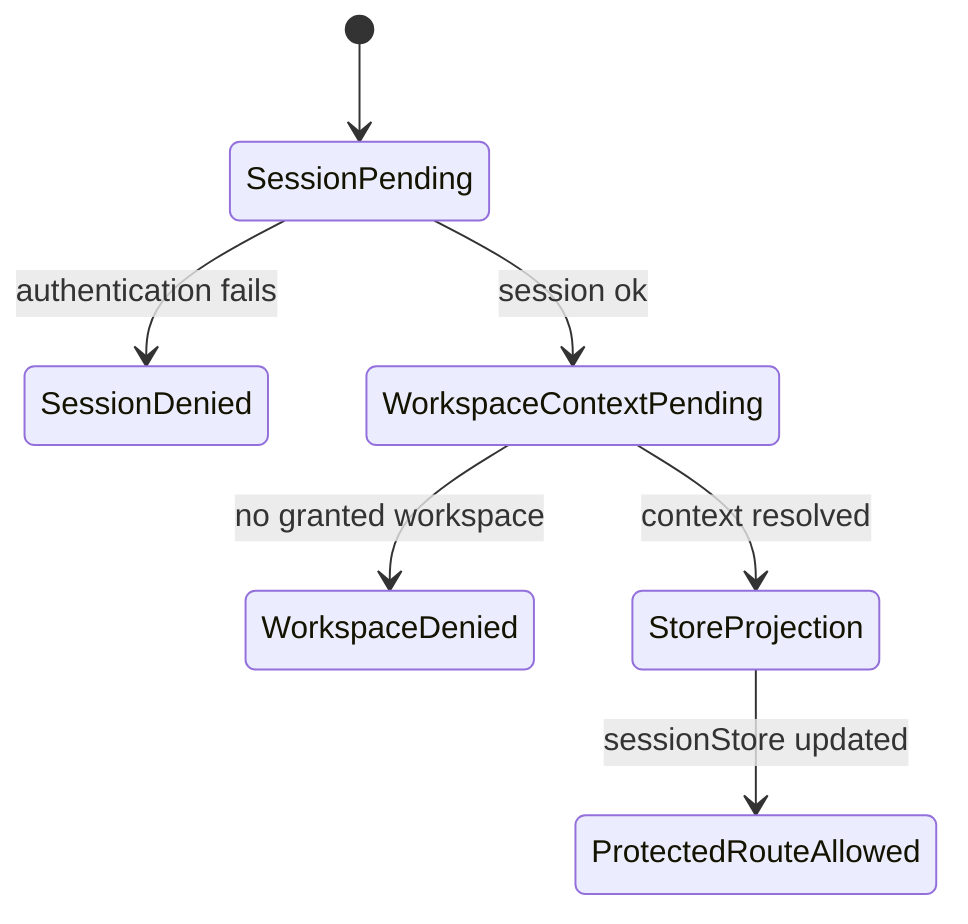
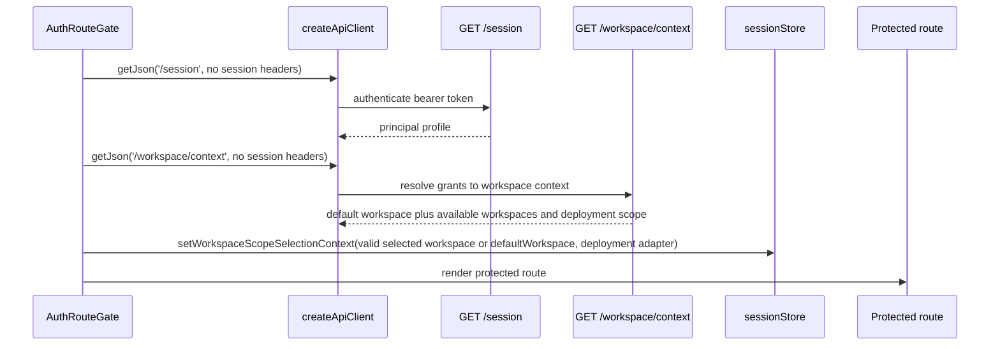

# Effective Workspace Context Component

## Purpose

The workspace context component gives API-mode web routes a server-owned set of
granted tenant, project, and environment scopes plus a deterministic default
before they render protected product surfaces. The browser selects only within
that set.

It complements the shell workspace context component. The shell component
renders the active validated selection. This component resolves the
authoritative grant projection and default that the shell and runtime services
may display or send back to protected routes.

## Owned Concern

Owns server-granted workspace context resolution and deterministic defaulting
for protected web routes. The browser owns only its validated selected scope.

It does not own authentication, login, tenant administration, project creation,
server-persisted workspace preferences, graph draft persistence, run execution, or
workspace-file content.

## Public API

| API                                              | Kind                    | Rail                                                    | Responsibility                                                                          |
| ------------------------------------------------ | ----------------------- | ------------------------------------------------------- | --------------------------------------------------------------------------------------- |
| `GET /workspace/context`                         | HTTP query              | `GetEffectiveWorkspaceContext`                          | Return granted workspaces, deterministic default, and deployment scope.                 |
| `IWorkspaceContextQuery`                         | API port                | `GetEffectiveWorkspaceContext`                          | Resolve granted workspaces from backend grant storage.                                  |
| `EmbeddedWorkspaceContextQuery`                  | API adapter             | `GetEffectiveWorkspaceContext`                          | Read one normalized grant snapshot and project names using one set query.               |
| `resolveProtectedRouteSessionContext`            | web application service | `GetRuntimeSession` then `GetEffectiveWorkspaceContext` | Resolve session and context before protected route render.                              |
| `sessionStore.setWorkspaceScopeSelectionContext` | projection update       | `GetEffectiveWorkspaceContext`                          | Store a selected granted scope and deployment adapter for downstream headers and views. |

## Invariants

- `GET /session` does not return workspace context.
- `GET /workspace/context` requires authentication.
- `GET /workspace/context` fails closed when no workspace is granted.
- Protected route rendering waits for both session and workspace
  context.
- `sessionStore` is a browser selection projection, not grant authority.
- The deployment adapter used by plan/run comes from the protected runtime
  adapter registry through `/workspace/context`; the web client must not infer
  it from local storage.
- `availableWorkspaces` is sorted deterministically by tenant, project, and
  environment; `defaultWorkspace` is its first entry.
- When `availableWorkspaces` contains the browser-selected scope, the resolver
  preserves that scope.
- When the selected scope is absent from `availableWorkspaces`, the resolver
  falls back to `defaultWorkspace` and still fails closed on context denial.
- `createApiClient` may send session headers only after the protected route
  gate has applied server-owned context, and those headers include tenant,
  project, environment, and target adapter.
- Mock mode may keep local demo scope, but must not be documented as product
  authority.

## Transitions

## Sequence

## Consumers

| Consumer                | Rule                                                                                                         |
| ----------------------- | ------------------------------------------------------------------------------------------------------------ |
| `AuthRouteGate`         | Resolves session and granted workspace context before rendering protected routes.                            |
| `sessionStore`          | Stores validated browser selection and deployment adapter, not grants or authorization.                      |
| `createApiClient`       | Reads projected scope for `X-Tenant-Id`, `X-Project-Id`, `X-Environment-Id`, and `X-Target-Adapter` headers. |
| Canvas                  | Reads session context through existing route/controller seams after gate resolution.                         |
| Runs                    | Reads session context through existing route/controller seams after gate resolution.                         |
| Shell workspace context | Displays current scope read-only.                                                                            |

## Semantic Fitness Function

The architecture guard in
`apps/web/src/app/services/session/protectedRouteSessionContext.architecture.test.ts`
validates:

- session and workspace context remain separate rails;
- `AuthRouteGate` delegates route startup semantics to the resolver;
- the resolver calls `/session` before `/workspace/context`;
- `/workspace/context` is applied to `sessionStore`;
- an already selected scope is preserved only when it appears in
  `availableWorkspaces`;
- `/session` does not import or mention workspace context.

## Drift Guard

Update this guide and the user stories when a change alters:

- the route surface for granted workspace context;
- the session/workspace responsibility split;
- when protected routes are allowed to render;
- how granted workspace options are represented;
- how deployment adapter scope is represented;
- whether local storage may influence API-mode scope.
- whether multiple available workspaces are collapsed or selectable during
  protected route startup.
