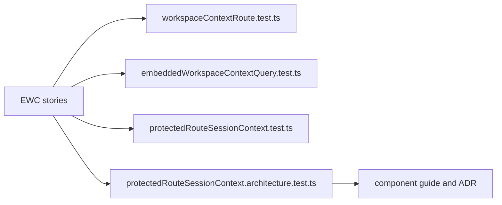

# Effective Workspace Context User Stories

## Purpose

These stories cover protected web API-mode workspace context resolution.

## Scenario Matrix

| Scenario | User intent                                       | Expected behavior                                               | Guard                   |
| -------- | ------------------------------------------------- | --------------------------------------------------------------- | ----------------------- |
| EWC-1    | Enter a protected route with a valid session      | UI resolves granted workspaces and default before rendering     | Unit, route             |
| EWC-2    | Enter with no authenticated session               | UI redirects to login and does not use local workspace defaults | Unit                    |
| EWC-3    | Enter with valid session but no granted workspace | UI denies protected route startup instead of inventing scope    | API route, web resolver |
| EWC-4    | Work after context resolution                     | Downstream API calls use the granted tenant/project scope       | Web resolver            |
| EWC-5    | Preserve session boundary                         | `/session` stays authentication-only                            | Architecture            |
| EWC-6    | Preserve local demo mode                          | Mock mode may use demo scope but remains outside API authority  | Documentation           |

## User Stories

### EWC-1: Resolve Granted Workspace Before Route Render

As an operator opening Canvas, I want the application to load the
workspace context granted by the backend before the route renders, so the UI
does not display a tenant/project/environment that the backend has not granted.

Acceptance:

- given `/session` succeeds;
- and `/workspace/context` returns granted workspaces and a deterministic default;
- when a protected route is entered;
- then `sessionStore` retains its selection only when it remains granted, otherwise it uses the default;
- and only then does the protected route render.

### EWC-2: Do Not Use Local Defaults As Protected Authority

As a platform owner, I want local env and localStorage values to be ignored as
authority in API-mode route startup, so stale browser state cannot present an
ungranted workspace.

Acceptance:

- given localStorage contains a different tenant/project/environment;
- when that identity is absent from `availableWorkspaces`;
- then `defaultWorkspace` replaces the stale local projection.

### EWC-3: Deny Startup Without Granted Workspace

As an operator without workspace grants, I want the app to stop at protected
route startup, so I do not see a workspace that I cannot use.

Acceptance:

- given `/session` succeeds;
- and `/workspace/context` returns forbidden;
- when a protected route is entered;
- then the route is not rendered;
- and the user sees the existing protected-route denial posture.

### EWC-4: Keep Session Endpoint Narrow

As an API maintainer, I want `GET /session` to remain a principal profile query,
so authentication does not absorb workspace-selection responsibilities.

Acceptance:

- given the API route files are inspected;
- then `sessionRoute.ts` does not return or import workspace context;
- and `workspaceContextRoute.ts` owns `GET /workspace/context`.

### EWC-5: Expose Granted Options For Future Selection

As a project selector, I want the backend to return the granted workspace
options and deterministic default, so I can choose only valid scopes.

Acceptance:

- given multiple workspaces are granted;
- when `/workspace/context` is called;
- then the response includes `defaultWorkspace` and `availableWorkspaces`;
- and the default is the first deterministically sorted granted option.

## Coverage Map

