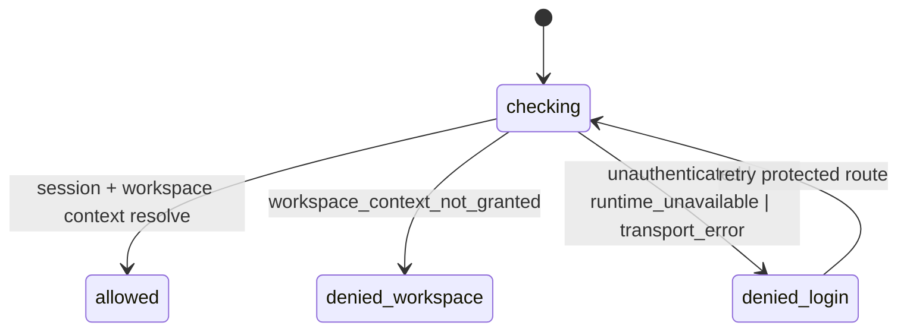

# Protected Route Session Gate Component

## Purpose

`AuthRouteGate` and `resolveProtectedRouteSessionContext` own protected-route
session admission in web bootstrap. The component verifies authenticated session
and effective workspace context through canonical runtime queries, then decides
route access posture.

This component does not authenticate users itself and does not bypass API
authorization. It maps runtime outcomes to route-level recovery vocabulary.

## Public API

| API                                   | Kind               | Owned concern                                                                                                     |
| ------------------------------------- | ------------------ | ----------------------------------------------------------------------------------------------------------------- |
| `resolveProtectedRouteSessionContext` | query orchestrator | Load `/session` and `/workspace/context` in canonical order.                                                      |
| `classifyProtectedRouteSessionError`  | mapper             | Map API failures to `unauthenticated`, `workspace_context_not_granted`, `runtime_unavailable`, `transport_error`. |
| `AuthRouteGate`                       | route gate         | Allow protected route render or route to login/workspace-denied posture.                                          |

## Invariants

- `/session` query always resolves before `/workspace/context`.
- `404` on `/session` is mapped to `runtime_unavailable`, not generic transport.
- `401/403` remain `unauthenticated` unless the explicit workspace denial shape
  is returned.
- No local dev flag can convert unauthorized responses into allowed posture.
- Session and workspace context ownership stays in API rails.

## Transitions

## Recovery Vocabulary (Source-Owned)

| Failure source                             | Route state        | Recovery copy key               |
| ------------------------------------------ | ------------------ | ------------------------------- |
| `/session` returns `401` or `403`          | `denied_login`     | `unauthenticated`               |
| `/session` returns `404`                   | `denied_login`     | `runtime_unavailable`           |
| network/transport failure                  | `denied_login`     | `transport_error`               |
| `/workspace/context` returns denied reason | `denied_workspace` | `workspace_context_not_granted` |

## Plan/Run Readiness Rail Mapping

Protected-route admission is upstream of plan/run controls and must fail closed
before any run intent surface appears.

| Route gate rail           | Downstream rail dependency | Rule                                                        |
| ------------------------- | -------------------------- | ----------------------------------------------------------- |
| `ObserveWorkspaceContext` | `ObservePlanRunReadiness`  | readiness cannot render without effective workspace context |
| `ObserveWorkspaceContext` | `SaveWorkspaceGraphDraft`  | authoring mutations blocked if scope is not admitted        |
| `ObserveWorkspaceContext` | `ListWorkspaceFiles`       | code workbench must remain scope-bound                      |

## Consumers

- `apps/web/src/app/bootstrap/AuthRouteGate.tsx`
- `apps/web/src/app/views/LoginView.tsx`
- Web route bootstrap and F-27 acceptance matrix

## Semantic Fitness Function

- Architecture tests assert resolver-order invariants and route-level
  documentation coverage.
- Route tests assert `runtime_unavailable` copy when `/session` rail is missing.
