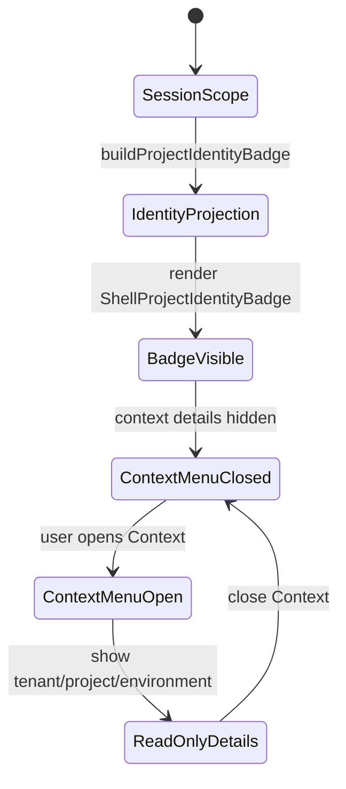
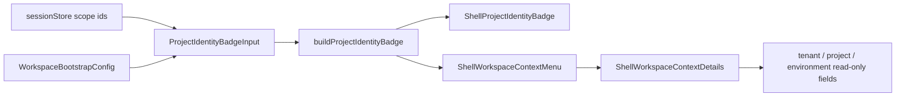
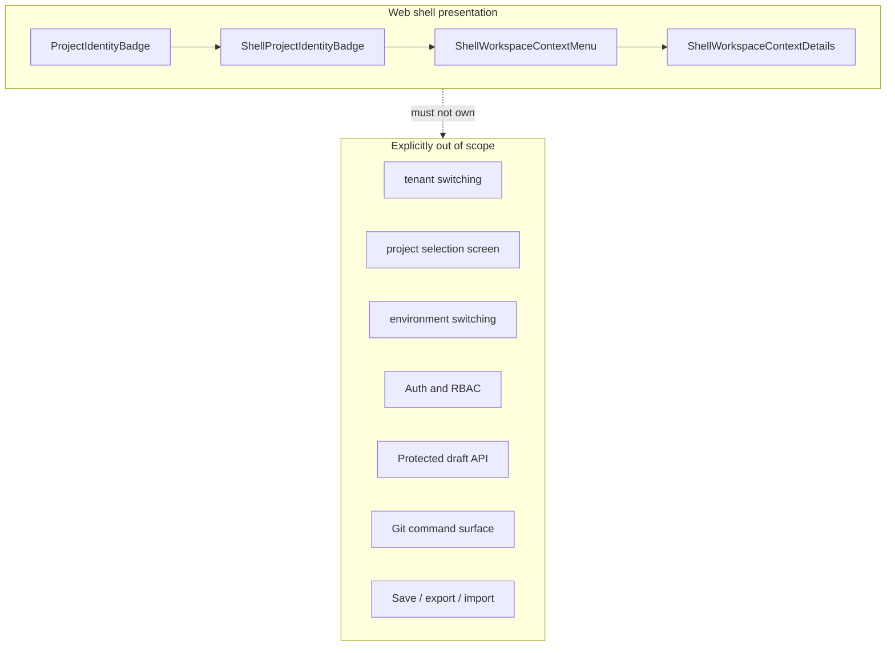

# Shell Workspace Context Component

## Purpose

Shell workspace context is the App Shell component that presents the active
tenant, project, environment, and draft-scope posture without allowing the main
screen to change workspace ownership.

It is a shell-owned Presentation Model boundary. It projects existing session
scope into read-only identity labels and read-only context details. Project
changes belong to a separate governed project-selection screen, not to the App
Shell top bar or Canvas workbench.

## Owned Concern

The component owns shell presentation of workspace scope.

It does not own tenant switching, project selection, environment switching,
authorization, grants, project persistence, protected draft authority, Canvas
graph state, Git operations, or route-local workbench commands.

## Public API

| API                              | Kind                | Rail                            | Contract                                                                 |
| -------------------------------- | ------------------- | ------------------------------- | ------------------------------------------------------------------------ |
| `ProjectIdentityBadge`           | read model          | `ResolveCanvasWorkbenchContext` | Carries active tenant, project, environment, compact id, slug, and draft |
| `ProjectIdentityBadgeInput`      | query input         | `ResolveCanvasWorkbenchContext` | Supplies session ids and bootstrap option labels                         |
| `buildProjectIdentityBadge`      | projection function | `ResolveCanvasWorkbenchContext` | Resolves labels and preserves raw ids when labels are unavailable        |
| `ShellProjectIdentityBadge`      | passive view        | `ResolveCanvasWorkbenchContext` | Renders breadcrumb-style identity labels with no mutation affordance     |
| `ShellWorkspaceContextMenu`      | details UI          | shell context display           | Opens read-only workspace context details                                |
| `ShellWorkspaceContextDetails`   | passive view        | shell context display           | Displays tenant, project, and environment without mutation controls      |
| `TopAppBar.architecture.test.ts` | semantic fitness    | semantic posture proof          | Guards ownership, docs, invariants, and read-only posture                |

The browser posture proof is `VerifyCanvasWorkbenchVisualPosture`.

## Invariants

- workspace context is breadcrumb-style read-only content on the main screen;
- the persistent top bar renders a read-only identity badge;
- the persistent top bar does not render tenant, project, or environment
  comboboxes;
- `ShellWorkspaceContextMenu` does not render tenant, project, or environment
  comboboxes;
- tenant, project, and environment scope are read-only inside an active project
  context;
- project changes belong to a separate governed project-selection screen;
- `ProjectIdentityBadge` may display fallback ids, but must not fabricate
  unavailable labels or grants;
- the component must not introduce new auth, RBAC, tenant-admin, Git, save,
  export, import, environment-selection, project-selection, or protected draft
  semantics.

## Transitions

## Consumers

| Consumer                        | Consumption rule                                                              |
| ------------------------------- | ----------------------------------------------------------------------------- |
| `ShellTopBar`                   | Composes badge, context details, Git ref, health, and global shell menus      |
| `Root.shellChrome.test.support` | Verifies rendered shell posture from the mounted root shell                   |
| Canvas workbench                | Reads session scope through route-owned queries and controllers               |
| Runs and other routes           | React through existing session-aware data loading, not through this component |
| Cypress Stage 1 posture proof   | Verifies badge, no comboboxes, and read-only context details                  |
| F-28-A feature mechanization    | Tracks the public API, rails, Fowler signals, and closeout commands           |

## Component Flow

## Boundary Map

## Semantic Fitness Function

The architecture guard in
[`TopAppBar.architecture.test.ts`](../../../../../apps/web/src/app/components/TopAppBar.architecture.test.ts)
checks more than import shape. It validates:

- each module declares its owned concern;
- the top bar composes the read model, badge, and context details;
- no shell workspace context module imports selector primitives;
- no shell workspace context module dispatches tenant, project, or environment
  mutation commands;
- tenant, project, and environment scope stay read-only inside an active
  project context;
- local component docs, user stories, and mailbox analysis exist;
- API, invariants, transitions, consumers, and diagrams stay documented.

The browser posture proof in
[`canvas-workbench-tabs.cy.ts`](../../../../../apps/web/cypress/e2e/canvas/canvas-workbench-tabs.cy.ts)
then checks the rendered Stage 1 behavior from the user surface.

## Drift Guard

Changes to this component must update this guide, the user-story guide, the
F-28-A manifest, and the architecture guard in the same PR when they alter:

- public API shape;
- command/query rail ownership;
- visible top-bar context behavior;
- read-only detail behavior;
- fallback or unavailable-state copy;
- any consumer listed above.
