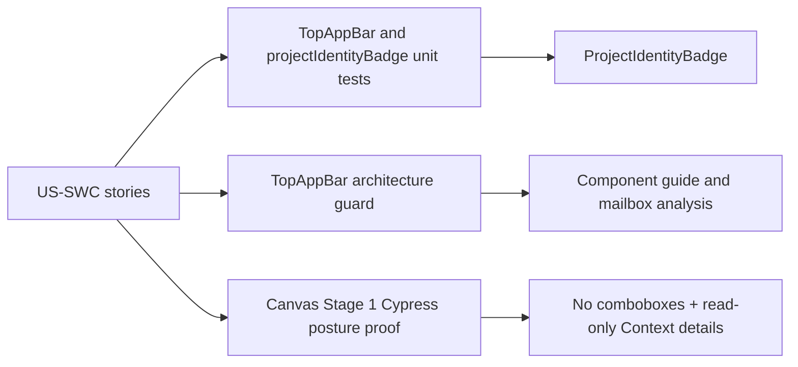

# Shell Workspace Context User Stories

## Purpose

These stories define the expected user-visible behavior for the App Shell
workspace context component.

They complement
[Shell Workspace Context Component](./shell-workspace-context-component.md) and
keep Stage 1 acceptance tied to scenarios instead of only file structure.

## Scenario Matrix

| Scenario | User intent                         | Expected behavior                                               | Guard                 |
| -------- | ----------------------------------- | --------------------------------------------------------------- | --------------------- |
| S1       | Confirm current workspace           | Top bar shows breadcrumb-style project identity and environment | Unit, Cypress         |
| S2       | Avoid accidental scope switching    | Tenant/project/environment controls are hidden from top bar     | Unit, architecture    |
| S3       | Verify tenant context               | Context menu shows tenant as read-only content                  | Architecture, Cypress |
| S4       | Verify project context              | Context menu shows project as read-only content                 | Architecture, Cypress |
| S5       | Verify environment context          | Context menu shows environment as read-only content             | Architecture, Cypress |
| S6       | Work with unavailable option labels | Badge displays raw ids instead of inventing labels or grants    | Unit                  |
| S7       | Keep Git reference passive          | Git ref remains read-only and separate from workspace context   | Architecture          |
| S8       | Preserve route authority            | Canvas/Runs read session scope through existing route queries   | Regression tests      |

## User Stories

### US-SWC-1: Read Current Workspace

As an operator, I want the persistent shell to show the active project and
environment as breadcrumb-style context so I can stay oriented while working in
Canvas.

Acceptance:

- given a selected tenant, project, and environment;
- when the shell top bar renders;
- then it shows `ShellProjectIdentityBadge`;
- and the badge has no mutation control.

### US-SWC-2: Keep Scope Controls Out Of Main Chrome

As an operator focused on graph authoring, I want workspace selectors out of
the main top bar so workspace switching does not dominate or endanger the
authoring surface.

Acceptance:

- given the shell top bar renders on Canvas;
- when the persistent top bar is inspected;
- then it contains no tenant/project/environment comboboxes;
- and workspace context is presented as read-only content.

### US-SWC-3: Keep Tenant Read-Only

As an operator inside an active project, I want tenant context to be read-only
so I cannot cross a tenant boundary from the main workbench.

Acceptance:

- given the Context menu is opened;
- when tenant context is shown;
- then it is rendered as read-only content;
- and no `setTenantId`, tenant selector, or tenant command mirror exists in
  the shell workspace context component.

### US-SWC-4: Keep Project Read-Only

As an operator inside the main workbench, I want project context to be read-only
because changing project belongs to a separate governed project-selection
screen.

Acceptance:

- given the Context menu is opened;
- when project context is shown;
- then it is rendered as read-only content;
- and no `setProjectId`, project selector, or project command mirror exists in
  the shell workspace context component.

### US-SWC-5: Keep Environment Read-Only

As an operator inside the main workbench, I want environment context to be
read-only so runtime context is not changed from ambient shell chrome.

Acceptance:

- given the Context menu is opened;
- when environment context is shown;
- then it is rendered as read-only content;
- and no `setEnvironmentId`, environment selector, or environment command
  mirror exists in the shell workspace context component.

### US-SWC-6: Handle Missing Granted Labels Honestly

As an operator, I want unknown granted labels to show as raw ids so the UI does
not pretend to know unavailable tenant, project, or environment names.

Acceptance:

- given bootstrap options do not contain the selected id;
- when `buildProjectIdentityBadge` projects the badge;
- then the selected raw id is displayed as fallback;
- and no fabricated label or grant state is produced.

### US-SWC-7: Keep Git Reference Passive

As an operator, I want the Git reference to remain a read-only context signal in
Stage 1 so branch management does not appear without a governed Git rail.

Acceptance:

- given the top bar renders Git branch and SHA context;
- when the workspace Context menu is opened;
- then Git controls are not part of the context details;
- and no branch-switch command is introduced.

### US-SWC-8: Preserve Route Authority

As an operator moving between Canvas and Runs, I want routes to read workspace
context through their existing query/controller paths.

Acceptance:

- given Canvas or Runs needs workspace context;
- when the route reads session scope;
- then each route reacts through its existing query/controller path;
- and the shell context component does not own route data loading.

## Coverage Map

## Drift Triggers

Update these stories when a change alters:

- where workspace identity is displayed;
- whether workspace context can mutate session scope;
- how missing labels or grants are represented;
- whether Git context becomes command-capable;
- how Canvas, Runs, or another route consumes session-scope context.
