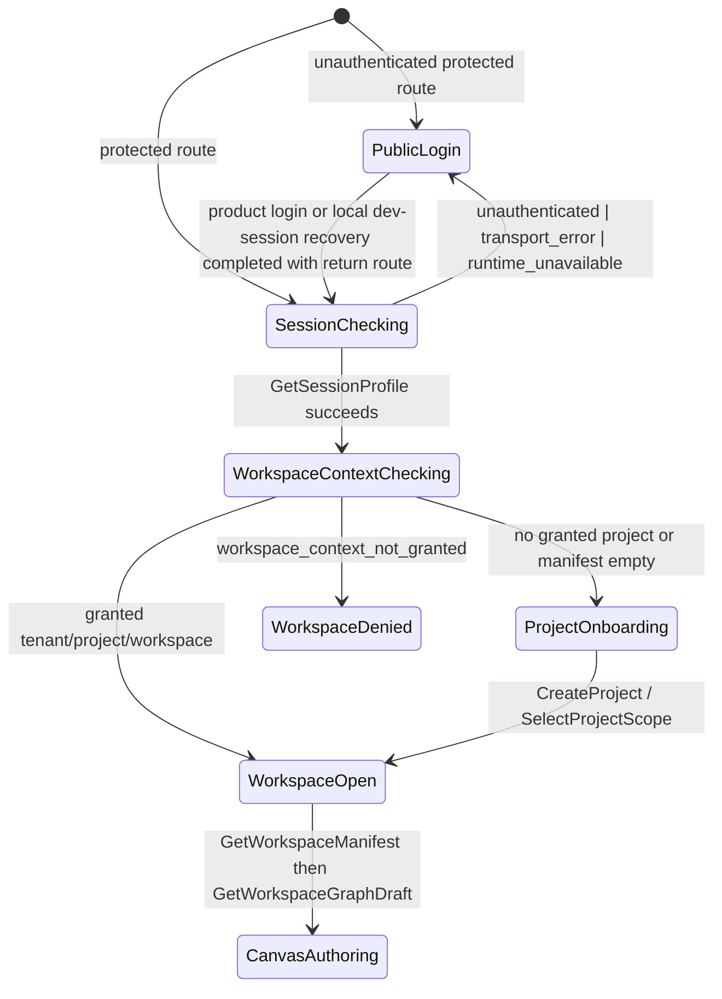
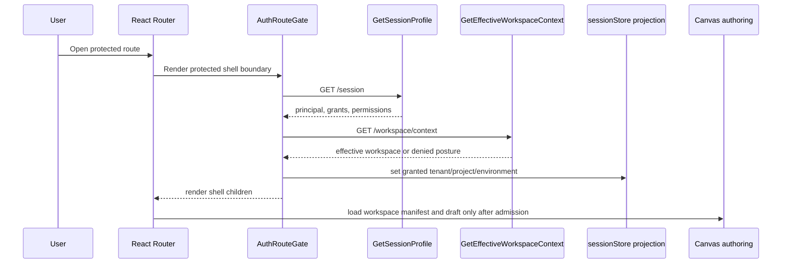

# Web Auth Project Onboarding Component

## Purpose

This component owns the semantic admission boundary for web identity, granted
workspace scope, and project-first startup. It canonizes the accepted web-auth
proposal into the current app shell: `/login` is the public recovery route,
`AuthRouteGate` protects product routes, and server-owned session plus effective
workspace context resolve before route children can render project data.

The component does not own external identity-provider configuration, API
authorization policy, Canvas graph mutation, or tenant-admin implementation.
Those remain behind their existing API, protected-runtime, and Canvas authoring
rails. `F-31` adds the first project-onboarding implementation slice for
authenticated users who have tenant scope but no effective project/workspace.

## Public API

| API                                   | Kind               | Owned concern                                                                  |
| ------------------------------------- | ------------------ | ------------------------------------------------------------------------------ |
| `/login`                              | public route       | Public recovery surface for unauthenticated product navigation.                |
| `RecoverLocalApiBearerSession`        | command            | Dev-only local session recovery through the API auth component.                |
| `AuthRouteGate`                       | route gate         | Admit protected shell routes only after session and workspace context resolve. |
| `resolveProtectedRouteSessionContext` | query orchestrator | Query `/session`, then `/workspace/context`, then update browser projections.  |
| `classifyProtectedRouteSessionError`  | mapper             | Convert API failures to source-owned route recovery vocabulary.                |
| `sessionStore.setSessionContext`      | projection command | Store granted workspace scope as projection, not independent authority.        |
| `useAuthorizationStore`               | projection command | Store granted UI permissions from the authenticated session profile.           |

## Invariants

- No product route may render tenant/project graph data before authentication
  and granted workspace context resolve.
- `/session` resolves before `/workspace/context`; workspace context is scoped by
  the authenticated principal.
- sessionStore is a projection of backend-granted scope; it is not
  the authority for tenant, project, environment, or authorization.
- Browser `localStorage` and `dvt-web-session` may hydrate selector convenience
  only after the value is still present in server grants.
- The fixture nodes `src_orders`, `model_orders`, and `orders_dashboard` are
  Cypress/demo evidence only; they are not clean-start product seed data.
- `GetWorkspaceGraphDraft` and Canvas authoring commands remain downstream of
  project/workspace admission.
- Disabled or unavailable actions must name a story, capability, and contract
  instead of terminal "pending backend" copy.

## Transitions

## Sequence

## Consumers

- `apps/web/src/app/routes.ts` mounts `/login` outside the protected shell and
  wraps `/` product children in `AuthRouteGate`.
- `apps/web/src/app/bootstrap/AuthRouteGate.tsx` owns route admission and
  recovery navigation.
- `apps/web/src/app/services/session/protectedRouteSessionContext.ts` owns the
  session/workspace query order and projection update.
- `apps/web/src/app/stores/sessionStore.ts` holds granted scope projection for
  downstream API headers.
- `apps/web/src/app/views/canvas/**` consumes the admitted scope before draft
  read/write rails.
- `apps/web/cypress/support/canvasDraftAuthoring.ts` remains fixture support,
  not product startup authority.

## Command/Query Rail

| Rail                           | Type    | DDD owner                        | Application port / adapter surface                                 | Negative tests                                                       |
| ------------------------------ | ------- | -------------------------------- | ------------------------------------------------------------------ | -------------------------------------------------------------------- |
| `StartLogin`                   | command | `ReturnRoute` value object       | `/login` route                                                     | protected deep link without session redirects with return route      |
| `RecoverLocalApiBearerSession` | command | `ReturnRoute` value object       | `/login` route via API auth component                              | missing refresh URL or unusable token leaves user on public recovery |
| `GetSessionProfile`            | query   | `SessionProfile` read model      | `resolveProtectedRouteSessionContext` via `GET /session`           | missing, expired, malformed, or unauthorized session fails closed    |
| `GetEffectiveWorkspaceContext` | query   | `SelectedScope` read model       | `resolveProtectedRouteSessionContext` via `GET /workspace/context` | revoked tenant, deleted project, stale browser storage, denied scope |
| `ListProjects`                 | query   | `ProjectDescriptor` read model   | project onboarding catalog                                         | empty tenant returns onboarding, not sample graph data               |
| `CreateProject`                | command | `Project` aggregate              | project onboarding command port                                    | duplicate project and unauthorized tenant are rejected               |
| `GetWorkspaceManifest`         | query   | `WorkspaceManifest` read model   | workspace manifest query                                           | no selected project does not call `GetWorkspaceGraphDraft`           |
| `GetWorkspaceGraphDraft`       | query   | `WorkspaceGraphDraft` read model | protected Canvas draft repository                                  | draft query is downstream of session and project admission           |
| `EnableDemoProjectSeed`        | command | `DemoSeedPolicy`                 | explicit demo/test seed command                                    | fixture nodes cannot appear in clean startup without explicit seed   |

## Fowler Analysis

- Pattern improved: `AuthRouteGate` plus
  `resolveProtectedRouteSessionContext` behaves like an Application Service
  boundary instead of a route-level transaction script.
- Pattern improved: browser stores are projections, matching Fowler's
  separation between domain authority and presentation state.
- Anti-pattern resisted: Active Record style route components that fetch,
  authorize, mutate browser state, and decide product seed data inline.
- Anti-pattern resisted: fixture data promoted to product truth.
- Grouping opportunity: future implementation should group identity/session,
  project onboarding, tenant admin, and capability-gap code by owned component
  rather than scattering it under generic `views` and `services`.

## Semantic Fitness Function

- `apps/web/src/app/bootstrap/webAuthProjectOnboarding.architecture.test.ts`
  verifies the protected shell is gated by session and effective workspace
  rails, validates this component guide and user stories, and binds the accepted
  proposal to the current canonical slice.
- `apps/web/src/app/services/session/protectedRouteSessionContext.architecture.test.ts`
  verifies session and workspace context rails remain separate.
- Cypress coverage for future implementation must cover login-required,
  stale-storage rejection, empty tenant/project onboarding, project creation,
  first empty Canvas, explicit demo seed, and disabled-action capability copy.
