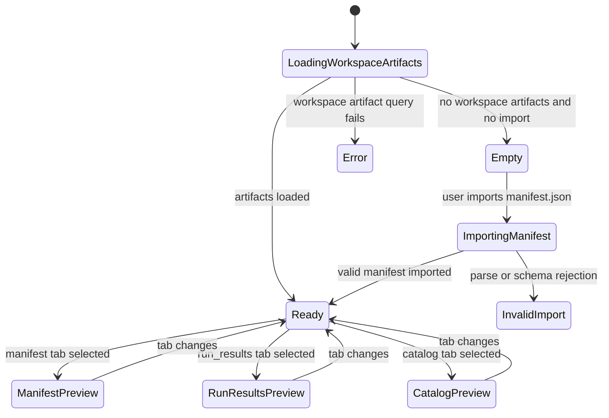
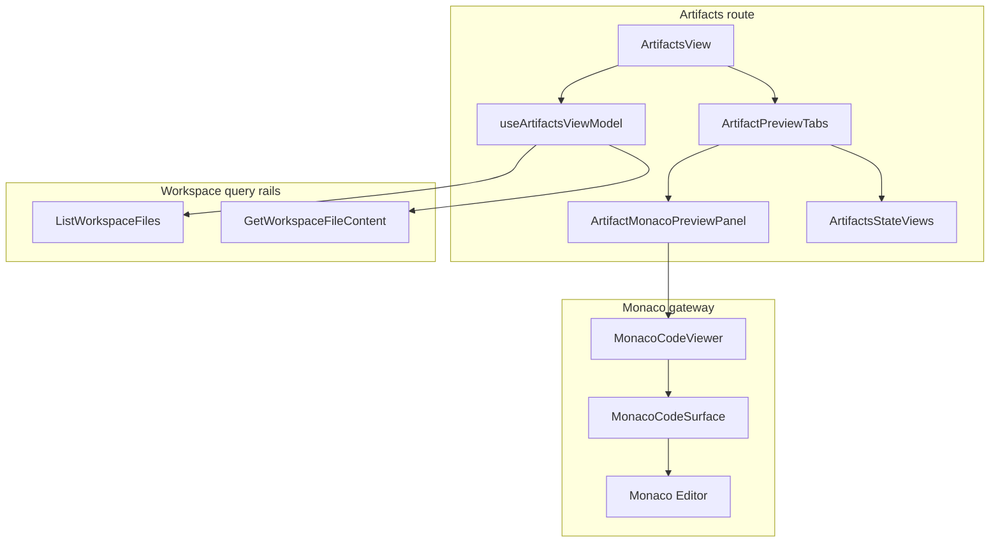

# Artifacts Monaco Read-Only Viewer Component

## Purpose

This component governs Monaco-backed read-only inspection for `manifest.json`,
`run_results.json`, and `catalog.json` inside the Artifacts route.

Owned concern: render route-scoped, read-only, structured artifact payload
inspection without adding editing semantics, shell ownership, or Canvas Monaco
hosting.

## Public API

| API                          | Type                   | Owner            | Purpose                                                                                         |
| ---------------------------- | ---------------------- | ---------------- | ----------------------------------------------------------------------------------------------- |
| `ArtifactsView`              | route component        | Artifacts route  | Composes query/import state, route frame, import panel, list, preview tabs, and info.           |
| `useArtifactsViewModel`      | hook                   | Artifacts route  | Builds the route-local artifact preview read model from imported and workspace-backed payloads. |
| `ArtifactPreviewTabs`        | presentation component | Artifacts route  | Selects the supported artifact document tab.                                                    |
| `ArtifactMonacoPreviewPanel` | presentation adapter   | Artifacts route  | Maps one structured artifact document to a JSON `MonacoCodeViewer`.                             |
| `MonacoCodeViewer`           | lazy gateway           | Monaco component | Exposes the DVT-safe lazy read-only code viewer API.                                            |
| `MonacoCodeSurface`          | third-party binding    | Monaco component | Binds `@monaco-editor/react` `Editor` with read-only options.                                   |

The component consumes existing rails through `useWorkspaceArtifactsQuery`:

| Rail                      | Type  | Use                                                                             |
| ------------------------- | ----- | ------------------------------------------------------------------------------- |
| `ListWorkspaceFiles`      | query | Finds workspace-backed `manifest.json`, `run_results.json`, and `catalog.json`. |
| `GetWorkspaceFileContent` | query | Loads the selected artifact payload for read-only inspection.                   |

No command rail is introduced by this component.

## DDD And Read Models

| Object                                | Kind                    | Responsibility                                                              |
| ------------------------------------- | ----------------------- | --------------------------------------------------------------------------- |
| `ArtifactPreviewDocumentMap`          | presentation read model | Holds optional payload documents for supported dbt artifact files.          |
| `ArtifactPreviewDocument`             | presentation document   | Carries one artifact path and parsed or raw content.                        |
| `ArtifactsWorkbenchState`             | state model             | Represents loading, empty, error, invalid-import, and ready route states.   |
| `ArtifactsStructuredPayloadReadModel` | conceptual read model   | Describes read-only JSON inspection for manifest, run results, and catalog. |

## Invariants

- Artifacts is a read-only inspection route.
- `ArtifactsView` must not import `@monaco-editor/react` or `MonacoCodeViewer`.
- `ArtifactPreviewTabs` must not import `@monaco-editor/react` or `MonacoCodeViewer`.
- `ArtifactMonacoPreviewPanel` is the only Artifacts module that maps a payload
  document to `MonacoCodeViewer`.
- `MonacoCodeViewer` lazy-loads `MonacoCodeSurface`.
- `MonacoCodeSurface` uses `Editor` with `readOnly: true`,
  `domReadOnly: true`, and `contextmenu: false`.
- Missing artifacts render explicit unavailable states instead of placeholder
  JSON.
- No save, edit, apply, import mutation, or "view full file" command belongs to
  the Monaco viewer.
- Canvas production modules must not import Monaco as part of this slice.

## Transitions

## Component Diagram

## Consumers

| Consumer               | Uses                                        | Rule                                                                   |
| ---------------------- | ------------------------------------------- | ---------------------------------------------------------------------- |
| Artifacts route users  | manifest, run results, and catalog payloads | May inspect and search JSON but cannot edit from this surface.         |
| Canvas route           | imported manifest projection                | May consume imported graph state elsewhere, but does not host Monaco.  |
| Diff route             | shared Monaco primitives                    | May reuse Monaco primitives without sharing Artifacts route ownership. |
| Future Templates route | Monaco pattern                              | Must define its own component guide and command/query rails.           |
| Architecture tests     | semantic guard                              | Must prove read-only, route-safe, and non-Canvas-hosted posture.       |

## Architecture Guard

`apps/web/src/app/views/artifacts/artifactsMonacoReadonlyViewer.architecture.test.ts`
guards:

- local docs and stories exist;
- `buzon` Fowler analysis exists;
- route modules have owned concern docblocks;
- route-level composition does not import Monaco directly;
- `ArtifactPreviewTabs` delegates Monaco wiring to `ArtifactMonacoPreviewPanel`;
- Monaco is lazy-loaded behind `MonacoCodeViewer`;
- `MonacoCodeSurface` is read-only at editor and DOM level;
- Canvas production modules do not become Monaco hosts.

## Current Scope

Included:

- `manifest.json`, `run_results.json`, and `catalog.json` previews;
- imported manifest and workspace-backed artifact payloads;
- route-local loading, empty, error, invalid-import, unavailable, and ready states;
- semantic documentation and architecture guard.

Out of scope:

- artifact editing;
- saving or applying artifact changes;
- a full-file modal or route;
- backend artifact contract changes;
- Canvas Monaco hosting;
- Templates route implementation.
