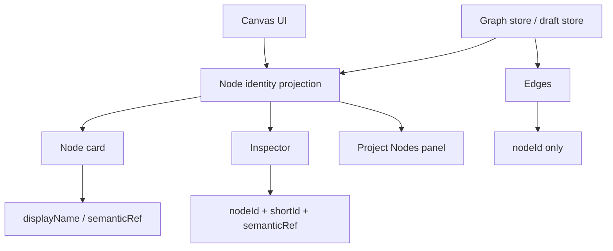
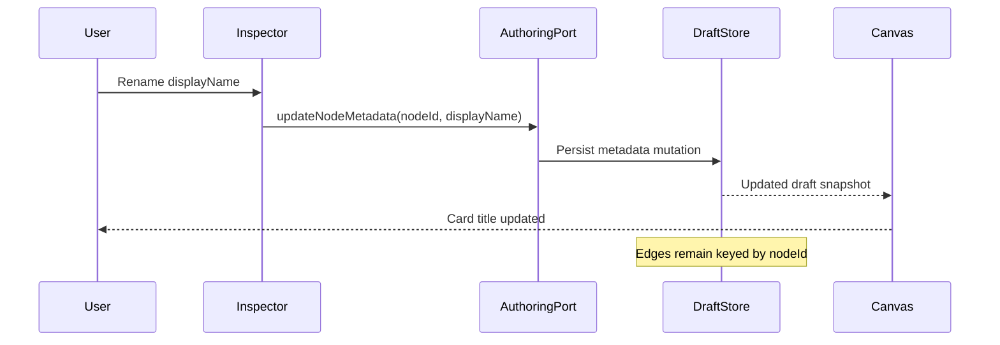
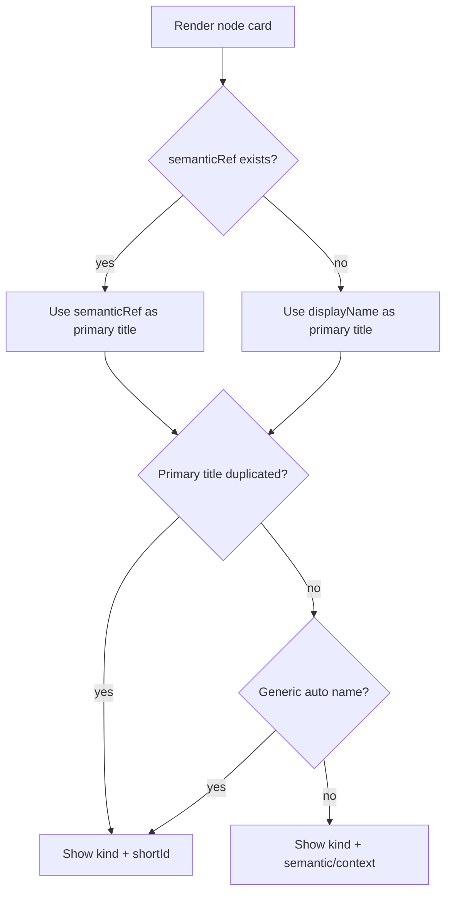

# DVT Canvas Node Identity And Naming Policy

## 1. Problem observed

The current canvas can display several nodes with the same visible name, for example multiple cards called `Source 2`. Even if each node has a unique internal identifier, the canvas becomes ambiguous for the user because the primary visual label no longer distinguishes the nodes.

- The user cannot easily know which `Source 2` feeds which transformation.
- The left catalog groups nodes by type, but the displayed node names do not communicate business meaning.
- Duplicate titles make debugging, documentation, lineage and code review harder.
- The problem is also an opportunity: keeping immutable identifiers allows safe references, while richer labels improve UX.

## 2. Recommended decision

DVT should separate three different concepts and render them differently in the UI:

```ts
nodeId        // immutable technical identity: e.g. src_01J...
displayName   // editable human label: e.g. Orders source
semanticRef   // real object/reference: e.g. raw.orders, stg_orders, model.sales.orders
shortId       // compact visual suffix derived from nodeId: e.g. A7F3
```

The technical identifier must always exist, but it should not be the primary title shown to the user. The visible card should prioritize business meaning and only expose the identifier as a secondary disambiguator.

## 3. Visual rule for node cards

Every node card should render two levels of identity:

```text
Primary title:     displayName or semanticRef
Secondary line:    kind label · semanticRef or #shortId
```

| Current           | Minimum acceptable     | Preferred                              |
| ----------------- | ---------------------- | -------------------------------------- |
| `Source 2`        | `Source 2 · #S2A1`     | `raw.orders` / `Source · #S2A1`        |
| `SQL transform 1` | `SQL transform 1 · #T91B` | `Normalize orders` / `SQL transform · stg_orders` |
| `Sink 1`          | `Sink 1 · #K3D2`       | `mart.orders_daily` / `Sink · #K3D2`   |

## 4. Naming policy

1. `nodeId` is always unique, immutable and never reused.
2. `displayName` is visible, editable and may be user-defined.
3. `semanticRef` is shown when available and should represent the real object or logical target.
4. Automatic names must never duplicate within the same canvas.
5. Manual duplicates may be allowed, but the UI must show a `shortId` disambiguator.
6. The inspector must always expose the full technical identity and allow copying it.

## 5. Auto-naming rules

When the system creates nodes automatically, it should generate unique names by type:

```text
Source 1
Source 2
Source 3
SQL transform 1
SQL transform 2
Sink 1
```

When duplicating a node, prefer assigning the next available name rather than copying the exact title. This avoids accidental duplicates:

```text
Duplicating “Source 2” -> “Source 7”
Duplicating “Normalize orders” -> “Normalize orders copy” only if semantic duplication is intentional
```

## 6. Manual duplicate handling

DVT should not necessarily block duplicate names. Duplicate names can be legitimate when several nodes represent instances of the same template, source family or logical role. However, every duplicate must be visually disambiguated.

```text
orders · #A7F3
orders · #B82C
```

The suffix should be subtle, not part of the primary name, and derived from `nodeId`. This preserves clarity without forcing artificial business names.

## 7. Inspector fields

| Field | Description |
| ----- | ----------- |
| Display name | Editable user-facing label. |
| Node ID | Immutable technical identifier, copyable. |
| Short ID | Compact visual suffix derived from `nodeId`. |
| Semantic ref | Real object reference: table, model, view, artifact or target. |
| Kind | `source`, `sql_transform`, `sink`, etc. |
| Created from | `manual`, `dbt_manifest`, `artifact_import`, `template`, `generated`. |
| Status | `authoring`, `valid`, `invalid`, `running`, `completed`, `failed`. |

## 8. Left catalog / Project Nodes

The left panel should keep grouped counters, but list meaningful labels underneath each group. The count is useful, but it should not replace node identity.

```text
Source (6)
  raw.customers
  raw.orders
  raw.payments
  Source 4 · #A7F3

SQL transform (3)
  stg_orders
  normalize_payments
  SQL transform 3 · #T91B

Sink (1)
  mart.orders_daily
```

## 9. Proposed TypeScript model

```ts
export type CanvasNodeOrigin =
  | 'manual'
  | 'dbt_manifest'
  | 'artifact_import'
  | 'template'
  | 'generated';

export type CanvasNodeKind =
  | 'source'
  | 'sql_transform'
  | 'sink';

export interface CanvasNodeIdentity {
  readonly nodeId: string;          // immutable, globally unique in workspace/canvas
  readonly kind: CanvasNodeKind;
  readonly displayName: string;     // visible, editable
  readonly semanticRef?: string;    // raw.orders, stg_orders, model.sales.orders
  readonly shortId: string;         // derived from nodeId, e.g. A7F3
  readonly createdFrom?: CanvasNodeOrigin;
}
```

## 10. Acceptance criteria

- Creating nodes repeatedly never produces duplicate automatic names inside the same canvas.
- If duplicate display names exist, all duplicate cards show a `shortId` suffix.
- Node cards show a meaningful primary title and a secondary identity line.
- The inspector exposes `nodeId`, `shortId`, `displayName`, `kind` and `semanticRef`.
- The left Project Nodes panel lists meaningful node names, not only type counters.
- Persisted edges and references use `nodeId`, never `displayName`.
- Renaming a node does not break edges, lineage, run history or plan references.

## 11. UX rationale

The user should reason visually in business language, while the system reasons technically through immutable IDs. This is the same separation used by mature graph tools: the visible title is optimized for cognition; the ID is optimized for persistence and references.

| Option | Clarity | Recommendation |
| ------ | ------- | -------------- |
| Only repeated `Source 2` | Low | Reject |
| `Source 2 · #A7F3` | Medium | Acceptable fallback |
| `raw.orders` plus secondary type/id | High | Preferred |
| Technical ID as title | Low for business users | Reject |
| Editable name plus ID in inspector | High | Recommended |

## 12. Implementation notes

- `shortId` should be deterministic and derived from `nodeId`, not stored as independent authority unless needed for performance.
- Duplicate detection should be scoped by canvas/workspace, not globally across all tenants.
- `semanticRef` should be optional because authoring nodes may exist before binding to a real object.
- Node rename should be treated as metadata mutation, not structural graph mutation.
- Plan compilation must always use `nodeId`/`semanticRef`, never `displayName` as identity.

## 13. Card mockups

### 13.1 Minimum fallback card

```text
┌──────────────────────────────┐
│ ▣ Source 2            ●      │
│ Source · #S2A1               │
│ authoring                    │
└──────────────────────────────┘
```

This is acceptable when no business metadata exists yet. The visible name is still generic, but the short ID prevents ambiguity.

### 13.2 Preferred source card

```text
┌──────────────────────────────┐
│ ▣ raw.orders          ●      │
│ Source · #S2A1               │
│ authoring                    │
└──────────────────────────────┘
```

This is preferred once the source is bound to a real table, model, file, stream or artifact.

### 13.3 Preferred transform card

```text
┌──────────────────────────────┐
│ ▦ Normalize orders    ●      │
│ SQL transform · stg_orders   │
│ valid                        │
└──────────────────────────────┘
```

Transform cards should expose intent first and output/semantic reference second.

### 13.4 Duplicate manual names

```text
┌──────────────────────────────┐    ┌──────────────────────────────┐
│ ▣ orders              ●      │    │ ▣ orders              ●      │
│ Source · #A7F3               │    │ Source · #B82C               │
└──────────────────────────────┘    └──────────────────────────────┘
```

Manual duplicates are allowed only if the secondary line disambiguates them.

## 14. Inspector changes

The inspector should become the authoritative place for full identity. Suggested grouping:

```text
Identity
  Display name       Orders source
  Node ID            src_01HX8R7Y6K...
  Short ID           A7F3
  Kind               source
  Semantic ref       raw.orders
  Created from       manual

Runtime
  Status             authoring
  Last planned       never
  Last run           never

Actions
  Copy node ID
  Copy semantic ref
  Rename
```

Inspector rules:

- `displayName` is editable.
- `nodeId` is read-only and copyable.
- `shortId` is read-only.
- `semanticRef` may be editable only when the node is not bound to an imported artifact authority.
- renaming a node updates presentation metadata only.
- renaming must not mutate edges, plan references, run events or lineage references.

## 15. Project Nodes panel changes

The current Project Nodes panel groups by type and shows counters. This should remain, but each item should expose meaningful identity.

```text
ADD NODE
  Source
  SQL transform
  Sink

PROJECT NODES
  Sink (1)
    mart.orders_daily

  Source (6)
    raw.customers
    raw.orders
    raw.payments
    Source 4 · #A7F3
    Source 5 · #S91C
    Source 6 · #S7DD

  SQL transform (3)
    stg_orders
    normalize_payments
    SQL transform 3 · #T91B
```

Panel behavior:

- sort by `displayName` or `semanticRef`, not by creation order only.
- show `shortId` for duplicates and generic names.
- selecting an item focuses the node in the canvas.
- hovering an item shows full `nodeId` and `semanticRef` in a tooltip.
- invalid or stale nodes should expose a compact status marker.

## 16. Definition of Done

### 16.1 Domain / model

- Add or confirm a canonical node identity model with `nodeId`, `displayName`, `semanticRef`, `shortId`, `kind`, `createdFrom`.
- Ensure `nodeId` is immutable after creation.
- Ensure `shortId` is deterministic from `nodeId`.
- Ensure graph edges use `nodeId` only.

### 16.2 Naming service

- Add a naming helper that generates unique automatic names scoped by canvas.
- Add tests for repeated creation of source/transform/sink nodes.
- Add tests for duplication behavior.
- Add tests for manual duplicates and short ID disambiguation.

### 16.3 Canvas card rendering

- Cards render primary title from `semanticRef ?? displayName` according to the active policy.
- Cards render secondary identity line with `kind` and either `semanticRef` or `shortId`.
- Duplicate display names always show `shortId`.
- Generic auto names always show `shortId` if ambiguity exists.

### 16.4 Inspector

- Inspector exposes full identity block.
- Copy actions exist for `nodeId` and `semanticRef`.
- Editing `displayName` does not mutate graph edges.
- Rename operations are persisted as metadata updates.

### 16.5 Project Nodes panel

- Groups keep counters.
- Items show meaningful labels.
- Duplicates and generic names show `shortId`.
- Item click focuses canvas node.
- Tooltip exposes full identity.

### 16.6 Tests

- Unit tests for naming policy.
- Unit tests for short ID generation.
- Component tests for duplicate rendering.
- Component tests for inspector identity fields.
- E2E test: create several nodes of the same kind and verify no ambiguous repeated labels are shown.
- Regression test: renaming a node keeps edges intact.

## 17. Implementation plan

### Phase 1 — Policy and read model alignment

- Introduce `CanvasNodeIdentity` if no equivalent exists.
- Add identity projection from existing canonical node model.
- Add `shortId` derivation utility.
- Add duplicate detection helper scoped to active canvas.

### Phase 2 — Card rendering

- Update source, transform and sink card renderers to consume projected identity.
- Add secondary identity line.
- Add duplicate/generic-name disambiguation.

### Phase 3 — Inspector

- Add Identity section.
- Add copy actions.
- Add rename action through the existing graph mutation/authoring port.

### Phase 4 — Project Nodes panel

- Replace counter-only group display with grouped identity list.
- Add focus-on-click behavior.
- Add tooltip with full identity.

### Phase 5 — Persistence and regression hardening

- Ensure rename persists as metadata.
- Ensure `nodeId` remains the only edge authority.
- Add regression tests for rename, duplicate names and plan compilation.

## 18. Mermaid diagrams

### 18.1 Identity ownership



### 18.2 Rename flow



### 18.3 Duplicate-name rendering policy



## 19. Open questions

- Should `semanticRef` become mandatory before a node can be planned?
- Should duplicate manual names trigger a warning badge or only visual disambiguation?
- Should imported dbt/source nodes derive `displayName` from `semanticRef` by default?
- Should `shortId` be globally unique within a workspace or only visually unique within a canvas?
- Should the Project Nodes panel support manual aliases distinct from canvas titles?

## 20. Final decision

DVT should keep immutable node identifiers as the persistence authority, but the UI must not rely on repeated display titles. The least confusing model is: business-readable title first, type/reference/shortId second, full technical identity in the inspector.

Final rule:

1. `nodeId` is immutable identity.
2. `displayName` is human-facing label.
3. `semanticRef` is the real data object or logical reference.
4. Duplicates are allowed only when visually disambiguated.
5. Edges, plans, lineage and run history never depend on `displayName`.
