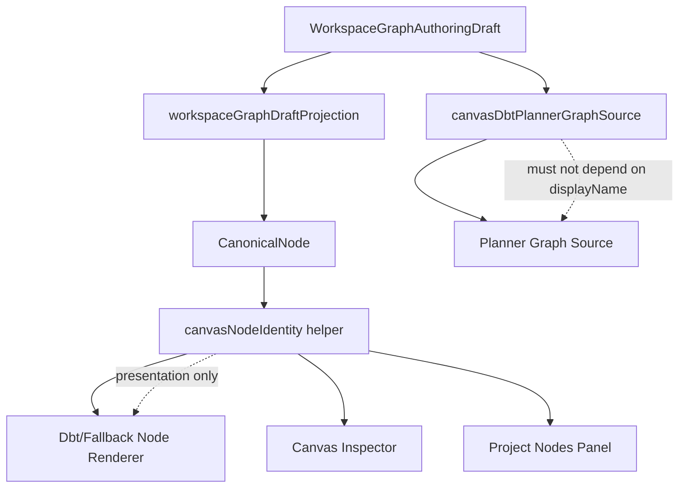

# Canvas Node Identity Implementation Plan

## 1. Purpose

This document turns ADR-0059 and the Canvas node naming policy into an
implementation sequence. It intentionally avoids a breaking contract migration
for the first iteration. The first implementation should treat the existing
contract fields as follows:

| Concept | Current field | First implementation meaning |
| ------- | ------------- | ---------------------------- |
| `nodeId` | `WorkspaceGraphAuthoringNode.id` | immutable graph identity |
| `displayName` | `WorkspaceGraphAuthoringNode.name` | editable UI label |
| `semanticRef` | `node.path` or `node.metadata.semanticRef` | stable data/workflow reference |
| `shortId` | derived from `nodeId` | visual disambiguator only |
| `kind` | `pluginId + kind` | plugin-qualified node kind |

The implementation goal is to remove visual ambiguity without changing planner
or runtime behavior.

## 2. Code map from current repo

The current repo already has a strong foundation:

- `packages/@dvt/contracts/src/contracts/planner/WorkspaceGraphAuthoringDraft.v1.ts`
  defines `WorkspaceGraphAuthoringNode.id`, `name`, `pluginId`, `kind`, `role`,
  `status`, optional `path`, optional `metadata`, and edges with `sourceId` and
  `targetId`.
- `apps/web/src/app/types/canonical.ts` defines `CanonicalNode.id`, `name`,
  `pluginId`, `kind`, `role`, `status`, and runtime/cost fields.
- `apps/web/src/app/services/workspace/workspaceGraphDraftProjection.ts` maps
  authoring nodes into canonical nodes and keeps `CanonicalNode.id = node.id` and
  `CanonicalNode.name = node.name`.
- `apps/web/src/app/views/canvas/canvasProjectSnapshot.ts` exports/imports the
  full `WorkspaceGraphAuthoringDraft`, so node identity changes must preserve
  snapshot compatibility.

The first implementation should therefore add a web-side projection layer rather
than mutate public contracts immediately.

## 3. Hotspot files found by code search

The following files should be inspected and changed in small commits:

| Area | File | Expected responsibility |
| ---- | ---- | ----------------------- |
| Inspector | `apps/web/src/app/views/canvas/CanvasInspectorAuthoringSection.tsx` | render full identity block and rename affordance |
| Inspector model | `apps/web/src/app/views/canvas/canvasInspectorAuthoringModel.ts` | project selected node into inspector read model |
| Creation | `apps/web/src/app/views/canvas/useCanvasAuthoringNodeCreationHandlers.ts` | generate unique default display names |
| Drop/import | `apps/web/src/app/views/canvas/useCanvasNodeDropHandlers.ts` | bind semantic refs when known |
| Duplicate | `apps/web/src/app/views/canvas/useCanvasNodeDuplicateHandlers.ts` | prevent duplicate auto names on duplication |
| Duplicate command | `apps/web/src/app/views/canvas/canvasDuplicateNodeCommand.ts` | preserve nodeId semantics and regenerate display name/shortId projection |
| Draft authoring | `apps/web/src/app/views/canvas/canvasDraftAuthoring.ts` | persist metadata-only rename safely |
| Node mapper | `apps/web/src/app/views/canvas/canvasNodeMapper.ts` | provide projected identity to React Flow nodes |
| Dbt node renderer | `apps/web/src/app/plugins/dbt/DbtNodeRenderer.tsx` | render primary title + secondary identity line |
| Fallback renderer | `apps/web/src/app/plugins/FallbackNodeRenderer.tsx` | render generic nodes with shortId disambiguation |
| Legacy component | `apps/web/src/app/components/canvas/DbtNodeComponent.tsx` | check whether still active; if active, align rendering |
| Planner projection | `apps/web/src/app/views/canvas/canvasDbtPlannerGraphSource.ts` | verify planner does not depend on display labels |
| Workspace explorer | `apps/web/src/app/components/canvasWorkspaceExplorerModel.ts` | show grouped meaningful labels in Project Nodes |

## 4. Proposed helper module

Add a focused helper under the Canvas view boundary:

```text
apps/web/src/app/views/canvas/canvasNodeIdentity.ts
```

Suggested exports:

```ts
export interface CanvasNodeIdentityViewModel {
  readonly nodeId: string;
  readonly displayName: string;
  readonly semanticRef: string | null;
  readonly shortId: string;
  readonly kindLabel: string;
  readonly primaryTitle: string;
  readonly secondaryTitle: string;
  readonly isDisplayNameDuplicated: boolean;
  readonly isGenericAutoName: boolean;
}

export function deriveCanvasNodeShortId(nodeId: string): string;

export function deriveCanvasNodeSemanticRef(
  node: Pick<CanonicalNode, 'path' | 'metadata'>
): string | null;

export function projectCanvasNodeIdentity(
  node: CanonicalNode,
  allNodes: readonly CanonicalNode[]
): CanvasNodeIdentityViewModel;

export function allocateUniqueCanvasNodeDisplayName(
  baseName: string,
  existingNames: readonly string[]
): string;
```

Rules:

- `shortId` must be deterministic from `nodeId`.
- `semanticRef` must prefer typed metadata, then `path`, then null.
- `primaryTitle` should prefer `semanticRef` when present; otherwise
  `displayName`.
- `secondaryTitle` should always include kind and include `shortId` when the
  primary title is duplicated or generic.
- helper functions must be pure and unit-tested.

## 5. Implementation tasks

### 59/1 — Add Canvas node identity projection helper

Scope:

- create `canvasNodeIdentity.ts`;
- derive `shortId`;
- derive `semanticRef` from `metadata.semanticRef` or `path`;
- derive primary and secondary titles;
- detect duplicate display names scoped to the current node list;
- detect generic auto names like `Source 2`, `SQL transform 3`, `Sink 1`.

Acceptance:

- no public contract changes;
- no runtime changes;
- tests cover duplicated labels, semanticRef preference and generic fallback.

### 59/2 — Use identity projection in Canvas node rendering

Scope:

- update `DbtNodeRenderer.tsx` and `FallbackNodeRenderer.tsx` first;
- if `DbtNodeComponent.tsx` is still active, align it too;
- show primary title and secondary identity line.

Acceptance:

- duplicate `Source 2` cards are visually disambiguated;
- source/model semantic refs are primary when available;
- generic nodes show `shortId` where ambiguity exists.

### 59/3 — Add Inspector identity block

Scope:

- update `canvasInspectorAuthoringModel.ts` to expose identity fields;
- update `CanvasInspectorAuthoringSection.tsx` to show node ID, short ID,
  display name, semantic ref, kind and created-from metadata if available.

Acceptance:

- `nodeId` is read-only and copyable;
- `displayName` is labelled as display metadata;
- rename does not mutate edges.

### 59/4 — Fix automatic names and duplication behavior

Scope:

- update node creation and drop handlers to allocate unique display names;
- update duplicate command/handler so duplicating `Source 2` does not create a
  second `Source 2` unless the user explicitly renames it later;
- keep duplicated node edge handling unchanged.

Acceptance:

- repeated node creation produces `Source 1`, `Source 2`, `Source 3`;
- duplicate auto names are not introduced by copy/duplicate;
- manual duplicates remain allowed but disambiguated in rendering.

### 59/5 — Project Nodes panel identity labels

Scope:

- update `canvasWorkspaceExplorerModel.ts` to consume the identity projection;
- group by role/kind as today but show `semanticRef ?? displayName`;
- show `shortId` for duplicate/generic labels.

Acceptance:

- Project Nodes no longer relies on counters alone;
- clicking an item still focuses the correct `nodeId`;
- tooltip or secondary text exposes full identity.

### 59/6 — Planner projection regression

Scope:

- audit `canvasDbtPlannerGraphSource.ts`;
- add regression tests proving rename does not change edge dependencies or the
  selected executable graph except for presentation metadata;
- ensure planner graph source uses IDs/semantic refs, not display label as
  dependency authority.

Acceptance:

- renaming a node preserves graph topology;
- planner selection still works after rename;
- tests fail if display name becomes dependency authority.

## 6. Test plan

| Test type | Target |
| --------- | ------ |
| Unit | `deriveCanvasNodeShortId` deterministic and stable |
| Unit | `allocateUniqueCanvasNodeDisplayName` avoids automatic duplicates |
| Unit | `projectCanvasNodeIdentity` prefers `semanticRef` over display name |
| Unit | duplicate display names trigger `shortId` in secondary title |
| Component | Dbt/fallback node renderer shows primary + secondary identity |
| Component | Inspector shows full identity block |
| Component | Project Nodes panel lists meaningful labels |
| Regression | rename keeps `edge.sourceId` / `edge.targetId` unchanged |
| Regression | planner projection does not depend on display name |
| E2E | create several source nodes; no ambiguous repeated visible labels |

## 7. Non-goals for this PR/iteration

- Do not rename public contract fields from `name` to `displayName` yet.
- Do not introduce `NodeDefinition` and `NodeInstance` as runtime contracts yet.
- Do not change planner `ExecutionPlan` step identity.
- Do not migrate stored snapshots.
- Do not change lineage/cost schemas.
- Do not implement backend migrations.

## 8. Risk controls

- Keep all identity presentation changes in web projection helpers first.
- Treat `shortId` as display-only; never persist it as authority.
- Keep `WorkspaceGraphAuthoringNode.id` as the only edge authority.
- Add tests before changing renderers.
- Update docs and ADR only after code confirms naming semantics.

## 9. Mermaid implementation flow



## 10. Recommended first code commit after this documentation PR

The first implementation commit should be limited to:

```text
apps/web/src/app/views/canvas/canvasNodeIdentity.ts
apps/web/src/app/views/canvas/canvasNodeIdentity.test.ts
```

This gives the team a safe pure-function boundary before changing UI rendering.
