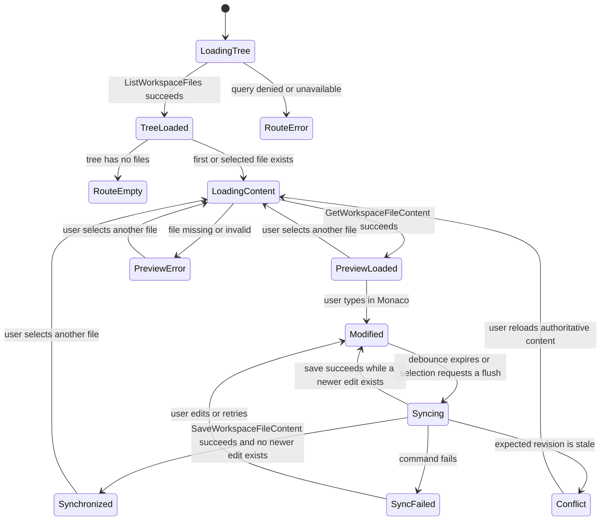
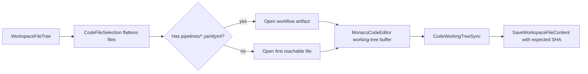
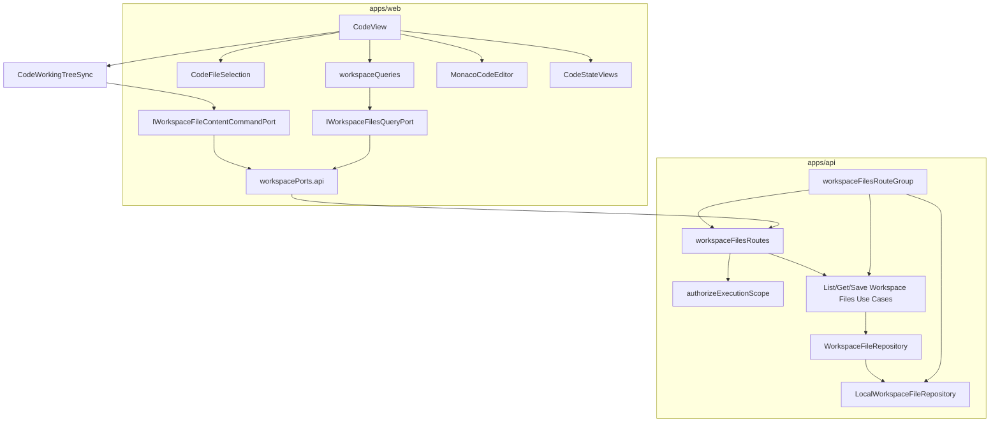

# Code Workbench Workspace Files Component

## Purpose

This component governs the Code workbench file explorer, file content query
flow, Monaco working-tree buffer, and the shared workspace-file mutation rail
used by both editor synchronization and product workflows that publish project
artifacts before preview or execution.

The component exists because the web Code route consumes workspace file queries
and product workflows can persist generated workspace artifacts through the live
command rail. The component closes the old read/write drift by naming the public
API, invariants, transitions, consumers, and tests.

Use with:

- [Command And Query Rail Governance](../../command-query-rail-governance.md)
- [Fowler Opportunity Planning Governance](../../fowler-opportunity-planning-governance.md)
- [Workbench UI Contract And Component Inventory](./workbench-ui-contract-and-component-inventory.md)
- [Web Auth, Project Onboarding, And Actionable Product Gaps](../../../planning/proposals/mandatory/frontend-and-ux/web-auth-project-onboarding-and-actionable-gaps-20260501.md)
- `buzon/20260504-codex-fowler-code-tab-workspace-files-analysis-and-plan.md`

## Owned Concern

Owned concern: expose tenant/project-scoped workspace files as operational
evidence for the Code workbench, synchronize selected-file edits into the
project working tree through revision-guarded writes, and provide the governed
`SaveWorkspaceFileContent` command for internal file mutations that must be
persisted before backend admission.

The component does not own project creation, graph draft mutation, or
authorization policy design. It consumes the protected runtime authorization
boundary, returns read models, and routes persistence through the governed
workspace file command rail.

## Public API

### Queries

| Query                     | Type  | Input                                                     | Output                 | Failure states                                                             |
| ------------------------- | ----- | --------------------------------------------------------- | ---------------------- | -------------------------------------------------------------------------- |
| `ListWorkspaceFiles`      | query | `tenantId`, `projectId`, `environmentId`                  | `WorkspaceFileTree`    | unauthenticated, unauthorized, missing scope                               |
| `GetWorkspaceFileContent` | query | `tenantId`, `projectId`, `environmentId`, `WorkspacePath` | `WorkspaceFileContent` | unauthenticated, unauthorized, missing scope, invalid path, file not found |

### Commands

| Command                    | Type    | Input                                                                                    | Output                     | Failure states                                                                      |
| -------------------------- | ------- | ---------------------------------------------------------------------------------------- | -------------------------- | ----------------------------------------------------------------------------------- |
| `SaveWorkspaceFileContent` | command | `tenantId`, `projectId`, `environmentId`, `WorkspacePath`, `content`, `expectedRevision` | `WorkspaceFileSaveReceipt` | unauthenticated, unauthorized, missing scope, invalid path, size, revision conflict |

### HTTP Adapter

| Route                         | Implements                 | Scope                                                                    |
| ----------------------------- | -------------------------- | ------------------------------------------------------------------------ |
| `GET /workspace/files`        | `ListWorkspaceFiles`       | query params: `tenantId`, `projectId`, `environmentId`                   |
| `GET /workspace/files/:path`  | `GetWorkspaceFileContent`  | encoded path plus query params: `tenantId`, `projectId`, `environmentId` |
| `POST /workspace/files/:path` | `SaveWorkspaceFileContent` | encoded path, query params: `tenantId`, `projectId`, `environmentId`     |

### Web Port

`apps/web/src/app/ports/workspace.ts` remains the web-facing port:

- `listFiles(): Promise<WorkspaceFileEntry[]>`
- `getFileContent(path: string): Promise<FileContent>`
- `saveFileContent(path: string, content: string): Promise<FileContent>`

The API adapter must build scoped endpoints from the active session store. The
mock adapter may remain a test/demo adapter, but it must not define live API
semantics.

### Web Presentation API

| Surface                 | Type                 | Responsibility                                                                                                |
| ----------------------- | -------------------- | ------------------------------------------------------------------------------------------------------------- |
| `CodeWorkingTreeSync`   | presentation model   | Holds editor text and synchronizes the latest revision-guarded value per selected workspace path.             |
| `CodeWorkingTreeStatus` | presentation view    | Renders honest modified, syncing, synchronized, conflict, failed, or read-only posture without a Save action. |
| `CodeFileSelection`     | read-model projector | Resolves the first selectable file from the authorized workspace tree.                                        |
| `MonacoCodeEditor`      | presentation gateway | Opens the shared Monaco surface in editable mode for Code.                                                    |
| `MonacoCodeViewer`      | presentation gateway | Opens the shared Monaco surface in read-only mode for Artifacts/review.                                       |

### Initial Selection Policy

`CodeFileSelection` opens the file most likely to explain the graph the user
just planned. It must prefer `pipelines/*.yaml|yml` workflow artifacts over
root project configuration files such as `dbt_project.yml`. If no workflow
artifact exists, it falls back to the first reachable file in the workspace
tree.

## DDD Model

| Object                     | Kind               | Responsibility                                                                            |
| -------------------------- | ------------------ | ----------------------------------------------------------------------------------------- |
| `WorkspaceFileTree`        | read model         | File hierarchy under an authorized workspace root.                                        |
| `WorkspaceFileContent`     | read model         | Text content, language, path, name, revision, and last modified metadata.                 |
| `WorkspaceFileRevision`    | value object       | Content SHA used as the mandatory compare-and-swap precondition.                          |
| `WorkspacePath`            | value object       | Normalized relative path; rejects absolute paths and parent traversal.                    |
| `WorkspaceFileReadPolicy`  | policy             | Allows only authenticated, tenant/project/environment-scoped reads.                       |
| `WorkspaceFileWritePolicy` | policy             | Allows only authenticated, tenant/project/environment-scoped writes.                      |
| `WorkspaceFileRepository`  | outbound port      | Lists files and reads content from the configured backing store.                          |
| `CodeFileSelection`        | read model         | Keeps file-tree traversal out of route rendering components.                              |
| `CodeWorkingTreeSync`      | presentation model | Serializes debounced file mutations and preserves later edits while a write is in flight. |

## Invariants

- File reads are queries; they must not mutate workspace state.
- Every live API file query requires tenant, project, and environment scope.
- The API returns canonical `HttpErrorEnvelope.v1` errors.
- Missing file maps to `workspace_file_not_found`, not generic `404` inference.
- Invalid path maps to `invalid_workspace_path`.
- The repository adapter rejects parent traversal, absolute paths, unsupported
  file types, and oversized files.
- The Code workbench automatically synchronizes edited content through
  `SaveWorkspaceFileContent`; it must not expose a second manual Save lifecycle
  or bypass the scoped command rail.
- Every synchronization supplies the SHA returned by
  `GetWorkspaceFileContent`; stale writes become an explicit conflict and never
  overwrite the current workspace file.
- Edits made while a write is in flight remain modified and are synchronized in
  a subsequent serialized write.
- Selecting another file flushes the current modified buffer before changing
  selection. A failed or conflicting flush keeps the current file selected.
- `synchronized` means working-tree content matches the editor. It does not mean
  staged, committed, pushed, or remotely synchronized.
- Initial Code file selection must prioritize workflow artifacts under
  `pipelines/` so the Code tab opens the artifact that matches the visible graph
  before lower-context project configuration files.
- Code route copy resolves through `resolveCodeViewCopy(locale)`; route,
  bootstrap, error, and Monaco surfaces must not own fixed-language strings.
- Canvas preview provenance may persist generated graph artifacts through
  `SaveWorkspaceFileContent` before calling `PreviewExecutionPlan`.
- Cypress must not seed `/workspace/files` by intercepting the route when proving
  the live happy path.

## Transitions



## Selection Flow



## Component Diagram



## Consumers

| Consumer                 | Uses                                                                      | Rule                                                                              |
| ------------------------ | ------------------------------------------------------------------------- | --------------------------------------------------------------------------------- |
| `CodeView`               | file tree, content queries, working-tree sync, `RouteWorkbenchFrameSlots` | May render loading, empty, error, edit, synchronization, and history states.      |
| `useCodeWorkingTreeSync` | selected file content and workspace command port                          | Owns debounced serialized synchronization, conflict posture, and selection flush. |
| `CodeWorkingTreeStatus`  | synchronization presentation model                                        | Renders status only and owns no command or persistence decision.                  |
| `FileTreePanel`          | localized title, selected path, entries                                   | Must render tree controls only; it does not own Code copy or queries.             |
| `resolveCodeViewCopy`    | locale                                                                    | Supplies Code route copy; Spanish text exists only in the locale map.             |
| `Diff` views             | selected file content                                                     | Must keep read-only posture and canonical error handling.                         |
| Artifact views           | workspace tree                                                            | Must not infer authorization from file presence.                                  |
| Canvas preview/run path  | `SaveWorkspaceFileContent`                                                | Must persist graph artifacts before protected plan preview.                       |
| Cypress Code happy path  | browser proof                                                             | Must prove real route behavior in live API mode.                                  |

## Strict Live Vertical

The stubbed Code Cypress spec proves presentation and request orchestration, but
it is not sufficient evidence for the workspace-file vertical. The required
live proof is:

```text
Monaco edit
  -> CodeWorkingTreeSync
  -> IWorkspaceFileContentCommandPort
  -> POST /workspace/files/:path with expected content SHA
  -> SaveWorkspaceFileContentUseCase
  -> scoped WorkspaceFileRepository
  -> atomic filesystem mutation
  -> GET /workspace/files/:path
  -> browser reload and Code reopen
```

The proof MUST run against the protected API and an isolated workspace root. It
MUST NOT intercept workspace-file routes, seed the edited content directly, or
use filesystem inspection as a substitute for `GetWorkspaceFileContent`. The
runner may reuse the selected-closure live stack, but the chosen Cypress spec is
a validated command input rather than a second process-orchestration copy.

## Architecture Test Requirement

Add a semantic architecture test that checks:

- component docs list `ListWorkspaceFiles`, `GetWorkspaceFileContent`, and
  `SaveWorkspaceFileContent`;
- global API route registration delegates to `registerProtectedWorkspaceFilesRouteGroup`;
- `registerProtectedRuntimeRoutes.ts` does not construct
  `LocalWorkspaceFileRepository`, `ListWorkspaceFilesUseCase`, or
  `GetWorkspaceFileContentUseCase`;
- web API adapter does not call bare `/workspace/files` without scope;
- no route component imports a concrete filesystem adapter;
- `CodeView` delegates initial file selection to `CodeFileSelection` instead
  of owning file-tree traversal logic, and `CodeFileSelection` prefers
  `pipelines/*.yaml|yml` workflow artifacts before generic project config
  files;
- `CodeView` delegates edit state and command orchestration to
  `CodeWorkingTreeSync` instead of owning timers, revisions, or mutation state
  inline;
- the synchronization model proves that edits arriving during an in-flight
  write are not lost and stale revisions stop automatic writes;
- the presentation contains no Save button and does not label a working-tree
  write as a Git commit or push;
- `CodeView` delegates route frame semantics to `RouteWorkbenchFrameSlots` so
  file navigation is `leftPanel` and the revision-guarded editor is
  `primarySurface`;
- Code bootstrap/error tests assert resolved copy objects, not fixed-language
  literals outside the locale catalog tests;
- `saveFileContent` is wired only to the scoped live API write route.

This guard must validate semantics, not only barrel thinness.

## Implementation Boundary

Allowed surfaces:

- `apps/api/src/application/ports/**`
- `apps/api/src/application/services/**`
- `apps/api/src/entrypoints/http/**`
- `apps/api/src/infrastructure/workspaceFiles/**`
- `apps/api/test/entrypoints/http/**`
- `apps/api/test/architecture/**`
- `apps/web/src/app/services/workspace/**`
- `apps/web/src/app/views/CodeView.test.tsx`
- `apps/web/src/app/views/code/codeWorkingTreeSyncModel.ts`
- `apps/web/src/app/views/code/useCodeWorkingTreeSync.ts`
- `apps/web/src/app/views/code/CodeWorkingTreeStatus.tsx`
- `apps/web/cypress/e2e/code/**` or existing Cypress workbench path
- this component doc and associated generated governance docs

Forbidden in this slice:

- changing Canvas graph draft semantics;
- adding fixture fallback for API mode;
- relaxing authorization or scope requirements;
- introducing a second workspace file query name;
- presenting local Monaco edits as persisted changes.
