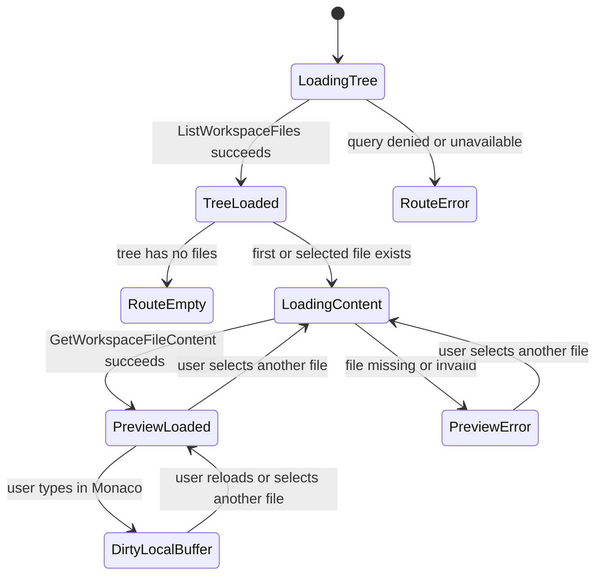
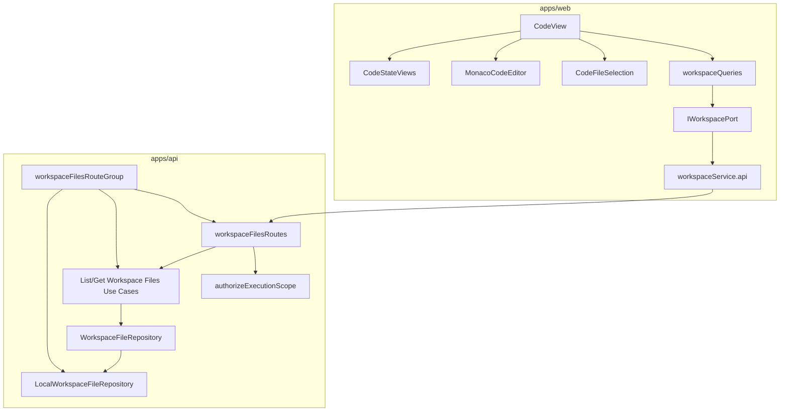

# Code Workbench Workspace Files Component

## Purpose

This component governs the Code tab file explorer, file content query flow, and
route-local Monaco editor buffer. It is a local editable buffer, not a file
persistence boundary.

The component exists because the web Code route already consumes workspace file
queries, while the live API route is not yet implemented. The component closes
that drift by naming the public API, invariants, transitions, consumers, and
tests before implementation.

Use with:

- [Command And Query Rail Governance](../../command-query-rail-governance.md)
- [Fowler Opportunity Planning Governance](../../fowler-opportunity-planning-governance.md)
- [Workbench UI Contract And Component Inventory](./workbench-ui-contract-and-component-inventory.md)
- [Web Auth, Project Onboarding, And Actionable Product Gaps](../../../planning/proposals/mandatory/frontend-and-ux/web-auth-project-onboarding-and-actionable-gaps-20260501.md)
- `buzon/20260504-codex-fowler-code-tab-workspace-files-analysis-and-plan.md`

## Owned Concern

Owned concern: expose tenant/project-scoped workspace files as operational
evidence for the Code workbench and let the browser hold a local editable
buffer for the selected file.

The component does not own file persistence, project creation, graph draft
mutation, or authorization policy design. It consumes the protected runtime
authorization boundary, returns read models, and keeps local text edits inside
the route until a governed save command exists.

## Public API

### Queries

| Query                     | Type  | Input                                                     | Output                 | Failure states                                                             |
| ------------------------- | ----- | --------------------------------------------------------- | ---------------------- | -------------------------------------------------------------------------- |
| `ListWorkspaceFiles`      | query | `tenantId`, `projectId`, `environmentId`                  | `WorkspaceFileTree`    | unauthenticated, unauthorized, missing scope                               |
| `GetWorkspaceFileContent` | query | `tenantId`, `projectId`, `environmentId`, `WorkspacePath` | `WorkspaceFileContent` | unauthenticated, unauthorized, missing scope, invalid path, file not found |

### HTTP Adapter

| Route                        | Implements                | Scope                                                                    |
| ---------------------------- | ------------------------- | ------------------------------------------------------------------------ |
| `GET /workspace/files`       | `ListWorkspaceFiles`      | query params: `tenantId`, `projectId`, `environmentId`                   |
| `GET /workspace/files/:path` | `GetWorkspaceFileContent` | encoded path plus query params: `tenantId`, `projectId`, `environmentId` |

### Web Port

`apps/web/src/app/ports/workspace.ts` remains the web-facing port:

- `listFiles(): Promise<WorkspaceFileEntry[]>`
- `getFileContent(path: string): Promise<FileContent>`

The API adapter must build scoped endpoints from the active session store. The
mock adapter may remain a test/demo adapter, but it must not define live API
semantics.

### Web Presentation API

| Surface              | Type                 | Responsibility                                                          |
| -------------------- | -------------------- | ----------------------------------------------------------------------- |
| `CodeEditableBuffer` | presentation model   | Holds unsaved editor text per selected workspace path in the browser.   |
| `CodeFileSelection`  | read-model projector | Resolves the first selectable file from the authorized workspace tree.  |
| `MonacoCodeEditor`   | presentation gateway | Opens the shared Monaco surface in editable mode for Code.              |
| `MonacoCodeViewer`   | presentation gateway | Opens the shared Monaco surface in read-only mode for Artifacts/review. |

## DDD Model

| Object                    | Kind               | Responsibility                                                         |
| ------------------------- | ------------------ | ---------------------------------------------------------------------- |
| `WorkspaceFileTree`       | read model         | File hierarchy under an authorized workspace root.                     |
| `WorkspaceFileContent`    | read model         | Text content, language, path, name, and last modified metadata.        |
| `WorkspacePath`           | value object       | Normalized relative path; rejects absolute paths and parent traversal. |
| `WorkspaceFileReadPolicy` | policy             | Allows only authenticated, tenant/project/environment-scoped reads.    |
| `WorkspaceFileRepository` | outbound port      | Lists files and reads content from the configured backing store.       |
| `CodeFileSelection`       | read model         | Keeps file-tree traversal out of route rendering components.           |
| `CodeEditableBuffer`      | presentation model | Unsaved browser-local editor text keyed by workspace path.             |

## Invariants

- File reads are queries; they must not mutate workspace state.
- Every live API file query requires tenant, project, and environment scope.
- The API returns canonical `HttpErrorEnvelope.v1` errors.
- Missing file maps to `workspace_file_not_found`, not generic `404` inference.
- Invalid path maps to `invalid_workspace_path`.
- The repository adapter rejects parent traversal, absolute paths, unsupported
  file types, and oversized files.
- The Code workbench may edit a browser-local buffer, but it must not persist
  file content without a separate governed command rail.
- Code route copy resolves through `resolveCodeViewCopy(locale)`; route,
  bootstrap, error, and Monaco surfaces must not own fixed-language strings.
- No save, apply, patch, or write indicator may appear until
  `SaveWorkspaceFileContent` exists with authorization, path policy, and
  concurrency semantics.
- Cypress must not seed `/workspace/files` by intercepting the route when proving
  the live happy path.

## Transitions

## Component Diagram

## Consumers

| Consumer                | Uses                                                                 | Rule                                                                   |
| ----------------------- | -------------------------------------------------------------------- | ---------------------------------------------------------------------- |
| `CodeView`              | file tree, content queries, local buffer, `RouteWorkbenchFrameSlots` | May render loading, empty, error, local edit, and preview states only. |
| `useCodeEditableBuffer` | selected file content                                                | Owns browser-local edit state keyed by workspace path.                 |
| `FileTreePanel`         | localized title, selected path, entries                              | Must render tree controls only; it does not own Code copy or queries.  |
| `resolveCodeViewCopy`   | locale                                                               | Supplies Code route copy; Spanish text exists only in the locale map.  |
| `Diff` views            | selected file content                                                | Must keep read-only posture and canonical error handling.              |
| Artifact views          | workspace tree                                                       | Must not infer authorization from file presence.                       |
| Cypress Code happy path | browser proof                                                        | Must prove real route behavior in live API mode.                       |

## Architecture Test Requirement

Add a semantic architecture test that checks:

- component docs list `ListWorkspaceFiles` and `GetWorkspaceFileContent`;
- global API route registration delegates to `registerProtectedWorkspaceFilesRouteGroup`;
- `registerProtectedRuntimeRoutes.ts` does not construct
  `LocalWorkspaceFileRepository`, `ListWorkspaceFilesUseCase`, or
  `GetWorkspaceFileContentUseCase`;
- web API adapter does not call bare `/workspace/files` without scope;
- no route component imports a concrete filesystem adapter;
- `CodeView` delegates initial file selection to `CodeFileSelection` instead
  of owning file-tree traversal logic;
- `CodeView` delegates local edit storage to `CodeEditableBuffer` instead of
  owning a path-keyed buffer map inline;
- `CodeView` delegates route frame semantics to `RouteWorkbenchFrameSlots` so
  file navigation is `leftPanel` and local-buffer preview is `primarySurface`;
- Code bootstrap/error tests assert resolved copy objects, not fixed-language
  literals outside the locale catalog tests;
- `saveFileContent` or `SaveWorkspaceFileContent` is not wired to a live API
  write route as part of this query/local-buffer component.

This guard must validate semantics, not only barrel thinness.

## Implementation Boundary

Allowed surfaces:

- `apps/api/src/application/ports/**`
- `apps/api/src/application/services/**`
- `apps/api/src/entrypoints/http/**`
- `apps/api/src/infrastructure/workspaceFiles/**`
- `apps/api/test/entrypoints/http/**`
- `apps/api/test/architecture/**`
- `apps/web/src/app/services/workspace/**`
- `apps/web/src/app/views/CodeView.test.tsx`
- `apps/web/cypress/e2e/code/**` or existing Cypress workbench path
- this component doc and associated generated governance docs

Forbidden in this slice:

- adding file write support;
- changing Canvas graph draft semantics;
- adding fixture fallback for API mode;
- relaxing authorization or scope requirements;
- introducing a second workspace file query name;
- presenting local Monaco edits as persisted changes.
