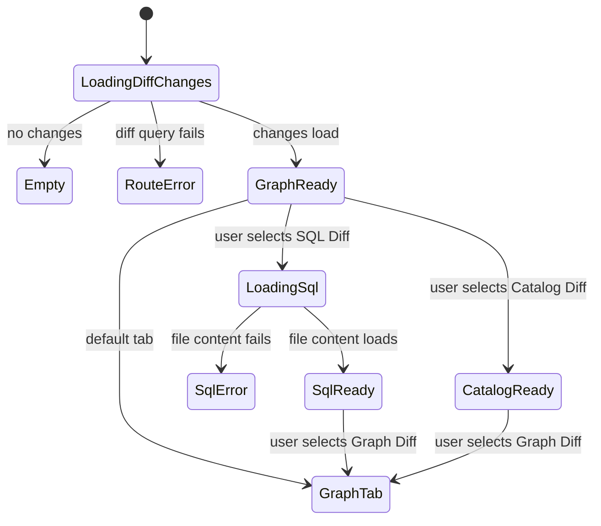
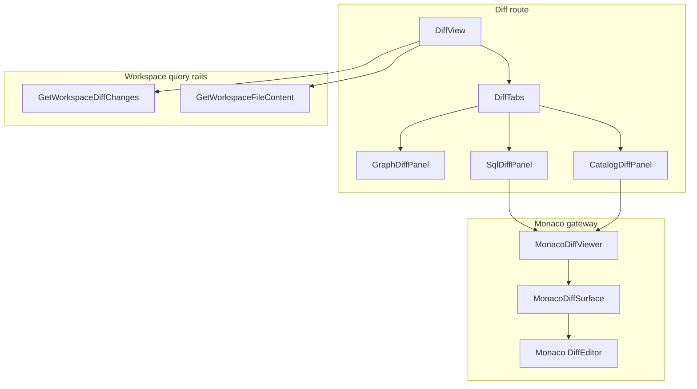

# Diff Monaco Review Surface Component

## Purpose

This component governs the Monaco-backed Diff route review surface for SQL and
structured payload comparison.

Owned concern: render route-scoped, read-only, diff-only review panes inside
the existing DVT workbench shell.

The component does not own shell navigation, Canvas graph authoring, live
backend diff computation, file editing, save/apply actions, or Monaco usage in
Artifacts and Templates.

## Public API

| API                 | Type                   | Owner            | Purpose                                                           |
| ------------------- | ---------------------- | ---------------- | ----------------------------------------------------------------- |
| `DiffView`          | route component        | Diff route       | Composes query state, header, summary, route frame, and tabs.     |
| `DiffTabs`          | presentation component | Diff route       | Selects Graph, SQL, and Catalog review panels.                    |
| `SqlDiffPanel`      | presentation adapter   | Diff route       | Maps `SqlDiffDocument` to a SQL `MonacoDiffViewer`.               |
| `CatalogDiffPanel`  | presentation adapter   | Diff route       | Maps `CatalogDiffDocument` to a JSON `MonacoDiffViewer`.          |
| `MonacoDiffViewer`  | lazy gateway           | Monaco component | Exposes the DVT-safe lazy diff viewer API.                        |
| `MonacoDiffSurface` | third-party binding    | Monaco component | Binds `@monaco-editor/react` `DiffEditor` with read-only options. |

The component consumes these rails:

| Rail                      | Type  | Use                                                        |
| ------------------------- | ----- | ---------------------------------------------------------- |
| `GetWorkspaceDiffChanges` | query | Provides graph/catalog diff change rows.                   |
| `GetWorkspaceFileContent` | query | Provides current SQL content for selected-node comparison. |

No command rail is introduced by this component.

## DDD And Read Models

| Object                       | Kind                    | Responsibility                                                                   |
| ---------------------------- | ----------------------- | -------------------------------------------------------------------------------- |
| `DiffReviewSurfaceReadModel` | presentation read model | Route-local state for selected Diff tab, compare context, and pane availability. |
| `SqlDiffDocument`            | presentation document   | Original compiled SQL, current SQL, and labels for SQL comparison.               |
| `CatalogDiffDocument`        | presentation document   | Previous and current catalog JSON plus summary rows.                             |
| `DiffCompareContextState`    | state model             | Loading, unavailable, or ready state for graph-backed comparison context.        |
| `DiffSqlContextState`        | state model             | Loading, unavailable, error, or ready state for file-backed SQL review.          |

## Invariants

- Monaco is embedded inside Diff panels; it does not own route composition.
- `DiffView` must not import `@monaco-editor/react` or `MonacoDiffViewer`.
- `DiffTabs` must not import `@monaco-editor/react`.
- `MonacoDiffViewer` lazy-loads `MonacoDiffSurface`.
- `MonacoDiffSurface` uses `DiffEditor`, not editable `Editor`.
- The diff surface is read-only and diff-only: `readOnly: true` and
  `originalEditable: false`.
- Context menu, code lens, diff code lens, glyph margin, and minimap remain off
  for the v1 review posture.
- SQL and catalog unavailable/error states fail closed without rendering Monaco.
- No save, apply, edit, or mutation callback belongs to this component.

## Transitions

## Component Diagram

## Consumers

| Consumer                       | Uses                                | Rule                                                                   |
| ------------------------------ | ----------------------------------- | ---------------------------------------------------------------------- |
| Diff route users               | Graph, SQL, and Catalog review tabs | May inspect changes but cannot edit or apply from this surface.        |
| Code workbench                 | contextual file evidence            | May link review context to Diff but does not own Diff rendering.       |
| Future `F-17-C` Artifacts work | Monaco patterns                     | Must use its own component guide and not inherit Diff route ownership. |
| Architecture tests             | semantic guard                      | Must prove read-only and route-safe posture.                           |

## Architecture Guard

`apps/web/src/app/views/diff/diffMonacoReviewSurface.architecture.test.ts`
guards:

- local docs and stories exist;
- `buzon` Fowler analysis exists;
- route modules have owned concern docblocks;
- route-level composition does not import Monaco directly;
- Monaco is lazy-loaded behind `MonacoDiffViewer`;
- `MonacoDiffSurface` uses `DiffEditor` with read-only options.

## Current Scope

Included:

- SQL diff rendering;
- catalog JSON diff rendering;
- route-local loading, empty, unavailable, and error states;
- semantic documentation and architecture guard.

Out of scope:

- editing;
- applying patches;
- backend diff computation;
- Artifacts Monaco viewer closure;
- bundle budget enforcement beyond lazy loading.
