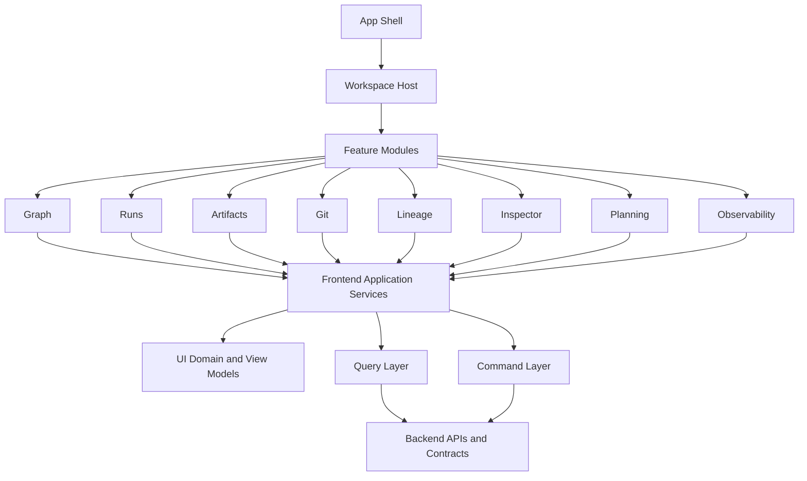

# DVT+ Frontend Architecture Introduction

## 1. Purpose

This document introduces the architectural direction for the DVT+ frontend. It is intended to establish a formal baseline for discussing the current state of the frontend, the desired target architecture, and the product-facing capabilities that the frontend must support over time.

This is an introductory document. Its purpose is not to fully specify implementation details, but to define the architectural frame in which those details should be decided.

The frontend of DVT+ should not be treated as a conventional web application composed of isolated pages. The product direction already implies a more demanding structure: a modular workbench capable of representing, editing, inspecting, comparing, and operating complex data workflows from multiple perspectives.

---

## 2. Context

DVT+ is not merely a visual shell around execution APIs. The product is evolving toward a system that must allow users to:

- design workflows
- inspect structure and dependencies
- understand generated artifacts
- observe execution
- inspect logs and metrics
- compare versions and changes
- trace lineage and impact
- operate across multiple work modes from a unified experience

That changes the nature of the frontend significantly.

A traditional route-based application model is insufficient for this product. DVT+ requires a frontend architecture capable of composing multiple simultaneous surfaces of interaction around shared entities and shared context.

---

## 3. Architectural Position

The frontend should be understood as a **workbench-oriented product surface**, not as a collection of unrelated views.

The core architectural principle is the following:

> The frontend must own its own UI domain and provide multiple coherent projections over shared product state.

This has several implications:

1. The frontend cannot be reduced to rendering backend payloads directly.
2. The frontend cannot be designed as a set of disconnected pages.
3. The frontend must support several representations of the same underlying project, workflow, run, or artifact.
4. The frontend must preserve separation between server state, UI state, and transient working state.
5. The frontend must remain extensible as DVT+ adds new capabilities, views, and execution-adjacent surfaces.

---

## 4. What exists today, conceptually

Even if some parts are still evolving, the current product direction already implies several frontend surfaces and operating modes.

These include, at minimum:

- workflow / graph workbench
- dbt-oriented view
- ETL / orchestration-oriented view
- execution and run monitoring view
- observer / operational room view
- artifact and SQL inspection
- git / diff / version comparison
- inspector / property editing surfaces
- lineage and dependency visualization

This means the frontend already has the shape of a multi-surface product.

The key point is that these surfaces are not independent products. They are distinct representations of shared product concepts.

---

## 5. Problem statement

The main architectural risk is not lack of components. The main risk is fragmentation.

If the frontend is developed as a sequence of isolated screens, each with its own local assumptions, it will almost certainly drift into:

- duplicated state models
- duplicated fetching logic
- duplicated selection logic
- inconsistent action semantics
- tight coupling to backend payload structures
- brittle integrations between graph, run, artifact, and git views

This would produce a front end that appears functional but is structurally weak, difficult to evolve, and expensive to stabilize.

A second major risk is confusing a canvas library with product architecture. A graph canvas, docking panels, tabs, split views, or editors are only presentation primitives. They do not provide the architectural model required by the product.

---

## 6. Why the frontend needs its own domain

The backend and the frontend do not solve the same problem.

The backend models concerns such as:

- planning
- execution
- persistence
- event sourcing
- snapshots
- provider interaction
- auditability

The frontend must additionally model concerns such as:

- selection
- focus
- layout
- active mode
- panel composition
- local edits
- compare state
- temporary overlays
- navigation context
- interaction history
- transient validation state

These concerns are not accidental UI details. They are part of the product behavior visible to the user.

Therefore, the frontend must maintain a product-facing UI domain of its own, instead of treating backend contracts as its only source of meaning.

---

## 7. Target direction

The target direction for DVT+ frontend architecture is:

> A modular, state-driven, projection-based workbench with a dedicated UI domain.

This statement can be unpacked as follows.

### 7.1 Modular

The frontend should be organized by product capability rather than by generic pages.

Indicative capability areas include:

- workspace
- graph
- runs
- artifacts
- lineage
- git
- inspector
- planning
- observability

Each capability should evolve as a coherent module with its own internal model, UI composition, and interaction contracts.

### 7.2 State-driven

The system should derive visible UI behavior from explicit state models rather than from ad hoc component interactions.

This is especially important because DVT+ requires:

- multiple views over the same entity
- synchronized panels
- stable selection context
- progressive loading
- operational monitoring
- transient editing and comparison modes

### 7.3 Projection-based

A project, workflow, artifact, or run should not need to be re-modeled independently for every screen.

Instead, the frontend should support multiple projections over shared semantic entities. For example, the same underlying node or workflow element may appear in:

- graph view
- artifact inspector
- run detail
- lineage overlay
- git diff correlation
- property panel
- planning surface

This avoids semantic drift between screens.

### 7.4 Workbench

The frontend should support simultaneous surfaces within a shared workspace, including combinations such as:

- graph center panel
- inspector side panel
- run monitor bottom panel
- artifact preview tab
- git diff side-by-side panel
- lineage overlay on graph
- operational observer surface

This is a workbench model, not a simple page model.

---

## 8. Architectural model

The high-level target architecture can be represented as follows.

This model is intentionally high-level. It establishes the separation of concerns without freezing implementation too early.

---

## 9. Core frontend areas

### 9.1 App Shell

The shell is responsible for global application composition, including:

- bootstrap
- routing baseline
- environment and tenant context
- session and auth context
- global layout frame
- module registration
- platform providers

The shell should remain thin. It should not become the place where product behavior accumulates.

### 9.2 Workspace Host

The workspace host is central to the product and should be treated as a first-class architectural element.

Its responsibilities include:

- tab/session handling
- panel composition
- layout coordination
- cross-surface context sharing
- selection propagation
- deep-linking within the workbench
- preserving user work context

The workspace host is not a visual container only. It is a product coordination layer.

### 9.3 Feature Modules

Feature modules should encapsulate product capabilities such as graph, runs, artifacts, git, or lineage.

A feature module may include:

- UI components
- internal state
- view-model mappers
- feature-specific services
- interaction commands
- selectors
- feature-local adapters

Modules should collaborate through defined context and service boundaries rather than through arbitrary component imports.

### 9.4 Frontend Application Services

The frontend will require orchestration logic that should not live directly inside presentational components.

These services may coordinate concerns such as:

- mapping server data into projection-ready models
- synchronizing selection and dependent panels
- opening context-sensitive views
- resolving related run, artifact, and graph data
- executing user intent against command endpoints

This layer helps prevent the front end from collapsing into component-driven spaghetti.

---

## 10. State model

A viable frontend architecture for DVT+ requires explicit separation of state categories.

### 10.1 Server state

This includes remotely sourced data such as:

- projects
- runs
- snapshots
- artifacts
- graph-derived data
- lineage data
- git metadata
- planning outputs

This state is fetched, cached, invalidated, refreshed, and observed over time.

### 10.2 UI state

This includes interaction-local state such as:

- selected entity
- active tab
- panel visibility
- split positions
- zoom and viewport
- active mode
- filters
- current workspace composition

This state exists to drive the interactive surface and should remain separate from backend persistence concerns.

### 10.3 Working or transient state

This includes user work in progress, such as:

- unsaved edits
- temporary graph changes
- draft node configuration
- connection staging
- compare sessions
- local validation state
- pending mutations awaiting confirmation

This state is neither pure UI chrome nor authoritative server state. It must be modeled explicitly.

Failure to separate these three state categories will cause instability, especially once the product combines design-time and run-time surfaces.

---

## 11. Shared context and selection

One of the most important architectural requirements is the existence of a shared selection and context model.

In DVT+, a single selected entity may need to drive several coordinated surfaces:

- graph highlight
- inspector content
- related run status
- related artifact preview
- lineage context
- available actions
- git correlation

This means selection cannot be treated as a private concern of the graph canvas or any single component.

Selection must be represented as a shared workbench-level concept.

The same is true for context such as:

- active project
- active environment
- active run
- compare mode
- active artifact
- active workspace mode

These must have explicit, coherent ownership.

---

## 12. Product implication: one system, many views

The frontend should be designed around the principle that the product exposes many views of the same system.

For example, a workflow node may participate in:

- a structural graph
- a run timeline
- an artifact tree
- a generated SQL preview
- a lineage dependency chain
- a git diff context
- a property editor

These are not separate realities. They are distinct projections over related entities.

The frontend architecture should make those relationships easy to represent, not difficult.

---

## 13. What the frontend should avoid

The following anti-patterns should be avoided from the beginning.

### 13.1 Page-first architecture

A page-first structure will fragment the product and make shared context difficult to maintain.

### 13.2 Monolithic global store

A single mega-store tends to become opaque, over-coupled, and difficult to test. The system should prefer modular state ownership with explicit coordination boundaries.

### 13.3 Backend payloads as direct UI model

The frontend must not assume that transport contracts are the correct shape for interaction design, editing, or view composition.

### 13.4 Library-driven domain design

Canvas libraries, editors, and docking frameworks must remain replaceable or at least bounded behind the frontend’s own semantic model. Product concepts should not be defined by third-party UI tool constraints.

---

## 14. Indicative domain areas for the frontend

At an introductory level, the frontend appears to require at least the following product-facing domains:

- **Workspace Domain**  
  Owns workbench composition, active context, tabs, and panel orchestration.

- **Graph Domain**  
  Owns visual workflow representation, structural interaction, selection hooks, layout coordination, and graph-level actions.

- **Run Monitoring Domain**  
  Owns active run representation, timeline, step focus, logs, metrics correlation, and operational refresh behavior.

- **Artifact Domain**  
  Owns artifact browsing, previews, SQL/documentation views, metadata, and artifact-to-entity correlation.

- **Git Domain**  
  Owns change representation, diffs, version awareness, and source-to-visual correlation.

- **Inspector Domain**  
  Owns detail surfaces, contextual properties, actions, validation summaries, and selected-entity inspection.

- **Lineage Domain**  
  Owns dependency exploration, upstream/downstream navigation, impact views, and lineage projections.

These are architectural candidates, not yet fixed implementation packages.

---

## 15. Strategic outcome

The purpose of this architecture is not only to support current screens. It is to make the frontend durable as the product expands.

A correct frontend architecture should allow DVT+ to support, over time:

- workflow authoring
- run-time observation
- artifact introspection
- version-aware review
- lineage navigation
- audit-oriented product behavior
- future plugin surfaces
- additional execution-related or data-related projections

The architecture therefore needs to optimize for coherence, extensibility, and traceability, not only for short-term UI delivery speed.

---

## 16. Preliminary conclusion

The frontend of DVT+ should be treated as a modular workbench with its own UI domain, rather than as a route-based application or a thin rendering layer over backend responses.

The central architectural shift is this:

> The frontend must represent a shared product model through multiple synchronized projections inside a persistent workspace.

That is the correct starting point for subsequent architectural work.

---

## 17. Next steps

This introductory document should be followed by more concrete documents covering at least:

1. **Frontend architecture baseline**  
   Boundaries, layers, state categories, interaction model, and initial technical conventions.

2. **Workspace model**  
   Tabs, panels, selection context, composition rules, and navigation semantics.

3. **Feature module map**  
   Capability decomposition and responsibilities for graph, runs, artifacts, git, lineage, and inspector.

4. **State strategy**  
   Clear separation of server state, UI state, and transient working state.

5. **Interaction and command model**  
   How user intent flows through the frontend and how views coordinate without excessive coupling.

6. **Implementation roadmap**  
   A phased plan to evolve from current product needs toward the target architecture.

---

## 18. Summary statement

DVT+ does not need a conventional frontend. It needs a frontend architecture capable of behaving like an operational and design workbench for auditable data workflows.

That requires:

- a dedicated UI domain
- modular capability boundaries
- shared selection and context
- multiple projections over shared entities
- explicit state separation
- a workspace-centric architectural model

That is the direction established by this document.
