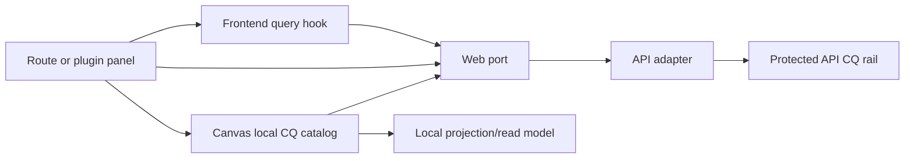

# Frontend Command And Query Rail Inventory

## Purpose

This document is a human-readable frontend rail overview for `apps/web`.
Planning DB is the formal command/query inventory; this page cannot add,
rename, or reclassify a rail.

The inventory does not create new behavior. It names what the frontend already
consumes, where rails are repeated, where documentation drift exists, and which
commands or queries are still needed for a mature end-to-end workflow.

## Governing Sources

- `docs/architecture/command-query-rail-governance.md`
- `docs/architecture/reference-architecture.md`
- `docs/architecture/fowler-opportunity-planning-governance.md`
- `docs/architecture/components/web/index.md`
- `docs/architecture/components/web/frontend-query-boundary-component.md`
- `docs/architecture/components/web/graph/canvas-workbench-command-query-catalog.md`
- `pnpm planning:db:query command-query-rails --filter Web --no-refresh`

## Status Vocabulary

- `implemented-api`: frontend port calls a protected backend/API rail.
- `implemented-local`: frontend rail is intentionally local presentation state.
- `implemented-projection`: frontend projects another authoritative rail into a
  route-specific read model.
- `partial-ui`: backend or port exists, but the route does not expose a complete
  user command.
- `fail-closed`: frontend exposes an unavailable posture instead of calling a
  missing or unsupported rail.
- `gap-needed`: a mature workflow needs the rail, but it is not implemented as
  a frontend command/query.

## Runtime And Session Rails

### `ConfigureApplicationLanguage`

- Type: command.
- Status: `implemented-local` once the CUX1/WUX1 convergence slice lands.
- Owner: `ApplicationLanguagePreference` value object.
- Frontend surfaces: the application-language preference store, shell copy
  presenters, and the Canvas View menu contribution.
- Scope and authorization: browser-local presentation preference only. It does
  not alter tenant, project, environment, graph, run, or authenticated-session
  authority.
- Persistence: a validated `en | es` value may be stored locally; unsupported or
  unreadable values fall back to the supported browser/document language and
  then English.
- Negative tests: unsupported persisted locale, unavailable storage, reactive
  copy update without reload, and no protected API call on language change.

### `GetRuntimeSession`

- Type: query.
- Status: `implemented-api`.
- Owner: runtime session admission.
- Frontend surface: protected route session context.
- Backend surface: `GET /session`.
- Notes: login failure states must remain explicit; the frontend must not
  invent an authenticated bearer session.

### `GetEffectiveWorkspaceContext`

- Type: query.
- Status: `implemented-api` for backend context and `implemented-local` for the
  presentation snapshot consumed by `SessionContextPort`.
- Owner: protected runtime workspace context.
- Frontend surface: `SessionContextPort`, `createSessionContextPort`.
- Backend surface: `GET /workspace/context`.
- Drift risk: the UI has several controls that imply workspace selection, but
  the formal frontend command to switch an existing workspace scope is not
  named.

### `GetRuntimeCapabilities`

- Type: query.
- Status: `implemented-api`.
- Owner: runtime capability read model.
- Frontend surface: `CapabilitiesPort.loadCapabilities`.
- Backend surface: `/capabilities`.
- Notes: governed by ADR-0056; browser-local fallback must not define runtime
  capability semantics.

## Project Onboarding Rails

### `ListProjects`

- Type: query.
- Status: `implemented-api`.
- Owner: project onboarding catalog.
- Frontend surface: `ProjectOnboardingService.listProjects`.
- Backend surface: `GET /projects`.
- Notes: used before a workspace context exists; session headers are not used
  for this first-use catalog call.

### `CreateProject`

- Type: command.
- Status: `implemented-api`.
- Owner: project aggregate.
- Frontend surface: `ProjectOnboardingService.createProject`.
- Backend surface: `POST /projects`.
- Notes: command carries an idempotency key generated at the frontend adapter
  edge.

### `SelectWorkspaceScope`

- Type: command.
- Status: `implemented-local`.
- Owner: workspace scope selection command.
- DB-first authority: `WEB-SCOPE-SELECTION-20260605` and
  `WEB-SCOPE-SELECTION-RELATIONS-20260605`.
- Frontend surfaces: `WorkspaceScopeSelectionPort`,
  `createWorkspaceScopeSelectionPort`, `ShellWorkspaceScopeSelector`, and
  `SessionContextPort`.
- Backend authority read model: `GetEffectiveWorkspaceContext`.
- Notes: the command accepts only tenant/project/environment scopes present in
  server-granted `availableWorkspaces`; rejected selections leave the current
  session projection unchanged.
- Negative tests: unavailable workspace scope, unresolved server context,
  protected workspace-file requests before grant resolution, and source import
  before grant resolution.

## Workspace Graph Draft Rails

### `GetWorkspaceGraphDraft`

- Type: query.
- Status: `implemented-api`.
- Owner: workspace graph draft read model.
- Frontend surfaces:
  - `IWorkspaceGraphDraftAuthoringPort.readGraphDraft`;
  - `IWorkspaceGraphSnapshotQueryPort.getGraphSnapshot`;
  - `useWorkspaceGraphForViewQuery`.
- Backend surface: `GET /workspace/graph/draft`.
- Repetition: the frontend has an envelope-preserving authoring read and a
  projected graph snapshot read over the same backend rail. This is acceptable
  only if the projection split stays documented.

### `SaveWorkspaceGraphDraft`

- Type: command.
- Status: `implemented-api`.
- Owner: workspace graph draft aggregate.
- Frontend surface: `IWorkspaceGraphDraftAuthoringPort.saveGraphDraft`.
- Backend surface: `PUT /workspace/graph/draft`.
- Notes: owns revision, idempotency key, schema-version rejection, and
  conflict posture. Canvas autosave and import flows must reuse this command.

### `GetWorkspaceGraphSnapshot`

- Type: query.
- Status: `implemented-projection`.
- Owner: frontend graph snapshot read model.
- Frontend surface: `IWorkspaceGraphSnapshotQueryPort.getGraphSnapshot`.
- Backend rail: `GetWorkspaceGraphDraft`.
- Notes: this is a projection query, not a separate backend product rail.

## Workspace File And Artifact Rails

### `ListWorkspaceFiles`

- Type: query.
- Status: `implemented-api`.
- Owner: workspace file tree read model.
- Frontend surfaces:
  - `IWorkspaceFilesQueryPort.listFiles`;
  - `useWorkspaceFileTreeQuery`;
  - `useWorkspaceArtifactsQuery`.
- Backend surface: `GET /workspace/files`.

### `GetWorkspaceFileContent`

- Type: query.
- Status: `implemented-api`.
- Owner: workspace file content read model.
- Frontend surfaces:
  - `IWorkspaceFilesQueryPort.getFileContent`;
  - `useWorkspaceFileContentQuery`;
  - Code and Artifacts routes.
- Backend surface: `GET /workspace/files/:path`.

### `SaveWorkspaceFileContent`

- Type: command.
- Status: `implemented-api`.
- Owner: workspace file content aggregate.
- Frontend surfaces:
  - `IWorkspaceFileContentCommandPort.saveFileContent`;
  - `useCodeWorkingTreeSync`;
  - the contextual `CodeView` workbench.
- Backend surface: `POST /workspace/files/:path`.
- Synchronization rule: Monaco edits are revision-guarded and automatically
  synchronized through this rail. Selection changes, contextual target
  changes, preview handoff, and workbench close may request an explicit
  `flush()`, but that operation only drains the same
  `SaveWorkspaceFileContent` command; it is not a second product command.
- Negative evidence: unchanged buffer no-op, stale revision conflict,
  unsupported path, read-only workspace, API rejection, serialized edits while
  a write is in flight, and persistence before contextual target changes.

### `GetWorkspaceFileHistory`

- Type: query.
- Status: `implemented-api`.
- Owner: workspace file history read model.
- Frontend surfaces:
  - `IWorkspaceFileHistoryQueryPort.getFileHistory`;
  - `useWorkspaceFileHistoryQuery`;
  - `CodeFileHistoryPanel`.
- Backend surface: `GET /workspace/file-history/:path`.

### `ListWorkspaceArtifacts`

- Type: query.
- Status: `implemented-projection`.
- Owner: workspace artifact preview read model.
- Frontend surface: `useWorkspaceArtifactsQuery`.
- Backend rails: `ListWorkspaceFiles` and `GetWorkspaceFileContent`.
- Repetition risk: artifact preview must not invent a separate workspace-file
  catalog; it is a projection over file rails.

## Workspace Diff And Plugin Catalog Rails

### `GetWorkspaceDiffChanges`

- Type: query.
- Status: `implemented-api`.
- Owner: workspace diff read model.
- Frontend surfaces:
  - `IWorkspaceDiffQueryPort.getDiffChanges`;
  - `useWorkspaceDiffChangesQuery`.
- Backend surface: `GET /workspace/diff/changes`.
- Drift: older route-parity planning classified this as a missing backend
  rail. Current API vocabulary and routes expose it; the old planning posture is
  historical unless refreshed.

### `ListWorkspacePlugins`

- Type: query.
- Status: `implemented-api`.
- Owner: workspace plugin catalog read model.
- Frontend surfaces:
  - `IWorkspacePluginCatalogQueryPort.getPlugins`;
  - `useWorkspacePluginCatalogQuery`.
- Backend surface: `GET /workspace/plugins`.
- Composition ownership: `createWorkspacePorts` creates the API plugin catalog
  query port; `buildAppServices` consumes that instance or an explicit override.

### `ListAdminRoles`

- Type: query.
- Status: `fail-closed`.
- Owner: admin RBAC read model.
- Frontend surface: `IWorkspaceAdminReadPort.getRoles`.
- Backend surface: not available as a frontend-consumed protected route.
- Notes: this must remain fail-closed until the admin bounded context exposes a
  governed read rail.

### `ListAdminAuditLog`

- Type: query.
- Status: `fail-closed`.
- Owner: admin audit read model.
- Frontend surface: `IWorkspaceAdminReadPort.getAuditLog`.
- Backend surface: not available as a frontend-consumed protected route.
- Notes: audit data must not be mocked as product truth.

## Warehouse Source Import Rails

### `ListWarehouseConnections`

- Type: query.
- Status: `implemented-api`.
- Owner: warehouse connection catalog read model.
- Frontend surface: `IWarehouseSourceImportPort.listWarehouseConnections`.
- Backend surface: `GET /workspace/warehouse/connections`.
- Security invariant: the public read model contains connection identity and
  provider metadata only. Credential references and discovered source-object
  payloads remain server-side and never cross this query boundary.

### `ListWarehouseConnectionSourceObjects`

- Type: query.
- Status: `implemented-api`.
- Owner: provider-neutral source object catalog read model.
- Frontend surface: `IWarehouseSourceImportPort.listSourceObjects`.
- Backend surface: `GET /workspace/warehouse/connections/:connectionId/objects`.

### `PreviewWarehouseSourceObjectRows`

- Type: query.
- Status: `implemented-api`.
- Owner: bounded relational source sample read model.
- Frontend surface:
  `IWarehouseSourceDataSampleQueryPort.previewSourceObjectRows` and the Canvas
  bottom operational drawer Data panel.
- Backend surface:
  `GET /workspace/warehouse/connections/:connectionId/source-data-sample`.
- Scope and safety: tenant, project, environment, governed connection and source
  object are server-authorized; the client supplies no SQL or credentials; the
  response is bounded and string-or-null.
- Presentation rule: column positioning and row sorting are local projections of
  the returned sample. They never mutate the sample, canonical Canvas field order,
  `FieldId`, lineage, or `ConfigureCanvasDvtNode` state.
- Negative evidence: unknown or cross-scope connection/object, unsupported
  provider, timeout, failed query, malformed response, stale response after a new
  sample request, and the server-enforced row limit.

### `ImportWarehouseSources`

- Type: command.
- Status: `implemented-api`.
- Owner: source registration aggregate.
- Frontend surface: `IWarehouseSourceImportPort.importSources`.
- Backend surface: `POST /workspace/sources/import`.

### `CreateWarehouseConnection`

- Type: command.
- Status: `implemented-api`.
- Owner: warehouse connection registry.
- Frontend surface:
  `IWarehouseSourceImportPort.createWarehouseConnection` and the Source Import
  connection step.
- Backend surface: `POST /workspace/warehouse/connections`.
- Negative evidence: malformed or secret-bearing payload, unauthorized scope,
  duplicate identity, failed provider probe, and stale workspace-file revision.

### `TestWarehouseConnection`

- Type: command-probe.
- Status: `implemented-api`.
- Owner: warehouse connection verification.
- Frontend surface: `IWarehouseSourceImportPort.testWarehouseConnection` and
  the Source Import connection step.
- Backend surface: `POST /workspace/warehouse/connections/:connectionId/test`.
- Rule: the probe is server-owned; the browser never fabricates a successful
  result or receives credential material.

## Templates Workbench Rails

The detailed Templates component catalog remains canonical in
`templates/execution-template-source-generation-component.md`. Frontend-wide
inventory groups those route-local rails by concern:

- Template catalog and preview projection:
  - `ListExecutionTemplateProfiles`;
  - `GenerateExecutionTemplatePreview`.
- Template route-local commands:
  - `SelectExecutionTemplateProfile`;
  - `UpdateExecutionTemplateParameterValue`.

These rails are intentionally `implemented-local`: they own built-in template
profile selection, parameter state, validation, and deterministic generated
source preview. They do not persist artifacts, execute providers, manage
credentials, or define backend template contracts.

## Plan Rails

### `PreviewExecutionPlan`

- Type: command.
- Status: `implemented-api`.
- Owner: planner/runtime admission.
- Frontend surface: `IPlansPort.previewPlan`.
- Backend surface: `POST /plans/preview`.
- Notes: despite returning a preview read model, this is a command because it
  performs protected runtime admission and persists preview evidence.

### `ImportExecutablePlan`

- Type: command.
- Status: `implemented-api`.
- Owner: runtime plan ingestion.
- Frontend surface: `IPlansPort.importPlan`.
- Backend surface: `POST /plans/import`.

### `ObservePlanRunReadiness`

- Type: query.
- Status: `implemented-local`.
- Owner: `PlanRunReadinessReadModel`.
- Frontend surfaces: `observePlanRunReadiness`, `deriveCanvasExecutionState`,
  `PlanRunReadinessPanel`, Canvas toolbar posture, and the bottom operational
  drawer.
- Inputs: persisted preview identity, exact `PlanRef`, current graph signature,
  execution strategy, authorization, adapter/capability posture, backpressure,
  and the typed Preview outcome.
- Output: one `ready | blocked` read model with canonical blockers and a
  source-owned summary. Presentation must not derive a second readiness gate.
- Negative evidence: missing, stale, unpersisted, or mismatched plan identity;
  unauthorized run; unsupported capability; degraded adapter; backpressure;
  `selection-rejected`; and `plan-invalid`.

## Run Rails

### `StartRun`

- Type: command.
- Status: `implemented-api`.
- Owner: runtime execution admission.
- Frontend surface: `IRunsPort.startRun`.
- Backend surface: `POST /runs/start`.
- Notes: frontend must not provide a client run id; platform-owned run identity
  comes from the backend receipt.

### `ListRuns`

- Type: query.
- Status: `implemented-api`.
- Owner: run list read model.
- Frontend surfaces:
  - `IRunsPort.listRunSummaries`;
  - `useScopedRunSummariesQuery`;
  - `useScopedRunSummariesQueryForHistory`.
- Backend surface: `GET /runs`.
- Cache authority: both observers share
  `queryKeys.runs.summaries(workspaceLayoutKey)`; the history observer varies
  only enablement and freshness policy.

### `GetRunStatus`

- Type: query.
- Status: `implemented-api`.
- Owner: run status and diagnostics read model.
- Frontend surfaces:
  - `IRunsPort.getRunSnapshot`;
  - `useRunSnapshotQuery`;
  - run detail views.
- Backend surface: `GET /runs/:runId`.
- Runtime diagnostics: the same snapshot may carry `diagnostics` with `runId`,
  `planId`, `planSha`, `stepId`, `attemptId`, `adapter`, `durationMs`,
  `status`, optional `errorCode`, and trace or log pointers.
- Naming drift: the frontend calls this a snapshot while backend vocabulary
  calls it status. The distinction should be documented where DTOs are mapped.

### `GetRunEvents`

- Type: query.
- Status: `implemented-api`.
- Owner: run event stream read model.
- Frontend surfaces:
  - `IRunsPort.listRunEvents`;
  - `useRunEventFeedQuery`.
- Backend surface: `GET /runs/:runId/events`.

### `CancelRun`

- Type: command.
- Status: `implemented-api`.
- Owner: runtime control.
- Frontend surfaces:
  - `IRunsPort.cancelRun`;
  - `useRunControlCommands`;
  - Runs and Canvas operational controls.
- Backend surface: `POST /runs/:runId/cancel`.
- Semantics: the backend decides availability and idempotent cancellation
  disposition; presentation consumes that projected truth.

### `RecoverRun`

- Type: command.
- Status: `implemented-api`.
- Owner: runtime recovery.
- Frontend surfaces:
  - `IRunsPort.recoverRun`;
  - `useRunControlCommands`;
  - Runs and Canvas operational controls.
- Backend surface: `POST /runs/:runId/recover`.
- Semantics: recovery creates a new run from the source run's exact immutable,
  integrity-validated stored `PlanRef`; the browser supplies only source run
  identity.

### `SignalRun`

- Type: command.
- Status: `not-front-default`.
- Owner: runtime control.
- Backend surface: `POST /runs/:runId/signal`.
- Notes: compatibility behavior must not become the primary frontend cancel
  command. Use `CancelRun` for cancellation.

## Cost Rails

### `GetCostAttributionSummary`

- Type: query.
- Status: `implemented-api`.
- Owner: cost attribution read model.
- Frontend surface: `ICostAttributionSummaryPort.getCostAttributionSummary`.
- Backend surface: `GET /cost/attribution-summary`.

## Canvas Workbench Rails

The detailed Canvas catalog remains canonical in
`graph/canvas-workbench-command-query-catalog.md`. Frontend-wide inventory
groups those rails by concern:

- Shell and contextual Canvas presentation queries and commands:
  - `ListShellNavigationItems`;
  - `RequestCanvasExecutionScope`;
  - `RenderCanvasContextualGraphSurface`.
- Plugin placement:
  - `RegisterPluginViewPlacement`.
- Layout and viewport:
  - `PersistCanvasLayout`;
  - `GetCanvasLayout`;
  - `ConfigureCanvasViewportPreferences` for grid visibility, grid color,
    snap-to-grid, and typed-empty guide visibility.
- Contextual graph interaction:
  - `ResolveCanvasContextMenu`;
  - `CreateCanvasAuthoringNode`;
  - `RemoveCanvasEdgeFromContext`.
- Authoring metadata:
  - `ConfigureCanvasDbtNode`;
  - `ConfigureCanvasDvtNode`;
  - `SelectDbtModelOrigin`.
- Project canvas lifecycle:
  - `ListProjectCanvases`;
  - `CreateProjectCanvas`;
  - `SelectProjectCanvas`;
  - `RenameProjectCanvas`;
  - `UpdateCanvasProperties`;
  - `DeleteProjectCanvas`.
- Project resource and artifact projection:
  - `ListProjectWorkspaceResources`;
  - `AttachProjectResourceToCanvasObject`;
  - `GenerateTransformationWorkspaceArtifacts`;
  - `GenerateDbtWorkspaceArtifacts`;
  - `BuildDbtPlannerGraphSource`.
- Project snapshot:
  - `ExportProjectSnapshot`;
  - `ValidateProjectImport`;
  - `ImportProjectSnapshot`.
- Governance:
  - `RecordCanvasFowlerCanon`;
  - `ClassifyCanvasFowlerDisposition`.

## Repetitions And Consolidation Opportunities

1. Workspace graph reads repeat one backend rail as two frontend ports:
   `readGraphDraft` and `getGraphSnapshot`. Keep both only as an explicit
   envelope-vs-projection split.
2. Run status is named `GetRunStatus` in backend rail vocabulary and
   `getRunSnapshot` in frontend ports. Either the mapping doc must stay explicit
   or the frontend DTO vocabulary should converge.
3. Workspace file artifacts are a projection over file tree/content rails. Do
   not create a separate backend artifact catalog unless freshness, auth, or
   storage semantics differ materially.
4. Code editing uses a route-local working-tree buffer, but all automatic and
   explicit flush paths converge on `SaveWorkspaceFileContent`; there is no
   separate Save command or browser-owned persistence lifecycle.
5. Older route-parity planning docs still describe diff/plugins/file-write as
   missing or unavailable in places. Current code and API route constants show
   several of those rails are now implemented.
6. Canvas authoring has a strong local catalog, while the broader frontend does
   not. This document is the web-level consolidation point.

## Commands And Queries Needed But Not Implemented

The following frontend rails remain unimplemented and require an owning issue
before implementation:

- `OpenRunSourceCanvas` command: navigate from run evidence back to the canvas
  and execution scope that produced the run.
- `UpdateNodeCodeProjection` command: reconcile graph node SQL/dbt properties
  with saved workspace code when the Code route becomes authoritative editing.
- `ListNodeExecutionEvidence` query: expose node-scoped run evidence for the
  inspector without each plugin panel inventing its own run-history semantics.

## Drift Register

- Canvas C&Q catalog is richer and more current than the web-wide catalog that
  existed before this file.
- The web/API integration audit remains useful as history, but current API
  route constants show more implemented rails than its first gap posture.
- Code working-tree synchronization, contextual flush, and Preview handoff all
  reuse `SaveWorkspaceFileContent`; any inventory entry that introduces a
  second Save command is drift.
- Warehouse source import is server-backed for connection list/create/test,
  provider-neutral object discovery, and source registration. Provider support
  remains capability-dependent and must not be inferred from browser copy.
- `ObservePlanRunReadiness` is the only Canvas plan/run readiness query;
  `ValidateCanvasExecutionReadiness` is an obsolete proposed name, not an open
  rail.
- Admin roles/audit remain fail-closed at the frontend workspace admin port.

## Topology

## Operating Rule

New frontend behavior must update this document or a more specific component
catalog before implementation when it adds:

- a route action;
- a query hook;
- a service-port method;
- a toolbar/menu/context-menu command;
- a plugin panel data dependency;
- a new cache key;
- a browser E2E workflow assertion that represents product semantics.
