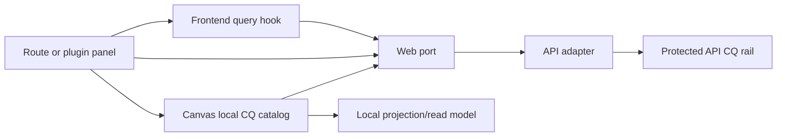

# Frontend Command And Query Rail Inventory

## Purpose

This document is the formal frontend command/query inventory for `apps/web`.
It consolidates the route-facing rails that are currently split across Canvas
component catalogs, runtime protected-rail vocabulary, web ports, query hooks,
and older integration plans.

The inventory does not create new behavior. It names what the frontend already
consumes, where rails are repeated, where documentation drift exists, and which
commands or queries are still needed for a mature end-to-end workflow.

## Governing Sources

- `docs/architecture/command-query-rail-governance.md`
- `docs/architecture/reference-architecture.md`
- `docs/architecture/fowler-opportunity-planning-governance.md`
- `docs/architecture/components/web/index.md`
- `docs/architecture/components/web/frontend-query-boundary-component.md`
- `docs/architecture/components/web/graph/canvas-workbench-command-query-catalog.md`
- `apps/api/src/application/ports/protectedRuntimeRailVocabulary.ts`
- `apps/api/src/application/ports/protectedRuntimeRunRailVocabulary.ts`

## Status Vocabulary

- `implemented-api`: frontend port calls a protected backend/API rail.
- `implemented-local`: frontend rail is intentionally local presentation state.
- `implemented-projection`: frontend projects another authoritative rail into a
  route-specific read model.
- `partial-ui`: backend or port exists, but the route does not expose a complete
  user command.
- `fail-closed`: frontend exposes an unavailable posture instead of calling a
  missing or unsupported rail.
- `gap-needed`: a mature workflow needs the rail, but it is not implemented as
  a frontend command/query.

## Runtime And Session Rails

### `GetRuntimeSession`

- Type: query.
- Status: `implemented-api`.
- Owner: runtime session admission.
- Frontend surface: protected route session context.
- Backend surface: `GET /session`.
- Notes: login failure states must remain explicit; the frontend must not
  invent an authenticated bearer session.

### `GetEffectiveWorkspaceContext`

- Type: query.
- Status: `implemented-api` for backend context and `implemented-local` for the
  presentation snapshot consumed by `SessionContextPort`.
- Owner: protected runtime workspace context.
- Frontend surface: `SessionContextPort`, `createSessionContextPort`.
- Backend surface: `GET /workspace/context`.
- Drift risk: the UI has several controls that imply workspace selection, but
  the formal frontend command to switch an existing workspace scope is not
  named.

### `LoadRuntimeCapabilities`

- Type: query.
- Status: `implemented-api`.
- Owner: runtime capability read model.
- Frontend surface: `CapabilitiesPort.loadCapabilities`.
- Backend surface: `/capabilities`.
- Notes: governed by ADR-0056; browser-local fallback must not define runtime
  capability semantics.

## Project Onboarding Rails

### `ListProjects`

- Type: query.
- Status: `implemented-api`.
- Owner: project onboarding catalog.
- Frontend surface: `ProjectOnboardingService.listProjects`.
- Backend surface: `GET /projects`.
- Notes: used before a workspace context exists; session headers are not used
  for this first-use catalog call.

### `CreateProject`

- Type: command.
- Status: `implemented-api`.
- Owner: project aggregate.
- Frontend surface: `ProjectOnboardingService.createProject`.
- Backend surface: `POST /projects`.
- Notes: command carries an idempotency key generated at the frontend adapter
  edge.

### `SelectWorkspaceScope`

- Type: command.
- Status: `gap-needed`.
- Owner: workspace scope selection.
- Needed because: users can create or discover projects, but there is no
  explicit frontend rail for selecting an existing tenant/project/environment
  scope and making it visible before plan/run execution.
- Candidate surfaces: project onboarding route, workspace scope controls, and
  `SessionContextPort`.
- Negative tests needed: unknown tenant, unauthorized project, unavailable
  environment, stale route scope, and run-start using an unselected scope.

## Workspace Graph Draft Rails

### `GetWorkspaceGraphDraft`

- Type: query.
- Status: `implemented-api`.
- Owner: workspace graph draft read model.
- Frontend surfaces:
  - `IWorkspaceGraphDraftAuthoringPort.readGraphDraft`;
  - `IWorkspaceGraphSnapshotQueryPort.getGraphSnapshot`;
  - `useWorkspaceGraphForViewQuery`.
- Backend surface: `GET /workspace/graph/draft`.
- Repetition: the frontend has an envelope-preserving authoring read and a
  projected graph snapshot read over the same backend rail. This is acceptable
  only if the projection split stays documented.

### `SaveWorkspaceGraphDraft`

- Type: command.
- Status: `implemented-api`.
- Owner: workspace graph draft aggregate.
- Frontend surface: `IWorkspaceGraphDraftAuthoringPort.saveGraphDraft`.
- Backend surface: `PUT /workspace/graph/draft`.
- Notes: owns revision, idempotency key, schema-version rejection, and
  conflict posture. Canvas autosave and import flows must reuse this command.

### `GetWorkspaceGraphSnapshot`

- Type: query.
- Status: `implemented-projection`.
- Owner: frontend graph snapshot read model.
- Frontend surface: `IWorkspaceGraphSnapshotQueryPort.getGraphSnapshot`.
- Backend rail: `GetWorkspaceGraphDraft`.
- Notes: this is a projection query, not a separate backend product rail.

## Workspace File And Artifact Rails

### `ListWorkspaceFiles`

- Type: query.
- Status: `implemented-api`.
- Owner: workspace file tree read model.
- Frontend surfaces:
  - `IWorkspaceFilesQueryPort.listFiles`;
  - `useWorkspaceFileTreeQuery`;
  - `useWorkspaceArtifactsQuery`.
- Backend surface: `GET /workspace/files`.

### `GetWorkspaceFileContent`

- Type: query.
- Status: `implemented-api`.
- Owner: workspace file content read model.
- Frontend surfaces:
  - `IWorkspaceFilesQueryPort.getFileContent`;
  - `useWorkspaceFileContentQuery`;
  - Code and Artifacts routes.
- Backend surface: `GET /workspace/files/:path`.

### `SaveWorkspaceFileContent`

- Type: command.
- Status: `partial-ui`.
- Owner: workspace file content aggregate.
- Frontend surface: `IWorkspaceFileContentCommandPort.saveFileContent`.
- Backend surface: `POST /workspace/files/:path`.
- Gap: `CodeView` currently owns a route-local editable buffer and displays
  that local-buffer posture, but it does not expose a save command that commits
  editor changes through this rail.
- Required frontend command: `SaveCodeWorkspaceFileBuffer`.

### `GetWorkspaceFileHistory`

- Type: query.
- Status: `implemented-api`.
- Owner: workspace file history read model.
- Frontend surfaces:
  - `IWorkspaceFileHistoryQueryPort.getFileHistory`;
  - `useWorkspaceFileHistoryQuery`;
  - `CodeFileHistoryPanel`.
- Backend surface: `GET /workspace/file-history/:path`.

### `ListWorkspaceArtifacts`

- Type: query.
- Status: `implemented-projection`.
- Owner: workspace artifact preview read model.
- Frontend surface: `useWorkspaceArtifactsQuery`.
- Backend rails: `ListWorkspaceFiles` and `GetWorkspaceFileContent`.
- Repetition risk: artifact preview must not invent a separate workspace-file
  catalog; it is a projection over file rails.

### `SaveCodeWorkspaceFileBuffer`

- Type: command.
- Status: `gap-needed`.
- Owner: Code workbench file editing.
- Reuses backend rail: `SaveWorkspaceFileContent`.
- Needed because: the route presents an editable Monaco buffer, but the user
  cannot commit that buffer into workspace files.
- Negative tests needed: unchanged buffer no-op, stale content, unsupported
  path, read-only workspace, API rejection, and query invalidation after save.

## Workspace Diff And Plugin Catalog Rails

### `GetWorkspaceDiffChanges`

- Type: query.
- Status: `implemented-api`.
- Owner: workspace diff read model.
- Frontend surfaces:
  - `IWorkspaceDiffQueryPort.getDiffChanges`;
  - `useWorkspaceDiffChangesQuery`.
- Backend surface: `GET /workspace/diff/changes`.
- Drift: older route-parity planning classified this as a missing backend
  rail. Current API vocabulary and routes expose it; the old planning posture is
  historical unless refreshed.

### `ListWorkspacePlugins`

- Type: query.
- Status: `implemented-api`.
- Owner: workspace plugin catalog read model.
- Frontend surfaces:
  - `IWorkspacePluginCatalogQueryPort.getPlugins`;
  - `useWorkspacePluginCatalogQuery`.
- Backend surface: `GET /workspace/plugins`.
- Repetition: `createWorkspacePorts` and `buildAppServices` both know how to
  create the API plugin catalog query port. Composition should have one owner.

### `ListAdminRoles`

- Type: query.
- Status: `fail-closed`.
- Owner: admin RBAC read model.
- Frontend surface: `IWorkspaceAdminReadPort.getRoles`.
- Backend surface: not available as a frontend-consumed protected route.
- Notes: this must remain fail-closed until the admin bounded context exposes a
  governed read rail.

### `ListAdminAuditLog`

- Type: query.
- Status: `fail-closed`.
- Owner: admin audit read model.
- Frontend surface: `IWorkspaceAdminReadPort.getAuditLog`.
- Backend surface: not available as a frontend-consumed protected route.
- Notes: audit data must not be mocked as product truth.

## Warehouse Source Import Rails

### `ListWarehouseConnections`

- Type: query.
- Status: `implemented-api`.
- Owner: warehouse connection catalog read model.
- Frontend surface: `IWarehouseSourceImportPort.listWarehouseConnections`.
- Backend surface: `GET /workspace/warehouse/connections`.

### `ListWarehouseConnectionTables`

- Type: query.
- Status: `implemented-api`.
- Owner: warehouse table catalog read model.
- Frontend surface: `IWarehouseSourceImportPort.listWarehouseTables`.
- Backend surface: `GET /workspace/warehouse/connections/:connectionId/tables`.

### `ImportWarehouseSources`

- Type: command.
- Status: `implemented-api`.
- Owner: source registration aggregate.
- Frontend surface: `IWarehouseSourceImportPort.importSources`.
- Backend surface: `POST /workspace/sources/import`.

### `CreateWarehouseConnection`

- Type: command.
- Status: `gap-needed`.
- Owner: warehouse connection registry.
- Needed because: the current frontend can list server-known connections, but
  cannot create or authenticate a new source from user-provided connection
  details.
- Negative tests needed: invalid credentials, unauthorized tenant, duplicate
  connection name, unsupported adapter, secret leakage, and failed audit write.

### `TestWarehouseConnection`

- Type: query or command-probe.
- Status: `gap-needed`.
- Owner: warehouse connection verification.
- Needed because: a realistic source selection flow needs a governed connection
  check before table import.
- Rule: the probe must be server-owned; the browser must never fake a
  successful login.

## Plan Rails

### `PreviewExecutablePlan`

- Type: command.
- Status: `implemented-api`.
- Owner: planner/runtime admission.
- Frontend surface: `IPlansPort.previewPlan`.
- Backend surface: `POST /plans/preview`.
- Notes: despite returning a preview read model, this is a command because it
  performs protected runtime admission and persists preview evidence.

### `ImportExecutablePlan`

- Type: command.
- Status: `implemented-api`.
- Owner: runtime plan ingestion.
- Frontend surface: `IPlansPort.importPlan`.
- Backend surface: `POST /plans/import`.

### `ValidateCanvasExecutionReadiness`

- Type: query.
- Status: `gap-needed`.
- Owner: Canvas execution readiness read model.
- Needed because: Canvas currently derives plan readiness through local view
  models and then relies on plan-preview rejection. A mature frontend should
  expose a single readable readiness query that names missing source, transform,
  sink, scope, artifact, and permission problems before opening the preview.
- Candidate surfaces: `canvasPlanReadiness`, `transformationGraphValidation`,
  and plan/run toolbar state.

## Run Rails

### `StartRun`

- Type: command.
- Status: `implemented-api`.
- Owner: runtime execution admission.
- Frontend surface: `IRunsPort.startRun`.
- Backend surface: `POST /runs/start`.
- Notes: frontend must not provide a client run id; platform-owned run identity
  comes from the backend receipt.

### `ListRuns`

- Type: query.
- Status: `implemented-api`.
- Owner: run list read model.
- Frontend surfaces:
  - `IRunsPort.listRunSummaries`;
  - `useRunsListForViewQuery`;
  - `useScopedRunSummariesQuery`.
- Backend surface: `GET /runs`.
- Naming drift: frontend summary hooks use multiple route-specific names over
  the same run-list rail.

### `GetRunStatus`

- Type: query.
- Status: `implemented-api`.
- Owner: run status and diagnostics read model.
- Frontend surfaces:
  - `IRunsPort.getRunSnapshot`;
  - `useRunSnapshotQuery`;
  - run detail views.
- Backend surface: `GET /runs/:runId`.
- Runtime diagnostics: the same snapshot may carry `diagnostics` with `runId`,
  `planId`, `planSha`, `stepId`, `attemptId`, `adapter`, `durationMs`,
  `status`, optional `errorCode`, and trace or log pointers.
- Naming drift: the frontend calls this a snapshot while backend vocabulary
  calls it status. The distinction should be documented where DTOs are mapped.

### `GetRunEvents`

- Type: query.
- Status: `implemented-api`.
- Owner: run event stream read model.
- Frontend surfaces:
  - `IRunsPort.listRunEvents`;
  - `useRunEventsQuery`.
- Backend surface: `GET /runs/:runId/events`.

### `CancelRun`

- Type: command.
- Status: `gap-needed` for frontend consumption.
- Owner: runtime control.
- Backend surface: `POST /runs/:runId/cancel`.
- Needed because: backend vocabulary exposes canonical cancellation, but
  `IRunsPort` does not expose a frontend command.

### `RecoverRun`

- Type: command.
- Status: `gap-needed` for frontend consumption.
- Owner: runtime recovery.
- Backend surface: `POST /runs/:runId/recover`.
- Needed because: backend vocabulary exposes recovery, but the frontend run
  port does not expose a governed retry/recover command.

### `SignalRun`

- Type: command.
- Status: `not-front-default`.
- Owner: runtime control.
- Backend surface: `POST /runs/:runId/signal`.
- Notes: compatibility behavior must not become the primary frontend cancel
  command. Use `CancelRun` for cancellation.

## Cost Rails

### `GetCostAttributionSummary`

- Type: query.
- Status: `implemented-api`.
- Owner: cost attribution read model.
- Frontend surface: `ICostAttributionSummaryPort.getCostAttributionSummary`.
- Backend surface: `GET /cost/attribution-summary`.

## Canvas Workbench Rails

The detailed Canvas catalog remains canonical in
`graph/canvas-workbench-command-query-catalog.md`. Frontend-wide inventory
groups those rails by concern:

- Shell/tab presentation queries and commands:
  - `ListShellNavigationItems`;
  - `ListCanvasWorkbenchTabs`;
  - `ResolveCanvasWorkbenchContext`;
  - `SelectCanvasWorkbenchTab`;
  - `RequestCanvasExecutionScope`;
  - `OpenCanvasScopedRunTab`.
- Plugin placement:
  - `RegisterPluginViewPlacement`.
- Layout and viewport:
  - `PersistCanvasLayout`;
  - `GetCanvasLayout`;
  - `ConfigureCanvasViewportPreferences` for grid visibility, grid color,
    snap-to-grid, and typed-empty guide visibility.
- Contextual graph interaction:
  - `ResolveCanvasContextMenu`;
  - `CreateCanvasAuthoringNode`;
  - `RemoveCanvasEdgeFromContext`.
- Authoring metadata:
  - `ConfigureCanvasDbtNode`;
  - `ConfigureCanvasDvtNode`;
  - `SelectDbtModelOrigin`;
  - `SelectCanvasRuntimeTemplate`.
- Project canvas lifecycle:
  - `ListProjectCanvases`;
  - `CreateProjectCanvas`;
  - `SelectProjectCanvas`;
  - `RenameProjectCanvas`;
  - `UpdateCanvasProperties`;
  - `DeleteProjectCanvas`.
- Project resource and artifact projection:
  - `ListProjectWorkspaceResources`;
  - `AttachProjectResourceToCanvasObject`;
  - `GenerateTransformationWorkspaceArtifacts`;
  - `GenerateDbtWorkspaceArtifacts`;
  - `BuildDbtPlannerGraphSource`.
- Project snapshot:
  - `ExportProjectSnapshot`;
  - `ValidateProjectImport`;
  - `ImportProjectSnapshot`.
- Governance and browser proof:
  - `RecordCanvasFowlerCanon`;
  - `ClassifyCanvasFowlerDisposition`;
  - `VerifyCanvasWorkbenchVisualPosture`.

## Repetitions And Consolidation Opportunities

1. Workspace graph reads repeat one backend rail as two frontend ports:
   `readGraphDraft` and `getGraphSnapshot`. Keep both only as an explicit
   envelope-vs-projection split.
2. Workspace plugin catalog construction is duplicated between
   `createWorkspacePorts` and `buildAppServices`. The composition root should
   choose one construction owner.
3. Run status is named `GetRunStatus` in backend rail vocabulary and
   `getRunSnapshot` in frontend ports. Either the mapping doc must stay explicit
   or the frontend DTO vocabulary should converge.
4. Run list is exposed through several hooks for view-specific caching. Those
   hooks should keep one rail name and vary only query keys/scope.
5. Workspace file artifacts are a projection over file tree/content rails. Do
   not create a separate backend artifact catalog unless freshness, auth, or
   storage semantics differ materially.
6. Code editing has an implemented file-save backend rail but a route-local
   buffer UI. This is the most visible command gap for graph/code parity.
7. Older route-parity planning docs still describe diff/plugins/file-write as
   missing or unavailable in places. Current code and API route constants show
   several of those rails are now implemented.
8. Canvas authoring has a strong local catalog, while the broader frontend does
   not. This document is the web-level consolidation point.

## Commands And Queries Needed But Not Implemented

The following rails are required for a mature frontend E2E and should be planned
before implementation:

- `SelectWorkspaceScope` command: select an existing tenant/project/environment
  scope explicitly.
- `CreateWarehouseConnection` command: register a warehouse connection through
  protected server authority.
- `TestWarehouseConnection` query or command-probe: verify connection access
  without leaking secrets or faking success in the browser.
- `SaveCodeWorkspaceFileBuffer` command: commit Code route edits through
  `SaveWorkspaceFileContent` and invalidate file/artifact/code graph queries.
- `ValidateCanvasExecutionReadiness` query: expose graph, source, sink, scope,
  artifact, and permission readiness before plan preview.
- `CancelRun` command: frontend port and route action over the canonical
  backend cancel route.
- `RecoverRun` command: frontend port and route action over the canonical
  backend recovery route.
- `OpenRunSourceCanvas` command: navigate from run evidence back to the canvas
  and execution scope that produced the run.
- `UpdateNodeCodeProjection` command: reconcile graph node SQL/dbt properties
  with saved workspace code when the Code route becomes authoritative editing.
- `ListNodeExecutionEvidence` query: expose node-scoped run evidence for the
  inspector without each plugin panel inventing its own run-history semantics.

## Drift Register

- Canvas C&Q catalog is richer and more current than the web-wide catalog that
  existed before this file.
- The web/API integration audit remains useful as history, but current API
  route constants show more implemented rails than its first gap posture.
- The Code route copy truthfully says the buffer is local; the existence of
  `SaveWorkspaceFileContent` means the product gap is now UI command wiring, not
  backend absence.
- Warehouse source import is server-backed for existing connections and table
  import, but it is not a full user-created connection workflow.
- Admin roles/audit remain fail-closed at the frontend workspace admin port.

## Topology

## Operating Rule

New frontend behavior must update this document or a more specific component
catalog before implementation when it adds:

- a route action;
- a query hook;
- a service-port method;
- a toolbar/menu/context-menu command;
- a plugin panel data dependency;
- a new cache key;
- a browser E2E workflow assertion that represents product semantics.
