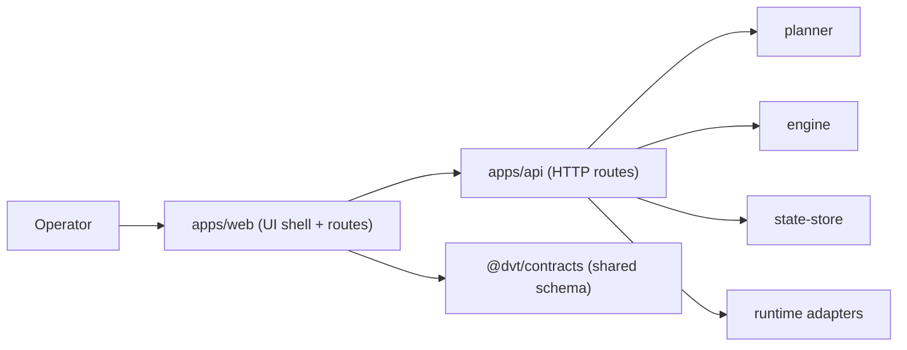
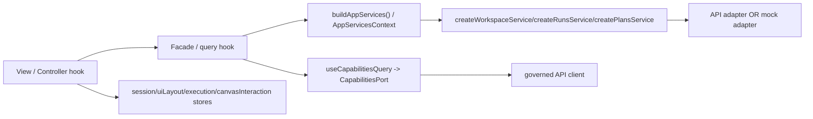
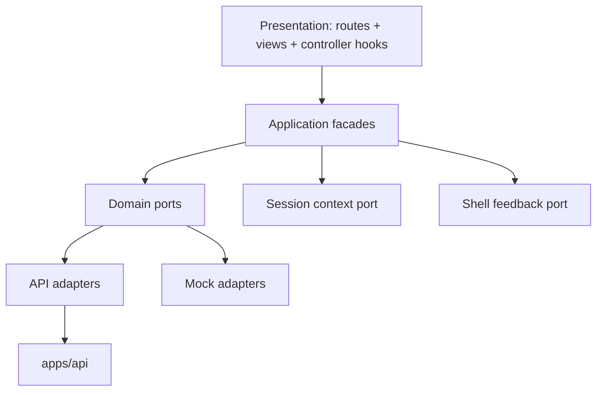
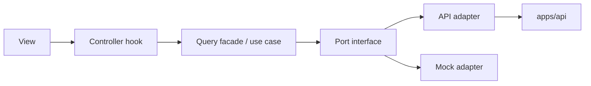
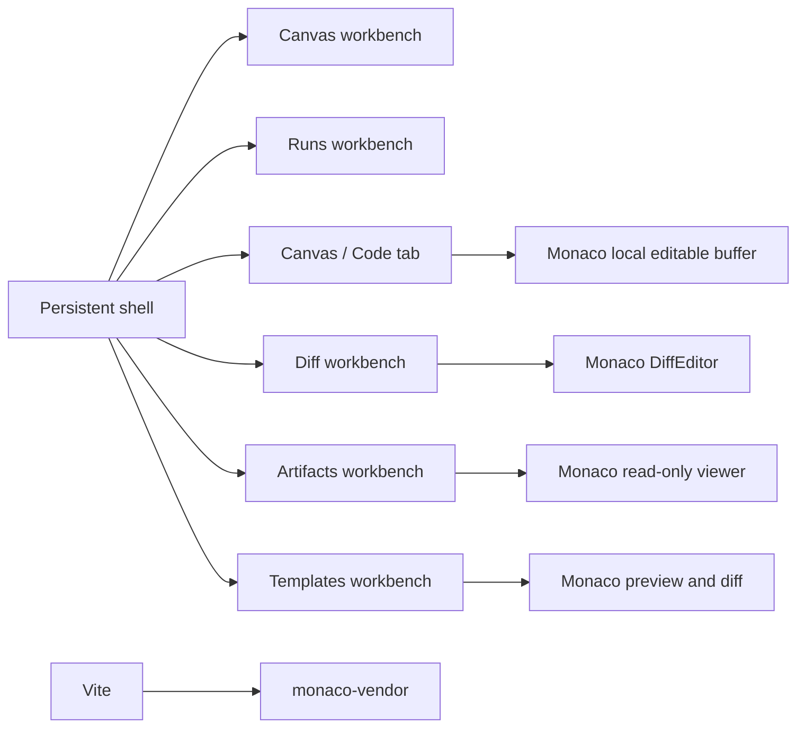
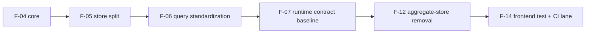

# Frontend Data-Boundary Architecture

## Subsystem In DVT Context

This subsystem belongs to the DVT `UI / Visualization Domain` and is implemented in `apps/web`.
It is a browser client and never an execution authority.

## Current Topology (As-Is)

The current code now routes service and capability wiring through one governed
composition root, and UI state is split across named store slices instead of an
aggregate shell store.

Current friction points:

- `workspaceService`, `runsService`, `plansService` are hybrid boundaries (ports, adapter selection, and mapping in one module).
- store responsibilities now have named slices, but route-level facades still
  need continued tightening around read-model ownership.
- not every route uses a dedicated application facade yet; some still depend on app-level hooks directly.
- capability querying is now composition-owned, but broader query standardization remains a later slice.
- the removed aggregate store and duplicate store barrel must stay absent; new
  state paths must be added to the named slices or a new bounded slice.

## Ports And Communication Matrix

Inbound ports:

- route intents from shell/workbench views;
- shell actions (navigation, panel state, UX events);
- plugin-contributed commands.

Outbound ports:

- `WorkspacePort`
- `RunsPort`
- `PlansPort`
- `CapabilitiesPort`
- `SessionContextPort`
- `ShellFeedbackPort`

## Target Model (Hexagonal + SRP + Fowler)

Chosen model: capability-centered hexagonal frontend.

- Presentation owns rendering and intent collection only.
- Application owns orchestration and route use-cases.
- Domain contracts own port interfaces and UI-facing view-model rules.
- Adapters implement API or mock behind those ports.
- Composition root is the only place reading `VITE_DATA_SOURCE`.

## Monaco Positioning Inside This Subsystem

Monaco is a presentation primitive inside the browser client, not a shell or
composition authority.

Positioning rules:

- Canvas stays graph-first.
- Runs stays execution-first.
- Monaco becomes first-class only in `Code`, `Diff`, `Artifacts`, and
  `Templates`, and only through route-safe lazy gateways.
- Monaco vendor dependencies stay isolated in the named `monaco-vendor` chunk.
- `VITE_DATA_SOURCE`, adapter selection, and route composition stay owned by the
  frontend composition root, not by Monaco surfaces.
- Future docking, if ever needed, is a later layout decision and not part of
  this boundary model.

## Migration And Consequences

Expected gains:

- one controlled mode boundary;
- lower API/mock drift risk;
- lower coupling from views to transport concerns;
- clearer ownership for store and query behavior.

Expected cost:

- more modules and interfaces now;
- migration overhead for route/controller rewiring;
- stricter discipline required for new capabilities.

## Reuse From Current System

- Keep `platform-health` as the reference capability pattern.
- Keep `createApiClient` as the transport base.
- Keep `sessionStore` as session authority.
- Keep plugin registry as extension seam (app-first composition).

## System-Level Improvements Enabled

- earlier visibility of contract drift;
- repeatable pattern for future capabilities;
- cleaner path for execution-template/source-generation workbench slices;
- better CI hardening once frontend test lane is formalized.

## Runtime Contract Baseline Link

Runtime route truth for Runs is governed by the dedicated F-07 docs pack:

- [Frontend Fowler Implementation Pattern](./frontend-fowler-implementation-pattern.md)
- [Frontend Runtime Contract Technical Manual](./runs/frontend-runtime-contract-technical-manual.md)
- [Frontend Runtime Contract User Manual](./runs/frontend-runtime-contract-user-manual.md)
