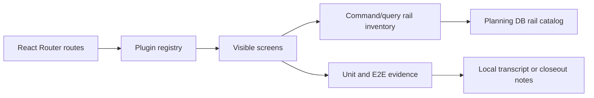
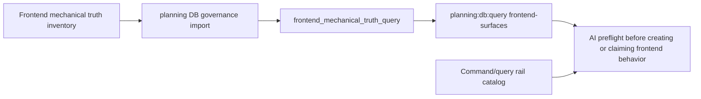

# Frontend Mechanical Truth Inventory

## Purpose

This document is the governed source imported into the planning DB for the
frontend mechanical truth read model. It answers a different question from the
frontend command/query rail catalog: which frontend surfaces exist, what do they
consume, what can the user see without a real backend, and whether the screen is
closed product behavior or only a preview/fail-closed posture.

The query-store rail is `ListFrontendMechanicalTruthSurfaces`, exposed through:

```bash
pnpm planning:db:query frontend-surfaces --limit 20
pnpm planning:db:query frontend-surfaces --state preview --limit 20
pnpm planning:db:query frontend-surfaces --kind route --path /runs --limit 20
```

## Governing Sources

- `docs/architecture/command-query-rail-governance.md`
- `docs/architecture/components/web/index.md`
- `docs/architecture/components/web/frontend-command-query-rail-inventory.md`
- `apps/web/src/app/routes.ts`
- `apps/web/src/app/plugins/registry.ts`
- `apps/web/src/app/plugins/**`
- `apps/web/src/app/queries/**`
- `apps/web/src/app/stores/**`

## Status Vocabulary

- `operational-product`: screen is a product surface with governed rails and
  reproducible validation evidence for the visible behavior.
- `preview`: screen or affordance is visible, but a mature workflow still has
  missing commands, missing closure rails, or preview-only UX.
- `disabled-unsupported`: screen intentionally fails closed or presents an
  unsupported posture instead of inventing behavior.
- `experimental`: screen is not a release claim and must not be presented as a
  closed capability.

## Mechanical Evidence

| Gate                                                                                                                                                                                                          | Result | Elapsed | Notes                                                                                                                              |
| ------------------------------------------------------------------------------------------------------------------------------------------------------------------------------------------------------------- | ------ | ------: | ---------------------------------------------------------------------------------------------------------------------------------- |
| `pnpm --filter @dvt/web typecheck`                                                                                                                                                                            | passed |  21.71s | Phase 0 type surface.                                                                                                              |
| `pnpm --filter @dvt/web lint`                                                                                                                                                                                 | passed |  67.15s | Phase 0 lint surface.                                                                                                              |
| `pnpm --filter @dvt/web test:ci`                                                                                                                                                                              | passed | 123.60s | 307 test files, 1,302 assertions; current warning noise remains in Recharts size and React act output.                             |
| `pnpm --filter @dvt/web build`                                                                                                                                                                                | passed |   8.77s | Build succeeds; Monaco vendor chunk remains the largest bundle.                                                                    |
| `pnpm --filter @dvt/web test:e2e:native -- --spec "cypress/e2e/shell/startup-route-readiness.cy.ts,cypress/e2e/shell/canvas-workbench-screen-composition.cy.ts,cypress/e2e/runs/runs-runtime-contract.cy.ts"` | passed |  36.79s | Startup, Canvas, and Runs smoke: 6/6 passed after Runs bootstrap stubs were aligned with shell capabilities and workspace context. |

## Current State



Current problem: route existence, rail closure, and validation evidence are
observable in different places. An agent can infer capability closure from a
screen without querying the operational posture.

## Target State



Target behavior: agents query the surface inventory and the command/query rail
catalog before creating new frontend behavior or claiming a screen is complete.

## Frontend Surface Inventory

The table below is intentionally structured for import. Keep the column names
stable.

| Surface ID           | Surface kind | Route path              | Screen state         | Frontend owner           | Registered plugins                               | Consumed endpoints                                                                                                                                        | Zustand stores                                                                                                   | TanStack queries                                                                                                                            | Visible no-backend affordances                                                                        | Capability gaps                                                                                               | Evidence                                                                                                  |
| -------------------- | ------------ | ----------------------- | -------------------- | ------------------------ | ------------------------------------------------ | --------------------------------------------------------------------------------------------------------------------------------------------------------- | ---------------------------------------------------------------------------------------------------------------- | ------------------------------------------------------------------------------------------------------------------------------------------- | ----------------------------------------------------------------------------------------------------- | ------------------------------------------------------------------------------------------------------------- | --------------------------------------------------------------------------------------------------------- |
| `web.login`          | route        | `/login`                | operational-product  | Public bootstrap shell   | none                                             | none                                                                                                                                                      | none                                                                                                             | none                                                                                                                                        | login route; public bootstrap complete state                                                          | authenticated product routes still require session admission                                                  | `apps/web/src/app/routes.ts`; startup native smoke                                                        |
| `web.shell.root`     | route        | `/`                     | operational-product  | Authenticated shell root | dbt; dvt-warehouse-source; dvt; monitoring; cost | `/session`; `/workspace/context`; `/capabilities`; `/healthz`; `/readyz`; `/version`; `/db/ready`                                                         | `useSessionStore`; `useAuthorizationStore`; `usePlatformConnectionStore`; `useUiLayoutStore`                     | `useCapabilitiesQuery`; `usePlatformHealthSnapshotQuery`                                                                                    | workspace menu; view menu; shell health banner                                                        | explicit workspace scope selection command remains a rail gap                                                 | `apps/web/src/app/routes.ts`; startup native smoke                                                        |
| `web.canvas.graph`   | route        | `/canvas`               | operational-product  | Canvas workbench         | dbt; dvt; monitoring; cost                       | `/workspace/graph/draft`; `/workspace/files`; `/plans/preview`; `/plans/import`; `/workspace/warehouse/connections`; `/workspace/sources/import`; `/runs` | `useCanvasInteractionStore`; `useExecutionStore`; `useSessionStore`; `useAuthorizationStore`; `useUiLayoutStore` | `useWorkspaceGraphForViewQuery`; `useWorkspaceFileTreeQuery`; `useWorkspaceFileContentQuery`; `useScopedRunSummariesQuery`                  | create transformation canvas; import/export project snapshot; plan and run buttons gated by readiness | create/test warehouse connection; execution readiness validation rail                                         | `apps/web/src/app/plugins/dbt/dbtContributions.ts`; canvas native smoke                                   |
| `web.canvas.tabs`    | route        | `/canvas/:workbenchTab` | preview              | Canvas workbench tabs    | dbt; monitoring                                  | `/workspace/files`; `/workspace/file-history/:path`; `/workspace/diff/changes`; `/runs`; `/runs/:runId`; `/runs/:runId/events`                            | `useCanvasInteractionStore`; `useExecutionStore`; `useUiLayoutStore`                                             | `useWorkspaceArtifactsQuery`; `useWorkspaceFileHistoryQuery`; `useWorkspaceDiffChangesQuery`; `useRunSnapshotQuery`; `useRunEventFeedQuery` | Code, Artifacts, Lineage, Diff, and Runs tabs visible                                                 | save code buffer; update node code projection; list node execution evidence                                   | `apps/web/src/app/plugins/dbt/dbtContributions.ts`; `apps/web/src/app/queries/workspaceQueries.ts`        |
| `web.runs.list`      | route        | `/runs`                 | operational-product  | Runs workbench           | monitoring                                       | `/runs`                                                                                                                                                   | `useExecutionStore`; `useUiLayoutStore`                                                                          | `useScopedRunSummariesQuery`                                                                                                                | dense run table; filters; status badges; View Details action                                          | cancel run; recover run                                                                                       | `apps/web/src/app/plugins/monitoring/monitoringContributions.ts`; runs native smoke                       |
| `web.runs.detail`    | route        | `/runs/:runId`          | operational-product  | Run detail workbench     | monitoring                                       | `/runs/:runId`; `/runs/:runId/events`                                                                                                                     | `useExecutionStore`; `useUiLayoutStore`                                                                          | `useRunSnapshotQuery`; `useRunEventFeedQuery`; `useRunWorkspace`                                                                            | event timeline; materialization evidence; failure diagnostics                                         | open run source canvas; list node execution evidence; cancel run; recover run                                 | `apps/web/src/app/plugins/monitoring/monitoringContributions.ts`; runs native smoke                       |
| `web.templates`      | route        | `/templates`            | preview              | DVT templates workbench  | dvt                                              | none                                                                                                                                                      | `useUiLayoutStore`                                                                                               | none                                                                                                                                        | template catalog route is visible through plugin navigation                                           | template command rails are not product-closed                                                                 | `apps/web/src/app/plugins/dvt/dvtContributions.ts`                                                        |
| `web.cost.dashboard` | route        | `/cost`                 | preview              | Cost dashboard           | cost                                             | `/cost/attribution-summary`                                                                                                                               | `useSessionStore`; `useUiLayoutStore`                                                                            | `useCostAttributionSummaryQuery`                                                                                                            | cost attribution dashboard when runtime plugin is available                                           | production cost UX still depends on backend plugin availability and route-level evidence beyond unit coverage | `apps/web/src/app/plugins/cost/costContributions.ts`; `apps/web/src/app/queries/costQueries.ts`           |
| `web.plugins`        | route        | `/plugins`              | preview              | Plugin management shell  | dbt; dvt-warehouse-source; dvt; monitoring; cost | `/workspace/plugins`; `/capabilities`                                                                                                                     | `useUiLayoutStore`                                                                                               | `useWorkspacePluginCatalogQuery`; `useCapabilitiesQuery`                                                                                    | plugin capability table; availability badges                                                          | plugin install/enable commands are not exposed as product rails                                               | `apps/web/src/app/routes.ts`; `apps/web/src/app/views/plugins/PluginsRouteWorkbench.tsx`                  |
| `web.admin`          | route        | `/admin`                | disabled-unsupported | Admin shell              | none                                             | none                                                                                                                                                      | `useUiLayoutStore`; `useAuthorizationStore`                                                                      | `useWorkspaceRolesQuery`; `useWorkspaceAuditQuery`                                                                                          | admin route exists but must fail closed without backend roles/audit rails                             | `ListAdminRoles`; `ListAdminAuditLog` remain fail-closed                                                      | `apps/web/src/app/routes.ts`; `docs/architecture/components/web/frontend-command-query-rail-inventory.md` |

## Maintenance Rules

- Add or update a row before presenting a new frontend route or externally
  visible frontend capability as complete.
- Keep `Capability gaps` aligned with
  `docs/architecture/components/web/frontend-command-query-rail-inventory.md`.
- Do not mark a surface `operational-product` unless the evidence column names
  a runnable validation route.
- After changes, validate this Git-owned inventory and its code evidence
  directly. Do not rebuild Planning DB to make a physical repository inventory
  current; DB architecture queries consume existing semantic authority and fail
  closed when it is unavailable or stale.
