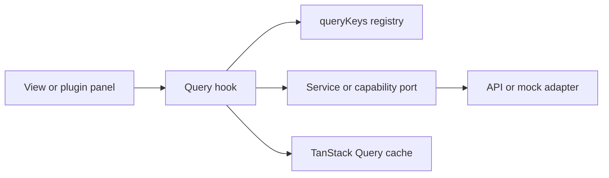

# Frontend Query Boundary Component

This component owns the TanStack Query boundary for `apps/web`. Views and plugin
panels may consume query hooks, but they must not own cache keys, query
functions, invalidation, or direct `@tanstack/react-query` imports unless the
file is explicitly listed as a query boundary.

## Public API

| Module                                                                                       | Public hooks                                                                                                                                                                                                                                                                                     | Owned rail                  |
| -------------------------------------------------------------------------------------------- | ------------------------------------------------------------------------------------------------------------------------------------------------------------------------------------------------------------------------------------------------------------------------------------------------ | --------------------------- |
| `apps/web/src/app/queries/workspaceQueries.ts`                                               | `useWorkspaceDiffChangesQuery` `useWorkspacePluginCatalogQuery` `useWorkspaceGraphForViewQuery` `useWorkspaceFileTreeQuery` `useWorkspaceFileContentQuery` `useWorkspaceFileHistoryQuery` `useWorkspaceRolesQuery` `useWorkspaceAuditQuery` `useWorkspaceArtifactsQuery` | Workspace query read models |
| `apps/web/src/app/queries/runsQueries.ts`                                                    | `useScopedRunSummariesQuery` `useScopedRunSummariesQueryForHistory` `useRunSnapshotQuery`                                                                                                                                                                                                  | Run summary/status queries  |
| `apps/web/src/app/queries/runEventFeedQuery.ts`                                              | `useRunEventFeedQuery`                                                                                                                                                                                                                                                                           | Run event feed query        |
| `apps/web/src/app/views/runs/useRunWorkspace.ts`                                             | `useRunWorkspace`                                                                                                                                                                                                                                                                                | Run workspace projection    |
| `apps/web/src/capabilities/platform-health/presentation/usePlatformHealthSnapshotQuery.ts`   | `usePlatformHealthSnapshotQuery`                                                                                                                                                                                                                                                                 | Platform health query       |
| `apps/web/src/capabilities/runtime-capabilities/presentation/useRuntimeCapabilitiesQuery.ts` | `useRuntimeCapabilitiesQuery`                                                                                                                                                                                                                                                                    | Runtime capability query    |

## Invariants

1. Query keys are created only through `apps/web/src/app/queries/queryKeys.ts`.
2. Operator views consume query hooks instead of importing `@tanstack/react-query`
   directly.
3. Service ports remain behind query hooks; views do not construct query
   functions from ports.
4. Cache mutation helpers stay in named cache modules such as
   `canvasDraftQueryCache.ts`, not in controller hooks.
5. Route facades may compose multiple query hooks, but they do not invent cache
   keys or own invalidation policy.

## Transitions

The F-06 hard cut moved run workspace, admin roles/audit, artifact loading, and
dbt run history queries out of view/plugin modules and into the query boundary.

## Consumers

| Consumer                                  | Query hooks consumed                                                                  |
| ----------------------------------------- | ------------------------------------------------------------------------------------- |
| `RunsView` / `useRunWorkspace`            | `useScopedRunSummariesQuery`, `useRunSnapshotQuery`, `useRunEventFeedQuery`           |
| `AdminView` / `useAdminViewData`          | `useWorkspaceRolesQuery`, `useWorkspaceAuditQuery`                                    |
| `ArtifactsView` / `useArtifactsViewModel` | `useWorkspaceArtifactsQuery`                                                          |
| `DbtNodeRenderer` history panel           | `useRunSnapshotQuery`, `useScopedRunSummariesQueryForHistory`, `useRunEventFeedQuery` |

## Guardrails

`apps/web/src/app/queries/queryKeyPolicy.architecture.test.ts` is the semantic
architecture guard. It fails when selected operator views or plugin panels
import `@tanstack/react-query` directly, when runtime files use inline query key
arrays, or when removed aggregate store imports return.
