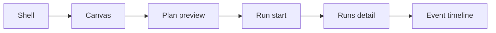

# Frontend Runtime Modes User Manual

## Purpose

This manual explains how operators and developers should interpret frontend
behavior in `mock` and `api` modes.

## Runtime Modes

### `mock` mode

- used for explicit local development and UX iteration
- data is synthetic or locally derived
- useful for isolated component, route, and adapter work
- not the canonical product truth for active Canvas authoring after the
  protected-draft hard-cut

### `api` mode

- default runtime mode when `VITE_DATA_SOURCE` is omitted or invalid
- used for integration and operational validation
- views consume backend-backed data through governed adapters
- route behavior must follow runtime contracts exposed by `apps/api`
- unsupported mutations must fail closed instead of being implied by legacy UI
  affordances

Mode selection is done once at frontend composition boot. Views should not
branch on mode.

## Capability Interpretation

Mode selection alone is not enough to understand route behavior.

Operators and developers must distinguish:

- selected adapter family
- explicit service capability
- route startup or operability posture

Current Canvas rule:

- active Canvas authoring requires `api` mode plus protected workspace-draft
  authority
- `api` mode still does not expose source import because the backend endpoint
  is not implemented yet
- `mock` mode may still boot the frontend, but Canvas authoring is fail-closed
  and must not be treated as equivalent product behavior

## Shell Guarantees

The shell should expose clear states:

- `loading`: backend state is being resolved
- `empty`: no data exists for the selected context
- `degraded`: partial backend availability
- `offline`: backend unreachable
- `read-only`: user can inspect but cannot execute mutation actions

## Route Behavior Under Target Model

- Canvas: renders graph and planning actions through controller hooks and
  facades
- Canvas source import is a capability-gated affordance, not a guaranteed
  action in every runtime mode
- Runs: list/detail/events flow reads runtime data through `RunsPort`
- Diff: reads diff data through `WorkspacePort` or dedicated diff port
- Artifacts: reads artifact surfaces via adapter-backed services
- Admin: reads capabilities, role, and audit views through governed clients

No route should decide API/mock mode locally.

## Failure Interpretation

- capability unavailable: specific feature reported as not available by backend
- backend failure: request failed due to network or HTTP error
- permissions failure: action denied by auth or role posture

Operators should distinguish "feature unavailable" from "system offline".

For Canvas specifically:

- `feature unavailable` means the route is up but the active runtime does not
  provide source import, so the UI must hide `Add data` and render honest empty
  guidance
- `system offline` means route startup or backend access is degraded and the
  route should publish blocked or offline posture instead

## Shell Health Banner Behavior (F-03)

The shell TopBar and global banner use one health capability seam and expose:

- `Checking`: first health query is still pending and no optimistic `ok` is
  shown
- `Backend degraded`: backend reachable but health semantics are degraded
- `Backend offline`: required health snapshot is unreachable

Retry policy:

- automatic polling at `15s` in stable `ok` state
- exponential backoff for repeated offline failures, capped at `60s`
- manual `Retry now` action always available while degraded or offline

Reference contract:

- [Frontend-facing backend contract MVP-E1 2026-04-04](./frontend-backend-contract-mvp-e1-20260404.md)

## F-03 Test Matrix By Type

<!-- markdownlint-disable MD060 -->

| Type          | Scope                                      | Primary files                                                                                                                                                             | Focus                                                                                                 |
| ------------- | ------------------------------------------ | ------------------------------------------------------------------------------------------------------------------------------------------------------------------------- | ----------------------------------------------------------------------------------------------------- |
| `unit`        | health projection and retry/backoff policy | `apps/web/src/capabilities/platform-health/presentation/platformHealthStatus.test.ts`, `apps/web/src/capabilities/platform-health/domain/platformHealthSelectors.test.ts` | `ok/degraded/offline` mapping and policy behavior for probe/auth/server failures                      |
| `integration` | shell banner and topbar behavior           | `apps/web/src/app/Root.test.tsx`                                                                                                                                          | Initial checking state, degraded/offline banner rendering, countdown, and manual retry behavior       |
| `contract`    | backend endpoint-to-snapshot mapping       | `apps/web/src/capabilities/platform-health/infrastructure/httpPlatformHealthClient.test.ts`                                                                               | HTTP and network failure mapping (`401/403/5xx` and unavailable probes) into frontend probe semantics |

<!-- markdownlint-enable MD060 -->

## Route Journey (Operator)

Mode selection is not part of this route journey.
