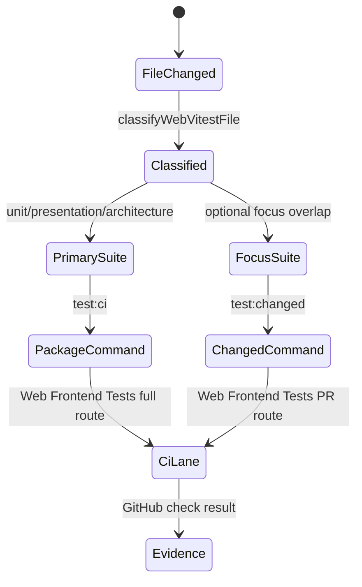
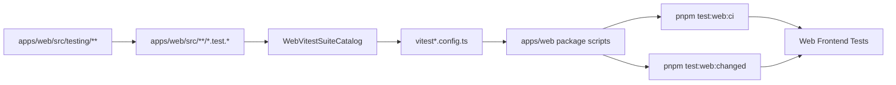

# Frontend Test Governance Component

## Purpose

Own the `@dvt/web` Vitest execution boundary and keep frontend tests visible as
test support rather than production source.

Owned concern: `WebVitestSuiteCatalog` is the semantic owner for web test suite
assignment, package-level web test commands, and the dedicated GitHub Actions
web test lane.

This component does not own product behavior, Cypress browser flows, backend
contract validation, or engine determinism tests.

## Governing Sources

- [web component](./index.md)
- [Testing and CI Capabilities](../../../guides/testing-and-ci-capabilities.md)
- [F-14 Fowler mailbox analysis](../../../../buzon/20260518-f14-fowler-frontend-test-governance-analysis.md)
- [Web Vitest suite partition plan](../../../planning/proposals/mandatory/frontend-and-ux/web-vitest-suite-partition-plan-20260517.md)

## Public API

<!-- markdownlint-disable MD060 -->

| Surface                          | Type     | Responsibility                                       |
| -------------------------------- | -------- | ---------------------------------------------------- |
| `WEB_VITEST_PRIMARY_SUITE_NAMES` | constant | Names primary non-overlapping web test suites.       |
| `WEB_VITEST_FOCUS_SUITE_NAMES`   | constant | Names allowed overlapping focus suites.              |
| `WEB_VITEST_SUITES`              | catalog  | Defines include and exclude rules for each suite.    |
| `createWebVitestConfig`          | function | Builds Vitest config from the suite catalog.         |
| `classifyWebVitestFile`          | function | Classifies a test file into primary and focus lanes. |
| `pnpm --filter @dvt/web test`    | command  | Runs the governed web primary-suite composition.     |
| `pnpm test:web:ci`               | command  | Runs governed web primary suites.                    |
| `pnpm test:web:changed`          | command  | Runs the changed-file web suite route.               |
| `Web Frontend Tests`             | CI job   | Runs changed PR routing or full primary suites.      |

<!-- markdownlint-enable MD060 -->

## Invariants

- Every web Vitest file belongs to exactly one primary suite.
- Focus suites may overlap with primary ownership only when they are explicitly
  listed in `WEB_VITEST_FOCUS_SUITE_NAMES`.
- Feature-owned focus suites may narrow local feedback loops without changing
  primary suite ownership.
- Architecture tests are excluded from unit and presentation suites.
- The `unit` and `architecture` primary suites default to Node. Unit tests that
  exercise browser APIs, browser-backed persistence, or browser-derived language explicitly declare
  `@vitest-environment jsdom`; this also keeps their environment consistent when
  exact-file routing invokes the primary config. Presentation, focus suites and
  the aggregate watch config retain jsdom. Environment selection does not change
  file ownership or changed-suite routing.
- Tests using `installWorkspaceScopeHarness` explicitly declare jsdom because
  the harness updates the real persisted session store. The catalog architecture
  guard checks this dependency. Localized presentation-model tests likewise keep
  their browser environment; Node's host-language default must not change their
  expected copy across contributor operating systems.
- Every CI file retains an isolated fork. The GH-2900 experiment found that
  ten-file shared-fork batches introduce presentation-test interference; bounded
  memory alone is not sufficient evidence to remove isolation. See the
  [benchmark evidence and closeout in issue #2900](https://github.com/dunay2/dvt/issues/2900).
- The CI job name for the web Vitest lane is `Web Frontend Tests`.
- Ordinary web pull requests route through `pnpm test:web:changed`.
- Pushes to `main`, manual workflow runs, and root-build-sensitive PRs route
  through `pnpm test:web:ci`.
- The package default `test` command delegates to the same primary-suite
  composition as `test:web:ci`, so root `turbo run test` and the dedicated web
  CI lane exercise the same governed coverage instead of parallel web routes.
- CI Vitest configs bound worker count, worker old-space capacity, and hosted
  runner fork topology in the suite catalog so full web coverage avoids worker
  OOMs and retained fork queues.
- Hosted CI web Vitest routes must also export the same Node old-space value as
  `NODE_OPTIONS` at the workflow step boundary. That keeps the actual Vitest
  parent and forked worker processes aligned when GitHub runners execute
  `pnpm test:web:ci` or root `turbo run test` through `pnpm ci:full`.
- The `Web Frontend Tests` job reserves a 25-minute budget for full coverage
  routes because the CI worker cap deliberately trades parallelism for hosted
  runner memory and process-exit stability; ordinary PRs remain on changed-suite
  routing.
- Test support under `apps/web/src/testing/**` remains test-only and must not
  become a production adapter surface.
- `vitest*.config.ts` files are adapters over the suite catalog. They do not own
  suite partition semantics.

## Transitions

## Consumers

- Local developers use `pnpm --filter @dvt/web test:unit`,
  `test:presentation`, `test:architecture`, `test:canvas`, `test:monaco`, and
  `test:shell-session`, and `test:workspace-services`.
- GitHub Actions uses `pnpm test:web:changed` for ordinary web pull requests
  and `pnpm test:web:ci` for full web coverage routes.
- Architecture tests use `classifyWebVitestFile` to prevent suite drift.
- Planning and closeout evidence cite the named web test lane instead of an
  implicit generic test step.

## Component Flow

## Negative Rules

- Do not add a second web suite catalog.
- Do not run web tests only through the generic `Run Tests` job.
- Do not classify test harnesses as runtime services.
- Do not add route-specific CI commands when a suite or focus-suite entry can
  express the same intent.
