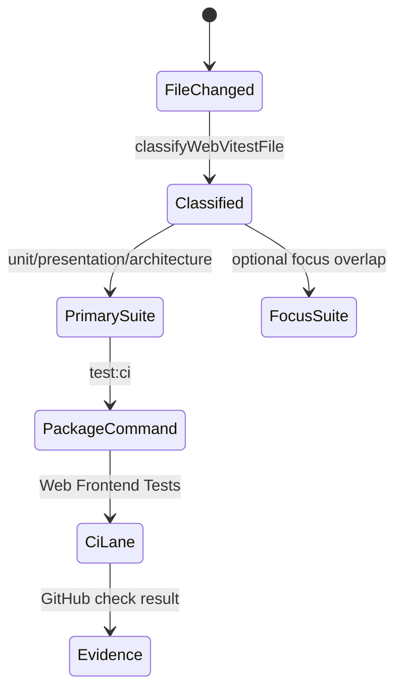
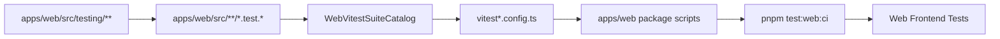

# Frontend Test Governance Component

## Purpose

Own the `@dvt/web` Vitest execution boundary and keep frontend tests visible as
test support rather than production source.

Owned concern: `WebVitestSuiteCatalog` is the semantic owner for web test suite
assignment, package-level web test commands, and the dedicated GitHub Actions
web test lane.

This component does not own product behavior, Cypress browser flows, backend
contract validation, or engine determinism tests.

## Governing Sources

- [web component](./index.md)
- [Testing and CI Capabilities](../../../guides/testing-and-ci-capabilities.md)
- [F-14 Fowler mailbox analysis](../../../../buzon/20260518-f14-fowler-frontend-test-governance-analysis.md)
- [Web Vitest suite partition plan](../../../planning/proposals/mandatory/frontend-and-ux/web-vitest-suite-partition-plan-20260517.md)

## Public API

<!-- markdownlint-disable MD060 -->

| Surface                          | Type     | Responsibility                                       |
| -------------------------------- | -------- | ---------------------------------------------------- |
| `WEB_VITEST_PRIMARY_SUITE_NAMES` | constant | Names primary non-overlapping web test suites.       |
| `WEB_VITEST_FOCUS_SUITE_NAMES`   | constant | Names allowed overlapping focus suites.              |
| `WEB_VITEST_SUITES`              | catalog  | Defines include and exclude rules for each suite.    |
| `createWebVitestConfig`          | function | Builds Vitest config from the suite catalog.         |
| `classifyWebVitestFile`          | function | Classifies a test file into primary and focus lanes. |
| `pnpm test:web:ci`               | command  | Runs governed web primary suites in CI.              |
| `Web Frontend Tests`             | CI job   | Runs `pnpm test:web:ci` as a named frontend lane.    |

<!-- markdownlint-enable MD060 -->

## Invariants

- Every web Vitest file belongs to exactly one primary suite.
- Focus suites may overlap with primary ownership only when they are explicitly
  listed in `WEB_VITEST_FOCUS_SUITE_NAMES`.
- Architecture tests are excluded from unit and presentation suites.
- The CI job name for the web Vitest lane is `Web Frontend Tests`.
- Test support under `apps/web/src/testing/**` remains test-only and must not
  become a production adapter surface.
- `vitest*.config.ts` files are adapters over the suite catalog. They do not own
  suite partition semantics.

## Transitions

## Consumers

- Local developers use `pnpm --filter @dvt/web test:unit`,
  `test:presentation`, `test:architecture`, and `test:canvas`.
- GitHub Actions uses `pnpm test:web:ci` from the `Web Frontend Tests` job.
- Architecture tests use `classifyWebVitestFile` to prevent suite drift.
- Planning and closeout evidence cite the named web test lane instead of an
  implicit generic test step.

## Component Flow

## Negative Rules

- Do not add a second web suite catalog.
- Do not run web tests only through the generic `Run Tests` job.
- Do not classify test harnesses as runtime services.
- Do not add route-specific CI commands when a suite or focus-suite entry can
  express the same intent.
