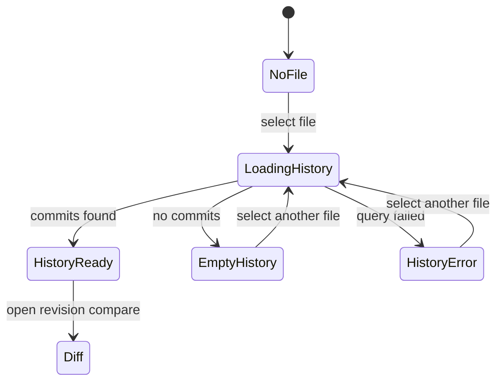

# Git File History Review User Stories

## Scope

These stories cover `F-23` file-scoped history review. They intentionally stop
before staging, committing, branch management, conflict handling, or a dedicated
Git explorer.

## Stories

1. As an operator reviewing a workspace file, I can see recent commits for the
   selected file inside `Code` so that history discovery stays next to file
   browsing.
2. As an operator reviewing a selected file with no commits, I see an explicit
   empty history state so that absence of history is not confused with loading.
3. As an operator whose history request fails, I see an explicit degraded state
   while the file preview remains usable.
4. As an operator selecting a history entry, I can open the existing `Diff`
   route so that comparison remains owned by the governed Diff workbench.
5. As a product reviewer, I do not see staging, commit, branch, conflict, or
   repository-console affordances in this slice.

## Transitions

