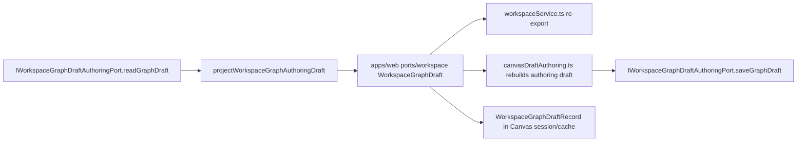
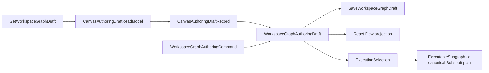
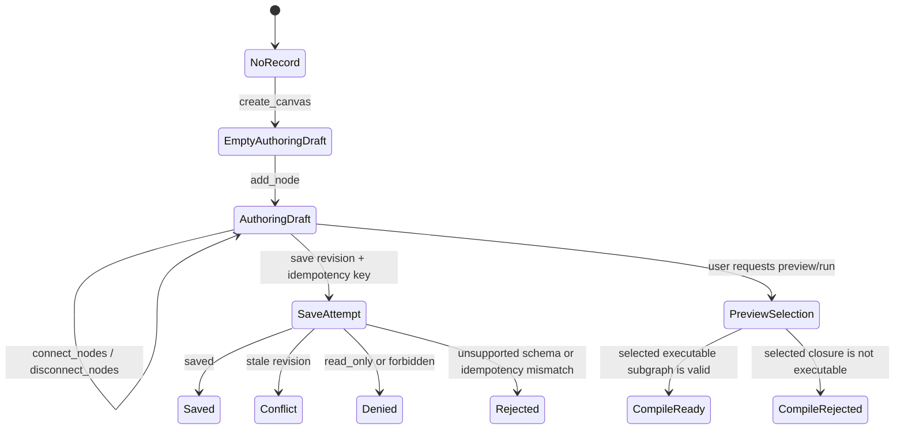

# Canvas Authoring Draft Boundary Component

## Purpose

This component defines the target web-side boundary for `TF-E2-A`.

Canvas must use `WorkspaceGraphAuthoringDraft` as editable authoring truth. It
must not treat route-local `WorkspaceGraphDraft` projections or
compile-ready execution artifacts as the active save model.

The protected contract and API already persist `WorkspaceGraphAuthoringDraft`.
The remaining web drift is the active Canvas save path still passing through a
route-local `WorkspaceGraphDraft` DTO that drops semantic node and edge records
and then reconstructs an authoring draft from projections.

The hard cut removes that route-local DTO entirely from `apps/web` authoring
state. After this slice, `WorkspaceGraphDraft` remains only the protected
contract/envelope name in `@dvt/contracts` and endpoint-facing authoring port
names. Canvas presentation state must use Canvas-owned names.

## Owned Concern

Owned concern: keep Canvas authoring commands, protected draft reads, protected
draft writes, and React Flow projections aligned with the
`WorkspaceGraphAuthoringDraft` aggregate.

This component does not own:

- protected API authorization;
- HTTP route parsing;
- compare-and-swap storage;
- planner compile semantics;
- preview or run admission;
- standalone layout persistence beyond projecting authoring node positions from
  the aggregate into the renderer.

## DDD Assessment

The target design is DDD-aligned only when the following ownership split is
preserved:

| Concern                 | DDD owner                                             | Rule                                                                          |
| ----------------------- | ----------------------------------------------------- | ----------------------------------------------------------------------------- |
| Editable graph truth    | `WorkspaceGraphAuthoringDraft` aggregate              | The aggregate is the only save payload.                                       |
| Mutation language       | `WorkspaceGraphAuthoringCommand` command value object | UI commands produce aggregate commands before save.                           |
| Protected read envelope | `WorkspaceGraphDraftReadResponse` read model          | Capability, audit, format, revision, and record remain boundary facts.        |
| Protected save receipt  | `WorkspaceGraphDraftSaveResponse` command receipt     | Saved, conflict, denied, schema, and idempotency outcomes stay typed.         |
| Canvas route state      | `CanvasAuthoringDraftReadModel` read model            | Canvas keeps authoring draft and metadata together under Canvas-owned names.  |
| Renderer projection     | `CanvasViewportGraphModel` projection                 | React Flow nodes and edges are derived and disposable.                        |
| Compile projection      | `ExecutableSubgraph` read model                       | Preview/run derives compile input only from an explicit executable selection. |

The current code is not yet DDD-complete because `WorkspaceGraphDraft`,
`WorkspaceGraphDraftRecord`, and `WorkspaceGraphDraftSemanticGraph` still act as
route-local data carriers. Those names must disappear from Canvas-owned state;
only protected contract/port names may keep `WorkspaceGraphDraft`.

## Governing Sources

- `AGENTS.md`
- `docs/planning/status/governance-document-rule-inventory.md`
- `docs/architecture/command-query-rail-governance.md`
- `docs/architecture/fowler-opportunity-planning-governance.md`
- [Workspace graph draft persistence v1](../../../../contracts/planner/workspace-graph-draft-persistence-v1.md)
- [Workspace authoring draft aggregate](../../planner/workspace-authoring-draft-aggregate.md)
- [Canonical API architecture authority](../../api/index.md)
- [Canvas target architecture execution plan](../../../../planning/proposals/mandatory/frontend-and-ux/tf-e2-canvas-target-architecture-execution-plan-20260417.md)
- [TF-E2-A authoring draft hard cut implementation plan](../../../../planning/proposals/mandatory/frontend-and-ux/tf-e2-a-authoring-draft-hard-cut-implementation-plan-20260503.md)

## Target Public API

| API                                                       | Owner                | Behavior                                                                                                                   |
| --------------------------------------------------------- | -------------------- | -------------------------------------------------------------------------------------------------------------------------- |
| `IWorkspaceGraphDraftAuthoringPort.readGraphDraft()`      | web composition port | Reads the protected draft envelope and preserves boundary-native outcomes.                                                 |
| `IWorkspaceGraphDraftAuthoringPort.saveGraphDraft(input)` | web composition port | Saves `WorkspaceGraphAuthoringDraft` with revision and idempotency key.                                                    |
| `CanvasAuthoringDraftRecord`                              | this component       | Canvas-owned record containing revision, saved time, and `WorkspaceGraphAuthoringDraft`.                                   |
| `CanvasAuthoringDraftReadModel`                           | this component       | Route-facing read model that keeps authoring draft, semantic graph, capability, audit, format, and revision data together. |
| `CanvasAuthoringDraftSaveCommand`                         | this component       | Route command object for saving `WorkspaceGraphAuthoringDraft` without a projection detour.                                |
| `CanvasAuthoringSemanticGraph`                            | this component       | Canvas-owned semantic projection derived from the authoring aggregate.                                                     |
| `projectCanvasAuthoringDraftToViewportGraph()`            | this component       | Projects authoring truth into React Flow nodes and edges under Canvas-owned types.                                         |
| `projectCanvasAuthoringDraftToCompileInput()`             | preview/run boundary | Derives compile-only input from selected executable subgraph, not from the entire authoring draft.                         |

## Invariants

- `WorkspaceGraphAuthoringDraft` is the only protected save payload.
- `apps/web/src/app/ports/workspace.ts` must not export
  `WorkspaceGraphDraft`, `WorkspaceGraphDraftRecord`,
  `SaveWorkspaceGraphDraftInput`, or `SaveWorkspaceGraphDraftResult`.
- `apps/web/src/app/services/workspace/workspaceService.ts` must not re-export
  route-local draft types that were removed from the generic workspace port.
- Route-local types must not be named `WorkspaceGraphDraft`.
- Canvas save, cache, session, and working-set modules must not import
  projected draft records from the generic workspace port.
- compile-ready Substrait plans must not appear in Canvas draft persistence
  modules.
- Read success preserves capability, audit, format metadata, revision, and the
  authoring aggregate.
- Read denial, format error, unsupported schema version, idempotency mismatch,
  conflict, and not-found remain typed outcomes.
- A draft save must lock every Canvas identity in the aggregate and reject the
  complete save when any Canvas is already bound to file-backed authority.
- File-authority binding and graph-draft persistence use the same scoped
  transaction lock identity. A preflight read is advisory only; both write
  paths revalidate ownership inside their transaction.
- Zero nodes, one node, disconnected graphs, and partially connected graphs
  are valid authoring states.
- Compile validity is evaluated only after explicit preview/run selection.
- React Flow nodes and edges are projections; they are not aggregate truth and
  cannot be used as save payloads.
- Layout can project from authoring positions, but it cannot replace protected
  graph truth.

## Command And Query Rails

| Rail                                  | Type    | Bounded context             | DDD owner                                     | Application port                                     | Negative tests                                                                                                                                    |
| ------------------------------------- | ------- | --------------------------- | --------------------------------------------- | ---------------------------------------------------- | ------------------------------------------------------------------------------------------------------------------------------------------------- |
| `GetWorkspaceGraphDraft`              | query   | Workspace authoring         | `WorkspaceGraphDraftReadResponse` read model  | `IWorkspaceGraphDraftAuthoringPort.readGraphDraft()` | unauthenticated, forbidden, not found, format error, unsupported schema                                                                           |
| `SaveWorkspaceGraphDraft`             | command | Workspace authoring         | `WorkspaceGraphAuthoringDraft` aggregate      | `SaveWorkspaceGraphDraftUseCase.execute()`           | rate limited, read-only, forbidden, stale revision, idempotency mismatch, unsupported schema, file-authority conflict, concurrent authority claim |
| `ApplyWorkspaceGraphAuthoringCommand` | command | Canvas authoring            | `WorkspaceGraphAuthoringCommand` value object | Canvas authoring application service                 | duplicate node id, missing node ref, invalid edge ref, non-writable posture                                                                       |
| `ProjectCanvasAuthoringViewportGraph` | query   | Canvas presentation         | `CanvasViewportGraphModel` projection         | Canvas viewport mapper                               | projection cannot mutate draft, missing semantic node fails closed                                                                                |
| `ProjectSelectedExecutableSubgraph`   | query   | Planner execution selection | `ExecutableSubgraph` read model               | planner preview/run boundary                         | loose unselected nodes do not block selected executable closure                                                                                   |

No implementation for `TF-E2-A` may add a UI action, service method, route
helper, Cypress workflow, or architecture test outside these rails without
updating this component and the implementation plan first.

Node duplication remains an `add_node` operation under
`ApplyWorkspaceGraphAuthoringCommand`, gated by writable draft posture. When the
node carries a canonical Substrait document, the copied semantic objects receive
fresh RelationIds and FieldIds through the shared contracts allocator. Every
internal relation, source-field and parent-field reference is remapped together.
The semantic plan and physical provenance remain equivalent; the original node
and its identities remain unchanged. Negative tests retain missing-source,
read-only and duplicate-node admission rejection through the same aggregate.

## Current-State Drift

The detour above is the remaining drift. It makes a projection look like the
editable aggregate and forces Canvas to reconstruct semantic nodes and edges
from side-channel canonical graph arrays.

## Target Boundary

## Transitions

## Consumers

- `apps/web/src/app/ports/workspaceGraphDraftAuthoring.ts`
- `apps/web/src/app/ports/workspace.ts` until route-local draft exports are
  deleted
- `apps/web/src/app/services/workspace/workspaceService.ts` until route-local
  draft re-exports are deleted
- `apps/web/src/app/services/workspace/workspaceGraphDraftAuthoring.api.ts`
- `apps/web/src/app/services/workspace/workspaceGraphDraftAuthoring.mock.ts`
- `apps/web/src/app/services/workspace/workspaceGraphDraftProjection.ts` until
  projection ownership moves to Canvas-named projection types
- `apps/web/src/app/views/canvas/canvasActiveGraphStrategy.test.ts`
- `apps/web/src/app/views/canvas/canvasAuthoringGraphProjection.ts`
- `apps/web/src/app/views/canvas/canvasAuthoringProjection.architecture.test.ts`
- `apps/web/src/app/views/canvas/canvasCenterSurface.types.ts`
- `apps/web/src/app/views/canvas/canvasCreateCanvasDocumentCommand.test.ts`
- `apps/web/src/app/views/canvas/canvasCreateCanvasDocumentCommandPolicy.ts`
- `apps/web/src/app/views/canvas/canvasCreateCanvasDocumentSaveResult.ts`
- `apps/web/src/app/views/canvas/canvasDraftAuthoringComponent.architecture.test.ts`
- `apps/web/src/app/views/canvas/canvasDraftAutosaveExecution.ts`
- `apps/web/src/app/views/canvas/canvasDraftAutosaveScheduling.ts`
- `apps/web/src/app/views/canvas/canvasDraftLifecycleSnapshot.ts`
- `apps/web/src/app/views/canvas/canvasDraftLocalNodeCatalog.ts`
- `apps/web/src/app/views/canvas/canvasDraftReadModel.ts`
- `apps/web/src/app/views/canvas/canvasDraftRepository.ts`
- `apps/web/src/app/views/canvas/canvasDraftAuthoring.ts`
- `apps/web/src/app/views/canvas/canvasDraftQueryCache.ts`
- `apps/web/src/app/views/canvas/canvasDraftSession.ts`
- `apps/web/src/app/views/canvas/canvasDraftSession.types.ts`
- `apps/web/src/app/views/canvas/canvasDraftSessionBaseline.ts`
- `apps/web/src/app/views/canvas/canvasDraftSessionMachine.ts`
- `apps/web/src/app/views/canvas/canvasDraftStructuralSignature.ts`
- `apps/web/src/app/views/canvas/canvasDraftSessionWorkingSet.ts`
- `apps/web/src/app/views/canvas/canvasHostCycleState.ts`
- `apps/web/src/app/views/canvas/useCanvasController.ts`
- `apps/web/src/app/views/canvas/useCanvasAuthoringProjection.architecture.test.ts`
- `apps/web/src/app/views/canvas/useCanvasAuthoringProjection.ts`
- `apps/web/src/app/views/canvas/useCanvasDraftAutosave.ts`
- `apps/web/src/app/views/canvas/useCanvasDraftBaseline.ts`
- `apps/web/src/app/views/canvas/useCanvasDraftBootstrapSync.ts`
- `apps/web/src/app/views/canvas/useCanvasDraftBootstrapping.ts`
- `apps/web/src/app/views/canvas/useCanvasDraftCanonicalReconcile.ts`
- `apps/web/src/app/views/canvas/useCanvasDraftInitialBootstrap.ts`
- `apps/web/src/app/views/canvas/useCanvasDraftLifecycle.ts`
- `apps/web/src/app/views/canvas/useCanvasDraftMissingRemoteSync.ts`
- `apps/web/src/app/views/canvas/useCanvasDraftPersistence.ts`
- `apps/web/src/app/views/canvas/useCanvasDraftRecoveryActions.ts`
- `apps/web/src/app/views/canvas/useCanvasDraftReloadHydration.ts`
- `apps/web/src/app/views/canvas/useCanvasExecutionActions.ts`
- `apps/web/src/app/views/canvas/canvasDraftRecoveryBoundary.architecture.test.ts`

## Architecture Guard Requirements

The implementation must add or update a semantic architecture test that proves:

- `apps/web/src/app/ports/workspace.ts` no longer exports route-local draft
  types;
- `apps/web/src/app/services/workspace/workspaceService.ts` no longer
  re-exports route-local draft types;
- active Canvas draft save inputs do not import `WorkspaceGraphDraft` from
  `apps/web/src/app/ports/workspace.ts`;
- Canvas route modules do not import `WorkspaceGraphDraft` or
  `WorkspaceGraphDraftRecord` from
  `apps/web/src/app/ports/workspace.ts`;
- `canvasDraftRepository.ts` saves `WorkspaceGraphAuthoringDraft` directly;
- `canvasDraftAuthoring.ts` does not compile or validate execution plans;
- DVT compile projection consumes the canonical Substrait authority;
- the component guide, Planning DB architecture record, and GitHub issue all
  name the same command/query rails without duplicating task lifecycle.

## Extension Rules

- Add authoring fields to
  `packages/@dvt/contracts/src/contracts/planner/WorkspaceGraphAuthoringDraft.v1.ts`
  before adding route-local fields.
- Keep transport-only outcomes in the authoring port.
- Keep UI projections in Canvas presentation modules under Canvas-owned names.
- Keep compile projection at the canonical Substrait boundary.
- Delete route-local draft types instead of adding compatibility aliases.
- Do not add compatibility paths accepting compile artifacts,
  `WorkspaceGraphDraft`, projected records, React Flow nodes, or canonical graph
  side channels as protected draft save payload.
