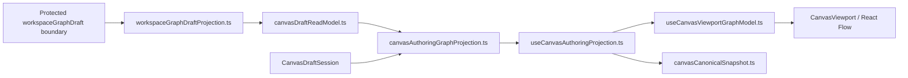
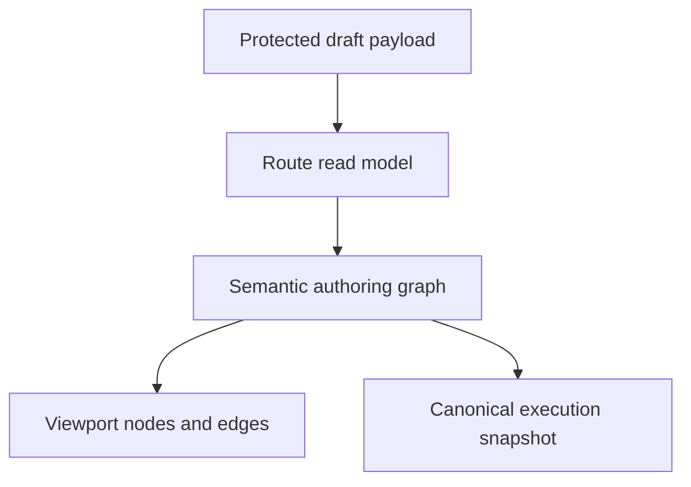
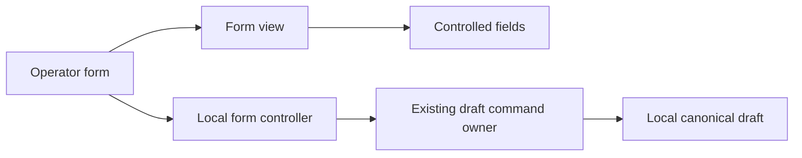

# Canvas Authoring Projection Component

## Purpose

Define the local component model for the Canvas authoring-projection seam.

This page is intentionally narrower than the broader Canvas architecture pack.
It explains:

- what the authoring-projection component is
- which APIs are public
- how protected draft truth becomes route-facing semantic truth
- where viewport projection begins and ends
- which invariants and consumers the component owns

## Governing Sources

- [Graph Frontend Architecture](./graph-frontend-architecture.md)
- [Canvas Controller Current To Target Architecture](./canvas-controller-current-to-target-architecture.md)
- [Canvas runtime truth hard-cut review](../../../../planning/reviews/architecture-and-governance/20260422-canvas-runtime-truth-hardcut-review.md)
- [Canvas component governance follow-up review](../../../../planning/reviews/architecture-and-governance/20260422-canvas-component-governance-follow-up-review.md)
- [Frontend Fowler Implementation Pattern](../frontend-fowler-implementation-pattern.md)

## Component Reading Rule

Read the component in this order:

1. `workspaceGraphDraftProjection.ts`
   the protected-boundary projection seam
2. `canvasDraftReadModel.ts`
   the route-facing read-model translation seam
3. `canvasAuthoringGraphProjection.ts`
   the semantic authoring merge seam
4. `useCanvasAuthoringProjection.ts`
   the route-facing composition hook
5. `useCanvasViewportGraphModel.ts`
   the viewport-only projection seam
6. `canvasCanonicalSnapshot.ts`
   the execution-safe canonical snapshot derived from semantic truth

If a change does not fit one of those concerns, it probably belongs in the
repository, the draft aggregate, or the controller read model instead.

## Why This Component Exists

The Canvas route now hard-cuts active authoring semantics to protected
`workspaceGraphDraft` truth.

That requires a local projection component with three separate responsibilities:

- map protected draft payloads into route-facing read models
- compose semantic authoring truth from protected graph semantics plus
  route-local explicit additions
- project that already-composed semantic truth into React Flow state

This component exists to keep those responsibilities explicit instead of
blending them into one hook or one controller-local helper file.

## Public API

The public APIs of the component are:

- `projectProtectedWorkspaceGraphDraftRecord(...)`
- `projectCanvasDraftReadModel(...)`
- `buildCanvasAuthoringGraphProjection(...)`
- `resolveCanvasAuthoringVisibleEdgeId(...)`
- `useCanvasAuthoringProjection(...)`
- `useCanvasViewportGraphModel(...)`
- `buildCanvasCanonicalSnapshot(...)`
- `resolveDvtSubstraitProjectionSource(...)`

This is a multi-surface component, not one namespaced object, because it spans:

- protected-boundary mapping
- read-model translation
- semantic projection
- React hook composition
- viewport projection

## File Responsibilities

<!-- markdownlint-disable MD060 -->

| File                                | Owned concern                                                                        | Public to other modules |
| ----------------------------------- | ------------------------------------------------------------------------------------ | ----------------------- |
| `workspaceGraphDraftProjection.ts`  | project the protected draft boundary into route-facing draft and semantic models     | yes                     |
| `canvasDraftReadModel.ts`           | translate authoring-port outcomes into route-facing draft read models                | yes                     |
| `canvasAuthoringGraphProjection.ts` | compose semantic authoring truth from protected semantics and scoped local additions | yes                     |
| `useCanvasAuthoringProjection.ts`   | compose semantic projection, canonical snapshot, and viewport projection             | yes                     |
| `useCanvasViewportGraphModel.ts`    | project semantic authoring truth into React Flow viewport state only                 | yes                     |
| `canvasCanonicalSnapshot.ts`        | derive execution-safe canonical snapshots from semantic authoring truth              | yes                     |

<!-- markdownlint-enable MD060 -->

## Topology

## Projection Transition Model

This component does not own a domain state machine. Its transitions are
projection transitions.

Rule:

- boundary mapping is not semantic merge
- semantic merge is not viewport projection
- viewport projection is not execution snapshot derivation

## Invariants

- protected semantic graph is the first authority when a protected draft record
  exists
- route-local supplementation may add only scoped, explicit, non-persisted
  authoring members that are absent from protected semantic truth
- `useCanvasViewportGraphModel.ts` must not import or understand protected
  draft types
- React Flow node and edge state remain a projection, never semantic authority
- canonical execution snapshot must be derived from semantic canonical nodes
  and edges, not from viewport state
- lossy record projection must not replace semantic graph truth

## Outer Canvas And Model Boundary

The main Canvas projects real Source-to-Model dependencies directly between
their ports. Each dependency retains its own identity, selection, removal and
execution gate. It does not project the Model's internal JOIN/Set operation as
an edge badge, shared relational junction, synthetic node or shared trunk.
Substrait remains the semantic authority inside the Model; internal operations
are inspected and edited in the semantic editor reached from the Model.

This presentation follows #3293/#3296 and supersedes the grouped edge badge
presentation from #3227. It does not change persisted graph topology or the
execution snapshot. `canvasViewportEdgeProjection.ts` must not decode internal
Model composition to render an external dependency.

## Operator Form Boundary

The semantic editor's operator form is a local component, not another mutation
authority. `CanvasRelationalTreeOperatorForm` composes a controller with an inline
or modal view. Its `relational-operator-form/` members own:

- `useOperatorForm`: discardable input state, exact integer conversion and
  dispatch to the existing `applyCanvasRelationalOperatorTool` command owner.
- `OperatorFormView`: form submission, error presentation and explicit actions.
- `OperatorFormFields` and `SortKeyFields`: controlled input presentation.
- `operatorFormCopy`: shared English/Spanish presentation copy.

Views receive values and actions; they do not receive persistence ports or call
semantic mutations. Cancelling discards local input. Accepted edits update only
the editor draft; persistence still belongs to explicit Apply through the
existing authoring rail. Selecting a card opens its properties without fetching
rows, running the model or applying a semantic revision.

## Consumers

Direct consumers:

- `canvasDraftRepository.ts`
- `useCanvasAuthoringRuntime.ts`
- `useCanvasController.ts`

Indirect consumers:

- `useCanvasControllerReadModel.ts`
- `useCanvasExecutionActions.ts`
- `CanvasViewport.tsx`

## Fitness Functions

The canonical fitness checks for this component are:

- `workspaceGraphDraftProjection.test.ts`
- `canvasAuthoringGraphProjection.test.ts`
- `canvasAuthoringProjection.architecture.test.ts`
- `useCanvasAuthoringProjection.architecture.test.ts`
- `useCanvasViewportGraphModel.architecture.test.ts`

Those tests must keep proving:

- protected-boundary projection stays outside viewport code
- semantic merge stays outside React Flow state ownership
- viewport code does not re-import protected boundary semantics
- canonical snapshot stays derived from semantic truth

## Drift To Watch

- if `canvasDraftReadModel.ts` drops `semanticGraph`, the route becomes lossy
  again
- if `useCanvasViewportGraphModel.ts` starts importing protected draft types,
  the projection boundary has regressed
- if `canvasAuthoringGraphProjection.ts` starts reading React Flow state
  directly, semantic authority has leaked into the adapter layer
- if execution snapshot starts deriving from viewport nodes, command scope is
  no longer governed by semantic truth
