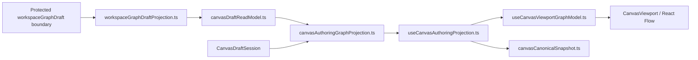
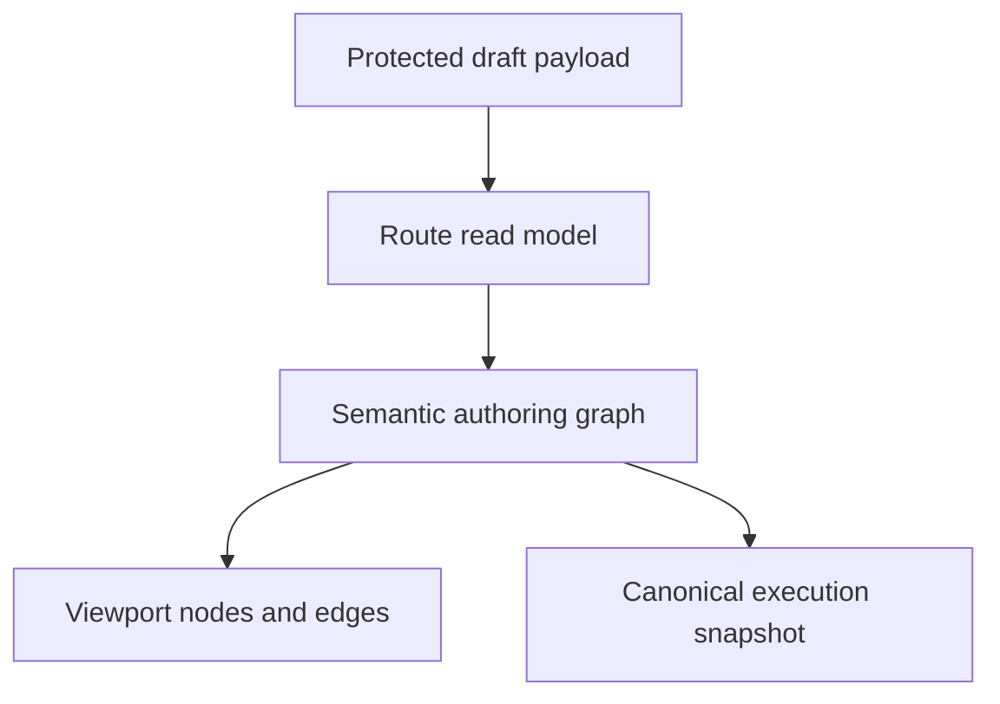
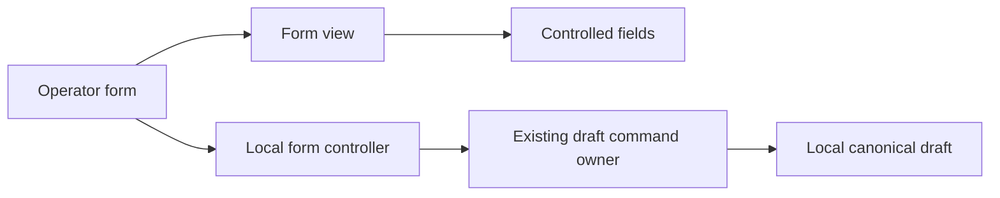
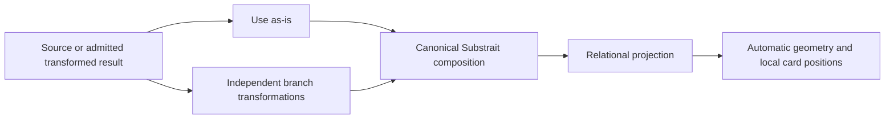

# Canvas Authoring Projection Component

## Purpose

Define the local component model for the Canvas authoring-projection seam.

This page is intentionally narrower than the broader Canvas architecture pack.
It explains:

- what the authoring-projection component is
- which APIs are public
- how protected draft truth becomes route-facing semantic truth
- where viewport projection begins and ends
- which invariants and consumers the component owns

## Governing Sources

- [Graph Frontend Architecture](./graph-frontend-architecture.md)
- [Canvas Controller Current To Target Architecture](./canvas-controller-current-to-target-architecture.md)
- [Canvas runtime truth hard-cut review](../../../../planning/reviews/architecture-and-governance/20260422-canvas-runtime-truth-hardcut-review.md)
- [Canvas component governance follow-up review](../../../../planning/reviews/architecture-and-governance/20260422-canvas-component-governance-follow-up-review.md)
- [Frontend Fowler Implementation Pattern](../frontend-fowler-implementation-pattern.md)

## Component Reading Rule

Read the component in this order:

1. `workspaceGraphDraftProjection.ts`
   the protected-boundary projection seam
2. `canvasDraftReadModel.ts`
   the route-facing read-model translation seam
3. `canvasAuthoringGraphProjection.ts`
   the semantic authoring merge seam
4. `useCanvasAuthoringProjection.ts`
   the route-facing composition hook
5. `useCanvasViewportGraphModel.ts`
   the viewport-only projection seam
6. `canvasCanonicalSnapshot.ts`
   the execution-safe canonical snapshot derived from semantic truth

If a change does not fit one of those concerns, it probably belongs in the
repository, the draft aggregate, or the controller read model instead.

## Why This Component Exists

The Canvas route now hard-cuts active authoring semantics to protected
`workspaceGraphDraft` truth.

That requires a local projection component with three separate responsibilities:

- map protected draft payloads into route-facing read models
- compose semantic authoring truth from protected graph semantics plus
  route-local explicit additions
- project that already-composed semantic truth into React Flow state

This component exists to keep those responsibilities explicit instead of
blending them into one hook or one controller-local helper file.

## Public API

The public APIs of the component are:

- `projectProtectedWorkspaceGraphDraftRecord(...)`
- `projectCanvasDraftReadModel(...)`
- `buildCanvasAuthoringGraphProjection(...)`
- `resolveCanvasAuthoringVisibleEdgeId(...)`
- `useCanvasAuthoringProjection(...)`
- `useCanvasViewportGraphModel(...)`
- `buildCanvasCanonicalSnapshot(...)`
- `resolveDvtSubstraitProjectionSource(...)`

This is a multi-surface component, not one namespaced object, because it spans:

- protected-boundary mapping
- read-model translation
- semantic projection
- React hook composition
- viewport projection

## File Responsibilities

<!-- markdownlint-disable MD060 -->

| File                                | Owned concern                                                                        | Public to other modules |
| ----------------------------------- | ------------------------------------------------------------------------------------ | ----------------------- |
| `workspaceGraphDraftProjection.ts`  | project the protected draft boundary into route-facing draft and semantic models     | yes                     |
| `canvasDraftReadModel.ts`           | translate authoring-port outcomes into route-facing draft read models                | yes                     |
| `canvasAuthoringGraphProjection.ts` | compose semantic authoring truth from protected semantics and scoped local additions | yes                     |
| `useCanvasAuthoringProjection.ts`   | compose semantic projection, canonical snapshot, and viewport projection             | yes                     |
| `useCanvasViewportGraphModel.ts`    | project semantic authoring truth into React Flow viewport state only                 | yes                     |
| `canvasCanonicalSnapshot.ts`        | derive execution-safe canonical snapshots from semantic authoring truth              | yes                     |

<!-- markdownlint-enable MD060 -->

## Topology



## Projection Transition Model

This component does not own a domain state machine. Its transitions are
projection transitions.



Rule:

- boundary mapping is not semantic merge
- semantic merge is not viewport projection
- viewport projection is not execution snapshot derivation

## Invariants

- protected semantic graph is the first authority when a protected draft record
  exists
- route-local supplementation may add only scoped, explicit, non-persisted
  authoring members that are absent from protected semantic truth
- `useCanvasViewportGraphModel.ts` must not import or understand protected
  draft types
- React Flow node and edge state remain a projection, never semantic authority
- canonical execution snapshot must be derived from semantic canonical nodes
  and edges, not from viewport state
- lossy record projection must not replace semantic graph truth

## Outer Canvas And Model Boundary

The main Canvas projects real Source-to-Model dependencies directly between
their ports. Each dependency retains its own identity, selection, removal and
execution gate. It does not project the Model's internal JOIN/Set operation as
an edge badge, shared relational junction, synthetic node or shared trunk.
Substrait remains the semantic authority inside the Model; internal operations
are inspected and edited in the semantic editor reached from the Model.

This presentation follows #3293/#3296 and supersedes the grouped edge badge
presentation from #3227. It does not change persisted graph topology or the
execution snapshot. `canvasViewportEdgeProjection.ts` must not decode internal
Model composition to render an external dependency.

## Operator Form Boundary

The semantic editor's operator form is a local component, not another mutation
authority. `CanvasRelationalTreeOperatorForm` composes a controller with an inline
or modal view. Its `relational-operator-form/` members own:

- `useOperatorForm`: discardable input state, exact integer conversion and
  dispatch to the existing `applyCanvasRelationalOperatorTool` command owner.
- `OperatorFormView`: form submission, error presentation and explicit actions.
- `OperatorFormFields` and `SortKeyFields`: controlled input presentation.
- `operatorFormCopy`: shared English/Spanish presentation copy.

Views receive values and actions; they do not receive persistence ports or call
semantic mutations. Cancelling discards local input. Accepted edits update only
the editor draft; persistence still belongs to explicit Apply through the
existing authoring rail. Selecting a card opens its properties without fetching
rows, running the model or applying a semantic revision.

Applied inspection dispatches by the selected canonical operation, including the
transition immediately after Apply. Sort and Fetch show their projected key/order
or limit/offset summary in Properties and retain the selected data dock. They do
not mount the scalar predicate viewer: a sort-key reference is not a JOIN
condition, and Fetch has no scalar predicate. Read-only inspection follows the
same rule. JOIN and other expression-owning operations retain their existing
expression tree. This boundary must hold while navigation waits for Apply; it
must not reset selection, swallow projection errors or change the saved plan.

Admission and relation kind are separate facts. A rejected Sort or Fetch remains
visibly unsupported and must never enter the JOIN expression viewer, even when
its canonical relation contains expression references. Selection follows the
stable RelationId within the same Model across Apply, not a digest-bearing tree
locator; a removed relation or a different Model falls back to its current root.
Switching selected relations resets the local operator form, not the saved plan.

The `relational-inspection/` component owns the applied inspector presentation
model and panel. An exhaustive operator policy selects source, CROSS, summary,
scalar expressions or unsupported content. Scalar inspection requires the
operator's declared expression slot and a stable relation identity; an arbitrary
nonempty expression list is not admission to that viewer. The parent workbench
only composes its operation shelf, graph and inspector panel. This disposable
view model does not re-decode Substrait or define operation semantics.



## Relational Card Movement And Reusable Inputs

The #3342 product need distinguishes a connected source or transformed result,
each use of that input in a branch, and its disposable screen position. Reuse
must support inputs as-is and independently transformed branches, not just
self-JOINs of raw Reads. Countries separated by filters and employee/manager
roles are examples, not product-specific types or rules. Occurrence identity
must not be collapsed to the physical source identity during editing or reload.



Card movement belongs to the presentation model. It must not mutate the plan,
reorder operands, save a semantic revision, fetch rows or invalidate data.
Positions live only in the open Model editor session, including transitions
between inspection and local editing; they are not persisted in the sidecar.
Pointer movement accounts for zoom; cancellation restores the starting position.
Keyboard movement uses Alt plus arrow keys. Port endpoints follow the card.

The movement microcut does not admit new relation shapes. General reusable-input
authoring remains an open design/delivery criterion in #3342: it must establish
the standard Substrait representation, stable RelationId/FieldId bindings,
shared-upstream versus branch-local edit behavior, reload and PostgreSQL
projection before exposure. A display alias is not a new physical table or a
substitute for this identity boundary.

Occurrence creation and edits must reuse ConfigureCanvasDvtNode and the protected
authoring save rail; preview must reuse PreviewCanvasTransformRows. Business-entity
contracts, hierarchy-cycle validation and recursive operations are outside this
slice. A self-JOIN condition is not a data-quality constraint: invalid source
rows must not be silently hidden by an injected inequality.

The shared PostgreSQL JOIN inspector separates document admission, physical Read
bindings, stage propagation and predicate binding. Its internal
`join-inspection/` modules consume the same Plan and identity sidecar; the public
`inspectDvtSubstraitJoinDraft` and `inspectNInputJoinStructure` entry points remain
the only inspection API. Repeated named-table Reads may share a physical source
while retaining distinct RelationIds and FieldIds. Their schema, table and field
schema must agree; repeated provenance is not permission to change the queried
table. The protected API checks exact physical dependency coverage, not equality
between the number of Read occurrences and graph Sources. Every occurrence
resolves to one authorized source and every selected dependency is used.
Selected-operation preview may use a subset of that already validated closure.

Shared-reader/API admission alone does not complete repeated-input authoring.
Generic transformed branches and end-to-end browser/provider acceptance remain
open in #3342; the bounded occurrence controls below expose only admitted shapes.

The `relational-source-occurrence/` component separates canonical JOIN Read
identity allocation from physical graph binding. Existing Reads are preserved
only by their RelationId, never by matching a table name or physical source.
Each physical binding verifies field names, types and nullability. Repeated
Reads retain separate entries in the relational projection and its reopen seed;
the left source catalogue remains one entry per physical source. A physical
entry with several occurrences cannot arbitrarily select or edit the first one.

Read relation display names follow the existing human-name contract, not the
physical table name. Aliases do not change plan bytes, SQL or protected source
coverage. JOIN edits preserve these labels. The identity foundation does not
admit transformed-result reuse.
Retaining a single Read also preserves its label and identities. If its types or
required-field nullability cannot be expressed by the current projection profile,
removal rejects without changing the draft; it must not silently widen the schema.

### Explicit Source occurrence controls

The [bounded UI plan](https://github.com/dunay2/dvt/issues/3342#issuecomment-5763838796)
reuses ConfigureCanvasDvtNode. `sourceOccurrencePolicy` owns admission and the
immutable Read-label edit; `sourceOccurrenceActions` prepares the discardable
append intent. Catalogue action, alias properties and append form are separate
presentation components. `useCanvasRelationalTreeDraftState` owns local reset and
hydration; it does not save, query or run the model.

```text
Physical catalogue -> Add instance -> admission -> existing predicate form
                                             -> new canonical Read identity
Read click -> Properties -> alias by RelationId -> local draft
Local draft -> Apply -> existing graph save / CAS -> reopen
Read selection -> existing bottom data dock -> explicit protected data query
```

Add instance admits an existing JOIN accepted by the shared JOIN reader and
compatible connected fields. It does not replace a Project, CROSS, Set or wrapped
composition to manufacture support. The unavailable action explains its reason
and performs no write. Confirmation allocates a Read, not a physical Source or
graph edge. Repeated field options use aliases and, where labels repeat, ordinal
disambiguation; their values remain canonical FieldIds.

A single Read click opens Properties and the existing selected data dock. Alias
edits use the canonical human-name contract, preserve Plan bytes and source
bindings, and remain cancelable until Apply. Read-only inspection exposes no
mutation controls. Non-JOIN alias editing is explicitly unavailable where the
current reader does not admit it. These boundaries do not close #3342: initial
repeated-source construction from a single projection, general transformed reuse
and browser-through-live-PostgreSQL acceptance remain separate pending work.

```text
Canonical document -> document admission -> Read bindings -> JOIN stages
                                                           -> predicate bindings
                   <- verified input/stage/output read model
```

## Consumers

Direct consumers:

- `canvasDraftRepository.ts`
- `useCanvasAuthoringRuntime.ts`
- `useCanvasController.ts`

Indirect consumers:

- `useCanvasControllerReadModel.ts`
- `useCanvasExecutionActions.ts`
- `CanvasViewport.tsx`

## Fitness Functions

### Compositional regression boundaries (#3352)

Source-append admission is a pure read model, separate from draft construction
and operation-choice presentation. Consumers import that policy directly; there
is no compatibility facade. The operation catalogue remains the single owner of
the supported choice list and its order.

```text
Canonical Substrait -> wrapper admission -> existing JOIN / Set base reader
                                        -> shared bounded Aggregate / Window AST
Protected selected query -> identity-preserving Sort / Fetch removal -> same reader
```

Aggregate and Window inspection share one bounded wrapper policy in
`@dvt/postgres-projection`. JOIN and Set retain their existing base readers and
canonical selectors. Wrapper removal preserves relation and field identities;
generated aggregate outputs do not claim source-field lineage. SQL remains a
projection, never an additional authoring authority.

PostgreSQL regression tests must project canonical documents through the API
before executing SQL. Handwritten SQL wrappers around a base projection do not
prove that canonical composition is supported. Browser tests separately prove
Apply, selected-relation identity and data navigation.

The canonical fitness checks for this component are:

- `workspaceGraphDraftProjection.test.ts`
- `canvasAuthoringGraphProjection.test.ts`
- `canvasAuthoringProjection.architecture.test.ts`
- `useCanvasAuthoringProjection.architecture.test.ts`
- `useCanvasViewportGraphModel.architecture.test.ts`

Those tests must keep proving:

- protected-boundary projection stays outside viewport code
- semantic merge stays outside React Flow state ownership
- viewport code does not re-import protected boundary semantics
- canonical snapshot stays derived from semantic truth

### Browser Scenario Boundaries

`canvas-relational-tree-workbench.cy.ts` owns keyboard entry and workspace
navigation only. The sibling `canvas-relational-workbench-*.cy.ts` specs isolate
viewport behavior, contextual removal, pending JOIN creation, source append,
predicate editing, chain persistence, CROSS preview and UNION creation.
`canvas-relational-source-occurrence.cy.ts` owns explicit repeated-Read append,
alias Apply/save/reopen and the selected data query. Its controlled sample checks
query identity and explicit execution, not PostgreSQL result correctness.
Each spec selects its scenario explicitly from
`cypress/support/relationalWorkbench/scenario.ts`; test titles never select
fixtures. Shared support owns navigation, geometry assertions, chain setup and
saved-document inspection, not a parallel semantic implementation.

These browser tests exercise the real Web against controlled API responses.
They assert canonical persisted documents and revision-bound query parameters;
they do not replace PostgreSQL integration tests or prove database results.
The focused suite is run with:

```sh
pnpm --filter @dvt/web test:e2e:native --spec 'cypress/e2e/canvas/canvas-relational-tree-workbench.cy.ts,cypress/e2e/canvas/canvas-relational-workbench-*.cy.ts'
```

## Drift To Watch

- if `canvasDraftReadModel.ts` drops `semanticGraph`, the route becomes lossy
  again
- if `useCanvasViewportGraphModel.ts` starts importing protected draft types,
  the projection boundary has regressed
- if `canvasAuthoringGraphProjection.ts` starts reading React Flow state
  directly, semantic authority has leaked into the adapter layer
- if execution snapshot starts deriving from viewport nodes, command scope is
  no longer governed by semantic truth
