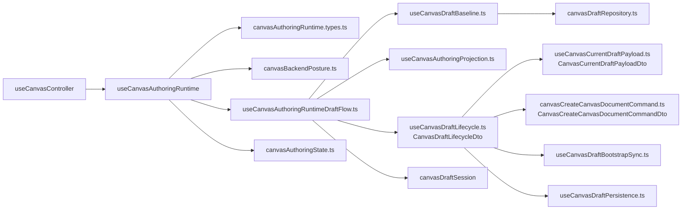
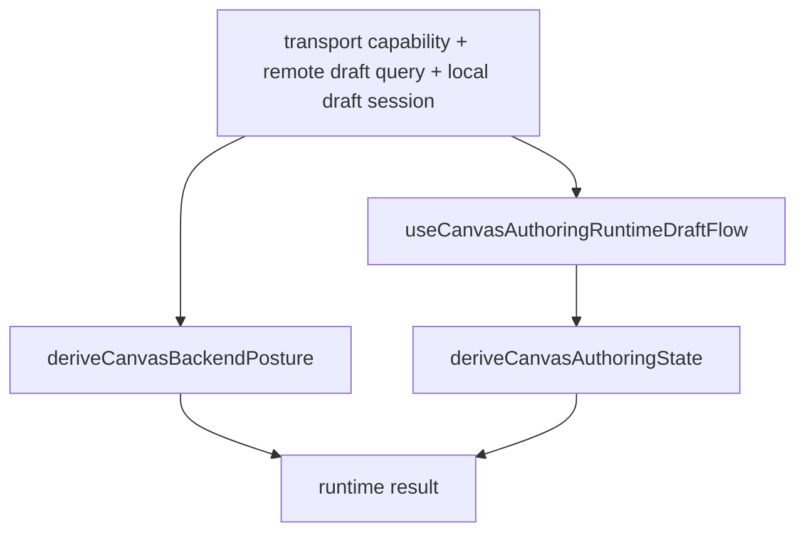

# Canvas Authoring Runtime Component

## Purpose

Define the local component model for the Canvas authoring-runtime seam in
`apps/web`.

This page is intentionally narrower than the broader controller and graph pack.
It explains:

- what the authoring-runtime component is
- which files define its public contract and subordinate seams
- which API is public to the rest of the Canvas slice
- which invariants and transitions it owns
- which consumers may depend on it

## Governing Sources

- [Graph Frontend Architecture](./graph-frontend-architecture.md)
- [Canvas Controller Current To Target Architecture](./canvas-controller-current-to-target-architecture.md)
- [Graph Canvas Runtime Model](./graph-canvas-runtime-model.md)
- [Canvas Draft Session Component](./canvas-draft-session-component.md)
- [Canvas Authoring Projection Component](./canvas-authoring-projection-component.md)
- [TF-E2 Canvas Target Architecture Execution Plan 2026-04-17](../../../../planning/proposals/mandatory/frontend-and-ux/tf-e2-canvas-target-architecture-execution-plan-20260417.md)

## Component Reading Rule

Read the component in this order:

1. `canvasAuthoringRuntime.types.ts`
   the public local contract and argument vocabulary
2. `canvasBackendPosture.ts`
   backend readiness and transport-mutation posture
3. `useCanvasDraftBaseline.ts`
   protected draft repository plus query baseline seam
4. `useCanvasAuthoringRuntimeDraftFlow.ts`
   internal composition over baseline, projection, lifecycle, and local session
   state
5. `canvasAuthoringState.ts`
   route-safe authoring scope, recovery posture, and mutation capability
6. `useCanvasAuthoringRuntime.ts`
   public application-service seam that composes the component

If a change does not fit one of those concerns, it probably belongs in the
controller facade, the draft aggregate, or the projection component instead.

## Why This Component Exists

The Canvas controller needs one route-local application service for authoring:

- it must understand backend posture
- it must own the draft-flow orchestration seam
- it must expose route-safe authoring state to the controller facade

That creates a real local component:

- the contract file defines the public vocabulary
- subordinate seams own one concern each
- the top-level runtime hook composes them without becoming another bag of
  unrelated route helpers

The component is the command-side counterpart to the authoring-projection
component:

- projection explains what the route can see
- runtime explains how authoring posture is composed

## Public API

The public entrypoint is `useCanvasAuthoringRuntime(...)`.

The public contract vocabulary is:

- `UseCanvasAuthoringRuntimeArgs`
- `UseCanvasAuthoringRuntimeDraftFlowArgs`
- `CanvasAuthoringRuntimeBaselineArgs`
- `CanvasAuthoringRuntimePlatformHealthQuery`
- `CanvasAuthoringRuntimePreviewProvenanceConfig`
- `CanvasNodePositions`

This is a hard-cut component API. Internal seams must depend on the contract
file, not on the parent runtime hook.

## Draft Lifecycle DTO Boundary

The draft-flow seam must hand authoring lifecycle state to
`useCanvasDraftLifecycle.ts` through a semantic DTO instead of a flat argument
bag.

Lifecycle-local vocabulary in `canvasDraftLifecycle.types.ts`:

- `CanvasDraftLifecycleDto`
- `CanvasCurrentDraftPayloadDto`
- `CanvasCreateCanvasDocumentCommandDto`

Canonical grouping:

- `baseline`: protected-draft repository, query/cache state, and authority
  posture
- `session`: local draft-session machine plus canonical snapshot and position
  updates
- `projection`: visible graph nodes, canonical graph edges/nodes, and authoring
  provenance needed to build the current payload
- `policy`: explicit persistence posture such as `canPersistGraphDraft`

Inside the lifecycle seam, `useCanvasCurrentDraftPayload.ts` repeats the same
rule: one DTO expresses the current projection and authoring context instead of
another long positional call.

The first-canvas save path follows the same rule. `useCanvasDraftLifecycle.ts`
should compose one narrow create-canvas command seam rather than keeping the
authoritative save and conflict choreography inline in the hook body.

## File Responsibilities

<!-- markdownlint-disable MD060 -->

| File                                    | Owned concern                                                             | Public to other modules |
| --------------------------------------- | ------------------------------------------------------------------------- | ----------------------- |
| `canvasAuthoringRuntime.types.ts`       | component contract and local argument vocabulary                          | yes                     |
| `canvasBackendPosture.ts`               | backend readiness and transport-mutation posture                          | backend posture API     |
| `useCanvasDraftBaseline.ts`             | draft repository plus query/cache baseline for the runtime component      | baseline API only       |
| `useCanvasAuthoringRuntimeDraftFlow.ts` | composition over draft baseline, projection, lifecycle, and session state | draft-flow API only     |
| `canvasCreateCanvasDocumentCommand.ts`  | authoritative first-canvas save and conflict/no-op choreography           | lifecycle-local only    |
| `canvasAuthoringState.ts`               | route-safe visible, UI, execution, and recovery authoring state           | authoring-state API     |
| `useCanvasAuthoringRuntime.ts`          | public application-service composition seam                               | yes                     |

<!-- markdownlint-enable MD060 -->

## Topology

## Transition Model

This component does not own the full aggregate state machine. It owns a
composition transition:

Interpretation rule:

- backend posture determines whether transport-backed editing is even allowed
- draft-flow composition determines the current protected-draft, projection, and
  lifecycle state
- authoring-state derivation turns that runtime truth into route-safe scopes and
  recovery posture

## Invariants

- subordinate seams depend on `canvasAuthoringRuntime.types.ts`, not on
  `useCanvasAuthoringRuntime.ts`
- `useCanvasAuthoringRuntime.ts` stays a composition seam and must not absorb
  query creation, React state creation beyond composition, or repository
  construction
- the runtime contract receives draft persistence authority as
  `canPersistGraphDraftTransport`; using graph editability or `canEditEdges` as
  this transport input is drift
- graph mutation authority remains a separate runtime input named
  `canMutateGraphTransport`; it may depend on `canEditEdges`, but it must not
  decide first-canvas document creation
- `useCanvasDraftBaseline.ts` owns the query baseline and repository/cache
  wiring, not backend posture or recovery rules
- `useCanvasAuthoringRuntimeDraftFlow.ts` owns runtime-local draft-flow
  composition, not route-shell or controller logic
- `useCanvasDraftLifecycle.ts` receives one semantic DTO boundary; adding new
  flat parameters to the hook or to `useCanvasCurrentDraftPayload.ts` is drift
- first-canvas creation remains a dedicated lifecycle-local command seam; do
  not regrow the save, conflict, and status choreography inline in
  `useCanvasDraftLifecycle.ts`
- `canvasAuthoringState.ts` derives route-safe scopes and recovery posture from
  draft truth; it is not a persistence seam
- the public contract must not retain dead parameters or controller-only
  dependencies

## Consumers

Direct consumer:

- `useCanvasController.ts`

Indirect consumers through the controller facade:

- `useCanvasMutationHandlers.ts`
- `useCanvasGraphHandlers.ts`
- `useCanvasExecutionActions.ts`
- route presentation and shell composition through `Canvas.tsx`

## Fitness Functions

The canonical fitness checks for this component are:

- `canvasAuthoringRuntimeComponent.architecture.test.ts`
- `useCanvasAuthoringRuntime.architecture.test.ts`
- `useCanvasAuthoringRuntimeDraftFlow.architecture.test.ts`
- `useCanvasDraftLifecycle.architecture.test.ts`

Those tests must keep proving:

- the runtime contract remains explicit and local
- draft persistence authority remains named separately from graph editability
- draft-flow no longer learns its argument contract from the parent runtime hook
- lifecycle and current-payload seams stay on DTO boundaries instead of
  regrowing transport-shaped parameter lists
- baseline, lifecycle, and authoring-state seams remain separate
- runtime stays a composition seam instead of regrowing into a monolith

## Drift To Watch

- if controller-only dependencies appear in `canvasAuthoringRuntime.types.ts`,
  the component contract is leaking upward
- if `useCanvasAuthoringRuntimeDraftFlow.ts` imports from
  `useCanvasAuthoringRuntime.ts` again, dependency direction has regressed
- if `useCanvasAuthoringRuntime.ts` starts creating queries, repositories, or
  large inline policies, the component is regrowing in the wrong place
- if `useCanvasDraftLifecycle.ts` or `useCanvasCurrentDraftPayload.ts` regrow
  wide positional or transport-shaped parameter lists, the DTO boundary has
  drifted
- if first-canvas save logic migrates back into `useCanvasDraftLifecycle.ts`
  as a large inline branch, the lifecycle seam has started absorbing too much
  policy again
- if route-shell or viewport concerns appear here, the runtime seam is absorbing
  presentation responsibilities
