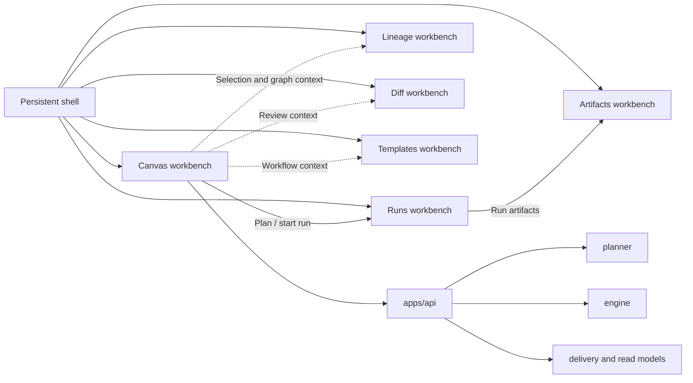
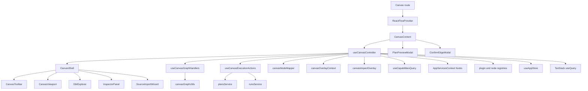
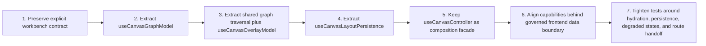

# Canvas Component Map And Modernization Review

## Purpose

This document maps the current Canvas component system in `apps/web`, including
responsibilities, relationships, main props/contracts, and library dependencies.

It also records a modern frontend-pattern review to decide what should stay and
what should change without altering behavior in this documentation slice.

This review is not Canvas-only in isolation. It places Canvas inside the final
DVT operator workbench together with the shell, Runs, Lineage, Diff,
Artifacts, and the future Templates route so design and architecture decisions
stay consistent across the whole product.

## Scope And Code Anchors

Primary anchors:

- [Canvas.tsx](../../../../../apps/web/src/app/views/Canvas.tsx)
- [CanvasShell.tsx](../../../../../apps/web/src/app/views/canvas/CanvasShell.tsx)
- [CanvasViewport.tsx](../../../../../apps/web/src/app/views/canvas/CanvasViewport.tsx)
- [CanvasToolbar.tsx](../../../../../apps/web/src/app/views/canvas/CanvasToolbar.tsx)
- [useCanvasController.ts](../../../../../apps/web/src/app/views/canvas/useCanvasController.ts)
- [useCanvasGraphHandlers.ts](../../../../../apps/web/src/app/views/canvas/useCanvasGraphHandlers.ts)
- [useCanvasExecutionActions.ts](../../../../../apps/web/src/app/views/canvas/useCanvasExecutionActions.ts)
- [canvasShell.types.ts](../../../../../apps/web/src/app/views/canvas/canvasShell.types.ts)
- [canvasNodeMapper.ts](../../../../../apps/web/src/app/views/canvas/canvasNodeMapper.ts)
- [canvasOverlayContext.ts](../../../../../apps/web/src/app/views/canvas/canvasOverlayContext.ts)
- [canvasImpactOverlay.ts](../../../../../apps/web/src/app/views/canvas/canvasImpactOverlay.ts)
- [canvasGraphUtils.ts](../../../../../apps/web/src/app/views/canvas/canvasGraphUtils.ts)

## Canvas In Final DVT Workbench

Canvas is the main graph-authoring route, not the whole frontend.

| Subsystem | Final role in the product                                              | What Canvas must not absorb                                                  |
| --------- | ---------------------------------------------------------------------- | ---------------------------------------------------------------------------- |
| Shell     | Persistent frame, global context, health, nav, console visibility      | Route-local graph semantics and graph commands                               |
| Canvas    | Workflow topology authoring, selection, overlays, plan and run handoff | Full run monitoring, SQL diff review, artifact inspection, source generation |
| Runs      | Execution workspace for active and historical runs                     | Graph authoring or topology editing                                          |
| Lineage   | Read-only dependency and impact analysis route                         | Main graph editing workflow                                                  |
| Diff      | Structured review surface for graph, SQL, and catalog deltas           | Everyday graph interaction or route shell ownership                          |
| Artifacts | Read-only artifact browser and payload inspection                      | Graph orchestration or editing                                               |
| Templates | Future governed source-generation workbench                            | Canvas toolbar growth into a code generator                                  |

## Component And Hook Inventory

| Element                     | Kind                            | Primary responsibility                                                                                 | Current boundary posture                         |
| --------------------------- | ------------------------------- | ------------------------------------------------------------------------------------------------------ | ------------------------------------------------ |
| `Canvas`                    | Route entry component           | Creates `ReactFlowProvider`, mounts `CanvasContent`, binds modals                                      | Good route boundary                              |
| `CanvasContent`             | Composition component           | Calls `useCanvasController`, adapts controller output to shell and modals                              | Good composition seam                            |
| `CanvasShell`               | Workbench composition component | Orchestrates 3-panel layout (explorer/viewport/inspector), toolbar, and route-local import modal state | Good route-local composition boundary            |
| `CanvasToolbar`             | Presentational/action bar       | Exposes graph commands and state toggles (`impact`, `columns`, `cost`, `plan`, `run`)                  | Good UI boundary                                 |
| `CanvasViewport`            | React Flow adapter component    | Binds graph state to `ReactFlow`, minimap, controls, viewport sync                                     | Good render boundary                             |
| `DbtExplorer`               | Contextual side panel           | Graph source browsing and import entry point                                                           | Correct contextual panel, not shell chrome       |
| `InspectorPanel`            | Contextual side panel           | Selection-driven node detail                                                                           | Correct contextual panel, not route authority    |
| `SourceImportWizard`        | Route-local modal               | Source import flow launched from Canvas                                                                | Acceptable route-local support surface           |
| `PlanPreviewModal`          | Route-local modal               | Shows planned execution before run start                                                               | Good handoff surface between graph and execution |
| `ConfirmEdgeModal`          | Route-local modal               | Confirms graph dependency creation                                                                     | Good guard rail for graph mutation               |
| `useCanvasController`       | Orchestration hook              | Query + canonical mapping + overlays + persisted layout + action wiring + output facade                | Overloaded boundary                              |
| `useCanvasGraphHandlers`    | Interaction hook                | Connect, drag/drop, selection, auto-layout, edge confirmation, node removal                            | Reusable, mostly cohesive                        |
| `useCanvasExecutionActions` | Run-plan action hook            | Plan preview and run start flow + console side effects + navigation callback                           | Cohesive action boundary                         |
| `canvasNodeMapper`          | Mapper utility                  | Canonical node/edge to React Flow node/edge mappings                                                   | Pure mapping boundary                            |
| `canvasOverlayContext`      | Overlay utility                 | Overlay context computation + merged decorations                                                       | Pure projection boundary                         |
| `canvasImpactOverlay`       | Overlay utility                 | Impact upstream/downstream projection + node data handlers                                             | Pure projection boundary                         |
| `canvasGraphUtils`          | Graph utility                   | DAG layout (`dagre`) and cycle detection                                                               | Pure graph algorithm boundary                    |

## Current Relationship Map

## Main Props And Contracts

| Component                          | Contract surface                                                                                | Notes                                      |
| ---------------------------------- | ----------------------------------------------------------------------------------------------- | ------------------------------------------ |
| `CanvasShell`                      | `CanvasShellProps` with graph data, side panel state, action callbacks                          | High prop volume; explicit and typed       |
| `CanvasViewport`                   | React Flow event handlers (`onNodesChange`, `onNodeDragStop`, `onSelectionChange`, `onMoveEnd`) | Correctly isolates graph primitive wiring  |
| `CanvasToolbar`                    | UI command callbacks + overlay toggles + counters                                               | Stateless; easy to test in isolation       |
| `useCanvasController` return       | Single facade consumed by route                                                                 | Useful for consumers; too broad internally |
| `useCanvasExecutionActions` params | Service ports (`plansService`, `runsService`) + permission/context fields                       | Aligns with dependency injection           |
| `useCanvasGraphHandlers` params    | Canonical lookup map, graph state, state setters, panel controls                                | Powerful but dense, still cohesive         |

Decision after review:

- keep `CanvasShellProps` explicit at the route boundary;
- do not replace the workbench contract with opaque command bags or a large
  anonymous view-model object;
- split complexity inside hooks and model layers first, not by hiding the route
  contract.

## Library Dependency Map

| Library                 | Where used                                            | Role in this slice                                   |
| ----------------------- | ----------------------------------------------------- | ---------------------------------------------------- |
| `react`                 | All components/hooks                                  | State and lifecycle model                            |
| `react-router`          | `useCanvasController`, `Canvas` route                 | Navigation and route-level wiring                    |
| `@tanstack/react-query` | `useCanvasController`                                 | Server-state query ownership                         |
| `zustand`               | `useAppStore` consumed by the controller              | Global shell and route UI state, currently too broad |
| `@xyflow/react`         | `Canvas`, `CanvasViewport`, controller/handlers/types | Graph rendering and interaction primitive            |
| `dagre`                 | `canvasGraphUtils`                                    | Auto-layout algorithm                                |
| `sonner`                | `useCanvasGraphHandlers`, `useCanvasExecutionActions` | UX feedback for commands/errors                      |
| `lucide-react`          | `CanvasToolbar`, `CanvasViewport`                     | Iconography only                                     |
| Radix plus `shadcn/ui`  | `CanvasShell`, dialogs, buttons, resizable primitives | Workbench layout and interaction primitives          |

## Extension Seams And Internal Dependencies

| Seam                                              | Current role                                               | Review decision                                                  |
| ------------------------------------------------- | ---------------------------------------------------------- | ---------------------------------------------------------------- |
| `resolveCanvasGraphStrategy()`                    | Maps workspace graph inputs into canonical graph shape     | Keep as plugin-aware graph seam                                  |
| `getAllOverlays()` and `getRegisteredPluginIds()` | Overlay registration and plugin visibility                 | Keep as extension seam, but make overlay traversal cheaper       |
| `resolveNodeKindRegistration()`                   | Node-kind specific labels and minimap colors               | Keep as rendering metadata seam                                  |
| `AppServicesContext` hooks                        | Governed route access to workspace, plan, and run services | Keep and deepen                                                  |
| `useCapabilitiesQuery()`                          | Loads runtime capabilities through `CapabilitiesPort`      | Keep behind the governed app query boundary and composition root |

## Subsystem Handoffs And Non-Ownership

| Handoff             | Current anchor                                        | Final rule                                                                                        |
| ------------------- | ----------------------------------------------------- | ------------------------------------------------------------------------------------------------- |
| Canvas -> Runs      | `onRunStarted(runId)` then `navigate('/runs/:runId')` | Keep explicit route handoff; do not bury inside graph mutation logic                              |
| Canvas -> Lineage   | Shared node and column context                        | Canvas may launch or inform Lineage, but full lineage analysis remains a separate read-only route |
| Canvas -> Diff      | Graph and SQL review context                          | Keep review-heavy UX in `Diff`, not in Canvas overlays or inspector                               |
| Runs -> Artifacts   | Run detail artifacts tab                              | Artifact browsing belongs to `Artifacts` and run detail, not Canvas inspector growth              |
| Canvas -> Templates | Future workflow-context handoff                       | Source generation should become its own workbench, not a Canvas toolbar sprawl                    |
| Canvas -> Backend   | Services + capabilities + typed adapters              | Canvas talks to `apps/api` only; never to planner, engine, or adapters directly                   |

## Modern Pattern Review

### Keep

- `Canvas` + `CanvasContent` split:
  route bootstrapping and controller composition are cleanly separated.
- Presentational split (`CanvasShell`, `CanvasToolbar`, `CanvasViewport`):
  UI composition is decoupled from orchestration logic.
- explicit route-level workbench contract:
  `CanvasShellProps` is verbose but readable and keeps the route boundary
  inspectable.
- Action extraction (`useCanvasExecutionActions`, `useCanvasGraphHandlers`):
  domain actions are not fully embedded in the controller.
- Pure utility modules (`canvasNodeMapper`, `canvasOverlayContext`, `canvasGraphUtils`):
  deterministic helper seams exist and are reusable.
- route-local support state:
  import-wizard visibility staying local to `CanvasShell` is preferable to
  pushing it into global store prematurely.

### Change

- `useCanvasController` responsibility concentration:
  split into narrower model hooks (`graph`, `overlay`, `layout persistence`,
  `navigation side effects`) and keep controller as facade-only composition.
- capability boundary inconsistency:
  `useCapabilitiesQuery` bypasses `AppServicesProvider` and should align with
  the governed frontend data-boundary model.
- Expensive sync path in node reconciliation:
  avoid repeated linear search over current node arrays; use `Map` keyed by
  `node.id` for stable O(n) reconciliation.
- Debug logging in hot paths:
  remove runtime `console.debug` or gate with explicit debug flag.
- Overlay algorithm duplication:
  `canvasImpactOverlay` and `canvasOverlayContext` both walk graph edges for
  impact-like data; unify traversal logic in one utility.
- route responsibility bleed:
  keep Monaco, diff-heavy review, artifact browsing, and source generation out
  of Canvas even when Canvas provides the originating workflow context.

## UX And Design Review

Canvas should stay graph-first, dense, and operationally clear.

| UX or design rule                                                         | Architectural implication                                                      |
| ------------------------------------------------------------------------- | ------------------------------------------------------------------------------ |
| The shell remains persistent                                              | Canvas must not duplicate top-level navigation, health, or global controls     |
| The graph is the primary surface                                          | Toolbar actions should stay short, high-value, and graph-contextual            |
| Explorer and inspector are contextual panels                              | Their visibility belongs to workbench ergonomics, not to domain truth          |
| Loading, empty, error, degraded, and read-only states must preserve frame | Local state machines and data guards matter as much as happy-path rendering    |
| Overlays are interpretive layers                                          | Visual emphasis may change, but topology truth must not change                 |
| Review and generation need their own density model                        | Monaco belongs to `Diff`, `Artifacts`, and `Templates`, not to Canvas core     |
| Design should feel intentional rather than dashboard-like                 | Avoid turning Canvas into a pile of cards, forms, and secondary status widgets |

## Proposed Refactor Sequence

## Decision Adjustments From The Previous Review

Confirmed decisions:

- `useCanvasController` still needs decomposition.
- Canvas remains the main authoring workbench.
- Overlays, persistence, and route handoff must be separable and testable.

Changed decision:

- do not optimize the route boundary by collapsing `CanvasShellProps` into
  grouped command bags;
- the right split is inside the controller and data/model layers, while the
  workbench contract stays explicit;
- capability fetching is now an explicit architectural issue, not a minor
  implementation detail.

## Decision Table: Keep Vs Change

| Area                                       | Decision       | Why                                                                    |
| ------------------------------------------ | -------------- | ---------------------------------------------------------------------- |
| Route and shell composition                | Keep           | Clear layering, low coupling                                           |
| React Flow integration boundary            | Keep           | `CanvasViewport` already isolates primitive concerns                   |
| Services as injected dependencies          | Keep           | Testable and environment-agnostic                                      |
| Explicit shell props                       | Keep           | Better workbench readability and route acceptance clarity              |
| Controller internals                       | Change         | Too many concerns in one hook                                          |
| Capabilities data boundary                 | Change         | Current direct `fetch` bypasses governed service composition           |
| Node sync and persistence path             | Change         | Performance and consistency risk                                       |
| Overlay traversal ownership                | Change         | Duplicate traversal logic and maintenance cost                         |
| Cross-route review and generation behavior | Keep separated | Prevents Canvas from absorbing Diff, Artifacts, and Templates concerns |

## Validation Focus For Next Iteration

When implementation starts, prioritize tests for:

1. hydration and query-pending guards before layout persistence writes;
2. no-op viewport persistence when viewport has not changed;
3. overlay mode fallback (`cost` to `runtime`) when cost data is absent;
4. stable node position reconciliation with persisted positions;
5. explicit route handoff from Canvas run start to Runs detail;
6. degraded or unavailable capabilities treatment without hidden fallback behavior.
