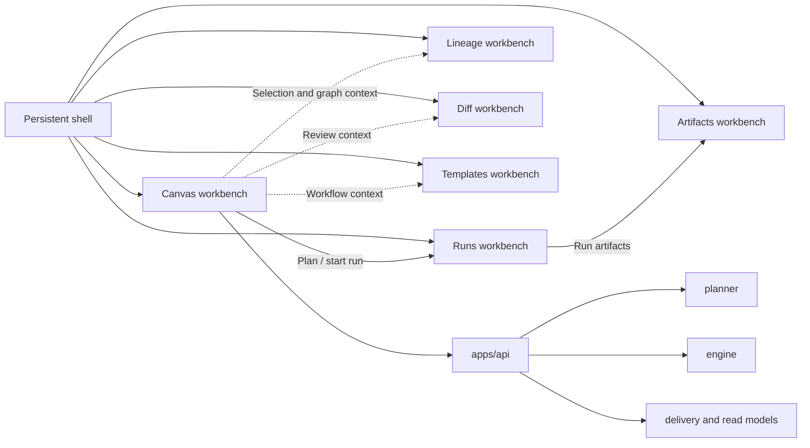
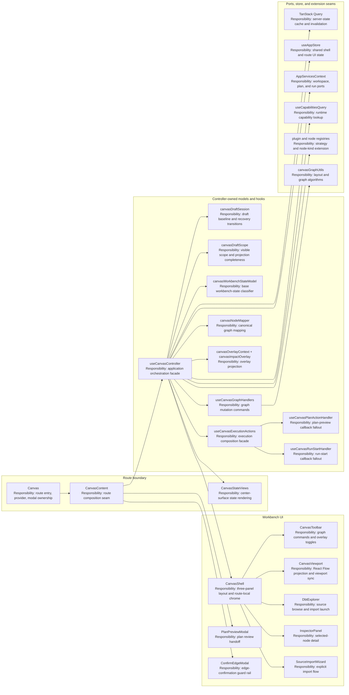
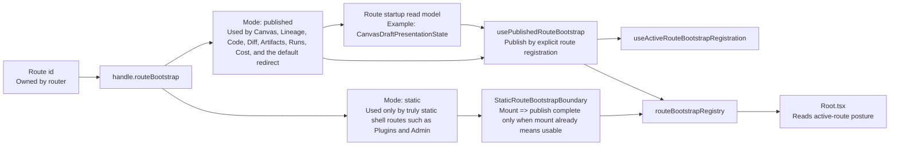
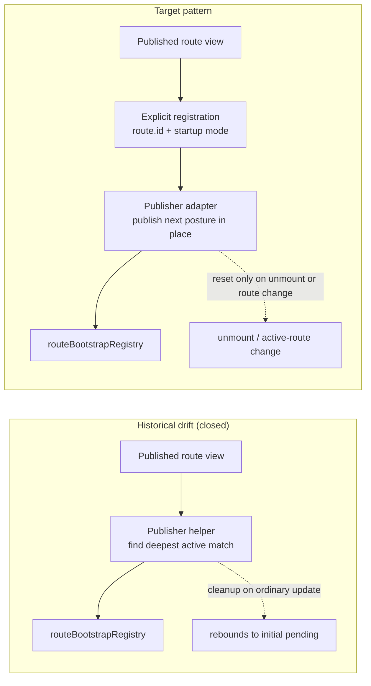

# Canvas Component Map And Modernization Review

## Purpose

This document maps the current Canvas component system in `apps/web`, including
responsibilities, relationships, main props/contracts, and library dependencies.

It also records a modern frontend-pattern review to decide what should stay and
what should change without altering behavior in this documentation slice.

This review is not Canvas-only in isolation. It places Canvas inside the final
DVT operator workbench together with the shell, Runs, Lineage, Diff,
Artifacts, and the future Templates route so design and architecture decisions
stay consistent across the whole product.

## Scope And Code Anchors

Primary anchors:

- [Canvas.tsx](../../../../../apps/web/src/app/views/Canvas.tsx)
- [CanvasShell.tsx](../../../../../apps/web/src/app/views/canvas/CanvasShell.tsx)
- [CanvasViewport.tsx](../../../../../apps/web/src/app/views/canvas/CanvasViewport.tsx)
- [CanvasToolbar.tsx](../../../../../apps/web/src/app/views/canvas/CanvasToolbar.tsx)
- [CanvasStateViews.tsx](../../../../../apps/web/src/app/views/canvas/CanvasStateViews.tsx)
- [routeBootstrapContract.ts](../../../../../apps/web/src/app/bootstrap/routeBootstrapContract.ts)
- [routeBootstrapRegistration.ts](../../../../../apps/web/src/app/bootstrap/routeBootstrapRegistration.ts)
- [routeBootstrapRegistry.ts](../../../../../apps/web/src/app/bootstrap/routeBootstrapRegistry.ts)
- [useActiveRouteBootstrapRegistration.ts](../../../../../apps/web/src/app/bootstrap/useActiveRouteBootstrapRegistration.ts)
- [routeBootstrapErrors.ts](../../../../../apps/web/src/app/bootstrap/routeBootstrapErrors.ts)
- [routeBootstrapErrorCopy.ts](../../../../../apps/web/src/app/bootstrap/routeBootstrapErrorCopy.ts)
- [StaticRouteBootstrapBoundary.tsx](../../../../../apps/web/src/app/bootstrap/StaticRouteBootstrapBoundary.tsx)
- [usePublishedRouteBootstrap.ts](../../../../../apps/web/src/app/bootstrap/usePublishedRouteBootstrap.ts)

Ownership note:

- typed bootstrap failures and code-based diagnostics are owned by
  `routeBootstrapErrors.ts`; bootstrap copy and locale resolution are owned by
  `routeBootstrapErrorCopy.ts`.
- [canvasWorkbenchStateModel.ts](../../../../../apps/web/src/app/views/canvas/canvasWorkbenchStateModel.ts)
- [useCanvasController.ts](../../../../../apps/web/src/app/views/canvas/useCanvasController.ts)
- [canvasDraftSession.ts](../../../../../apps/web/src/app/views/canvas/canvasDraftSession.ts)
- [canvasDraftScope.ts](../../../../../apps/web/src/app/views/canvas/canvasDraftScope.ts)
- [useCanvasGraphHandlers.ts](../../../../../apps/web/src/app/views/canvas/useCanvasGraphHandlers.ts)
- [useCanvasExecutionActions.ts](../../../../../apps/web/src/app/views/canvas/useCanvasExecutionActions.ts)
- [useCanvasPlanActionHandler.ts](../../../../../apps/web/src/app/views/canvas/useCanvasPlanActionHandler.ts)
- [useCanvasRunStartHandler.ts](../../../../../apps/web/src/app/views/canvas/useCanvasRunStartHandler.ts)
- [transformationGraphValidation.ts](../../../../../apps/web/src/app/views/canvas/transformationGraphValidation.ts)
- [transformationGraphValidationScope.ts](../../../../../apps/web/src/app/views/canvas/transformationGraphValidationScope.ts)
- [transformationGraphValidationRules.ts](../../../../../apps/web/src/app/views/canvas/transformationGraphValidationRules.ts)
- [transformationGraphValidationResults.ts](../../../../../apps/web/src/app/views/canvas/transformationGraphValidationResults.ts)
- [canvasShell.types.ts](../../../../../apps/web/src/app/views/canvas/canvasShell.types.ts)
- [canvasNodeMapper.ts](../../../../../apps/web/src/app/views/canvas/canvasNodeMapper.ts)
- [canvasOverlayContext.ts](../../../../../apps/web/src/app/views/canvas/canvasOverlayContext.ts)
- [canvasImpactOverlay.ts](../../../../../apps/web/src/app/views/canvas/canvasImpactOverlay.ts)
- [canvasGraphUtils.ts](../../../../../apps/web/src/app/views/canvas/canvasGraphUtils.ts)

## Reading Posture

- Sections labeled `Current` describe active runtime truth as of 2026-04-20.
- Sequence/refactor/review sections remain target-state design guidance for
  future Canvas extraction work.
- Startup-contract rules in this document describe active implementation
  requirements and must stay aligned with
  `graph-route-bootstrap-architecture.md`.

## Canvas In Final DVT Workbench

Canvas is the main graph-authoring route, not the whole frontend.

| Subsystem | Final role in the product                                              | What Canvas must not absorb                                                  |
| --------- | ---------------------------------------------------------------------- | ---------------------------------------------------------------------------- |
| Shell     | Persistent frame, global context, health, nav, console visibility      | Route-local graph semantics and graph commands                               |
| Canvas    | Workflow topology authoring, selection, overlays, plan and run handoff | Full run monitoring, SQL diff review, artifact inspection, source generation |
| Runs      | Execution workspace for active and historical runs                     | Graph authoring or topology editing                                          |
| Lineage   | Read-only dependency and impact analysis route                         | Main graph editing workflow                                                  |
| Diff      | Structured review surface for graph, SQL, and catalog deltas           | Everyday graph interaction or route shell ownership                          |
| Artifacts | Read-only artifact browser and payload inspection                      | Graph orchestration or editing                                               |
| Templates | Future governed source-generation workbench                            | Canvas toolbar growth into a code generator                                  |

## Component And Hook Inventory

<!-- markdownlint-disable MD060 -->

| Element                         | Kind                            | Primary responsibility                                                                                 | Current boundary posture                                        |
| ------------------------------- | ------------------------------- | ------------------------------------------------------------------------------------------------------ | --------------------------------------------------------------- |
| `Canvas`                        | Route entry component           | Creates `ReactFlowProvider`, mounts `CanvasContent`, binds modals                                      | Good route boundary                                             |
| `CanvasContent`                 | Composition component           | Calls `useCanvasController`, adapts controller output to shell and modals                              | Good composition seam                                           |
| `CanvasShell`                   | Workbench composition component | Orchestrates 3-panel layout (explorer/viewport/inspector), toolbar, and route-local import modal state | Good route-local composition boundary                           |
| `CanvasToolbar`                 | Presentational/action bar       | Exposes graph commands and state toggles (`impact`, `columns`, `cost`, `plan`, `run`)                  | Good UI boundary; draft-status semantics are still too local    |
| `CanvasStateViews`              | Route-state presentation        | Keeps `loading`, `empty`, and `error` inside the existing workbench center surface                     | Useful center-surface boundary, but not the whole route posture |
| `CanvasViewport`                | React Flow adapter component    | Binds graph state to `ReactFlow`, minimap, controls, viewport sync                                     | Good render boundary                                            |
| `DbtExplorer`                   | Contextual side panel           | Graph source browsing and import entry point                                                           | Correct contextual panel, not shell chrome                      |
| `InspectorPanel`                | Contextual side panel           | Selection-driven node detail                                                                           | Correct contextual panel, not route authority                   |
| `SourceImportWizard`            | Route-local modal               | Source import flow launched from Canvas                                                                | Acceptable route-local support surface                          |
| `PlanPreviewModal`              | Route-local modal               | Shows planned execution before run start                                                               | Good handoff surface between graph and execution                |
| `ConfirmEdgeModal`              | Route-local modal               | Confirms graph dependency creation                                                                     | Good guard rail for graph mutation                              |
| `useCanvasController`           | Orchestration hook              | Query ownership + draft-session orchestration + graph projection + action wiring + output facade       | Improved, but still the main application-service seam           |
| `canvasDraftSession`            | Domain/session model            | Owns authoritative draft baseline, working set, sync state, and recovery transitions                   | Correct aggregate seam                                          |
| `canvasDraftScope`              | Projection/read model           | Derives visible graph scope, execution scope, and projection completeness from the draft session       | Correct projection seam                                         |
| `canvasWorkbenchStateModel`     | Route-state classifier          | Converts graph-query and permission signals into base workbench states                                 | Necessary input, but no longer sufficient alone                 |
| `useCanvasGraphHandlers`        | Interaction hook                | Connect, drag/drop, selection, auto-layout, edge confirmation, node removal                            | Reusable, mostly cohesive                                       |
| `useCanvasExecutionActions`     | Execution composition hook      | Composes execution state plus dedicated plan-preview and run-start handlers                            | Better SRP after the handler split                              |
| `useCanvasPlanActionHandler`    | Execution callback hook         | Owns plan-preview shell feedback and plan-modal fallout over the pure plan command                     | Narrow callback adapter                                         |
| `useCanvasRunStartHandler`      | Execution callback hook         | Owns run-start shell feedback, modal fallout, and console reveal over the pure run command             | Narrow callback adapter                                         |
| `transformationGraphValidation` | Validation facade               | Composes scoped graph resolution, invariant rules, and typed result construction for preview gating    | Better SRP after the validation split                           |
| `canvasNodeMapper`              | Mapper utility                  | Canonical node/edge to React Flow node/edge mappings                                                   | Pure mapping boundary                                           |
| `canvasOverlayContext`          | Overlay utility                 | Overlay context computation + merged decorations                                                       | Pure projection boundary                                        |
| `canvasImpactOverlay`           | Overlay utility                 | Impact upstream/downstream projection + node data handlers                                             | Pure projection boundary                                        |
| `canvasGraphUtils`              | Graph utility                   | DAG layout (`dagre`) and cycle detection                                                               | Pure graph algorithm boundary                                   |

<!-- markdownlint-enable MD060 -->

## Current Relationship Map

```mermaid
flowchart TB
  Root["Root.tsx"] --> RouteMeta["Route id + handle.routeBootstrap"]
  RouteMeta --> Registry["routeBootstrapRegistry"]
  RouteMeta --> StaticBoundary["StaticRouteBootstrapBoundary"]
  Canvas["Canvas route"] --> Provider["ReactFlowProvider"]
  Provider --> Content["CanvasContent"]

  Content --> Controller["useCanvasController"]
  Content --> PlanModal["PlanPreviewModal"]
  Content --> EdgeModal["ConfirmEdgeModal"]

  Controller --> Shell["CanvasShell"]
  Shell --> Toolbar["CanvasToolbar"]
  Shell --> Viewport["CanvasViewport"]
  Shell --> Explorer["DbtExplorer"]
  Shell --> Inspector["InspectorPanel"]
  Shell --> Import["SourceImportWizard"]

  Controller --> GraphHandlers["useCanvasGraphHandlers"]
  Controller --> ExecActions["useCanvasExecutionActions"]
  ExecActions --> PlanHandler["useCanvasPlanActionHandler"]
  ExecActions --> RunHandler["useCanvasRunStartHandler"]
  PlanHandler --> Validation["transformationGraphValidation"]
  Validation --> ValidationScope["transformationGraphValidationScope"]
  Validation --> ValidationRules["transformationGraphValidationRules"]
  Validation --> ValidationResults["transformationGraphValidationResults"]
  Controller --> DraftSession["canvasDraftSession"]
  Controller --> DraftScope["canvasDraftScope"]
  Controller --> Presentation["Canvas draft presentation state (required seam)"]
  Controller --> Mapper["canvasNodeMapper"]
  Controller --> OverlayCtx["canvasOverlayContext"]
  Controller --> Impact["canvasImpactOverlay"]
  Controller --> Capabilities["useCapabilitiesQuery"]
  Controller --> Services["AppServicesContext hooks"]
  Controller --> Plugins["plugin and node registries"]
  Controller --> Publisher["usePublishedRouteBootstrap"]
  Publisher --> ActiveRegistration["useActiveRouteBootstrapRegistration"]
  Publisher --> Registry
  Presentation --> Shell
  Presentation --> Toolbar
  Presentation --> Content
  Presentation --> Publisher

  GraphHandlers --> GraphUtils["canvasGraphUtils"]
  PlanHandler --> Plans["plansService"]
  RunHandler --> Runs["runsService"]
  Controller --> Store["useAppStore"]
  Controller --> Query["TanStack useQuery"]
  StaticBoundary --> Registry
```

## Current Component Responsibilities And Relations

The inventory above names the pieces. This diagram makes the present
responsibility split explicit, including where the architecture is already
sound and where the controller still acts as a concentration point.

Architectural reading of the current picture:

- route and workbench view boundaries are already reasonably mature;
- the controller is still the main concentration point because it coordinates
  draft semantics, projection, persistence, commands, and service calls;
- the next safe move is to keep view boundaries stable and keep extracting
  policy into explicit models rather than hiding the route contract.

## Canonical Route-State Rule

Canvas route readiness is no longer allowed to be derived independently in
`Canvas.tsx`, `CanvasShell.tsx`, `CanvasToolbar.tsx`, or `Root.tsx`.

The canonical split for this slice is now:

- `canvasDraftSession.ts`: authoritative draft aggregate
- `canvasDraftScope.ts`: graph and execution projection read model
- `canvasWorkbenchStateModel.ts`: base workbench-state classifier
- one route-level presentation read model:
  `CanvasDraftPresentationState` (required architectural seam)
- one shell-facing startup contract:
  `routeBootstrapRegistry.ts` (required route-bootstrap seam)
- one publisher adapter for published routes:
  `usePublishedRouteBootstrap.ts` (must own explicit registration publication
  and reset only on unmount or route change)
- one generic mount bridge only for truly static routes:
  `StaticRouteBootstrapBoundary.tsx`

`canvasWorkbenchStateModel.ts` still matters, but only as an input. It must be
refined by draft recovery posture before the route declares itself `ready`,
before the center surface renders `empty`, and before the toolbar claims
`Draft synced`.

This rule canonicalizes the recovery posture introduced by the `TF-E2`
hardening chain: `stale_conflict`, `missing_remote`, and `projection_gap` are
route-level states, not ad hoc JSX branches.

`Root.tsx` still owns the Raven bootstrap screen and shell reveal, but it does
not own Canvas operability semantics. The shell may only hand off from Raven to
the workbench by consuming the active route bootstrap contract declared through
route metadata and published by the Canvas slice via
`routeBootstrapRegistry.ts`.

## Route Bootstrap Modes Diagram

The generalized architecture introduces explicit route startup modes. This
diagram is the missing link between the shell contract and the concrete route
shapes.

## Publisher Ownership And Lifecycle Diagram

The missing modernization rule is not just explicit startup mode. It is explicit
publisher ownership plus a monotonic lifecycle for published routes.

Target reading:

- a published route must own one explicit registration; active registration
  resolution is centralized through `useActiveRouteBootstrapRegistration`;
- `initialPresentation` is the startup seed, not a reusable interstitial state
  between normal updates;
- lifecycle reset belongs to teardown or route change, not to every
  re-derivation of route posture.
- missing Data Router context is identified through a contained React Router
  Data Router context seam and mapped to a typed bootstrap failure; when that
  context is present, non-router runtime exceptions are rethrown without
  remapping.
- missing registration in published mode fails closed with
  `ROUTE_BOOTSTRAP_REGISTRATION_NOT_FOUND` outside test runtime.
- missing active registration at shell-consumption time fails closed with
  `ROUTE_BOOTSTRAP_ACTIVE_REGISTRATION_MISSING`; the registry no longer
  supplies a synthetic pending fallback when registration is absent.
- bootstrap error messages are locale-resolved from runtime
  (`navigator.language`, then `navigator.languages[0]`, then
  `document.documentElement.lang`, fallback `en`) and are not hardcoded in
  route hooks.

## Canonical Startup Classification

`mount != settled` is now a fixed architectural rule for the DVT workbench.

Route startup modes:

- `static`: first useful interaction is already correct at mount time.
- `published`: the route must publish a startup read model because first useful
  interaction still depends on startup data, validation, or recovery posture.

Classification rule:

- `static` is valid only when the route has no route-local `loading`, `error`,
  `empty`, `missing`, or `recovery` state before its first useful surface;
- if a route owns any startup query or startup reconciliation, it must be
  `published`;
- if a route is `published`, its publisher must bind to an explicit
  registration keyed by `route.id`;
- if a route is `published`, ordinary posture changes must replace the current
  posture in place instead of resetting to the handle seed;
- a missing classification is design drift, not an acceptable implicit
  `complete`.

Canonical route table:

| Route id                      | Path           | Startup mode | Responsibility signal that forces the choice                    |
| ----------------------------- | -------------- | ------------ | --------------------------------------------------------------- |
| `dbt.canvas`                  | `/canvas`      | `published`  | Draft session, scope projection, recovery banner, CAS semantics |
| `dbt.lineage`                 | `/lineage`     | `published`  | Snapshot-driven state views                                     |
| `dbt.code`                    | `/code`        | `published`  | File tree plus preview query                                    |
| `dbt.diff`                    | `/diff`        | `published`  | Diff and SQL context queries                                    |
| `dbt.artifacts`               | `/artifacts`   | `published`  | Artifact loading and import-validation states                   |
| `monitoring.runs`             | `/runs`        | `published`  | Runs summary load and list-state outcomes                       |
| `monitoring.run-detail`       | `/runs/:runId` | `published`  | Run-workspace load and missing/error outcomes                   |
| `cost.dashboard`              | `/cost`        | `published`  | Cost load, error, and ready startup outcomes                    |
| `shell.plugins`               | `/plugins`     | `static`     | Shell-only route, useful immediately after mount                |
| `shell.admin`                 | `/admin`       | `static`     | Shell-only route, useful immediately after mount                |
| `shell.default-core-redirect` | `/` index      | `published`  | Redirect continues startup until the target route settles       |

Architecture reading for this rule:

- Fowler:
  `Root` is the application shell, `useCanvasController` is the application
  service for the route, `CanvasDraftPresentationState` is the route read
  model, and `routeBootstrapRegistry.ts` is the shell-facing contract.
- DDD:
  the startup shell and the graph-authoring route are adjacent contexts; the
  shell consumes an operability read model instead of re-deriving authoring
  truth.
- Hexagonal:
  the shell should depend on route metadata plus a presentation-facing seam,
  not on React Flow state, graph-query heuristics, or local JSX branches.
- SOLID:
  startup reveal and route operability are separate responsibilities, and the
  shell should depend on an abstraction rather than route-local booleans.

Comparison with mature systems:

- mature workbench shells keep splash/bootstrap ownership in the shell layer;
- route modules publish explicit readiness or recovery posture;
- static routes still cross the same contract through a shared boundary instead
  of relying on implicit shell defaults;
- `static` means "already useful at mount", not "has no custom publisher yet";
- shell reveal depends on the active route contract, not on leaf-widget state
  or pathname-only heuristics.

## Main Props And Contracts

| Component                          | Contract surface                                                                                | Notes                                      |
| ---------------------------------- | ----------------------------------------------------------------------------------------------- | ------------------------------------------ |
| `CanvasShell`                      | `CanvasShellProps` with graph data, side panel state, action callbacks                          | High prop volume; explicit and typed       |
| `CanvasViewport`                   | React Flow event handlers (`onNodesChange`, `onNodeDragStop`, `onSelectionChange`, `onMoveEnd`) | Correctly isolates graph primitive wiring  |
| `CanvasToolbar`                    | UI command callbacks + overlay toggles + counters                                               | Stateless; easy to test in isolation       |
| `useCanvasController` return       | Single facade consumed by route                                                                 | Useful for consumers; too broad internally |
| `useCanvasExecutionActions` params | Service ports (`plansService`, `runsService`) + permission/context fields                       | Aligns with dependency injection           |
| `useCanvasGraphHandlers` params    | Canonical lookup map, graph state, state setters, panel controls                                | Powerful but dense, still cohesive         |

Decision after review:

- keep `CanvasShellProps` explicit at the route boundary;
- do not replace the workbench contract with opaque command bags or a large
  anonymous view-model object;
- split complexity inside hooks and model layers first, not by hiding the route
  contract.

## Library Dependency Map

| Library                 | Where used                                            | Role in this slice                                   |
| ----------------------- | ----------------------------------------------------- | ---------------------------------------------------- |
| `react`                 | All components/hooks                                  | State and lifecycle model                            |
| `react-router`          | `useCanvasController`, `Canvas` route                 | Navigation and route-level wiring                    |
| `@tanstack/react-query` | `useCanvasController`                                 | Server-state query ownership                         |
| `zustand`               | `useAppStore` consumed by the controller              | Global shell and route UI state, currently too broad |
| `@xyflow/react`         | `Canvas`, `CanvasViewport`, controller/handlers/types | Graph rendering and interaction primitive            |
| `dagre`                 | `canvasGraphUtils`                                    | Auto-layout algorithm                                |
| `sonner`                | `useCanvasGraphHandlers`, `useCanvasExecutionActions` | UX feedback for commands/errors                      |
| `lucide-react`          | `CanvasToolbar`, `CanvasViewport`                     | Iconography only                                     |
| Radix plus `shadcn/ui`  | `CanvasShell`, dialogs, buttons, resizable primitives | Workbench layout and interaction primitives          |

## Extension Seams And Internal Dependencies

| Seam                                              | Current role                                               | Review decision                                                  |
| ------------------------------------------------- | ---------------------------------------------------------- | ---------------------------------------------------------------- |
| `resolveCanvasGraphStrategy()`                    | Maps workspace graph inputs into canonical graph shape     | Keep as plugin-aware graph seam                                  |
| `getAllOverlays()` and `getRegisteredPluginIds()` | Overlay registration and plugin visibility                 | Keep as extension seam, but make overlay traversal cheaper       |
| `resolveNodeKindRegistration()`                   | Node-kind specific labels and minimap colors               | Keep as rendering metadata seam                                  |
| `AppServicesContext` hooks                        | Governed route access to workspace, plan, and run services | Keep and deepen                                                  |
| `useCapabilitiesQuery()`                          | Loads runtime capabilities through `CapabilitiesPort`      | Keep behind the governed app query boundary and composition root |

## Subsystem Handoffs And Non-Ownership

| Handoff             | Current anchor                                        | Final rule                                                                                        |
| ------------------- | ----------------------------------------------------- | ------------------------------------------------------------------------------------------------- |
| Canvas -> Runs      | `onRunStarted(runId)` then `navigate('/runs/:runId')` | Keep explicit route handoff; do not bury inside graph mutation logic                              |
| Canvas -> Lineage   | Shared node and column context                        | Canvas may launch or inform Lineage, but full lineage analysis remains a separate read-only route |
| Canvas -> Diff      | Graph and SQL review context                          | Keep review-heavy UX in `Diff`, not in Canvas overlays or inspector                               |
| Runs -> Artifacts   | Run detail artifacts tab                              | Artifact browsing belongs to `Artifacts` and run detail, not Canvas inspector growth              |
| Canvas -> Templates | Future workflow-context handoff                       | Source generation should become its own workbench, not a Canvas toolbar sprawl                    |
| Canvas -> Backend   | Services + capabilities + typed adapters              | Canvas talks to `apps/api` only; never to planner, engine, or adapters directly                   |

## Modern Pattern Review

### Keep

- `Canvas` + `CanvasContent` split:
  route bootstrapping and controller composition are cleanly separated.
- Presentational split (`CanvasShell`, `CanvasToolbar`, `CanvasViewport`):
  UI composition is decoupled from orchestration logic.
- explicit route-level workbench contract:
  `CanvasShellProps` is verbose but readable and keeps the route boundary
  inspectable.
- Action extraction (`useCanvasExecutionActions`, `useCanvasGraphHandlers`):
  domain actions are not fully embedded in the controller.
- Pure utility modules (`canvasNodeMapper`, `canvasOverlayContext`, `canvasGraphUtils`):
  deterministic helper seams exist and are reusable.
- route-local support state:
  import-wizard visibility staying local to `CanvasShell` is preferable to
  pushing it into global store prematurely.

### Change

- `useCanvasController` responsibility concentration:
  keep pushing the controller toward an application-service facade and move
  domain policy into draft/session and projection read models.
- presentation-state split:
  `canvasWorkbenchStateModel.ts` is not the only route-state seam anymore; the
  route needs one explicit presentation read model so banner, toolbar, and
  center-surface state cannot contradict each other.
- capability boundary inconsistency:
  `useCapabilitiesQuery` bypasses `AppServicesProvider` and should align with
  the governed frontend data-boundary model.
- Expensive sync path in node reconciliation:
  avoid repeated linear search over current node arrays; use `Map` keyed by
  `node.id` for stable O(n) reconciliation.
- Debug logging in hot paths:
  remove runtime `console.debug` or gate with explicit debug flag.
- Overlay algorithm duplication:
  `canvasImpactOverlay` and `canvasOverlayContext` both walk graph edges for
  impact-like data; unify traversal logic in one utility.
- route responsibility bleed:
  keep Monaco, diff-heavy review, artifact browsing, and source generation out
  of Canvas even when Canvas provides the originating workflow context.
- route state opacity:
  loading, empty, error, recovery, and permission gating should be explicit
  route states instead of implicit blank-graph or toast-only behavior.
- startup-mode opacity:
  route startup classification must be explicit per route; blanket `static`
  defaults are not a valid end state for the workbench.
- publisher-ownership governance:
  published-route ownership must remain explicit through typed registration and
  centralized active-registration resolution.
- lifecycle monotonicity governance:
  published routes must continue replacing posture in place during ordinary
  updates; reset belongs only to teardown or route change.

## UX And Design Review

Canvas should stay graph-first, dense, and operationally clear.

| UX or design rule                                                         | Architectural implication                                                      |
| ------------------------------------------------------------------------- | ------------------------------------------------------------------------------ |
| The shell remains persistent                                              | Canvas must not duplicate top-level navigation, health, or global controls     |
| The graph is the primary surface                                          | Toolbar actions should stay short, high-value, and graph-contextual            |
| Explorer and inspector are contextual panels                              | Their visibility belongs to workbench ergonomics, not to domain truth          |
| Loading, empty, error, degraded, and read-only states must preserve frame | Local state machines and data guards matter as much as happy-path rendering    |
| Overlays are interpretive layers                                          | Visual emphasis may change, but topology truth must not change                 |
| Review and generation need their own density model                        | Monaco belongs to `Diff`, `Artifacts`, and `Templates`, not to Canvas core     |
| Design should feel intentional rather than dashboard-like                 | Avoid turning Canvas into a pile of cards, forms, and secondary status widgets |

## Proposed Refactor Sequence

```mermaid
flowchart LR
  A["1. Preserve explicit workbench contract"] --> B["2. Extract useCanvasGraphModel"]
  B --> C["3. Extract authoritative draft session plus projection scope"]
  C --> D["4. Introduce one route-level presentation state seam"]
  D --> E["5. Extract shared graph traversal plus useCanvasOverlayModel"]
  E --> F["6. Extract useCanvasLayoutPersistence"]
  F --> G["7. Keep useCanvasController as composition facade"]
  G --> H["8. Align capabilities behind governed frontend data boundary"]
  H --> I["9. Tighten tests around hydration, persistence, degraded states, recovery posture, and route handoff"]
```

## Decision Adjustments From The Previous Review

Confirmed decisions:

- `useCanvasController` still needs decomposition.
- Canvas remains the main authoring workbench.
- Overlays, persistence, and route handoff must be separable and testable.
- recovery posture is now a first-class architectural concern, not just a
  banner-copy detail.
- Canvas state hardening should preserve the current shell and panel grammar
  rather than replacing the workbench with a generic route frame.
- route startup classification is an architectural rule, not a convenience
  helper default.

Changed decision:

- do not optimize the route boundary by collapsing `CanvasShellProps` into
  grouped command bags;
- the right split is inside the controller and data/model layers, while the
  workbench contract stays explicit;
- capability fetching is now an explicit architectural issue, not a minor
  implementation detail.

## Decision Table: Keep Vs Change

| Area                                       | Decision       | Why                                                                    |
| ------------------------------------------ | -------------- | ---------------------------------------------------------------------- |
| Route and shell composition                | Keep           | Clear layering, low coupling                                           |
| React Flow integration boundary            | Keep           | `CanvasViewport` already isolates primitive concerns                   |
| Services as injected dependencies          | Keep           | Testable and environment-agnostic                                      |
| Explicit shell props                       | Keep           | Better workbench readability and route acceptance clarity              |
| Controller internals                       | Change         | Too many concerns in one hook                                          |
| Capabilities data boundary                 | Change         | Current direct `fetch` bypasses governed service composition           |
| Node sync and persistence path             | Change         | Performance and consistency risk                                       |
| Overlay traversal ownership                | Change         | Duplicate traversal logic and maintenance cost                         |
| Cross-route review and generation behavior | Keep separated | Prevents Canvas from absorbing Diff, Artifacts, and Templates concerns |

## Validation Focus For Next Iteration

When implementation starts, prioritize tests for:

1. hydration and query-pending guards before layout persistence writes;
2. no-op viewport persistence when viewport has not changed;
3. overlay mode fallback (`cost` to `runtime`) when cost data is absent;
4. stable node position reconciliation with persisted positions;
5. route readiness and toolbar draft signals staying coherent under
   `stale_conflict`, `missing_remote`, and `projection_gap`;
6. explicit route handoff from Canvas run start to Runs detail;
7. degraded or unavailable capabilities treatment without hidden fallback behavior.
