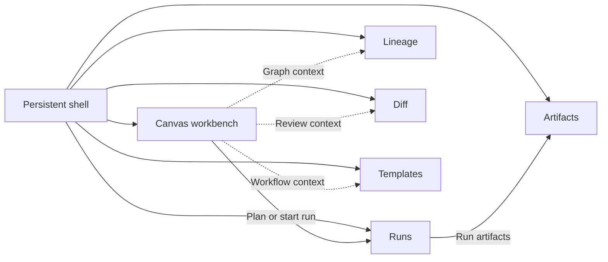
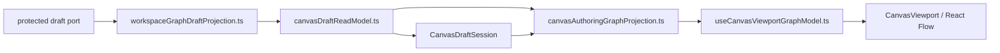
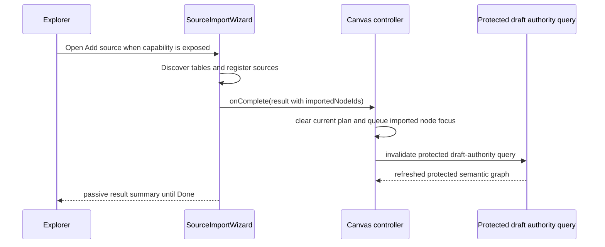
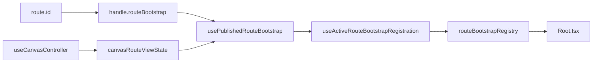

# Canvas Component Map And Modernization Review

## Purpose

This document maps the Canvas route as a component system inside the wider DVT
workbench.

It focuses on:

- UI composition and component ownership
- route startup and shell handoff posture
- modernization decisions about what to keep, what to change, and what to avoid

For aggregate internals, use
[Canvas Draft Session Component](./canvas-draft-session-component.md). For
graph mutation semantics, use
[Canvas Graph Lifecycle Component](./canvas-graph-lifecycle-component.md). For
route-visible posture, use
[Canvas Route Presentation Component](./canvas-route-presentation-component.md).
For route composition and route-owned shell or modal adaptation, use
[Canvas Route Composition Component](./canvas-route-composition-component.md).
For the shell contract and local chrome composition, use
[Canvas Shell Component](./canvas-shell-component.md). For controller-local
layering, use
[Canvas Controller Current To Target Architecture](./canvas-controller-current-to-target-architecture.md).
For the host layer above the route, use
[Canvas Playground Host Component](./canvas-playground-host-component.md).
For authoring-runtime contract and command-side runtime composition, use
[Canvas Authoring Runtime Component](./canvas-authoring-runtime-component.md).
For route-owned Inspector editing, use
[Canvas Inspector Authoring Component](./canvas-inspector-authoring-component.md).
For protected-draft semantic projection and viewport-boundary detail, use
[Canvas Authoring Projection Component](./canvas-authoring-projection-component.md).

## Governing Sources

- [Graph Frontend Architecture](./graph-frontend-architecture.md)
- [Canvas Controller Current To Target Architecture](./canvas-controller-current-to-target-architecture.md)
- [Canvas Authoring Runtime Component](./canvas-authoring-runtime-component.md)
- [Canvas Inspector Authoring Component](./canvas-inspector-authoring-component.md)
- [Canvas Draft Session Component](./canvas-draft-session-component.md)
- [Canvas Handler Contracts Component](./canvas-handler-contracts-component.md)
- [Canvas Graph Lifecycle Component](./canvas-graph-lifecycle-component.md)
- [Canvas Route Presentation Component](./canvas-route-presentation-component.md)
- [Canvas Route Composition Component](./canvas-route-composition-component.md)
- [Canvas Shell Component](./canvas-shell-component.md)
- [Canvas Playground Host Component](./canvas-playground-host-component.md)
- [Canvas Authoring Projection Component](./canvas-authoring-projection-component.md)
- [Graph Route Bootstrap Architecture](./graph-route-bootstrap-architecture.md)
- [Graph Sequences And State Machines](./graph-sequences-and-state-machines.md)

Reading rule:

- use this page for route composition and component ownership
- use `canvas-controller-current-to-target-architecture.md` for seam layering
  inside the controller chain
- use `canvas-route-composition-component.md` for the local route UI component
  contract
- use `canvas-authoring-projection-component.md` for protected-draft semantic
  projection and viewport-boundary detail
- use `canvas-handler-contracts-component.md` for adapter-composition
  vocabulary and namespaced builder APIs
- use `canvas-route-presentation-component.md` for route-visible posture,
  toolbar, banner, center-surface, and bootstrap alignment
- use `canvas-route-composition-component.md` for route composition,
  route-owned shell or modal adaptation, and semantic route fitness functions
- use `canvas-shell-component.md` for grouped `CanvasShell` API ownership,
  local chrome composition, and shell contract invariants
- use `graph-route-bootstrap-architecture.md` for shell contract rules
- use `canvas-draft-session-component.md` for aggregate semantics and state
  transitions

## Canvas In The Workbench

Canvas is the graph-authoring workbench, not the whole frontend.

| Subsystem          | Owns                                                                             | Canvas must not absorb                                       |
| ------------------ | -------------------------------------------------------------------------------- | ------------------------------------------------------------ |
| Shell              | Frame, navigation, platform health, route reveal                                 | Graph semantics and draft truth                              |
| Canvas             | Workflow topology authoring, graph selection, overlays, preview, and run handoff | Full run monitoring, artifact browsing, review-heavy diff UX |
| Runs               | Active and historical run workspaces                                             | Topology editing                                             |
| Lineage            | Read-only dependency and impact analysis                                         | Main authoring flow                                          |
| Diff and Artifacts | Review and inspection density                                                    | Everyday graph interaction                                   |
| Templates          | Future source-generation workbench                                               | Toolbar sprawl and code-generation behavior inside Canvas    |

## Canvas Component Stack

```mermaid
flowchart TB
  Canvas["Canvas.tsx"] --> Content["CanvasContent"]
  Content --> Controller["useCanvasController"]
  Content --> RouteSync["useCanvasRoutePresentationSync"]
  Content --> ShellBuilder["canvasShellPropsBuilder and subbuilders"]
  Content --> ModalBuilder["canvasModalHostPropsBuilder"]
  Content --> ModalHost["CanvasModalHost"]

  Controller --> Shell["CanvasShell"]
  Shell --> Toolbar["CanvasToolbar"]
  Shell --> Center["CanvasCenterSurface and CanvasStateViews"]
  Shell --> Viewport["CanvasViewport"]
  Shell --> Explorer["DbtExplorer"]
  Shell --> Inspector["CanvasInspectorPanel"]
  Shell --> Import["SourceImportWizard"]
  Shell --> Recovery["CanvasRecoveryBanner"]

  Controller --> DraftSession["canvasDraftSession"]
  Controller --> HandlerContracts["handler contracts component"]
  Controller --> GraphLifecycle["canvasGraphLifecycle"]
  Controller --> RoutePresentation["canvas route presentation component"]
  Controller --> GraphHandlers["useCanvasGraphHandlers"]
  Controller --> Execution["useCanvasExecutionActions"]
  Controller --> RouteState["canvasRouteViewState"]
  Controller --> Publisher["usePublishedRouteBootstrap"]
  ModalBuilder --> ModalHost
  ModalHost --> PlanModal["PlanPreviewModal"]

  DraftSession --> Baseline["canvasDraftSessionBaseline"]
  DraftSession --> Machine["canvasDraftSessionMachine"]
  DraftSession --> WorkingSet["canvasDraftSessionWorkingSet"]

  GraphHandlers --> GraphUtils["canvasGraphUtils"]
  Execution --> PlanHandler["useCanvasPlanActionHandler"]
  Execution --> RunHandler["useCanvasRunStartHandler"]
  Publisher --> Registry["routeBootstrapRegistry"]
  Controller --> Services["AppServicesContext and queries"]
```

Reading rule:

- route boundaries are already reasonably mature
- the controller remains the main concentration point
- the safe move is to keep view seams stable and extract graph policy behind a
  dedicated component

## Protected Draft Semantic Graph Seam

The Canvas route now has an explicit semantic projection boundary between the
protected draft contract and the viewport projection.

<!-- markdownlint-disable MD060 -->

| Seam                                | Owns                                                                 | Must not own                                            |
| ----------------------------------- | -------------------------------------------------------------------- | ------------------------------------------------------- |
| `workspaceGraphDraftProjection.ts`  | route-facing projection of protected draft record and semantic graph | React Flow state, route startup, or controller commands |
| `canvasDraftReadModel.ts`           | typed read outcomes and protected semantic graph handoff             | mutation logic or bootstrap publication                 |
| `canvasAuthoringGraphProjection.ts` | semantic composition for active authoring truth                      | React Flow state or controller commands                 |
| `useCanvasViewportGraphModel.ts`    | viewport-ready node and edge projection                              | inventing semantics or re-merging remote authority      |

<!-- markdownlint-enable MD060 -->

Semantic rule:

- when a protected draft record exists, the semantic authoring projection
  composes node and edge semantics from that draft-backed canonical graph
- snapshot-backed graph hydration may supplement only pending local working-set
  additions that are not yet persisted in the protected draft
- the viewport hook may only project already-composed semantic truth into React
  Flow state
- broader snapshot-backed semantic fallback remains transitional support only
  for paths that still need slice-3 deletion and must not override protected
  draft semantics

## Key Responsibilities

<!-- markdownlint-disable MD060 -->

| Element                                      | Primary role                                                               | Must stay out of scope                                                 |
| -------------------------------------------- | -------------------------------------------------------------------------- | ---------------------------------------------------------------------- |
| `Canvas.tsx`                                 | Route entry, provider setup, route composition                             | Draft semantics, inline publication, and inline contract assembly      |
| `useCanvasRoutePresentationSync.ts`          | Route publication and bootstrap synchronization                            | Shell layout composition                                               |
| `canvasModalHostPropsBuilder.ts`             | Route-owned modal-host contract adaptation                                 | Modal rendering or shell contract assembly                             |
| `CanvasModalHost.tsx`                        | Route-owned modal hosting                                                  | Controller-shaped props, shell contract assembly, or route publication |
| `canvasShellPropsBuilder.tsx`                | Route-owned orchestration of the grouped shell contract                    | Controller lifecycle or modal ownership                                |
| shell subbuilders                            | Concern-owned shell contract assembly                                      | Broad route composition or route-composer-sized input bags             |
| `CanvasContent`                              | Route composition seam over the controller facade                          | Deep domain policy                                                     |
| `CanvasShell`                                | Three-panel workbench layout and local chrome                              | Persistence and aggregate truth                                        |
| `CanvasToolbar`                              | Stateless command and toggle surface                                       | Hidden policy or ad hoc route-state logic                              |
| `CanvasCenterSurface` and `CanvasStateViews` | Center-surface rendering for loading, empty, error, and recovery           | Shell reveal ownership                                                 |
| `CanvasViewport`                             | React Flow projection and primitive event boundary                         | Authoring semantics                                                    |
| `DbtExplorer` and `CanvasInspectorPanel`     | Contextual side panels                                                     | Global shell behavior                                                  |
| `useCanvasController`                        | Route application facade                                                   | Mixed persistence, projection, and widget logic in one file            |
| handler-contract component                   | Local adapter-composition vocabulary and seam mapping                      | Owning graph semantics or React hook state                             |
| `canvasDraftSession`                         | Namespaced aggregate API over draft truth                                  | Direct service calls                                                   |
| route-presentation component                 | Canonical route-visible posture across banner, toolbar, and center surface | Raw controller branching or affordance-derived authority               |
| `useCanvasGraphHandlers`                     | Gesture-to-command adapter seam                                            | Duplicate mutation policy                                              |
| `useCanvasExecutionActions`                  | Plan and run handoff composition seam                                      | Graph mutation ownership                                               |
| `usePublishedRouteBootstrap`                 | Publish explicit route startup posture to the shell                        | Re-deriving authoring truth from shell heuristics                      |
| `canvasHostCycleState.ts`                    | Story-shaped host-cycle DTO between canonical posture and workbench render | Becoming a new transport bag or route-authority replacement            |

<!-- markdownlint-enable MD060 -->

## Source Import Handoff

`SourceImportWizard` is a route-owned import workflow, but imported nodes are a
`Canvas` concern as soon as registration succeeds.

That means:

- the explorer may only expose `Add source` when the active route posture and
  runtime capability contract both allow source import;
- `Register data objects` is the semantic commit point for the import flow;
- when the result includes `importedNodeIds`, Canvas applies the handoff
  immediately through `onSourceImportComplete`;
- Canvas now invalidates the protected draft-authority query instead of the
  retired workspace-graph query and focuses imported ids only when that
  authority refreshes with matching nodes;
- when the result contains no new ids, the wizard surfaces an explicit no-op
  result instead of implying a hidden failed mutation;
- the result screen is confirmation and audit context, not a second required
  mutation step;
- the route may still show the result summary and generated YAML files before
  the operator dismisses the modal.

Current truth:

- the active `api` authoring path exposes `Add source` only when route mutation
  posture and an authorized runtime source-import contribution both allow it;
  the contribution invokes the existing protected source-import rails rather
  than duplicating transport reachability as route policy
- the API path owns connection list/create/test, provider-neutral object
  discovery, and source registration; failures remain server-authored and
  fail closed
- `mock` mode is not a substitute active-authoring path or accepted product
  proof for Canvas
- this section documents ownership and handoff semantics; availability remains
  capability- and context-dependent rather than mode folklore

## Startup Contract

Canvas is a `published` route, not a `static` one.

That means:

- the shell must consume explicit startup posture from the route contract
- Canvas must publish loading, recovery, and ready posture deliberately
- `Root.tsx` must not infer Canvas operability from widget-local booleans

Canonical startup rule for this slice:

- `mount != settled`
- Canvas is only ready when its route-level presentation state is ready
- recovery posture is a route fact, not a JSX accident

## Modernization Review

### Keep

- explicit route boundary through `Canvas.tsx` plus `CanvasContent`
- presentational split across `CanvasShell`, `CanvasToolbar`, and
  `CanvasViewport`
- explicit grouped shell contract instead of an anemic flat prop bag or opaque
  view-model bag
- service injection through governed app-service seams
- draft aggregate vocabulary separated from UI components

### Change

- keep shrinking `useCanvasController` and especially
  `useCanvasAuthoringRuntime.ts`
- keep route presentation under the canonical component introduced in
  `TF-E2-F`, and reject any new banner-, toolbar-, or center-surface-specific
  route heuristics
- align capability loading with the governed frontend data-boundary model
- remove duplicate overlay traversal where projection logic overlaps
- keep selection and inspector fallout from growing back into adapter seams
- keep the handler-contract component namespaced and semantically explicit
  rather than drifting back into loose helper exports
- keep route-visible posture under one presentation component instead of
  allowing banner, center surface, and toolbar to branch independently
- keep route composition moving toward named seams such as presentation sync,
  modal hosting, semantic modal-host builders, and concern-scoped shell
  subbuilders instead of one broad route method
- keep host-cycle tests and workbench rendering on top of a stable DTO rather
  than letting transport-shaped setup helpers spread again
- keep draft lifecycle and current-payload seams on semantic DTOs instead of
  flat authoring-runtime parameter bags
- keep Inspector authoring route-owned so the passive `InspectorPanel` does
  not absorb aggregate mutation or route policy

### Avoid

- hiding route contracts behind anonymous view-model bags
- reintroducing parallel retired mutation paths
- moving Monaco-, review-, or artifact-heavy concerns back into Canvas
- letting the shell infer readiness from local widget heuristics

## Validation Focus For Next Iteration

- bootstrap publication lifecycle and teardown behavior
- `useCanvasAuthoringRuntime.ts` size and dependency spread
- handler-contract semantic ownership and namespaced builder API integrity
- overlay traversal duplication and hot-path cost
- selection and inspector command ownership if semantics expand

## Related Pages

- [Canvas Controller Current To Target Architecture](./canvas-controller-current-to-target-architecture.md)
- [Canvas Draft Session Component](./canvas-draft-session-component.md)
- [Canvas Handler Contracts Component](./canvas-handler-contracts-component.md)
- [Canvas Route Composition Component](./canvas-route-composition-component.md)
- [Canvas Route Presentation Component](./canvas-route-presentation-component.md)
- [Canvas Shell Component](./canvas-shell-component.md)
- [Canvas Authoring Projection Component](./canvas-authoring-projection-component.md)
- [Graph Route Bootstrap Architecture](./graph-route-bootstrap-architecture.md)
- [Graph Sequences And State Machines](./graph-sequences-and-state-machines.md)
