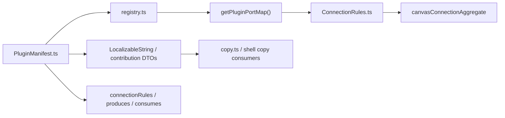
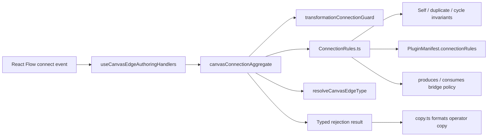
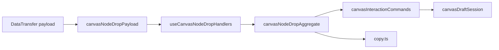
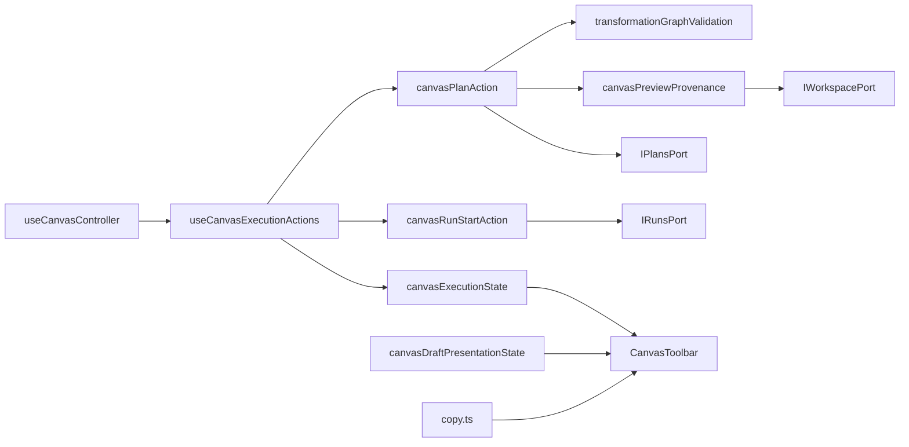

# Canvas Controller Current To Target Architecture

## Purpose

This document is the local architecture source for the Canvas controller slice
in `apps/web`.

It is intentionally narrow:

- current runtime truth for `useCanvasController` and its immediate SRP seams
- the remaining responsibility concentrations still blocking a Fowler-style
  composition facade
- the next extraction order required to reach the TF-E2 target

It is not the place for the full TF-E2 roadmap, route-startup taxonomy, or the
complete DDD/C4 pack. Those live in the canonical companion documents listed
below.

## Canonical Companion Sources

- [TF-E2 Canvas Target Architecture Execution Plan 2026-04-17](../../../../planning/proposals/mandatory/frontend-and-ux/tf-e2-canvas-target-architecture-execution-plan-20260417.md)
- [Graph Route Bootstrap Architecture](./graph-route-bootstrap-architecture.md)
- [Frontend Fowler Implementation Pattern](../frontend-fowler-implementation-pattern.md)
- [Frontend Data Boundary Architecture](../frontend-data-boundary-architecture.md)

Reading rule:

- use this document for the controller-local current/next architecture
- use `TF-E2` for roadmap, backlog, user stories, DDD, C4, sequences, and
  release posture
- use `graph-route-bootstrap-architecture.md` for startup contract rules and
  route publication invariants

## Current Code Anchors

Primary implementation anchors:

- [useCanvasController.ts](../../../../../apps/web/src/app/views/canvas/useCanvasController.ts)
- [useCanvasControllerEnvironment.ts](../../../../../apps/web/src/app/views/canvas/useCanvasControllerEnvironment.ts)
- [useCanvasControllerReadModel.ts](../../../../../apps/web/src/app/views/canvas/useCanvasControllerReadModel.ts)
- [useCanvasAuthoringRuntime.ts](../../../../../apps/web/src/app/views/canvas/useCanvasAuthoringRuntime.ts)
- [useCanvasDraftBaseline.ts](../../../../../apps/web/src/app/views/canvas/useCanvasDraftBaseline.ts)
- [useCanvasAuthoringProjection.ts](../../../../../apps/web/src/app/views/canvas/useCanvasAuthoringProjection.ts)
- [useCanvasSelectionSync.ts](../../../../../apps/web/src/app/views/canvas/useCanvasSelectionSync.ts)
- [useCanvasMutationHandlers.ts](../../../../../apps/web/src/app/views/canvas/useCanvasMutationHandlers.ts)
- [useCanvasGraphChangeHandlers.ts](../../../../../apps/web/src/app/views/canvas/useCanvasGraphChangeHandlers.ts)
- [useCanvasNodeChangeHandlers.ts](../../../../../apps/web/src/app/views/canvas/useCanvasNodeChangeHandlers.ts)
- [useCanvasEdgeChangeHandlers.ts](../../../../../apps/web/src/app/views/canvas/useCanvasEdgeChangeHandlers.ts)
- [useCanvasSourceImportHandlers.ts](../../../../../apps/web/src/app/views/canvas/useCanvasSourceImportHandlers.ts)
- [canvasInteractionCommands.ts](../../../../../apps/web/src/app/views/canvas/canvasInteractionCommands.ts)
- [canvasGraphChangeRuntime.ts](../../../../../apps/web/src/app/views/canvas/canvasGraphChangeRuntime.ts)
- [canvasBackendPosture.ts](../../../../../apps/web/src/app/views/canvas/canvasBackendPosture.ts)
- [canvasAuthoringState.ts](../../../../../apps/web/src/app/views/canvas/canvasAuthoringState.ts)
- [canvasDraftAuthoring.ts](../../../../../apps/web/src/app/views/canvas/canvasDraftAuthoring.ts)
- [canvasDraftRepository.ts](../../../../../apps/web/src/app/views/canvas/canvasDraftRepository.ts)
- [useCanvasDraftLifecycle.ts](../../../../../apps/web/src/app/views/canvas/useCanvasDraftLifecycle.ts)
- [useCanvasDraftBootstrapSync.ts](../../../../../apps/web/src/app/views/canvas/useCanvasDraftBootstrapSync.ts)
- [useCanvasDraftBootstrapping.ts](../../../../../apps/web/src/app/views/canvas/useCanvasDraftBootstrapping.ts)
- [useCanvasDraftInitialBootstrap.ts](../../../../../apps/web/src/app/views/canvas/useCanvasDraftInitialBootstrap.ts)
- [useCanvasDraftMissingRemoteSync.ts](../../../../../apps/web/src/app/views/canvas/useCanvasDraftMissingRemoteSync.ts)
- [useCanvasDraftCanonicalReconcile.ts](../../../../../apps/web/src/app/views/canvas/useCanvasDraftCanonicalReconcile.ts)
- [useCanvasDraftReloadHydration.ts](../../../../../apps/web/src/app/views/canvas/useCanvasDraftReloadHydration.ts)
- [useCanvasDraftPersistence.ts](../../../../../apps/web/src/app/views/canvas/useCanvasDraftPersistence.ts)
- [useCanvasDraftAutosave.ts](../../../../../apps/web/src/app/views/canvas/useCanvasDraftAutosave.ts)
- [canvasDraftAutosaveExecution.ts](../../../../../apps/web/src/app/views/canvas/canvasDraftAutosaveExecution.ts)
- [useCanvasDraftRecoveryActions.ts](../../../../../apps/web/src/app/views/canvas/useCanvasDraftRecoveryActions.ts)
- [canvasDraftLifecycleSnapshot.ts](../../../../../apps/web/src/app/views/canvas/canvasDraftLifecycleSnapshot.ts)
- [canvasDraftPersistenceRuntime.ts](../../../../../apps/web/src/app/views/canvas/canvasDraftPersistenceRuntime.ts)
- [useCanvasDraftAttemptRefs.ts](../../../../../apps/web/src/app/views/canvas/useCanvasDraftAttemptRefs.ts)
- [useCanvasCurrentDraftPayload.ts](../../../../../apps/web/src/app/views/canvas/useCanvasCurrentDraftPayload.ts)
- [canvasDraftSession.ts](../../../../../apps/web/src/app/views/canvas/canvasDraftSession.ts)
- [canvasDraftScope.ts](../../../../../apps/web/src/app/views/canvas/canvasDraftScope.ts)
- [canvasDraftPresentationState.ts](../../../../../apps/web/src/app/views/canvas/canvasDraftPresentationState.ts)
- [useCanvasGraphModel.ts](../../../../../apps/web/src/app/views/canvas/useCanvasGraphModel.ts)
- [useCanvasOverlayModel.ts](../../../../../apps/web/src/app/views/canvas/useCanvasOverlayModel.ts)
- [useCanvasLayoutPersistence.ts](../../../../../apps/web/src/app/views/canvas/useCanvasLayoutPersistence.ts)
- [useCanvasGraphHandlers.ts](../../../../../apps/web/src/app/views/canvas/useCanvasGraphHandlers.ts)
- [ConnectionRules.ts](../../../../../apps/web/src/app/plugins/contracts/ConnectionRules.ts)
- [PluginManifest.ts](../../../../../apps/web/src/app/plugins/contracts/PluginManifest.ts)
- [registry.ts](../../../../../apps/web/src/app/plugins/registry.ts)
- [canvasConnectionAggregate.ts](../../../../../apps/web/src/app/views/canvas/canvasConnectionAggregate.ts)
- [canvasNodeDropAggregate.ts](../../../../../apps/web/src/app/views/canvas/canvasNodeDropAggregate.ts)
- [canvasNodeDropPayload.ts](../../../../../apps/web/src/app/views/canvas/canvasNodeDropPayload.ts)
- [useCanvasNodeAuthoringHandlers.ts](../../../../../apps/web/src/app/views/canvas/useCanvasNodeAuthoringHandlers.ts)
- [useCanvasNodeDropHandlers.ts](../../../../../apps/web/src/app/views/canvas/useCanvasNodeDropHandlers.ts)
- [useCanvasNodeRemovalHandlers.ts](../../../../../apps/web/src/app/views/canvas/useCanvasNodeRemovalHandlers.ts)
- [useCanvasExecutionActions.ts](../../../../../apps/web/src/app/views/canvas/useCanvasExecutionActions.ts)
- [canvasExecutionState.ts](../../../../../apps/web/src/app/views/canvas/canvasExecutionState.ts)
- [canvasPlanAction.ts](../../../../../apps/web/src/app/views/canvas/canvasPlanAction.ts)
- [canvasPreviewProvenance.ts](../../../../../apps/web/src/app/views/canvas/canvasPreviewProvenance.ts)
- [canvasRunStartAction.ts](../../../../../apps/web/src/app/views/canvas/canvasRunStartAction.ts)
- [transformationGraphValidation.ts](../../../../../apps/web/src/app/views/canvas/transformationGraphValidation.ts)
- [useCanvasNavigationActions.ts](../../../../../apps/web/src/app/views/canvas/useCanvasNavigationActions.ts)
- [CanvasToolbar.tsx](../../../../../apps/web/src/app/views/canvas/CanvasToolbar.tsx)
- [copy.ts](../../../../../apps/web/src/app/views/canvas/copy.ts)

## Current Architecture Snapshot

As of 2026-04-18, the SRP split has improved, but the controller chain is not
finished.

### DDD posture

The current slice is moving in the right direction, but only recently became
clear enough to read as DDD rather than just "many smaller hooks".

Current DDD reading for the active Canvas slice:

- `application seams`
  `useCanvasController`, `useCanvasControllerEnvironment`,
  `useCanvasControllerReadModel`, `useCanvasAuthoringRuntime`,
  `useCanvasDraftLifecycle`, `useCanvasDraftPersistence`,
  `useCanvasDraftBootstrapSync`, `useCanvasExecutionActions`,
  `useCanvasMutationHandlers`
- `domain model and domain policies`
  `CanvasDraftSession`, `canvasDraftScope`, `canvasAuthoringState`,
  `canvasBackendPosture`
- `repositories and external boundaries`
  `canvasDraftRepository`, `IWorkspacePort`,
  `IWorkspaceGraphDraftAuthoringPort`, workspace snapshot and draft contracts
- `projections and presentation models`
  `useCanvasAuthoringProjection`, `useCanvasGraphModel`,
  `useCanvasOverlayModel`, `useCanvasControllerReadModel`,
  `useCanvasCurrentDraftPayload`, `canvasExecutionState`
- `adapters and route-facing composition`
  `useCanvasControllerEnvironment`, `useCanvasNavigationActions`,
  `useCanvasLayoutPersistence`, `useCanvasGraphHandlers`

The main DDD drift that remained was in `useCanvasAuthoringRuntime`: it still
hid persisted draft baseline access and graph projection assembly inside one
authoring seam. That drift is now reduced by extracting
`useCanvasDraftBaseline` and `useCanvasAuthoringProjection`.

Implemented seams:

- `useCanvasControllerEnvironment`
  owns route-local service, capability, config, graph-strategy, and store
  wiring before the controller composes deeper seams
- `useCanvasControllerReadModel`
  owns controller-local read-model derivation for validation, impacted nodes,
  and inspector projection
- `useCanvasAuthoringRuntime`
  is now the Canvas authoring application seam over draft baseline,
  authoring projection, lifecycle composition, and domain-policy derivation
- `useCanvasDraftBaseline`
  owns persisted draft baseline access over the repository and query client
- `useCanvasAuthoringProjection`
  owns graph projection and canonical snapshot assembly for the current
  working set
- `useCanvasSelectionSync`
  owns selected-node and inspector reconciliation between the store and the
  UI scope
- `useCanvasMutationHandlers`
  is now a composition seam over graph-change and source-import handlers
- `useCanvasGraphChangeHandlers`
  is now a composition seam over node and edge handlers
- `canvasInteractionCommands`
  now owns write-side working-set command policy for remove-node, visible-edge
  replacement, explicit-node admission, and source-import queueing
- `useCanvasNodeChangeHandlers`
  owns node-change adapter translation and delegates remove-node policy to the
  centralized command catalog
- `useCanvasEdgeChangeHandlers`
  owns edge-change adapter translation and delegates visible-edge replacement
  to the centralized command catalog
- `useCanvasSourceImportHandlers`
  owns source-import aftermath, focus handoff, and workspace-graph refresh
  while delegating aggregate mutation to the centralized command catalog
- `canvasBackendPosture`
  owns backend readiness, blocked-backend copy, and mutation posture
- `canvasAuthoringState`
  owns visible scope, execution scope, recovery flags, and local mutation
  gating
- `canvasDraftRepository`
  owns graph snapshot access over `IWorkspacePort` and draft read/write over
  `IWorkspaceGraphDraftAuthoringPort`
- `useCanvasDraftLifecycle`
  is now a composition seam over draft refs, draft payload projection,
  bootstrap sync, and persistence
- `useCanvasDraftBootstrapping`
  is now a composition seam over initial bootstrap and missing-remote sync
- `useCanvasDraftInitialBootstrap`
  owns the first draft-session transition from remote draft or canonical
  snapshot into the editing aggregate
- `useCanvasDraftMissingRemoteSync`
  owns post-bootstrap missing-remote detection and local reset
- `useCanvasDraftAutosave`
  owns autosave scheduling over persistence-readiness, debounce, and save
  eligibility checks
- `canvasDraftAutosaveExecution`
  owns save-attempt execution plus conflict, success, and failure resolution
- `useCanvasGraphModel`
  owns canonical graph hydration and identity maps
- `useCanvasOverlayModel`
  owns overlay decoration projection
- `useCanvasLayoutPersistence`
  owns viewport and node-position persistence
- `useCanvasGraphHandlers`
  is now a composition seam over edge authoring, selection, layout, and node
  authoring handlers
- `canvasConnectionAggregate`
  owns pure connection proposal and confirmation policy over canonical nodes,
  plugin port rules, and transformation guards, returning typed rejection
  outcomes instead of Canvas-visible strings
- `ConnectionRules.ts`
  owns shell-level connection policy over non-overridable graph invariants,
  plugin-local connection rules, and cross-plugin data-port bridges
- `canvasNodeDropAggregate`
  owns pure canonical-node admission and projection policy for drop-driven
  authoring
- `canvasNodeDropPayload`
  owns canonical drag payload parsing and validation before drop admission is
  evaluated
- `useCanvasNodeAuthoringHandlers`
  is now a composition seam over node drop and node removal handlers
- `useCanvasNodeDropHandlers`
  owns drag/drop adapter translation and delegates canonical-node admission
  policy to `canvasNodeDropAggregate`
- `useCanvasNodeRemovalHandlers`
  owns deferred node disposal and the coordinated working-set fallout
- `copy.ts`
  owns locale-resolved Canvas operator copy and shared formatting for
  route-state labels, mutation toasts, typed connection rejections,
  validation-summary codes, and limited-access messages
- `useCanvasExecutionActions`
  owns plan and run orchestration
- `canvasExecutionState`
  owns route-local execution readiness, preview staleness, and start-run
  availability derivation over plan readiness plus transformation validation
- `canvasPlanAction`
  owns plan-preview command execution over validation, provenance resolution,
  graph-source assembly, and planner invocation
- `canvasPreviewProvenance`
  owns preview provenance resolution over scoped transform selection, Git
  readiness, workspace artifact reads, and graph artifact persistence
- `canvasRunStartAction`
  owns start-run command execution over plan readiness and run service
  invocation
- `transformationGraphValidation`
  owns pure transformation-graph validation over scoped subgraph selection,
  role validation, edge-order invariants, and draft-signature derivation
- `CanvasToolbar`
  owns visual composition of toolbar actions and draft-status presentation
  over route-local presentation state
- `useCanvasNavigationActions`
  owns route-only navigation side effects

Remaining concentration:

- `useCanvasAuthoringRuntime`
  still assembles several authoring concerns and remains the heaviest runtime
  seam in the chain

## Current Topology

```mermaid
flowchart TB
  Environment["useCanvasControllerEnvironment"] --> Controller["useCanvasController"]
  Runtime["useCanvasAuthoringRuntime"] --> Controller["useCanvasController"]
  ReadModel["useCanvasControllerReadModel"] --> Controller
  Selection["useCanvasSelectionSync"] --> Controller
  Mutations["useCanvasMutationHandlers"] --> Controller
  Overlay["useCanvasOverlayModel"] --> Controller
  Layout["useCanvasLayoutPersistence"] --> Controller
  Handlers["useCanvasGraphHandlers"] --> Controller
  Execution["useCanvasExecutionActions"] --> Controller
  Navigation["useCanvasNavigationActions"] --> Execution

  Runtime --> Backend["canvasBackendPosture"]
  Runtime --> DraftRepo["canvasDraftRepository"]
  Runtime --> DraftBaseline["useCanvasDraftBaseline"]
  Runtime --> GraphModel["useCanvasGraphModel"]
  Runtime --> AuthoringProjection["useCanvasAuthoringProjection"]
  Runtime --> Lifecycle["useCanvasDraftLifecycle"]
  Runtime --> Authoring["canvasAuthoringState"]
  Handlers["useCanvasGraphHandlers"] --> EdgeAuthoring["useCanvasEdgeAuthoringHandlers"]
  Handlers["useCanvasGraphHandlers"] --> SelectionHandlers["useCanvasSelectionHandlers"]
  Handlers["useCanvasGraphHandlers"] --> LayoutHandlers["useCanvasLayoutHandlers"]
  Handlers["useCanvasGraphHandlers"] --> NodeAuthoring["useCanvasNodeAuthoringHandlers"]
  EdgeAuthoring --> Commands["canvasInteractionCommands"]
  NodeAuthoring --> NodeDrop["useCanvasNodeDropHandlers"]
  NodeAuthoring --> NodeRemoval["useCanvasNodeRemovalHandlers"]
  NodeDrop --> Commands
  NodeRemoval --> Commands
  Mutations --> GraphChanges["useCanvasGraphChangeHandlers"]
  GraphChanges --> NodeChanges["useCanvasNodeChangeHandlers"]
  GraphChanges --> EdgeChanges["useCanvasEdgeChangeHandlers"]
  Mutations --> SourceImport["useCanvasSourceImportHandlers"]
  NodeChanges --> Commands
  EdgeChanges --> Commands
  SourceImport --> Commands
  SourceImport --> Commands
  Lifecycle --> Bootstrap["useCanvasDraftBootstrapSync"]
  Lifecycle --> Persistence["useCanvasDraftPersistence"]
  Bootstrap --> DraftBootstrap["useCanvasDraftBootstrapping"]
  DraftBootstrap --> InitialBootstrap["useCanvasDraftInitialBootstrap"]
  DraftBootstrap --> MissingRemote["useCanvasDraftMissingRemoteSync"]
  Bootstrap --> DraftReconcile["useCanvasDraftCanonicalReconcile"]
  Bootstrap --> ReloadHydration["useCanvasDraftReloadHydration"]
  Persistence --> Autosave["useCanvasDraftAutosave"]
  Autosave --> AutosaveExecution["canvasDraftAutosaveExecution"]
  Persistence --> Recovery["useCanvasDraftRecoveryActions"]
  Autosave --> DraftSession["canvasDraftSession"]
  DraftBootstrap --> DraftSession
  DraftSession --> Scope["canvasDraftScope"]
  Scope --> Authoring
```

## Authoring Policy Slice

The local edge-authoring, drop-admission, preview-provenance, execution, and
toolbar slice now reads as a small bounded subsystem inside the wider Canvas
route.

### Plugin contract path

This path explains where `PluginManifest.ts` sits in the slice and where its
responsibility ends.

Reading rule:

- `PluginManifest.ts` owns declaration vocabulary and capability metadata
- `registry.ts` owns static plugin composition and runtime filtering
- `ConnectionRules.ts` owns graph-policy evaluation over those declarations
- `canvasConnectionAggregate` owns application-facing authoring outcomes

### Connection policy path

This path covers edge proposal, policy evaluation, and typed rejection.

Reading rule:

- `canvasConnectionAggregate` is the application-facing policy seam
- `ConnectionRules.ts` is the pure connection-rule engine
- `copy.ts` is the only owner of Canvas-visible messaging

### Node drop admission path

This path covers drag payload normalization before drop admission mutates local
working state.

Reading rule:

- payload parsing is separate from admission policy
- admission policy is separate from UI event translation
- working-set mutation still flows through the centralized command seam

### Preview and execution path

This path covers plan preview, provenance, run-start gating, and toolbar
presentation.

Reading rule:

- `canvasExecutionState` is query and presentation-state derivation
- `canvasPlanAction` and `canvasRunStartAction` are command seams
- `canvasPreviewProvenance` is a query-plus-artifact orchestration seam, not a
  view concern
- `CanvasToolbar` is presentation composition only

## Responsibility Map For The Local Slice

| Concern                           | Owner module                    | Responsibility boundary                                                                                             | Must not own                                                                 |
| --------------------------------- | ------------------------------- | ------------------------------------------------------------------------------------------------------------------- | ---------------------------------------------------------------------------- |
| plugin declaration contract       | `PluginManifest.ts`             | plugin capability vocabulary, contribution DTOs, lifecycle-aware manifest shape, and cross-plugin port declarations | registry composition, graph-policy execution, or Canvas-visible copy         |
| shell connection invariants       | `ConnectionRules.ts`            | self-connection, duplicate-edge, cycle, plugin rules, bridge compatibility                                          | toasts, edge creation, React Flow events                                     |
| edge authoring application policy | `canvasConnectionAggregate`     | propose or confirm connection, map typed rule failures to Canvas rejections                                         | low-level graph traversal or operator copy                                   |
| transformation preview validity   | `transformationGraphValidation` | select scoped graph, validate roles and edge order, derive stable summary codes                                     | localized strings or toolbar rendering                                       |
| preview provenance                | `canvasPreviewProvenance`       | resolve transform SQL artifact, graph artifact persistence, provenance payload assembly                             | planner invocation or toolbar state                                          |
| plan command                      | `canvasPlanAction`              | validation gate, provenance resolution, planner preview call                                                        | route rendering or operator messaging beyond returned command outcomes       |
| run command                       | `canvasRunStartAction`          | start-run gate and run invocation                                                                                   | toolbar state or direct UI feedback                                          |
| execution presentation state      | `canvasExecutionState`          | start-run availability, preview staleness, plan summary derivation                                                  | transport calls or persistence                                               |
| drag payload normalization        | `canvasNodeDropPayload`         | JSON parse, canonical payload validation, typed node assembly                                                       | canvas-node admission policy or draft mutation                               |
| node drop application policy      | `canvasNodeDropAggregate`       | drop admission and projected node insertion outcome                                                                 | DOM events or `DataTransfer` reads                                           |
| toolbar composition               | `CanvasToolbar`                 | compose controls from presentation state and command callbacks                                                      | execution policy, graph validation, provenance resolution, or draft mutation |

## Fowler Comparison

This local slice is not a textbook Fowler route in the "remote read model"
sense from the generic frontend pattern. It is a route-local authoring context
with tactical CQRS and pure domain-policy seams. The right comparison is
therefore "Fowler-compatible local composition", not "copy the runs route
verbatim".

### Current fit against the Fowler pattern

| Fowler layer             | Current Canvas slice                                                                                 | Fit     |
| ------------------------ | ---------------------------------------------------------------------------------------------------- | ------- |
| `Gateway`                | `IWorkspacePort`, `IPlansPort`, `IRunsPort`; plugin port map from `registry.ts`                      | partial |
| `Assembler / mapper`     | `canvasNodeDropPayload`, `canvasPreviewProvenance`, `transformationGraphValidation`                  | partial |
| `Service Layer / facade` | `useCanvasExecutionActions`, `canvasPlanAction`, `canvasRunStartAction`, `canvasConnectionAggregate` | strong  |
| `Presentation model`     | `canvasExecutionState`, `canvasDraftPresentationState`                                               | strong  |
| `View / controller hook` | `CanvasToolbar`, `useCanvasEdgeAuthoringHandlers`, `useCanvasNodeDropHandlers`                       | strong  |

### Where the Canvas slice already matches Fowler well

- route-facing hooks compose narrow seams instead of performing transport and
  policy work inline
- command paths are explicit:
  `canvasPlanAction`, `canvasRunStartAction`, `canvasConnectionAggregate`
- presentation state is explicit:
  `canvasExecutionState`, `canvasDraftPresentationState`
- UI copy is centralized in `copy.ts` instead of leaking into domain-policy
  helpers

### Where the Canvas slice intentionally differs from generic Fowler

- part of the logic is pure local domain policy, not gateway or DTO assembly:
  `ConnectionRules.ts`, `canvasConnectionAggregate`,
  `transformationGraphValidation`, `canvasNodeDropAggregate`
- the route owns a local authoring aggregate and command catalog, so tactical
  CQRS matters as much as the classic service-layer split
- plugin contracts act as a local declaration boundary, so not every seam is an
  HTTP or API gateway seam; `PluginManifest.ts` is closer to a static contract
  module than to a runtime gateway

### Remaining drift against the Fowler target

- `useCanvasExecutionActions` still coordinates several command and
  presentation concerns and remains a route-local facade that can likely split
  further once TF-E2 stabilizes
- `CanvasToolbar` is much cleaner than before but is still a substantial
  presentational composition seam rather than a tiny dumb widget
- plugin port-map assembly still lives in `registry.ts`; if the plugin system
  deepens further, that map may deserve its own local query surface

### Fowler conclusion

The local Canvas slice is now best described as:

- `DDD + tactical CQRS + hexagonal` in its authoring core
- `Fowler-compatible facade and presentation-model layering` at the route edge

That is the correct posture for this route. Forcing the whole slice into a
generic gateway-assembler-facade-only template would hide the real local
authoring domain instead of clarifying it.

## Current Responsibility Inventory

| Module                            | Current responsibility                                                                                                                                | Current problem                                                    |
| --------------------------------- | ----------------------------------------------------------------------------------------------------------------------------------------------------- | ------------------------------------------------------------------ |
| `useCanvasController`             | route-facing composition facade over environment, runtime, selection, mutation, overlays, handlers, layout, execution, and final contract publication | much thinner than before, but still returns a large route contract |
| `useCanvasControllerEnvironment`  | route-local service, capability, config, strategy, and store wiring                                                                                   | acceptable environment seam                                        |
| `useCanvasControllerReadModel`    | controller-local validation, impacted-node projection, and inspector projection                                                                       | acceptable read-model seam                                         |
| `useCanvasAuthoringRuntime`       | authoring application seam over baseline, projection, lifecycle, and domain-policy derivation                                                         | still broad enough to be the next likely split point               |
| `useCanvasDraftBaseline`          | persisted draft baseline query and repository access                                                                                                  | acceptable baseline seam                                           |
| `useCanvasAuthoringProjection`    | graph projection and canonical snapshot assembly                                                                                                      | acceptable projection seam                                         |
| `useCanvasMutationHandlers`       | composition seam over graph-change and source-import hooks                                                                                            | acceptable composition seam                                        |
| `useCanvasGraphChangeHandlers`    | composition seam over node and edge handlers                                                                                                          | acceptable composition seam                                        |
| `canvasInteractionCommands`       | centralized working-set command catalog for remove, admit, import, and edge updates                                                                   | acceptable command seam; UI commands still stay local              |
| `useCanvasGraphHandlers`          | composition seam over graph interaction adapters                                                                                                      | acceptable composition seam                                        |
| `canvasConnectionAggregate`       | pure connection proposal and confirmation policy over canonical graph context, with typed rejection outcomes                                          | acceptable pure edge-authoring policy seam                         |
| `canvasNodeDropAggregate`         | pure dropped-node admission policy and canvas-node projection                                                                                         | acceptable pure node-admission policy seam                         |
| `useCanvasNodeAuthoringHandlers`  | composition seam over node-drop and node-removal handlers                                                                                             | acceptable composition seam                                        |
| `useCanvasNodeDropHandlers`       | drag/drop adapter translation and explicit-node admission fallout via `canvasNodeDropAggregate`                                                       | acceptable node-drop adapter                                       |
| `useCanvasNodeRemovalHandlers`    | deferred remove-node adapter translation and coordinated UI fallout                                                                                   | acceptable node-removal adapter                                    |
| `copy.ts`                         | centralized locale-resolved operator copy plus shared formatting of typed rejections and validation-summary codes                                     | acceptable copy seam; keep visible Canvas strings out of handlers  |
| `useCanvasNodeChangeHandlers`     | node-change adapter translation plus selection or inspector fallout application                                                                       | acceptable node-mutation adapter                                   |
| `useCanvasEdgeChangeHandlers`     | edge-change adapter translation                                                                                                                       | acceptable edge-mutation adapter                                   |
| `useCanvasSourceImportHandlers`   | source-import aftermath, focus handoff, graph refresh, and command invocation                                                                         | acceptable import-aftereffect seam                                 |
| `useCanvasDraftLifecycle`         | lifecycle composition seam for refs, payload, bootstrap sync, and persistence                                                                         | acceptable composition seam                                        |
| `useCanvasDraftBootstrapSync`     | composition seam over reload hydration, bootstrapping, and canonical reconcile                                                                        | acceptable composition seam                                        |
| `useCanvasDraftPersistence`       | composition seam over autosave and recovery actions                                                                                                   | acceptable composition seam                                        |
| `useCanvasDraftAutosave`          | autosave scheduling over persistence readiness, debounce, and save eligibility                                                                        | acceptable scheduling seam                                         |
| `canvasDraftAutosaveExecution`    | save-attempt execution and result resolution                                                                                                          | acceptable pure runtime seam                                       |
| `useCanvasDraftBootstrapping`     | composition seam over narrow bootstrap policies                                                                                                       | acceptable composition seam                                        |
| `useCanvasDraftInitialBootstrap`  | first transition from remote draft or canonical snapshot into editing state                                                                           | acceptable bootstrap transition seam                               |
| `useCanvasDraftMissingRemoteSync` | post-bootstrap remote-missing detection and local reset                                                                                               | acceptable lifecycle recovery seam                                 |
| `canvasBackendPosture`            | pure backend posture derivation                                                                                                                       | acceptable as a pure policy seam                                   |
| `canvasAuthoringState`            | pure authoring and recovery posture derivation                                                                                                        | acceptable as a pure policy seam                                   |

## Current Drifts

These are the drifts this document currently tracks.

### 1. Authoring runtime assembly is still too broad

`useCanvasAuthoringRuntime` still owns:

- `draftSession` state creation
- lifecycle composition
- authoring-state derivation
- baseline and projection orchestration

That makes it the next likely seam to split once the current refactor settles.

### 2. Selection and inspector commands are still adapter-local

The working-set command catalog now exists and the old duplicated write paths
have been removed, but two route-local UI commands still live only inside the
graph adapter seam:

- `toggleNodeSelection`
- `inspectNode`

That is acceptable while they remain pure UI fallout, but it is still the next
potential concentration point if their semantics grow:

- selection and inspector behavior are still owned by the graph event adapter
- the command catalog does not yet expose an explicit UI command layer beside
  the working-set catalog
- future route-local authoring semantics should not expand directly back into
  `useCanvasGraphHandlers`

The hard-cut command centralization landed first because it removed actual
duplicated write authority. The remaining UI command split is a narrower
follow-up concern.

## Target DDD / CQRS / Hexagonal Posture

The target for this slice is explicit:

- `DDD`
  treat Canvas authoring as one bounded local context inside the wider Graph
  frontend surface
- `CQRS`
  split working-set mutation commands from route-local query and projection
  models
- `hexagonal`
  keep React Flow and route UI as inbound adapters, and keep workspace or plan
  services behind outbound ports

### No Retrocompatibility Posture

This target is a hard-cut target, not a compatibility-preserving migration
shape.

Accepted direction:

- old mixed command paths inside adapter hooks may be removed
- duplicated mutation policy between `useCanvasGraphHandlers` and
  `useCanvasNodeChangeHandlers` may be collapsed into one command seam
- route-local command ownership is allowed to move as long as
  `CanvasDraftSession` remains the authoritative local aggregate

Rejected direction:

- preserve legacy adapter-local mutation paths just because they already exist
- keep both `graphModel` writes and draft-session writes as peer semantic
  authorities
- add transitional compatibility shims that re-expand command policy into
  several hooks again

### Target Bounded Local Context

The Canvas slice should be read through five tactical layers.

| Layer                             | Owned modules                                                                                                                                                 | Responsibility                                                                            | Must not own                                                      |
| --------------------------------- | ------------------------------------------------------------------------------------------------------------------------------------------------------------- | ----------------------------------------------------------------------------------------- | ----------------------------------------------------------------- |
| `domain aggregate`                | `canvasDraftSession.ts`, `canvasDraftScope.ts`, `canvasAuthoringState.ts`, `canvasBackendPosture.ts`                                                          | route-local authoring truth, working-set semantics, policy derivation, recovery posture   | React Flow event semantics, service wiring, transport handling    |
| `command application seam`        | `useCanvasAuthoringRuntime.ts`, `useCanvasMutationHandlers.ts`, `canvasInteractionCommands.ts`                                                                | execute authoring commands against the aggregate and coordinate write-side fallout        | render projection, shell startup posture, direct widget ownership |
| `query / projection seam`         | `useCanvasGraphModel.ts`, `useCanvasAuthoringProjection.ts`, `useCanvasOverlayModel.ts`, `useCanvasControllerReadModel.ts`, `useCanvasCurrentDraftPayload.ts` | derive visible graph, overlays, validation, inspector view, and authoritative route scope | mutation policy, persistence write orchestration                  |
| `inbound adapters`                | `useCanvasGraphHandlers.ts`, `useCanvasNodeChangeHandlers.ts`, `useCanvasEdgeChangeHandlers.ts`, `useCanvasSourceImportHandlers.ts`, route UI components      | translate React Flow and route gestures into commands                                     | local domain policy, duplicate aggregate mutation logic           |
| `outbound ports and repositories` | `canvasDraftRepository.ts`, `IWorkspacePort`, `IWorkspaceGraphDraftAuthoringPort`, plan or run service ports                                                  | canonical snapshot read, typed persisted draft boundary, preview and run handoff          | route-local state truth                                           |

### Target Command Catalog

The command side should become explicit and centralized around one local command
catalog instead of being spread across handlers.

Target owner:

- `canvasInteractionCommands.ts`

This module is a pure application-domain seam. It is not a React hook and it is
not a transport adapter.

Initial command catalog:

| Command                    | Current triggering adapters                                     | Target centralized owner                                           | Aggregate authority                                             |
| -------------------------- | --------------------------------------------------------------- | ------------------------------------------------------------------ | --------------------------------------------------------------- |
| `removeNodeFromWorkingSet` | `useCanvasNodeRemovalHandlers`, `useCanvasNodeChangeHandlers`   | `canvasInteractionCommands.ts`                                     | `CanvasDraftSession`                                            |
| `replaceVisibleEdges`      | `useCanvasEdgeAuthoringHandlers`, `useCanvasEdgeChangeHandlers` | `canvasInteractionCommands.ts`                                     | `CanvasDraftSession`                                            |
| `admitExplicitNode`        | `useCanvasNodeDropHandlers`                                     | `canvasInteractionCommands.ts`                                     | `CanvasDraftSession`                                            |
| `importSourceNodes`        | `useCanvasSourceImportHandlers`                                 | `canvasInteractionCommands.ts`                                     | `CanvasDraftSession`                                            |
| `toggleNodeSelection`      | `useCanvasSelectionHandlers`                                    | `canvasInteractionCommands.ts` or a narrow adjacent command helper | route-local UI command state coordinated with aggregate fallout |
| `inspectNode`              | `useCanvasSelectionHandlers`                                    | command helper beside `canvasInteractionCommands.ts`               | route-local UI command state coordinated with query freshness   |

Command rules:

- commands may update aggregate state, visible graph write-side state, and
  route-local UI fallout in one coordinated result
- commands must not call transport or persistence directly
- commands must be pure or near-pure orchestration helpers so they can be
  validated without React Flow

### Target Query Catalog

The query side already exists and should stay split by projection concern
instead of collapsing into one read mega-service.

| Query / projection             | Current owner                                                             | Responsibility                                           | Authoritative source                      |
| ------------------------------ | ------------------------------------------------------------------------- | -------------------------------------------------------- | ----------------------------------------- |
| `graph hydration`              | `useCanvasGraphModel.ts`                                                  | React Flow nodes, edges, canonical node maps             | canonical snapshot + draft working set    |
| `authoring projection`         | `useCanvasAuthoringProjection.ts`                                         | current working graph plus canonical snapshot assembly   | `CanvasDraftSession` + canonical snapshot |
| `controller read model`        | `useCanvasControllerReadModel.ts`                                         | inspector projection, impacted nodes, validation surface | query seams only                          |
| `overlay projection`           | `useCanvasOverlayModel.ts`                                                | execution or cost overlays                               | canonical nodes, current run, permissions |
| `draft payload projection`     | `useCanvasCurrentDraftPayload.ts`                                         | save-ready payload shape                                 | `CanvasDraftSession`                      |
| `startup and recovery posture` | `useCanvasSelectionSync.ts`, route bootstrap stack, controller read model | published route startup posture and recovery visibility  | route-local read models, not widget state |

Query rules:

- projections are never semantic authority
- React Flow state is a projection and interaction medium, not the source of
  authoring truth
- if a new view concern appears, add it to a query seam instead of teaching a
  command module to answer read questions

## Target Shape For This Document

This document freezes only the controller-local target.

The target is:

- `useCanvasController`
  becomes a thin route composition facade
- `useCanvasControllerEnvironment`
  owns route-local dependency and config wiring
- `useCanvasControllerReadModel`
  owns controller-local read-model derivation and presentation projection
- `useCanvasAuthoringRuntime`
  remains the authoring application seam, but can later split again if
  lifecycle orchestration and draft-session ownership continue to grow
- `useCanvasDraftBaseline`
  owns persisted draft baseline access as a separate boundary seam
- `useCanvasAuthoringProjection`
  owns graph projection and canonical snapshot assembly as a separate
  projection seam
- `useCanvasSelectionSync`
  becomes the owner of store-selection and inspector synchronization
- `useCanvasMutationHandlers`
  remains a composition seam only and delegates mutation policy to the
  centralized command catalog
- `useCanvasGraphChangeHandlers`
  remains a composition seam only
- `useCanvasNodeChangeHandlers`
  becomes an inbound adapter over node-change callbacks and delegates
  remove-node policy to the centralized command catalog
- `useCanvasEdgeChangeHandlers`
  becomes an inbound adapter over edge-change callbacks and delegates edge
  replacement policy to the centralized command catalog
- `useCanvasSourceImportHandlers`
  becomes an inbound adapter over source-import aftermath callbacks and
  delegates import-side aggregate mutation to the centralized command catalog
- `useCanvasDraftLifecycle`
  remains a composition seam only
- `useCanvasDraftBootstrapSync`
  becomes a composition seam over narrower bootstrap policies
- `useCanvasDraftPersistence`
  becomes a composition seam over narrower autosave and recovery policies

## Target Local Topology

```mermaid
flowchart TB
  Environment["useCanvasControllerEnvironment"] --> Controller["useCanvasController facade"]
  ReadModel["useCanvasControllerReadModel"] --> Controller
  Controller["useCanvasController facade"] --> Runtime["useCanvasAuthoringRuntime"]
  Controller --> Selection["useCanvasSelectionSync"]
  Controller --> Mutations["useCanvasMutationHandlers"]
  Controller --> Overlay["useCanvasOverlayModel"]
  Controller --> Layout["useCanvasLayoutPersistence"]
  Controller --> Handlers["useCanvasGraphHandlers"]
  Controller --> Execution["useCanvasExecutionActions"]
  Handlers --> EdgeAuthoring["useCanvasEdgeAuthoringHandlers"]
  Handlers --> SelectionHandlers["useCanvasSelectionHandlers"]
  Handlers --> LayoutHandlers["useCanvasLayoutHandlers"]
  Handlers --> NodeAuthoring["useCanvasNodeAuthoringHandlers"]
  Mutations --> GraphChanges["useCanvasGraphChangeHandlers"]
  GraphChanges --> NodeChanges["useCanvasNodeChangeHandlers"]
  GraphChanges --> EdgeChanges["useCanvasEdgeChangeHandlers"]
  Mutations --> SourceImport["useCanvasSourceImportHandlers"]

  Runtime --> Backend["canvasBackendPosture"]
  Runtime --> DraftBaseline["useCanvasDraftBaseline"]
  Runtime --> GraphModel["useCanvasGraphModel"]
  Runtime --> AuthoringProjection["useCanvasAuthoringProjection"]
  Runtime --> Lifecycle["useCanvasDraftLifecycle"]
  Runtime --> Authoring["canvasAuthoringState"]
  Mutations --> Commands["canvasInteractionCommands"]
  EdgeAuthoring --> Commands
  NodeAuthoring --> NodeDrop["useCanvasNodeDropHandlers"]
  NodeAuthoring --> NodeRemoval["useCanvasNodeRemovalHandlers"]
  NodeDrop --> Commands
  NodeRemoval --> Commands
  NodeChanges --> Commands
  EdgeChanges --> Commands
  SourceImport --> Commands

  Lifecycle --> Bootstrap["useCanvasDraftBootstrapSync"]
  Lifecycle --> Persistence["useCanvasDraftPersistence"]
  Bootstrap --> DraftBootstrap["useCanvasDraftBootstrapping"]
  DraftBootstrap --> InitialBootstrap["useCanvasDraftInitialBootstrap"]
  DraftBootstrap --> MissingRemote["useCanvasDraftMissingRemoteSync"]
  Bootstrap --> DraftReconcile["useCanvasDraftCanonicalReconcile"]
  Bootstrap --> ReloadHydration["useCanvasDraftReloadHydration"]
  Persistence --> Autosave["useCanvasDraftAutosave"]
  Autosave --> AutosaveExecution["canvasDraftAutosaveExecution"]
  Persistence --> Recovery["useCanvasDraftRecoveryActions"]
```

## Extraction Order

The next slices should follow this order.

1. Shrink `useCanvasAuthoringRuntime`
   Keep it as the application seam only. If it grows again, split lifecycle
   orchestration or draft-session ownership, not baseline or projection.

2. Extend the centralized command catalog only when semantics become shared
   `canvasInteractionCommands.ts` is now the owner of current working-set
   mutation semantics. If new shared write behavior appears, extend that
   catalog instead of re-expanding `useCanvasGraphHandlers.ts`,
   `useCanvasNodeChangeHandlers.ts`, `useCanvasEdgeChangeHandlers.ts`, or
   import adapters.

3. Keep bootstrap policies split
   Extend `useCanvasDraftInitialBootstrap.ts` or
   `useCanvasDraftMissingRemoteSync.ts` instead of re-expanding
   `useCanvasDraftBootstrapping.ts`.

4. Keep autosave execution pure
   If save-attempt policy grows again, extend
   `canvasDraftAutosaveExecution.ts` or adjacent pure helpers instead of
   re-expanding `useCanvasDraftAutosave.ts`.

5. Keep query seams projection-only
   Add new visible-state or validation concerns to
   `useCanvasControllerReadModel.ts`, `useCanvasOverlayModel.ts`, or adjacent
   query seams instead of teaching command modules to answer read concerns.

6. Keep adapters thin
   If import aftermath or graph-change policy grows again, extend
   the centralized command catalog or a pure query seam instead of
   re-expanding `useCanvasMutationHandlers.ts`,
   `useCanvasGraphChangeHandlers.ts`, or adapter-facing hooks.

## Invariants To Preserve

- `CanvasDraftSession` remains the authoritative route-local draft aggregate
- working-set mutations flow through one local command authority instead of
  several adapter-local implementations
- workspace snapshot remains the authoritative canonical graph member set
- persisted remote draft remains the authoritative saved baseline
- overlays remain projections and never mutate canonical graph truth
- layout persistence remains blocked until hydration and graph-readiness are
  safe
- plan preview and run start consume authoritative route scope, not visual-only
  state
- route startup publication remains governed by
  `graph-route-bootstrap-architecture.md`, not by controller-local heuristics

## Out Of Scope For This Document

This document does not define:

- the full TF-E2 roadmap or release order
- the complete DDD context map or C4 model
- shell bootstrap route classification
- per-route startup matrix
- product backlog for Inspector, artifacts, diff, or other routes

Those concerns already have canonical homes in the companion sources.

## Acceptance Posture

This document is current only if all of the following remain true:

- the code anchors above still match the active Canvas controller chain
- the `Current Drifts` section names real unresolved concentrations
- no route-bootstrap rule is duplicated here when it already belongs to
  `graph-route-bootstrap-architecture.md`
- no roadmap, story-map, or C4 detail is duplicated here when it already
  belongs to `TF-E2`

If those statements stop being true, update this document by shrinking or
redirecting, not by re-accumulating another architecture mega-file.
