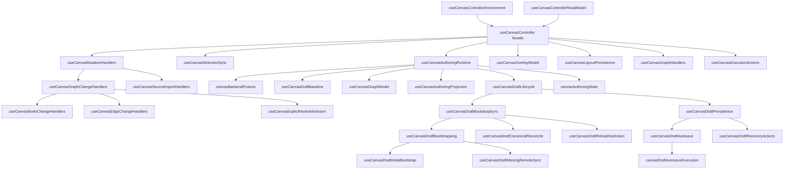

# Canvas Controller Current To Target Architecture

## Purpose

This document is the local architecture source for the Canvas controller slice
in `apps/web`.

It is intentionally narrow:

- current runtime truth for `useCanvasController` and its immediate SRP seams
- the remaining responsibility concentrations still blocking a Fowler-style
  composition facade
- the next extraction order required to reach the TF-E2 target

It is not the place for the full TF-E2 roadmap, route-startup taxonomy, or the
complete DDD/C4 pack. Those live in the canonical companion documents listed
below.

## Canonical Companion Sources

- [TF-E2 Canvas Target Architecture Execution Plan 2026-04-17](../../../../planning/proposals/mandatory/frontend-and-ux/tf-e2-canvas-target-architecture-execution-plan-20260417.md)
- [Graph Route Bootstrap Architecture](./graph-route-bootstrap-architecture.md)
- [Frontend Fowler Implementation Pattern](../frontend-fowler-implementation-pattern.md)
- [Frontend Data Boundary Architecture](../frontend-data-boundary-architecture.md)

Reading rule:

- use this document for the controller-local current/next architecture
- use `TF-E2` for roadmap, backlog, user stories, DDD, C4, sequences, and
  release posture
- use `graph-route-bootstrap-architecture.md` for startup contract rules and
  route publication invariants

## Current Code Anchors

Primary implementation anchors:

- [useCanvasController.ts](../../../../../apps/web/src/app/views/canvas/useCanvasController.ts)
- [useCanvasControllerEnvironment.ts](../../../../../apps/web/src/app/views/canvas/useCanvasControllerEnvironment.ts)
- [useCanvasControllerReadModel.ts](../../../../../apps/web/src/app/views/canvas/useCanvasControllerReadModel.ts)
- [useCanvasAuthoringRuntime.ts](../../../../../apps/web/src/app/views/canvas/useCanvasAuthoringRuntime.ts)
- [useCanvasDraftBaseline.ts](../../../../../apps/web/src/app/views/canvas/useCanvasDraftBaseline.ts)
- [useCanvasAuthoringProjection.ts](../../../../../apps/web/src/app/views/canvas/useCanvasAuthoringProjection.ts)
- [useCanvasSelectionSync.ts](../../../../../apps/web/src/app/views/canvas/useCanvasSelectionSync.ts)
- [useCanvasMutationHandlers.ts](../../../../../apps/web/src/app/views/canvas/useCanvasMutationHandlers.ts)
- [useCanvasGraphChangeHandlers.ts](../../../../../apps/web/src/app/views/canvas/useCanvasGraphChangeHandlers.ts)
- [useCanvasNodeChangeHandlers.ts](../../../../../apps/web/src/app/views/canvas/useCanvasNodeChangeHandlers.ts)
- [useCanvasEdgeChangeHandlers.ts](../../../../../apps/web/src/app/views/canvas/useCanvasEdgeChangeHandlers.ts)
- [useCanvasExplicitNodeAdmission.ts](../../../../../apps/web/src/app/views/canvas/useCanvasExplicitNodeAdmission.ts)
- [useCanvasSourceImportHandlers.ts](../../../../../apps/web/src/app/views/canvas/useCanvasSourceImportHandlers.ts)
- [canvasGraphChangeRuntime.ts](../../../../../apps/web/src/app/views/canvas/canvasGraphChangeRuntime.ts)
- [canvasBackendPosture.ts](../../../../../apps/web/src/app/views/canvas/canvasBackendPosture.ts)
- [canvasAuthoringState.ts](../../../../../apps/web/src/app/views/canvas/canvasAuthoringState.ts)
- [canvasDraftRepository.ts](../../../../../apps/web/src/app/views/canvas/canvasDraftRepository.ts)
- [useCanvasDraftLifecycle.ts](../../../../../apps/web/src/app/views/canvas/useCanvasDraftLifecycle.ts)
- [useCanvasDraftBootstrapSync.ts](../../../../../apps/web/src/app/views/canvas/useCanvasDraftBootstrapSync.ts)
- [useCanvasDraftBootstrapping.ts](../../../../../apps/web/src/app/views/canvas/useCanvasDraftBootstrapping.ts)
- [useCanvasDraftInitialBootstrap.ts](../../../../../apps/web/src/app/views/canvas/useCanvasDraftInitialBootstrap.ts)
- [useCanvasDraftMissingRemoteSync.ts](../../../../../apps/web/src/app/views/canvas/useCanvasDraftMissingRemoteSync.ts)
- [useCanvasDraftCanonicalReconcile.ts](../../../../../apps/web/src/app/views/canvas/useCanvasDraftCanonicalReconcile.ts)
- [useCanvasDraftReloadHydration.ts](../../../../../apps/web/src/app/views/canvas/useCanvasDraftReloadHydration.ts)
- [useCanvasDraftPersistence.ts](../../../../../apps/web/src/app/views/canvas/useCanvasDraftPersistence.ts)
- [useCanvasDraftAutosave.ts](../../../../../apps/web/src/app/views/canvas/useCanvasDraftAutosave.ts)
- [canvasDraftAutosaveExecution.ts](../../../../../apps/web/src/app/views/canvas/canvasDraftAutosaveExecution.ts)
- [useCanvasDraftRecoveryActions.ts](../../../../../apps/web/src/app/views/canvas/useCanvasDraftRecoveryActions.ts)
- [canvasDraftLifecycleSnapshot.ts](../../../../../apps/web/src/app/views/canvas/canvasDraftLifecycleSnapshot.ts)
- [canvasDraftPersistenceRuntime.ts](../../../../../apps/web/src/app/views/canvas/canvasDraftPersistenceRuntime.ts)
- [useCanvasDraftAttemptRefs.ts](../../../../../apps/web/src/app/views/canvas/useCanvasDraftAttemptRefs.ts)
- [useCanvasCurrentDraftPayload.ts](../../../../../apps/web/src/app/views/canvas/useCanvasCurrentDraftPayload.ts)
- [canvasDraftSession.ts](../../../../../apps/web/src/app/views/canvas/canvasDraftSession.ts)
- [canvasDraftScope.ts](../../../../../apps/web/src/app/views/canvas/canvasDraftScope.ts)
- [canvasDraftPresentationState.ts](../../../../../apps/web/src/app/views/canvas/canvasDraftPresentationState.ts)
- [useCanvasGraphModel.ts](../../../../../apps/web/src/app/views/canvas/useCanvasGraphModel.ts)
- [useCanvasOverlayModel.ts](../../../../../apps/web/src/app/views/canvas/useCanvasOverlayModel.ts)
- [useCanvasLayoutPersistence.ts](../../../../../apps/web/src/app/views/canvas/useCanvasLayoutPersistence.ts)
- [useCanvasGraphHandlers.ts](../../../../../apps/web/src/app/views/canvas/useCanvasGraphHandlers.ts)
- [useCanvasExecutionActions.ts](../../../../../apps/web/src/app/views/canvas/useCanvasExecutionActions.ts)
- [useCanvasNavigationActions.ts](../../../../../apps/web/src/app/views/canvas/useCanvasNavigationActions.ts)

## Current Architecture Snapshot

As of 2026-04-18, the SRP split has improved, but the controller chain is not
finished.

### DDD posture

The current slice is moving in the right direction, but only recently became
clear enough to read as DDD rather than just "many smaller hooks".

Current DDD reading for the active Canvas slice:

- `application seams`
  `useCanvasController`, `useCanvasControllerEnvironment`,
  `useCanvasControllerReadModel`, `useCanvasAuthoringRuntime`,
  `useCanvasDraftLifecycle`, `useCanvasDraftPersistence`,
  `useCanvasDraftBootstrapSync`, `useCanvasExecutionActions`,
  `useCanvasMutationHandlers`
- `domain model and domain policies`
  `CanvasDraftSession`, `canvasDraftScope`, `canvasAuthoringState`,
  `canvasBackendPosture`
- `repositories and external boundaries`
  `canvasDraftRepository`, `IWorkspacePort`, workspace snapshot and draft
  contracts
- `projections and presentation models`
  `useCanvasAuthoringProjection`, `useCanvasGraphModel`,
  `useCanvasOverlayModel`, `useCanvasControllerReadModel`,
  `useCanvasCurrentDraftPayload`
- `adapters and route-facing composition`
  `useCanvasControllerEnvironment`, `useCanvasNavigationActions`,
  `useCanvasLayoutPersistence`, `useCanvasGraphHandlers`

The main DDD drift that remained was in `useCanvasAuthoringRuntime`: it still
hid persisted draft baseline access and graph projection assembly inside one
authoring seam. That drift is now reduced by extracting
`useCanvasDraftBaseline` and `useCanvasAuthoringProjection`.

Implemented seams:

- `useCanvasControllerEnvironment`
  owns route-local service, capability, config, graph-strategy, and store
  wiring before the controller composes deeper seams
- `useCanvasControllerReadModel`
  owns controller-local read-model derivation for validation, impacted nodes,
  and inspector projection
- `useCanvasAuthoringRuntime`
  is now the Canvas authoring application seam over draft baseline,
  authoring projection, lifecycle composition, and domain-policy derivation
- `useCanvasDraftBaseline`
  owns persisted draft baseline access over the repository and query client
- `useCanvasAuthoringProjection`
  owns graph projection and canonical snapshot assembly for the current
  working set
- `useCanvasSelectionSync`
  owns selected-node and inspector reconciliation between the store and the
  UI scope
- `useCanvasMutationHandlers`
  is now a composition seam over graph-change and source-import handlers
- `useCanvasGraphChangeHandlers`
  is now a composition seam over node, edge, and explicit-node handlers
- `useCanvasNodeChangeHandlers`
  owns node-change handling, node removal fallout, and inspector or selection
  reconciliation
- `useCanvasEdgeChangeHandlers`
  owns edge-change handling
- `useCanvasExplicitNodeAdmission`
  owns explicit-node admission into the draft aggregate
- `useCanvasSourceImportHandlers`
  owns source-import aftermath, focus handoff, and workspace-graph refresh
- `canvasBackendPosture`
  owns backend readiness, blocked-backend copy, and mutation posture
- `canvasAuthoringState`
  owns visible scope, execution scope, recovery flags, and local mutation
  gating
- `canvasDraftRepository`
  owns draft read/write and graph snapshot access over `IWorkspacePort`
- `useCanvasDraftLifecycle`
  is now a composition seam over draft refs, draft payload projection,
  bootstrap sync, and persistence
- `useCanvasDraftBootstrapping`
  is now a composition seam over initial bootstrap and missing-remote sync
- `useCanvasDraftInitialBootstrap`
  owns the first draft-session transition from remote draft or canonical
  snapshot into the editing aggregate
- `useCanvasDraftMissingRemoteSync`
  owns post-bootstrap missing-remote detection and local reset
- `useCanvasDraftAutosave`
  owns autosave scheduling over persistence-readiness, debounce, and save
  eligibility checks
- `canvasDraftAutosaveExecution`
  owns save-attempt execution plus conflict, success, and failure resolution
- `useCanvasGraphModel`
  owns canonical graph hydration and identity maps
- `useCanvasOverlayModel`
  owns overlay decoration projection
- `useCanvasLayoutPersistence`
  owns viewport and node-position persistence
- `useCanvasGraphHandlers`
  owns graph interaction commands
- `useCanvasExecutionActions`
  owns plan and run orchestration
- `useCanvasNavigationActions`
  owns route-only navigation side effects

Remaining concentration:

- `useCanvasAuthoringRuntime`
  still assembles several authoring concerns and remains the heaviest runtime
  seam in the chain

## Current Topology

```mermaid
flowchart TB
  Environment["useCanvasControllerEnvironment"] --> Controller["useCanvasController"]
  Runtime["useCanvasAuthoringRuntime"] --> Controller["useCanvasController"]
  ReadModel["useCanvasControllerReadModel"] --> Controller
  Selection["useCanvasSelectionSync"] --> Controller
  Mutations["useCanvasMutationHandlers"] --> Controller
  Overlay["useCanvasOverlayModel"] --> Controller
  Layout["useCanvasLayoutPersistence"] --> Controller
  Handlers["useCanvasGraphHandlers"] --> Controller
  Execution["useCanvasExecutionActions"] --> Controller
  Navigation["useCanvasNavigationActions"] --> Execution

  Runtime --> Backend["canvasBackendPosture"]
  Runtime --> DraftRepo["canvasDraftRepository"]
  Runtime --> DraftBaseline["useCanvasDraftBaseline"]
  Runtime --> GraphModel["useCanvasGraphModel"]
  Runtime --> AuthoringProjection["useCanvasAuthoringProjection"]
  Runtime --> Lifecycle["useCanvasDraftLifecycle"]
  Runtime --> Authoring["canvasAuthoringState"]
  Mutations --> GraphChanges["useCanvasGraphChangeHandlers"]
  GraphChanges --> NodeChanges["useCanvasNodeChangeHandlers"]
  GraphChanges --> EdgeChanges["useCanvasEdgeChangeHandlers"]
  GraphChanges --> ExplicitNode["useCanvasExplicitNodeAdmission"]
  Mutations --> SourceImport["useCanvasSourceImportHandlers"]
  Lifecycle --> Bootstrap["useCanvasDraftBootstrapSync"]
  Lifecycle --> Persistence["useCanvasDraftPersistence"]
  Bootstrap --> DraftBootstrap["useCanvasDraftBootstrapping"]
  DraftBootstrap --> InitialBootstrap["useCanvasDraftInitialBootstrap"]
  DraftBootstrap --> MissingRemote["useCanvasDraftMissingRemoteSync"]
  Bootstrap --> DraftReconcile["useCanvasDraftCanonicalReconcile"]
  Bootstrap --> ReloadHydration["useCanvasDraftReloadHydration"]
  Persistence --> Autosave["useCanvasDraftAutosave"]
  Autosave --> AutosaveExecution["canvasDraftAutosaveExecution"]
  Persistence --> Recovery["useCanvasDraftRecoveryActions"]
  Autosave --> DraftSession["canvasDraftSession"]
  DraftBootstrap --> DraftSession
  DraftSession --> Scope["canvasDraftScope"]
  Scope --> Authoring
```

## Current Responsibility Inventory

| Module                            | Current responsibility                                                                                                                                | Current problem                                                    |
| --------------------------------- | ----------------------------------------------------------------------------------------------------------------------------------------------------- | ------------------------------------------------------------------ |
| `useCanvasController`             | route-facing composition facade over environment, runtime, selection, mutation, overlays, handlers, layout, execution, and final contract publication | much thinner than before, but still returns a large route contract |
| `useCanvasControllerEnvironment`  | route-local service, capability, config, strategy, and store wiring                                                                                   | acceptable environment seam                                        |
| `useCanvasControllerReadModel`    | controller-local validation, impacted-node projection, and inspector projection                                                                       | acceptable read-model seam                                         |
| `useCanvasAuthoringRuntime`       | authoring application seam over baseline, projection, lifecycle, and domain-policy derivation                                                         | still broad enough to be the next likely split point               |
| `useCanvasDraftBaseline`          | persisted draft baseline query and repository access                                                                                                  | acceptable baseline seam                                           |
| `useCanvasAuthoringProjection`    | graph projection and canonical snapshot assembly                                                                                                      | acceptable projection seam                                         |
| `useCanvasMutationHandlers`       | composition seam over graph-change and source-import hooks                                                                                            | acceptable composition seam                                        |
| `useCanvasGraphChangeHandlers`    | composition seam over node, edge, and explicit-node handlers                                                                                          | acceptable composition seam                                        |
| `useCanvasNodeChangeHandlers`     | node-change handling, node removal fallout, and selection or inspector reconciliation                                                                 | acceptable node-mutation seam                                      |
| `useCanvasEdgeChangeHandlers`     | edge-change handling                                                                                                                                  | acceptable edge-mutation seam                                      |
| `useCanvasExplicitNodeAdmission`  | explicit-node admission into the draft aggregate                                                                                                      | acceptable explicit-node seam                                      |
| `useCanvasSourceImportHandlers`   | source-import aftermath, focus handoff, and graph refresh                                                                                             | acceptable import-aftereffect seam                                 |
| `useCanvasDraftLifecycle`         | lifecycle composition seam for refs, payload, bootstrap sync, and persistence                                                                         | acceptable composition seam                                        |
| `useCanvasDraftBootstrapSync`     | composition seam over reload hydration, bootstrapping, and canonical reconcile                                                                        | acceptable composition seam                                        |
| `useCanvasDraftPersistence`       | composition seam over autosave and recovery actions                                                                                                   | acceptable composition seam                                        |
| `useCanvasDraftAutosave`          | autosave scheduling over persistence readiness, debounce, and save eligibility                                                                        | acceptable scheduling seam                                         |
| `canvasDraftAutosaveExecution`    | save-attempt execution and result resolution                                                                                                          | acceptable pure runtime seam                                       |
| `useCanvasDraftBootstrapping`     | composition seam over narrow bootstrap policies                                                                                                       | acceptable composition seam                                        |
| `useCanvasDraftInitialBootstrap`  | first transition from remote draft or canonical snapshot into editing state                                                                           | acceptable bootstrap transition seam                               |
| `useCanvasDraftMissingRemoteSync` | post-bootstrap remote-missing detection and local reset                                                                                               | acceptable lifecycle recovery seam                                 |
| `canvasBackendPosture`            | pure backend posture derivation                                                                                                                       | acceptable as a pure policy seam                                   |
| `canvasAuthoringState`            | pure authoring and recovery posture derivation                                                                                                        | acceptable as a pure policy seam                                   |

## Current Drifts

These are the drifts this document currently tracks.

### 1. Authoring runtime assembly is still too broad

`useCanvasAuthoringRuntime` still owns:

- `draftSession` state creation
- lifecycle composition
- authoring-state derivation
- baseline and projection orchestration

That makes it the next likely seam to split once the current refactor settles.

## Target Shape For This Document

This document freezes only the controller-local target.

The target is:

- `useCanvasController`
  becomes a thin route composition facade
- `useCanvasControllerEnvironment`
  owns route-local dependency and config wiring
- `useCanvasControllerReadModel`
  owns controller-local read-model derivation and presentation projection
- `useCanvasAuthoringRuntime`
  remains the authoring application seam, but can later split again if
  lifecycle orchestration and draft-session ownership continue to grow
- `useCanvasDraftBaseline`
  owns persisted draft baseline access as a separate boundary seam
- `useCanvasAuthoringProjection`
  owns graph projection and canonical snapshot assembly as a separate
  projection seam
- `useCanvasSelectionSync`
  becomes the owner of store-selection and inspector synchronization
- `useCanvasMutationHandlers`
  remains a composition seam only
- `useCanvasGraphChangeHandlers`
  remains a composition seam only
- `useCanvasNodeChangeHandlers`
  owns node-change callbacks outside the controller
- `useCanvasEdgeChangeHandlers`
  owns edge-change callbacks outside the controller
- `useCanvasExplicitNodeAdmission`
  owns explicit-node callbacks outside the controller
- `useCanvasSourceImportHandlers`
  owns source-import aftermath callbacks outside the controller
- `useCanvasDraftLifecycle`
  remains a composition seam only
- `useCanvasDraftBootstrapSync`
  becomes a composition seam over narrower bootstrap policies
- `useCanvasDraftPersistence`
  becomes a composition seam over narrower autosave and recovery policies

## Target Local Topology

## Extraction Order

The next slices should follow this order.

1. Shrink `useCanvasAuthoringRuntime`
   Keep it as the application seam only. If it grows again, split lifecycle
   orchestration or draft-session ownership, not baseline or projection.

2. Keep bootstrap policies split
   Extend `useCanvasDraftInitialBootstrap.ts` or
   `useCanvasDraftMissingRemoteSync.ts` instead of re-expanding
   `useCanvasDraftBootstrapping.ts`.

3. Keep autosave execution pure
   If save-attempt policy grows again, extend
   `canvasDraftAutosaveExecution.ts` or adjacent pure helpers instead of
   re-expanding `useCanvasDraftAutosave.ts`.

4. Keep mutation seams isolated
   If import aftermath or graph-change policy grows again, extend
   `useCanvasSourceImportHandlers.ts`, `useCanvasNodeChangeHandlers.ts`,
   `useCanvasEdgeChangeHandlers.ts`, or
   `useCanvasExplicitNodeAdmission.ts` instead of re-expanding
   `useCanvasMutationHandlers.ts` or `useCanvasGraphChangeHandlers.ts`.

## Invariants To Preserve

- `CanvasDraftSession` remains the authoritative route-local draft aggregate
- workspace snapshot remains the authoritative canonical graph member set
- persisted remote draft remains the authoritative saved baseline
- overlays remain projections and never mutate canonical graph truth
- layout persistence remains blocked until hydration and graph-readiness are
  safe
- plan preview and run start consume authoritative route scope, not visual-only
  state
- route startup publication remains governed by
  `graph-route-bootstrap-architecture.md`, not by controller-local heuristics

## Out Of Scope For This Document

This document does not define:

- the full TF-E2 roadmap or release order
- the complete DDD context map or C4 model
- shell bootstrap route classification
- per-route startup matrix
- product backlog for Inspector, artifacts, diff, or other routes

Those concerns already have canonical homes in the companion sources.

## Acceptance Posture

This document is current only if all of the following remain true:

- the code anchors above still match the active Canvas controller chain
- the `Current Drifts` section names real unresolved concentrations
- no route-bootstrap rule is duplicated here when it already belongs to
  `graph-route-bootstrap-architecture.md`
- no roadmap, story-map, or C4 detail is duplicated here when it already
  belongs to `TF-E2`

If those statements stop being true, update this document by shrinking or
redirecting, not by re-accumulating another architecture mega-file.
