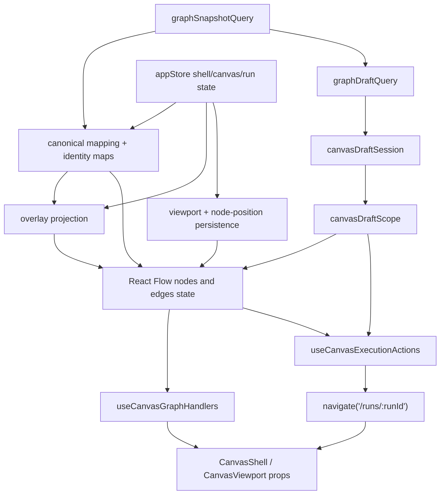
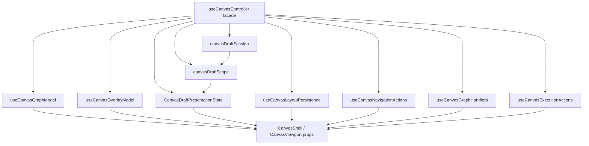
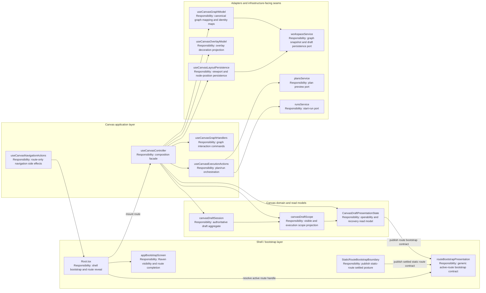
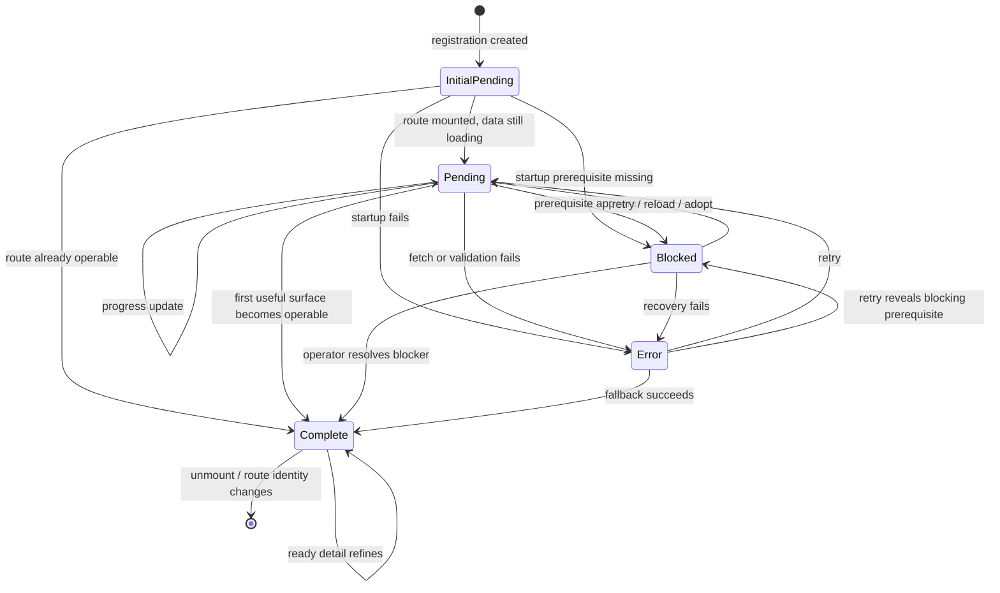
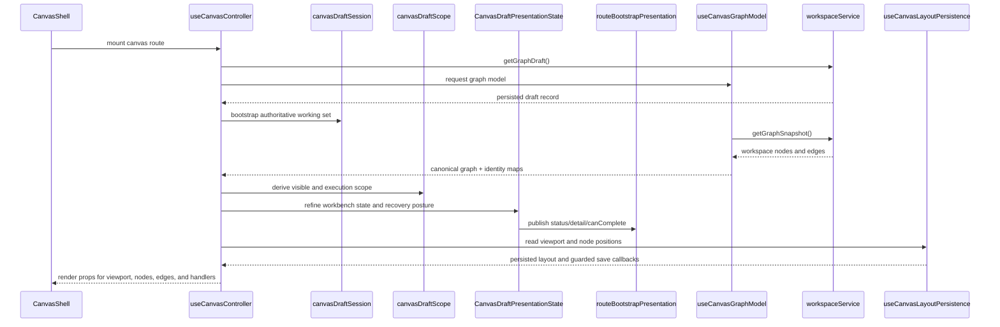
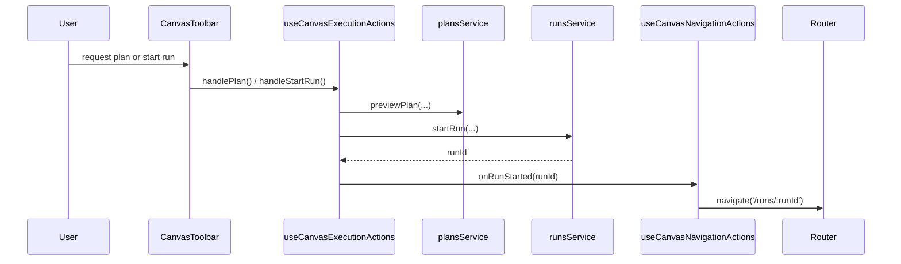
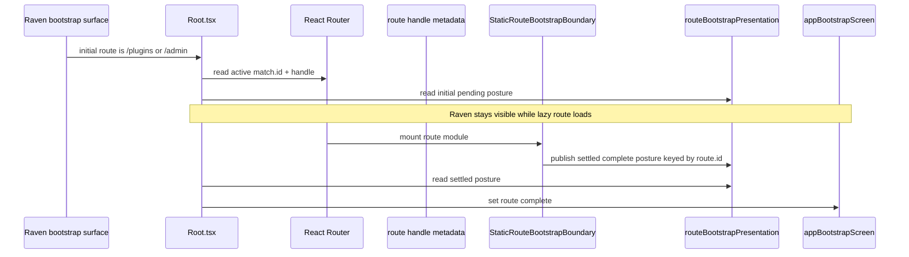

# Canvas Controller Current To Target Architecture

## Purpose

This document freezes the current truth, the remediation target, and the
non-goals for the `useCanvasController` slice in `apps/web`.

It is the focused technical source of truth for the controller hardening chain
under `F-05`.

## Current Code Anchors

Primary implementation anchors:

- [useCanvasController.ts](../../../../../apps/web/src/app/views/canvas/useCanvasController.ts)
- [canvasDraftSession.ts](../../../../../apps/web/src/app/views/canvas/canvasDraftSession.ts)
- [canvasDraftScope.ts](../../../../../apps/web/src/app/views/canvas/canvasDraftScope.ts)
- [useCanvasGraphHandlers.ts](../../../../../apps/web/src/app/views/canvas/useCanvasGraphHandlers.ts)
- [useCanvasExecutionActions.ts](../../../../../apps/web/src/app/views/canvas/useCanvasExecutionActions.ts)
- [CanvasShell.tsx](../../../../../apps/web/src/app/views/canvas/CanvasShell.tsx)
- [CanvasViewport.tsx](../../../../../apps/web/src/app/views/canvas/CanvasViewport.tsx)
- [Canvas.tsx](../../../../../apps/web/src/app/views/Canvas.tsx)
- [Root.tsx](../../../../../apps/web/src/app/Root.tsx)
- [appBootstrapScreen.ts](../../../../../apps/web/src/app/bootstrap/appBootstrapScreen.ts)
- [routeBootstrapPresentation.ts](../../../../../apps/web/src/app/bootstrap/routeBootstrapPresentation.ts)
- [StaticRouteBootstrapBoundary.tsx](../../../../../apps/web/src/app/bootstrap/StaticRouteBootstrapBoundary.tsx)
- [usePublishedRouteBootstrap.ts](../../../../../apps/web/src/app/bootstrap/usePublishedRouteBootstrap.ts)

## Current Responsibility Inventory

`useCanvasController` currently owns too many concerns in one hook:

| Responsibility                 | Current ownership in controller                                             | Why it matters                                                  |
| ------------------------------ | --------------------------------------------------------------------------- | --------------------------------------------------------------- |
| Query ownership                | Runs the workspace graph query through TanStack Query                       | Server-state acquisition and UI composition are coupled         |
| Canonical mapping              | Maps workspace nodes and edges into canonical graph types and identity maps | Graph truth and rendering prep are mixed                        |
| Overlay projection             | Builds runtime, impact, and cost overlay projections                        | Overlay policy is coupled to graph hydration                    |
| Layout persistence             | Reads persisted viewport and node positions and writes them back            | Persistence rules are mixed with render sync                    |
| Draft session orchestration    | Bootstraps, reloads, and saves the authoritative draft working set          | Aggregate policy still passes through the controller seam       |
| Projection and recovery policy | Derives visible scope and blocked recovery posture                          | Projection safety and route posture are still partly coupled    |
| Selection and inspector wiring | Binds selected nodes, inspector node, and panel toggles                     | UI coordination is mixed with graph derivation                  |
| Run navigation side effects    | Navigates to `/runs/:runId` after execution start                           | Route side effects are coupled to graph controller state        |
| Execution orchestration        | Composes planning and run-start actions with selection context              | Controller acts as both graph facade and execution orchestrator |

## Current Topology



## Current Architecture Drifts

The hard QA pass identified these active drifts:

- multi-responsibility controller:
  query, mapping, overlay policy, persistence, selection wiring, and navigation
  live in one hook
- graph sync cost:
  node synchronization performs repeated lookup against current node arrays
  instead of using a stable identity map
- runtime diagnostics in hot paths:
  `console.debug` is present in sync and persistence-related paths
- thin invariant coverage:
  tests are mostly happy-path wiring checks and do not freeze pending, error,
  or persistence guards

These are design and maintainability issues first, not new feature work.

## Invariants To Preserve

- overlays never mutate canonical graph truth
- layout persistence never writes while hydration or graph query readiness is
  incomplete
- route navigation remains an explicit side effect owned outside graph
  projection
- the route-facing workbench contract stays explicit and readable instead of
  being hidden behind opaque command bags
- graph query, overlay projection, and layout persistence stay separable enough
  to test independently
- toolbar signal, recovery banner, and workbench readiness must derive from
  one presentation-state seam rather than three local interpretations
- first-route Raven handoff remains shell-owned, but `Root.tsx` must consume
  a generic route-bootstrap contract resolved from route metadata and published
  by the route presentation seam rather than inferring it from pathname or
  canonical snapshot heuristics
- graph handlers and execution actions remain reusable hooks rather than being
  inlined back into the controller

## Target Decomposition

The target state is a slim composition facade:

- `canvasDraftSession`
  owns the authoritative draft aggregate, baseline, working set, CAS recovery,
  and reload or adoption transitions
- `canvasDraftScope`
  owns visible graph scope, execution scope, and projection completeness
- `CanvasDraftPresentationState`
  becomes the route-level presentation read model that refines
  `canvasWorkbenchStateModel` with recovery posture and is the only accepted
  Canvas operability source
- `routeBootstrapPresentation`
  owns the generic shell-facing startup contract keyed by router route ID so
  `Root.tsx` can consume active-route operability without knowing Canvas
- `usePublishedRouteBootstrap`
  is the adapter seam for published routes and should bind publication to an
  explicit route registration rather than discovering a route implicitly
- `StaticRouteBootstrapBoundary`
  owns the mount-time bridge only for routes whose first useful surface is
  already correct as soon as the lazy route module has mounted
- `useCanvasGraphModel`
  owns graph query consumption, canonical node or edge mapping, and graph
  identity maps
- `useCanvasOverlayModel`
  owns overlay mode, runtime or cost decoration projection, and overlay
  fallback rules
- `useCanvasLayoutPersistence`
  owns viewport equality checks, node-position persistence, and readiness
  guards
- `useCanvasNavigationActions`
  owns route-only side effects such as post-run navigation
- `useCanvasGraphHandlers`
  remains the owner of graph interaction commands
- `useCanvasExecutionActions`
  remains the owner of plan and run action orchestration
- `useCanvasController`
  becomes a composition facade that assembles the above into route-facing props



## Target Component Diagram

This is the canonical target decomposition at component level. It makes the
Fowler-style application service, read model, and adapter seams explicit
instead of leaving them implied inside `useEffect` branches.



Responsibility boundaries in this target:

- shell bootstrap depends on `routeBootstrapPresentation`, with
  `CanvasDraftPresentationState` translating Canvas operability into that
  shell-facing contract instead of exposing route-local booleans or query
  heuristics;
- route identity is owned by the router and becomes the canonical bootstrap key
  instead of a manual module-global string;
- `useCanvasController` stays thin by composing collaborators rather than
  retaining domain policy;
- `canvasDraftSession` owns authoritative draft behavior;
- `canvasDraftScope` and `CanvasDraftPresentationState` are read models, not
  mutation surfaces;
- ports remain behind service adapters so the route does not talk directly to
  backend infrastructure.

## Canonical Route Startup Rules

The route-bootstrap seam is not "lazy module loaded". It is "first useful route
surface is actually operable".

Canonical startup taxonomy:

- `none`: the route does not participate in startup gating.
- `static`: mount is enough because the route has no startup query, no startup
  validation, and no route-local blocked/error/recovery posture before first
  useful interaction.
- `published`: the route must publish its own startup read model because mount
  is not sufficient.

Hard rules:

- `mount != settled`;
- any route with route-local `loading`, `error`, `empty`, `missing`, or
  `recovery` startup posture must be `published`;
- any route whose first useful surface depends on asynchronous data must be
  `published`;
- a published route must publish against its explicit registration keyed by
  router `route.id`; scanning "the deepest active match" is implementation
  drift, not target design;
- the handle `initialPresentation` seeds startup once per mounted route and
  must not be re-entered during ordinary updates;
- reset is allowed only when the route unmounts or the active registration
  changes;
- no helper may infer `static` merely because a route is lazy-loaded;
- an unclassified route is a design error and should fail closed in the target
  architecture instead of being treated as implicitly `complete`.

Canonical classification for the current route set:

| Route id                      | Startup mode | Governing reason                                                 |
| ----------------------------- | ------------ | ---------------------------------------------------------------- |
| `dbt.canvas`                  | `published`  | Draft aggregate, projection completeness, and recovery posture   |
| `dbt.lineage`                 | `published`  | Snapshot-driven `loading`/`error`/`empty` workbench states       |
| `dbt.code`                    | `published`  | File-tree and preview queries                                    |
| `dbt.diff`                    | `published`  | Diff, snapshot, and SQL preview queries                          |
| `dbt.artifacts`               | `published`  | Artifact load and import-validation states                       |
| `monitoring.runs`             | `published`  | Runs summary query and empty/error/list startup outcomes         |
| `monitoring.run-detail`       | `published`  | Run workspace loading, missing-run, and error outcomes           |
| `shell.plugins`               | `static`     | Shell-only surface, useful immediately after mount               |
| `shell.admin`                 | `static`     | Shell-only surface, useful immediately after mount               |
| `shell.default-core-redirect` | `published`  | Redirect still governs startup progress until the target settles |

## Published Route Publisher Pattern

The missing target rule is not "use a generic publisher hook". It is "publish a
route-startup read model against one explicit registration with monotonic
lifecycle semantics".

Role mapping:

| Element                           | Fowler / DDD reading                       | Target rule                                                          |
| --------------------------------- | ------------------------------------------ | -------------------------------------------------------------------- |
| Route handle plus registration    | Shell-facing contract boundary             | Own `route.id`, startup mode, and initial seed posture               |
| Route startup read model          | Presentation Model / route read model      | Derive `pending`, `blocked`, `error`, or `complete` from route truth |
| Published-route publisher adapter | Adapter between route read model and shell | Publish against one explicit registration and reset only on unmount  |
| `routeBootstrapPresentation`      | Passive shell-facing registry              | Store the latest posture keyed by `route.id`                         |
| `Root.tsx`                        | Application shell consumer                 | Read the active-route posture, but never infer route operability     |

Canonical publisher invariants:

- ownership is explicit: publisher -> registration -> `route.id`;
- lifecycle is monotonic while the same route remains mounted;
- `initialPresentation` is the first seed, not a fallback on every update;
- reset is an unmount or route-change concern, not a normal state-transition
  step.

## Published Route Startup State Machine



## Operational Sequences

### Graph load to render and persistence



### Published route bootstrap handoff and route reveal

```mermaid
sequenceDiagram
  participant Raven as Raven bootstrap surface
  participant Root as Root.tsx
  participant RouteHandle as Route handle metadata
  participant Registration as Route bootstrap registration
  participant Controller as useCanvasController
  participant Presentation as CanvasDraftPresentationState
  participant Publisher as Published-route publisher
  participant RouteBootstrap as routeBootstrapPresentation
  participant Bootstrap as appBootstrapScreen
  participant Shell as App shell

  Raven->>Root: initial route is active
  Root->>RouteHandle: resolve active route bootstrap contract
  RouteHandle-->>Registration: bind route.id + startup mode
  Root->>RouteBootstrap: read initialPresentation(routeId)
  Root->>Controller: mount canvas route
  Controller->>Presentation: derive route posture
  Presentation-->>Publisher: next route posture
  Publisher->>RouteBootstrap: publish(routeId, status/detail/canComplete)
  Note over Publisher,RouteBootstrap: Replace posture in place; do not reset to initial pending during ordinary updates
  Root->>RouteBootstrap: read active route contract

  alt route is operable (ready or accepted empty)
    Root->>Bootstrap: set route complete
    Root->>Shell: reveal shell
  else route is not operable (loading, blocked, recovery, or error)
    Root->>Bootstrap: keep route pending/blocked/error
    Bootstrap-->>Raven: keep Raven visible
  end

  opt route unmounts or active route changes
    Publisher->>RouteBootstrap: reset(routeId)
  end
```

### Plan and run to route transition



### Truly static route mount to reveal



## Fowler / DDD / Hexagonal / SOLID Reading

- Fowler:
  `useCanvasController` is the application service, `canvasDraftSession` is the
  aggregate-like domain model, `canvasDraftScope` is the projection model,
  `CanvasDraftPresentationState` is the Canvas route read model, and
  `routeBootstrapPresentation` plus `StaticRouteBootstrapBoundary` form the
  generic shell contract consumed by the startup shell.
- DDD:
  Canvas authoring owns draft and projection semantics, while startup shell
  ownership stays in `Root.tsx`; the shell consumes an explicit operability
  model instead of re-deriving authoring truth.
- Hexagonal:
  `Root.tsx` should depend on route metadata plus a presentation-facing startup
  contract, not on React Flow state, query internals, or route-local JSX
  heuristics.
- SOLID:
  SRP separates startup reveal from route operability, DIP keeps the shell
  dependent on an abstraction, and OCP lets new recovery states extend the
  Canvas presentation model or add new route publishers without changing shell
  policy shape.

Comparison with mature systems:

- mature workbench shells treat splash or bootstrap as shell concerns, not
  editor/view concerns;
- route modules publish readiness and degraded posture explicitly;
- lighter routes commonly settle through a shared boundary keyed by router
  identity, but only when mount already means operable;
- route modules with their own loading/error/recovery semantics publish a route
  read model rather than hiding behind a blanket static helper;
- shell reveal is driven by that published posture, not by leaf component state
  or pathname-only shortcuts.

## Non-Goals For This Remediation

This controller remediation does not:

- complete the full `F-05` store decomposition
- standardize the full `F-06` query-key or invalidation policy
- redesign the canvas UX or add new panels
- change runtime route contracts
- add live-log or execution-console convergence

## Architectural Position

This slice belongs under the `F-05` convergence chain because the actual defect
is responsibility concentration around canvas and store-facing orchestration.

After the `TF-E2` draft-persistence hardening, that concentration is no longer
only about query and overlay logic. It also includes recovery posture:
`missing_remote`, `stale_conflict`, and `projection_gap` must be modeled as one
route-level presentation concern instead of being inferred separately by
`Canvas.tsx`, `CanvasShell.tsx`, and `CanvasToolbar.tsx`.

It is not a standalone feature. It is a controller and state-boundary hardening
step that should leave the user workflow intact while making future extraction
and TDD safer.
