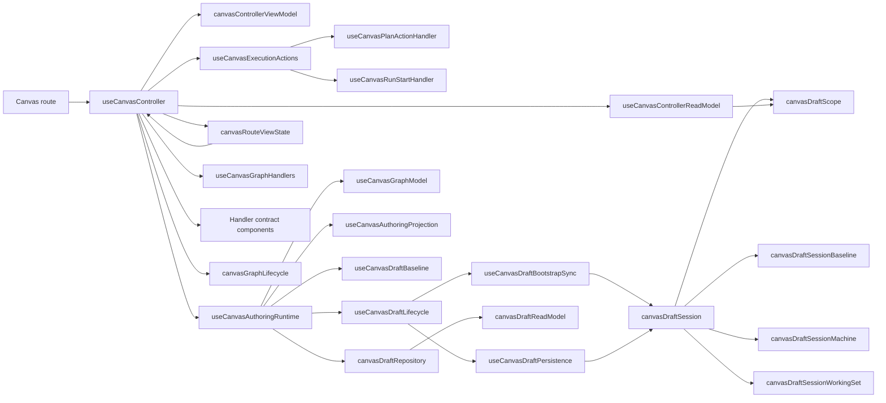
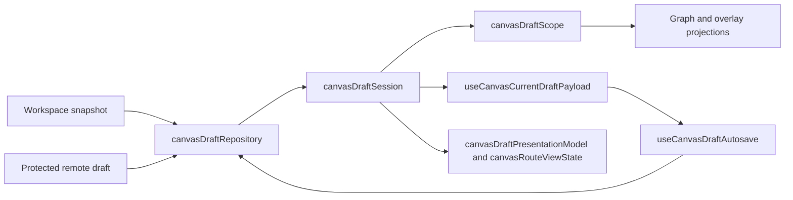
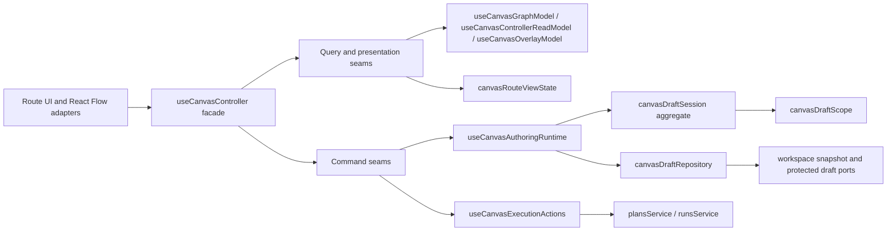

# Canvas Controller Current To Target Architecture

## Purpose

This document is the canonical architecture summary for the Canvas controller
slice in `apps/web`.

Use it for three things only:

- the controller-local layering around `useCanvasController`
- the current drifts that still matter for a Fowler-style facade
- the next extraction order for the hard-cut Canvas authoring slice

Do not use this document as the full `TF-E2` roadmap, the shell startup
taxonomy, or the detailed draft-state-machine spec.

## Governing Sources

- [TF-E2 Canvas Target Architecture Execution Plan 2026-04-17](../../../../planning/proposals/mandatory/frontend-and-ux/tf-e2-canvas-target-architecture-execution-plan-20260417.md)
- [Graph Route Bootstrap Architecture](./graph-route-bootstrap-architecture.md)
- [Canvas Draft Session Component](./canvas-draft-session-component.md)
- [Canvas Handler Contracts Component](./canvas-handler-contracts-component.md)
- [Canvas Route Presentation Component](./canvas-route-presentation-component.md)
- [Graph Sequences And State Machines](./graph-sequences-and-state-machines.md)
- [Frontend Fowler Implementation Pattern](../frontend-fowler-implementation-pattern.md)
- [Frontend Data Boundary Architecture](../frontend-data-boundary-architecture.md)

Reading rule:

- use this page for controller-local composition and target shape
- use `canvas-draft-session-component.md` for aggregate internals and state
  reading
- use `canvas-handler-contracts-component.md` for adapter composition
  vocabulary, namespaced builder APIs, and handler-seam invariants
- use `canvas-route-presentation-component.md` for route-visible posture and
  alignment across banner, toolbar, center surface, and bootstrap publication
- use `graph-route-bootstrap-architecture.md` for route publication and startup
  contract rules
- use `graph-sequences-and-state-machines.md` for sequence and state-machine
  diagrams
- use the `TF-E2` plan for roadmap, scope, and delivery ordering

## Canonical Anchors

<!-- markdownlint-disable MD060 -->

| Layer                        | Primary anchors                                                                                                                                                                                                                                                                                                                                                                                                                                                                                                                                                                           | Why they are canonical                                       |
| ---------------------------- | ----------------------------------------------------------------------------------------------------------------------------------------------------------------------------------------------------------------------------------------------------------------------------------------------------------------------------------------------------------------------------------------------------------------------------------------------------------------------------------------------------------------------------------------------------------------------------------------- | ------------------------------------------------------------ |
| Route entry and presentation | [Canvas.tsx](../../../../../apps/web/src/app/views/Canvas.tsx), [CanvasCenterSurface.tsx](../../../../../apps/web/src/app/views/canvas/CanvasCenterSurface.tsx), [CanvasRecoveryBanner.tsx](../../../../../apps/web/src/app/views/canvas/CanvasRecoveryBanner.tsx), [canvasRouteViewState.ts](../../../../../apps/web/src/app/views/canvas/canvasRouteViewState.ts), [canvasDraftPresentationModel.ts](../../../../../apps/web/src/app/views/canvas/canvasDraftPresentationModel.ts), [canvasToolbarViewModel.ts](../../../../../apps/web/src/app/views/canvas/canvasToolbarViewModel.ts) | Route-facing UI adapters and route-safe presentation state   |
| Controller facade            | [useCanvasController.ts](../../../../../apps/web/src/app/views/canvas/useCanvasController.ts), [canvasControllerViewModel.ts](../../../../../apps/web/src/app/views/canvas/canvasControllerViewModel.ts), [useCanvasControllerEnvironment.ts](../../../../../apps/web/src/app/views/canvas/useCanvasControllerEnvironment.ts)                                                                                                                                                                                                                                                             | Thin composition and route-safe output                       |
| Handler contract component   | [canvasGraphHandlerContracts.ts](../../../../../apps/web/src/app/views/canvas/canvasGraphHandlerContracts.ts), [canvasGraphHandlerContractBuilders.ts](../../../../../apps/web/src/app/views/canvas/canvasGraphHandlerContractBuilders.ts), [canvasMutationHandlerContracts.ts](../../../../../apps/web/src/app/views/canvas/canvasMutationHandlerContracts.ts), [canvasMutationHandlerContractBuilders.ts](../../../../../apps/web/src/app/views/canvas/canvasMutationHandlerContractBuilders.ts)                                                                                        | Local adapter-composition vocabulary and namespaced builders |
| Command seams                | [useCanvasAuthoringRuntime.ts](../../../../../apps/web/src/app/views/canvas/useCanvasAuthoringRuntime.ts), [useCanvasMutationHandlers.ts](../../../../../apps/web/src/app/views/canvas/useCanvasMutationHandlers.ts), [useCanvasExecutionActions.ts](../../../../../apps/web/src/app/views/canvas/useCanvasExecutionActions.ts), [canvasGraphLifecycle.ts](../../../../../apps/web/src/app/views/canvas/canvasGraphLifecycle.ts)                                                                                                                                                          | Write-side orchestration and command ownership               |
| Aggregate and domain policy  | [canvasDraftSession.ts](../../../../../apps/web/src/app/views/canvas/canvasDraftSession.ts), [canvasDraftSessionBaseline.ts](../../../../../apps/web/src/app/views/canvas/canvasDraftSessionBaseline.ts), [canvasDraftSessionMachine.ts](../../../../../apps/web/src/app/views/canvas/canvasDraftSessionMachine.ts), [canvasDraftSessionWorkingSet.ts](../../../../../apps/web/src/app/views/canvas/canvasDraftSessionWorkingSet.ts), [canvasDraftScope.ts](../../../../../apps/web/src/app/views/canvas/canvasDraftScope.ts)                                                             | Authoritative local draft truth                              |
| Query and projection seams   | [useCanvasGraphModel.ts](../../../../../apps/web/src/app/views/canvas/useCanvasGraphModel.ts), [useCanvasAuthoringProjection.ts](../../../../../apps/web/src/app/views/canvas/useCanvasAuthoringProjection.ts), [useCanvasControllerReadModel.ts](../../../../../apps/web/src/app/views/canvas/useCanvasControllerReadModel.ts), [useCanvasCurrentDraftPayload.ts](../../../../../apps/web/src/app/views/canvas/useCanvasCurrentDraftPayload.ts), [useCanvasOverlayModel.ts](../../../../../apps/web/src/app/views/canvas/useCanvasOverlayModel.ts)                                       | Read-side projections and route models                       |
| Persistence boundary         | [canvasDraftRepository.ts](../../../../../apps/web/src/app/views/canvas/canvasDraftRepository.ts), [canvasDraftReadModel.ts](../../../../../apps/web/src/app/views/canvas/canvasDraftReadModel.ts)                                                                                                                                                                                                                                                                                                                                                                                        | Outbound draft persistence plus typed read-side translation  |
| Fitness functions            | [canvasDraftSession.architecture.test.ts](../../../../../apps/web/src/app/views/canvas/canvasDraftSession.architecture.test.ts), [canvasDraftRepository.architecture.test.ts](../../../../../apps/web/src/app/views/canvas/canvasDraftRepository.architecture.test.ts), [canvasControllerViewModel.architecture.test.ts](../../../../../apps/web/src/app/views/canvas/canvasControllerViewModel.architecture.test.ts), [useCanvasAuthoringRuntime.architecture.test.ts](../../../../../apps/web/src/app/views/canvas/useCanvasAuthoringRuntime.architecture.test.ts)                      | Structural guardrails for the seam split                     |

<!-- markdownlint-enable MD060 -->

## Current Layer Model

| Layer                        | Current owner                                                                                                                                         | Must own                                                               | Must not own                                             |
| ---------------------------- | ----------------------------------------------------------------------------------------------------------------------------------------------------- | ---------------------------------------------------------------------- | -------------------------------------------------------- |
| Inbound adapters             | `Canvas.tsx`, `CanvasCenterSurface.tsx`, `CanvasToolbar.tsx`, `useCanvasGraphHandlers.ts`                                                             | Route composition, React Flow gesture translation, thin UI fallout     | Persistence rules, aggregate truth, bootstrap heuristics |
| Controller facade            | `useCanvasController.ts`, `canvasControllerViewModel.ts`                                                                                              | Wire seams into one route-safe facade                                  | Domain policy, transport logic, duplicate projections    |
| Application services         | `useCanvasAuthoringRuntime.ts`, `useCanvasDraftLifecycle.ts`, `useCanvasExecutionActions.ts`                                                          | Command orchestration, side-effect coordination, handoffs to ports     | Render concerns, widget-local state truth                |
| Aggregate and policy         | `canvasDraftSession.*`, `canvasDraftScope.ts`, `canvasAuthoringState.ts`, `canvasBackendPosture.ts`                                                   | Draft truth, transitions, working-set semantics, authoring policy      | Direct service calls, React Flow callbacks               |
| Read models and repositories | `useCanvasGraphModel.ts`, `useCanvasControllerReadModel.ts`, `useCanvasCurrentDraftPayload.ts`, `canvasDraftRepository.ts`, `canvasDraftReadModel.ts` | Projection, route presentation state, persistence boundary translation | Semantic authority over authoring truth                  |

## Current Topology

Reading rule:

- `useCanvasController` is already a facade, but not yet a fully settled thin
  one
- `useCanvasAuthoringRuntime` is the heaviest remaining orchestration seam
- `canvasDraftSession` is now a proper component API instead of a mixed utility file
- handler-contract builders are now explicit local component APIs instead of a
  loose helper catalog
- `canvasGraphLifecycle` is now the semantic graph-mutation component instead of
  a flat helper catalog
- route presentation is now a closed component seam under `TF-E2-F`; route
  posture no longer leaks through banner-specific controller reads, local
  center-surface branching, or toolbar recovery heuristics
- the repository is the only persistence authority in this slice

## Draft Authoring Pipeline

This is the canonical read:

- repository reads canonical inputs
- aggregate owns local authoring truth
- scope and projections derive route-safe views
- autosave writes back through the repository only

## Fowler Reading

| Fowler concept       | Current owner                                                                                | Posture                                                        |
| -------------------- | -------------------------------------------------------------------------------------------- | -------------------------------------------------------------- |
| Gateway / repository | `canvasDraftRepository.ts` plus workspace, plan, and run ports                               | strong                                                         |
| Application service  | `useCanvasController.ts`, `useCanvasAuthoringRuntime.ts`, `useCanvasExecutionActions.ts`     | partial, because `useCanvasAuthoringRuntime.ts` is still broad |
| Aggregate            | `canvasDraftSession.ts` plus baseline, machine, and working-set seams                        | strong                                                         |
| Domain component     | `canvasGraphLifecycle.ts` plus node and edge seams                                           | strong                                                         |
| Presentation model   | `canvasDraftPresentationModel.ts`, `canvasRouteViewState.ts`, `canvasControllerViewModel.ts` | strong                                                         |
| View and adapters    | route components and `useCanvasGraphHandlers.ts`                                             | strong                                                         |

Patterns improved in this branch:

- thin public aggregate facade with subordinate pure policy seams
- explicit command seams for execution and graph lifecycle fallout
- local handler contracts now group `state`, `effects`, and `policy` by seam
  instead of inheriting shape through parent-derived `Pick<>` bags
- contract mapping for handler composition now lives in dedicated builders, now
  exposed as namespaced component APIs instead of loose `build*` exports
- architecture tests protecting structure instead of relying on review memory

Remaining drift against the target:

1. `useCanvasAuthoringRuntime.ts` still coordinates too much in one place.
2. selection and inspector commands are still mostly adapter-local.
3. route-visible presentation hard cut is closed; remaining drift is elsewhere,
   mainly `useCanvasAuthoringRuntime.ts` breadth and selection/inspector
   semantics.
4. `canvasDraftReadModel.ts` remains intentionally lossy.
5. plugin registry assembly is still broader than the rest of the slice.

## Target Topology

Target reading:

- `useCanvasController` becomes thinner, not smarter
- command seams remain explicit and separate from query seams
- `canvasDraftSession` stays the local aggregate root
- projections answer read questions; commands do not

## Extraction Order

1. Shrink `useCanvasAuthoringRuntime.ts` if it regrows.
2. Keep shared write semantics in `canvasGraphLifecycle.ts`.
3. Keep bootstrap and persistence as separate composition seams.
4. Add a dedicated UI command seam only if selection or inspector semantics
   stop being trivial.
5. Keep route state inside presentation and query seams instead of route JSX.

## Invariants To Preserve

- `CanvasDraftSession` remains the authoritative route-local draft aggregate.
- React Flow state is a projection, not semantic authority.
- `canvasDraftRepository.ts` remains the only persistence boundary for draft
  storage in this slice.
- save and preview flows must consume authoritative route scope, not visible-only
  widget state.
- route startup publication stays governed by
  `graph-route-bootstrap-architecture.md`.
- no compatibility shim should reintroduce parallel mutation paths.

## Out Of Scope

- the full `TF-E2` roadmap or release order
- the shell-wide startup taxonomy
- Diff, Artifacts, or Templates route behavior
- the full draft state machine, which already lives in
  `graph-sequences-and-state-machines.md`
