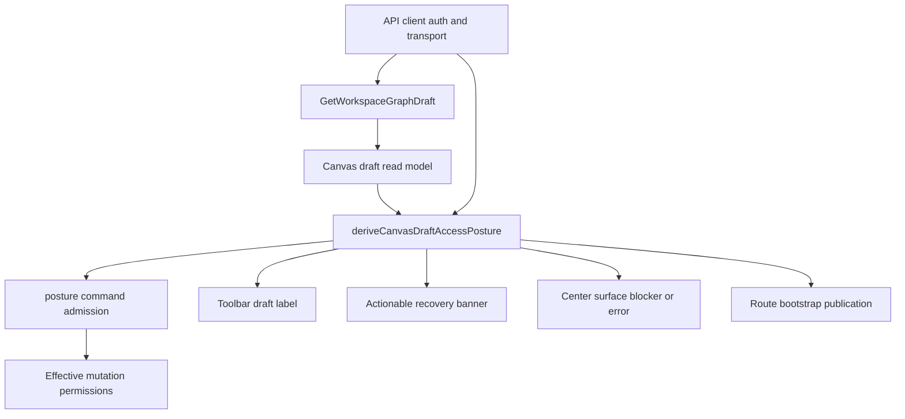
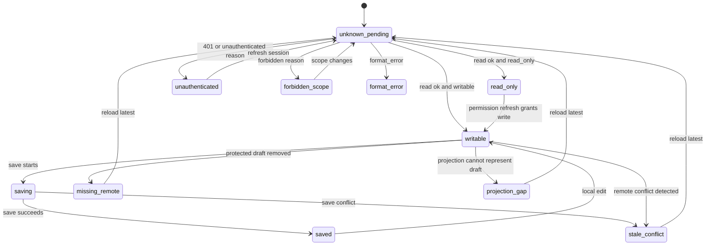

# Canvas Draft Access Posture Component

## Purpose

This component defines the target design for `TF-E2-M-B`.

It owns the route-visible truth for protected workspace graph draft access. Its
job is to convert the result of the governed draft query and transport failure
path into one renderable posture that every Canvas surface consumes.

The component exists because Canvas currently has related decisions split across
toolbar labels, center-surface errors, recovery banners, interaction gating, and
read-only posture. That split can produce a false product signal such as a
synced toolbar while the protected draft read is denied.

## Governing Sources

- `AGENTS.md`
- `docs/planning/status/governance-document-rule-inventory.md`
- `docs/guides/ai-work-protocol.md`
- `docs/architecture/command-query-rail-governance.md`
- `docs/architecture/fowler-opportunity-planning-governance.md`
- `docs/planning/state/agent-lane-e.yaml`
- `docs/planning/proposals/mandatory/frontend-and-ux/web-auth-project-onboarding-and-actionable-gaps-20260501.md`
- `docs/architecture/components/web/api-client-auth-component.md`
- `docs/architecture/components/web/graph/canvas-execution-selection-component.md`
- `docs/architecture/components/web/graph/canvas-startup-and-draft-recovery-component.md`
- `docs/architecture/components/web/graph/canvas-startup-and-draft-recovery-user-stories.md`
- `packages/@dvt/contracts/src/contracts/planner/WorkspaceGraphDraft.v1.ts`

## Owned Concern

Owned concern: resolve protected Canvas draft access into one route-visible
posture that controls banner copy, toolbar state, center-surface rendering,
mutation enablement, and startup publication.

The component does not own:

- protected runtime authentication or token refresh;
- workspace draft persistence;
- graph mutation commands;
- React Flow rendering;
- project or tenant selection;
- backend authorization policy.

Those concerns stay in their existing components and ports.

## Public API

The implementation introduces two pure model modules and one small template
module.

| API                                                 | Owner                                     | Responsibility                                                                                                                                       |
| --------------------------------------------------- | ----------------------------------------- | ---------------------------------------------------------------------------------------------------------------------------------------------------- |
| `CanvasDraftAccessPosture`                          | `canvasDraftAccessPostureModel.ts`        | Discriminated route posture consumed by Canvas UI and startup surfaces.                                                                              |
| `CanvasDraftAccessPostureKind`                      | `canvasDraftAccessPostureModel.ts`        | Exhaustive posture discriminator.                                                                                                                    |
| `deriveCanvasDraftAuthTransportPosture(args)`       | `canvasDraftAuthTransportPosture.ts`      | Converts protected draft query errors into the small Canvas auth-transport input without token inspection.                                           |
| `deriveCanvasDraftAccessPosture(args)`              | `canvasDraftAccessPostureModel.ts`        | Converts draft access mode, capability reason, format error, route recovery, and transport auth detail into one posture.                             |
| `isCanvasDraftPostureMutationBlocked(posture)`      | `canvasDraftAccessPostureModel.ts`        | Shared mutation gate for Canvas interaction state.                                                                                                   |
| `applyCanvasDraftPostureToRuntimePolicyInput(args)` | `canvasDraftAccessPostureModel.ts`        | Applies posture admission to graph mutation, plan, run, and reload command inputs before `canvasRuntimePolicy.ts` resolves final command enablement. |
| `resolveCanvasDraftAccessRecoveryCommand(args)`     | `canvasDraftAccessPostureModel.ts`        | Maps posture recovery actions to route-owned command callbacks without JSX command branching.                                                        |
| `toCanvasDraftToolbarState(posture)`                | `canvasDraftAccessPostureModel.ts`        | Converts posture into toolbar copy and tone.                                                                                                         |
| `toCanvasDraftRecoveryBannerViewState(posture)`     | `canvasDraftAccessPostureModel.ts`        | Converts actionable postures into banner view state.                                                                                                 |
| `toCanvasDraftTransportSurfaceState(posture)`       | `canvasDraftAccessPostureModel.ts`        | Converts blocking postures into center-surface state.                                                                                                |
| `CanvasDraftAccessRecoveryTemplate`                 | `CanvasDraftAccessRecovery.templates.tsx` | Passive rendering for the action-oriented recovery banner.                                                                                           |

Existing consumers are changed to use the new model instead of deriving the
same truth locally:

- `canvasDraftTransportErrorState.ts`
- `canvasRecoveryBannerModel.ts`
- `canvasDraftToolbarState.ts`
- `canvasToolbarViewModel.ts`
- `useCanvasAuthoringRuntime.ts`
- `canvasAuthoringState.ts`
- `canvasRuntimePolicy.ts`
- `useCanvasController.ts`
- `canvasControllerViewModel.ts`
- `canvasRouteInteractionState.ts`
- `canvasRouteViewState.ts`
- `CanvasRecoveryBanner.tsx`
- `canvasShellLayoutBuilder.tsx`

## Command And Query Rail

The authoritative read behavior belongs to the existing query rail:

- Query: `GetWorkspaceGraphDraft`
- Owning bounded context: Project And Workspace / Canvas Authoring
- DDD owner: `WorkspaceGraphDraft` aggregate read boundary
- Inbound port: `IWorkspaceGraphDraftAuthoringPort.readGraphDraft`
- Outbound contract:
  `WorkspaceGraphDraftReadResponse` in
  `packages/@dvt/contracts/src/contracts/planner/WorkspaceGraphDraft.v1.ts`

This component does not introduce a new command or query. It introduces a
posture admission policy over existing rails that are already named in the web
command/query catalog or canonical runtime docs.

| Rail                                     | Type    | Catalog surface                                   | DDD owner                                      | Slice effect                                                       |
| ---------------------------------------- | ------- | ------------------------------------------------- | ---------------------------------------------- | ------------------------------------------------------------------ |
| `GetWorkspaceGraphDraft`                 | query   | web auth/project onboarding command-query catalog | `WorkspaceGraphDraft` read boundary            | source of capability, format, and denial truth                     |
| `CreateCanvas`                           | command | web auth/project onboarding command-query catalog | Canvas document aggregate                      | disabled unless posture is writable                                |
| `CreateCanvasNode`                       | command | web auth/project onboarding command-query catalog | Canvas authoring graph                         | disabled unless posture is writable                                |
| `RemoveCanvasNode`                       | command | web auth/project onboarding command-query catalog | Canvas authoring graph                         | disabled unless posture is writable                                |
| `CreateCanvasEdge`                       | command | web auth/project onboarding command-query catalog | Canvas authoring graph                         | disabled unless posture is writable                                |
| `RemoveCanvasEdge`                       | command | web auth/project onboarding command-query catalog | Canvas authoring graph                         | disabled unless posture is writable                                |
| `SaveWorkspaceGraphDraft`                | command | web auth/project onboarding command-query catalog | `WorkspaceGraphDraft` aggregate write boundary | disabled unless posture is writable and existing CAS policy admits |
| `PreviewPlan` / `IPlansPort.previewPlan` | command | Canvas execution selection component              | planner preview boundary                       | disabled unless posture is writable and execution policy admits    |
| `StartRunInput` / run start              | command | Canvas run-start boundary docs                    | runtime execution boundary                     | disabled unless posture is writable and execution policy admits    |

Plan preview remains governed by the existing Canvas execution selection
component and `IPlansPort.previewPlan` path. This slice does not change the
plan-preview contract. If implementation changes plan preview semantics rather
than only gating the existing button, the command/query catalog must be updated
before code changes.

`RefreshSessionGrants` remains out of scope for this slice. The current
dev-stack token refresh path is owned by the API client auth component. Canvas
exposes only a recovery command that invalidates/refetches the draft query after
API client auth has refreshed; Canvas must not implement token refresh, decode
JWTs, or call the refresh endpoint.

## DDD Objects

| Object                                 | Type                    | Owner                                                | Invariant                                                                                                                      |
| -------------------------------------- | ----------------------- | ---------------------------------------------------- | ------------------------------------------------------------------------------------------------------------------------------ |
| `WorkspaceGraphDraft`                  | Aggregate read boundary | Protected workspace graph draft contract             | Draft read outcomes are authoritative for route-visible graph state.                                                           |
| `WorkspaceGraphDraftCapabilityOutcome` | Value object            | Contracts package                                    | `mode`, `canRead`, and `canWrite` must agree.                                                                                  |
| `WorkspaceGraphDraftCapabilityReason`  | Value object            | Contracts package                                    | `unauthenticated`, `workspace_scope_denied`, `tenant_mismatch`, `write_denied`, and `authorized` remain distinct.              |
| `CanvasDraftAccessPosture`             | Presentation model      | Canvas draft access posture component                | One posture controls copy, toolbar, permissions, and recovery action.                                                          |
| `CanvasDraftRecoveryAction`            | Value object            | Canvas draft access posture component                | Recovery action is explicit and actionable, not vague backend-pending copy.                                                    |
| `CanvasDraftCommandAdmission`          | Policy projection       | Canvas draft access posture component                | Graph mutation, draft save, plan, and run command inputs are disabled whenever posture is not writable.                        |
| `CanvasDraftAuthTransportPosture`      | Value object            | API client auth component to Canvas posture boundary | Final normalized `401` transport failure stays distinct from contract-level unauthenticated denial and forbidden scope denial. |

## Posture Model

The target posture discriminator is closed.

| Kind              | Source condition                                                      | User-facing meaning                              | Mutations                             | Primary action                              |
| ----------------- | --------------------------------------------------------------------- | ------------------------------------------------ | ------------------------------------- | ------------------------------------------- |
| `writable`        | draft read is `ok`, capability mode is `writable`, no recovery reason | Draft was read and edits are safe.               | enabled                               | none                                        |
| `saving`          | writable posture plus draft save status `saving`                      | Save is in flight.                               | enabled except duplicate submit paths | none                                        |
| `saved`           | writable posture plus draft save status `saved`                       | Latest save completed.                           | enabled                               | none                                        |
| `read_only`       | draft read is `ok`, capability mode is `read_only`                    | Draft is readable, but writes are denied.        | disabled                              | inspect only                                |
| `unauthenticated` | capability reason is `unauthenticated` or final transport 401         | Session is missing or expired.                   | disabled                              | refresh session                             |
| `forbidden_scope` | capability reason is `workspace_scope_denied` or `tenant_mismatch`    | Principal is authenticated but lacks this scope. | disabled                              | change tenant/project or request permission |
| `format_error`    | draft read returns governed format error                              | Stored payload violates supported format.        | disabled                              | reload after backend recovery or escalate   |
| `stale_conflict`  | draft session has conflict state                                      | Remote revision changed.                         | disabled                              | reload latest draft                         |
| `missing_remote`  | draft session reports missing remote draft                            | Protected draft vanished.                        | disabled                              | reload after authority is restored          |
| `projection_gap`  | protected draft cannot project into route graph                       | Route projection is behind draft authority.      | disabled                              | reload after authority catches up           |
| `unknown_pending` | draft has not settled                                                 | Route is still loading draft truth.              | disabled                              | wait                                        |

No implementation is valid when it adds a posture kind without updating this
table, the implementation plan, the tests, and the component guide.

## Auth Transport Input

`deriveCanvasDraftAccessPosture(args)` receives a typed auth transport input
instead of asking Canvas route code to inspect tokens.

| Auth transport kind  | Source                                                             | Posture result                           |
| -------------------- | ------------------------------------------------------------------ | ---------------------------------------- |
| `none`               | draft query completed without final auth transport failure         | contract capability decides posture      |
| `unauthorized_final` | API client returned final `401` after its bounded refresh behavior | `unauthenticated` with `refresh_session` |

The API client auth component owns how those transport states are detected.
Canvas consumes only the normalized state. The current API client does not
expose refresh exhaustion or refresh unavailability as Canvas-domain facts, so
Canvas must not model those states as posture kinds or recovery actions in this
slice.

## Target State

## Posture Transitions

## User-Facing Outcomes

| Scenario        | Toolbar label          | Banner or center surface                   | Allowed actions                                                    |
| --------------- | ---------------------- | ------------------------------------------ | ------------------------------------------------------------------ |
| Writable idle   | `Draft synced`         | no recovery banner                         | plan, run, graph edits according to permissions                    |
| Saving          | `Saving draft`         | no recovery banner                         | mutation commands remain guarded by existing pending-save policies |
| Saved           | `Draft saved`          | no recovery banner                         | plan, run, graph edits according to permissions                    |
| Read-only       | `Read-only draft`      | limited-access note, not a hard error      | inspect graph, overlays, columns, impact                           |
| Unauthenticated | `Session required`     | action: refresh session                    | no unsafe mutations                                                |
| Forbidden scope | `Draft access denied`  | action: change scope or request permission | no unsafe mutations                                                |
| Format error    | `Draft format blocked` | error surface with format reason           | no unsafe mutations                                                |
| Stale conflict  | `Stale version`        | action: reload latest draft                | no unsafe mutations                                                |
| Missing remote  | `Draft missing`        | action: reload latest draft                | no unsafe mutations                                                |
| Projection gap  | `Projection gap`       | action: reload after authority catches up  | no unsafe mutations                                                |

## Recovery Actions

Recovery actions are concrete values, not button-label strings hidden in JSX.

| Action                | Display condition                                            | Required UI behavior                                                                 |
| --------------------- | ------------------------------------------------------------ | ------------------------------------------------------------------------------------ |
| `refresh_session`     | unauthenticated or expired local token                       | Show one primary action that re-runs route draft read after API client auth refresh. |
| `change_scope`        | authenticated principal lacks tenant/project/workspace scope | Keep scope selectors visible and do not offer graph mutation.                        |
| `reload_latest_draft` | conflict, missing remote, projection gap                     | Trigger existing reload path.                                                        |
| `inspect_only`        | read-only                                                    | Do not show error recovery; keep inspection affordances active.                      |
| `escalate_format`     | format error                                                 | Do not offer overwrite or local cleanup.                                             |

Recovery command callbacks are resolved outside templates:

| Recovery action       | Route command callback                                                          |
| --------------------- | ------------------------------------------------------------------------------- |
| `refresh_session`     | invalidate/refetch protected draft query after API client auth refresh boundary |
| `change_scope`        | focus the first shell workspace scope selector so the operator can change scope |
| `reload_latest_draft` | existing `reloadLatestDraft` callback                                           |
| `inspect_only`        | no callback                                                                     |
| `escalate_format`     | no destructive callback; show escalation guidance                               |

## Impact

Product impact:

- Canvas no longer claims the draft is synchronized when the protected draft read
  failed or was denied.
- Operators receive one concrete next action per denial posture.
- Read-only users keep inspection value instead of seeing a false hard failure.

Engineering impact:

- Toolbar, banner, center surface, route interaction, and bootstrap consume one
  posture model.
- Permission gating stops duplicating `forbidden`, `read_only`, recovery, and
  format checks.
- Future auth, project onboarding, and tenant-admin work can reuse the posture
  taxonomy instead of inventing new route copy.

Testing impact:

- Unit tests prove every posture.
- Architecture tests prevent duplicated local conditionals.
- Cypress proves visible denial and read-only scenarios from the user flow.

## Fowler Opportunity Matrix

<!-- markdownlint-disable MD060 -->

| Scenario                                               | Opportunity                           | Fowler pattern                    | DDD owner                                                                                             | Command/query rail                                                        | Implementation surfaces                                                                                                                                     | Unit or package test                                | Architecture test                                                   | User-flow test                    | Out of scope                       |
| ------------------------------------------------------ | ------------------------------------- | --------------------------------- | ----------------------------------------------------------------------------------------------------- | ------------------------------------------------------------------------- | ----------------------------------------------------------------------------------------------------------------------------------------------------------- | --------------------------------------------------- | ------------------------------------------------------------------- | --------------------------------- | ---------------------------------- |
| Draft read denied because session is absent or expired | Boundary drift, duplicate semantics   | Presentation Model, Policy Object | `WorkspaceGraphDraftCapabilityOutcome`, `CanvasDraftAccessPosture`, `CanvasDraftAuthTransportPosture` | `GetWorkspaceGraphDraft`; existing graph/plan/run command rails are gated | auth transport posture model, posture model, copy catalogs, route view model, `canvasAuthoringState.ts`, `canvasRuntimePolicy.ts`, `useCanvasController.ts` | unauthenticated posture and admission cases         | guard route code uses posture model and no route-level JWT decoding | Cypress denied-session spec       | Product login route                |
| Draft read denied because scope is forbidden           | Primitive obsession, hidden authority | Presentation Model, Specification | `WorkspaceGraphDraftCapabilityReason`, `CanvasDraftCommandAdmission`                                  | `GetWorkspaceGraphDraft`; existing graph/plan/run command rails are gated | posture model, center-surface model, banner model, runtime policy                                                                                           | forbidden scope posture and command-admission tests | guard no generic forbidden copy replaces scope-specific copy        | Cypress 403 scope spec            | Tenant-admin permission management |
| Draft is read-only                                     | Responsibility overload               | Policy Object, Read Model         | `WorkspaceGraphDraftCapabilityOutcome`, `CanvasDraftCommandAdmission`                                 | `GetWorkspaceGraphDraft`; existing graph/plan/run command rails are gated | posture model, authoring state, interaction state, runtime policy                                                                                           | read-only mutation and plan/run gate tests          | guard read-only is not treated as center-surface error              | Cypress read-only inspection spec | New read-only backend contract     |
| Draft has format error                                 | Test-only confidence                  | Gateway, Error Presentation Model | `WorkspaceGraphDraftFormatError`, `CanvasDraftCommandAdmission`                                       | `GetWorkspaceGraphDraft`; existing graph/plan/run command rails are gated | posture model, transport surface, runtime policy                                                                                                            | unsupported, corrupt, migration tests               | guard format errors remain separate from auth denial                | Cypress format fixture            | Format migration implementation    |
| Draft has conflict, missing remote, or projection gap  | Duplicate semantics                   | State Machine, Presentation Model | `CanvasDraftSession`, `CanvasDraftAccessPosture`, `CanvasDraftCommandAdmission`                       | `GetWorkspaceGraphDraft`; existing graph/plan/run command rails are gated | posture model, recovery banner, runtime policy                                                                                                              | conflict, missing, projection admission tests       | guard toolbar and runtime policy consume posture                    | Cypress reload-latest spec        | Multi-canvas aggregate             |

<!-- markdownlint-enable MD060 -->

## Risks And Mitigations

| Risk                                              | Consequence                                               | Mitigation                                                                                                                                                             |
| ------------------------------------------------- | --------------------------------------------------------- | ---------------------------------------------------------------------------------------------------------------------------------------------------------------------- |
| `401` and `403` collapse into the same copy       | User cannot tell session recovery from permission denial. | Posture model maps `unauthenticated` and `forbidden_scope` to different kinds and tests assert both.                                                                   |
| Read-only becomes a hard error                    | Reviewers lose graph inspection value.                    | `read_only` posture disables mutations but does not create a transport error surface.                                                                                  |
| Toolbar keeps independent draft labels            | False synced state can return.                            | `canvasDraftToolbarState.ts` delegates labels to posture conversion.                                                                                                   |
| Banner and center surface duplicate conditions    | Future fixes patch only one visual surface.               | Both consume `CanvasDraftAccessPosture` conversions.                                                                                                                   |
| Runtime policy ignores posture                    | UI hides errors but command callbacks stay enabled.       | `canvasRuntimePolicy.ts` receives posture-admitted command inputs and tests assert graph edit, plan, and run are disabled.                                             |
| Recovery actions are JSX branches                 | Templates recreate command policy.                        | `resolveCanvasDraftAccessRecoveryCommand(posture)` maps actions to route callbacks before rendering.                                                                   |
| Cypress relies on uncontrolled local token expiry | Test becomes time-dependent.                              | Cypress uses the existing e2e fetch stub for draft read responses, does not call `cy.intercept()` for `/workspace/graph/draft`, and does not seed direct draft writes. |
| New copy appears only in one locale               | Route mixes languages or missing keys.                    | Copy keys are added to `CanvasViewCopy`, English catalog, and Spanish catalog in the same task.                                                                        |

## Architecture Rules

- Canvas route code must not decode JWTs.
- Canvas route code must not call the local token refresh endpoint directly.
- `canvasDraftAuthTransportPosture.ts` must depend only on final draft query
  errors and must not import API bearer-token refresh helpers.
- `Draft synced` must appear only for writable settled postures.
- `read_only` must not render the forbidden center surface.
- `forbidden_scope` must block graph edits, plan, and run actions.
- `unauthenticated` must block graph edits, plan, and run actions.
- `format_error` must stay an error posture, not a reload-only recovery banner.
- Recovery copy must come from Canvas copy catalogs.
- JSX templates must render resolved view state only.
- `canvasRuntimePolicy.ts` must receive posture-admitted command inputs; it must
  not independently inspect `draftAccessMode`, `draftCapabilityReason`, or
  `draftFormatError`.
- Recovery templates must receive resolved command callbacks; they must not
  branch on `CanvasDraftAccessPosture`.

## Verification Matrix

| Check                        | Command                                                                                                 |
| ---------------------------- | ------------------------------------------------------------------------------------------------------- |
| Posture unit tests           | `pnpm --filter @dvt/web test -- canvasDraftAccessPostureModel.test.ts`                                  |
| Auth transport posture tests | `pnpm --filter @dvt/web test -- canvasDraftAuthTransportPosture.test.ts`                                |
| Route interaction tests      | `pnpm --filter @dvt/web test -- canvasRouteInteractionState.test.ts`                                    |
| Authoring admission tests    | `pnpm --filter @dvt/web test -- canvasAuthoringState.test.ts`                                           |
| Runtime policy tests         | `pnpm --filter @dvt/web test -- canvasRuntimePolicy.test.ts useCanvasController.core.test.tsx`          |
| Route composition tests      | `pnpm --filter @dvt/web test -- canvasRouteViewState.test.ts`                                           |
| Toolbar and banner tests     | `pnpm --filter @dvt/web test -- canvasToolbarViewModel.test.ts canvasRecoveryBannerModel.test.ts`       |
| Recovery template tests      | `pnpm --filter @dvt/web test -- CanvasRecoveryBanner.test.tsx`                                          |
| Architecture guard           | `pnpm --filter @dvt/web test -- canvasStartupAndDraftRecovery.architecture.test.ts`                     |
| Cypress user flow            | `pnpm --filter @dvt/web test:e2e:native -- --spec cypress/e2e/canvas/canvas-draft-access-posture.cy.ts` |
| Web typecheck                | `pnpm --filter @dvt/web typecheck`                                                                      |
| Repo closeout                | `pnpm verify:prepush`                                                                                   |

## Acceptance Checklist

- [x] `CanvasDraftAccessPosture` is the only source for draft denial copy,
      toolbar draft label, recovery banner, and mutation blocking.
- [x] `CanvasDraftAuthTransportPosture` is derived from final draft query
      errors without API token-helper imports in Canvas route code.
- [x] Runtime policy command inputs are admitted through
      `CanvasDraftAccessPosture` before graph edits, draft save, plan, or run
      become enabled.
- [x] `canvasAuthoringState.ts` does not own plan/run permission inputs; those
      are admitted in `useCanvasController.ts` before runtime policy
      resolution.
- [x] Recovery action callbacks are resolved outside JSX templates.
- [x] `unauthenticated`, `forbidden_scope`, `read_only`, and `format_error`
      have distinct tests and visible outcomes.
- [x] Toolbar does not display the synced label for denied, read-only, recovery,
      or format-error postures.
- [x] Read-only keeps inspection available and blocks unsafe mutations.
- [x] Cypress spec covers the user-visible denied and read-only states.
- [x] Architecture tests prevent route-level JWT decoding and duplicated denial
      conditionals.
- [x] Docs, user stories, implementation plan, lane YAML, and generated indexes
      reference the same slice.
