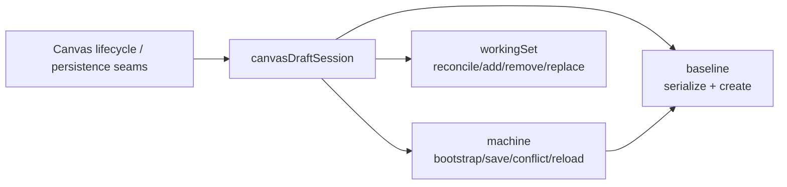
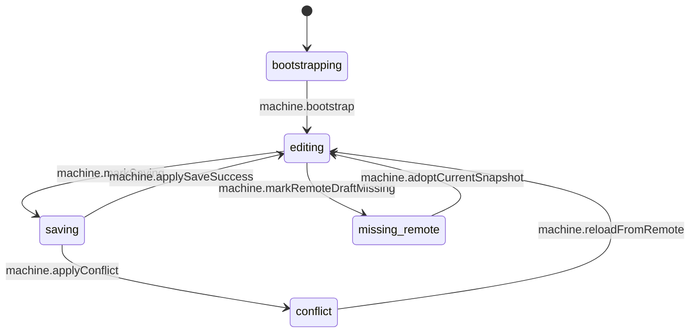
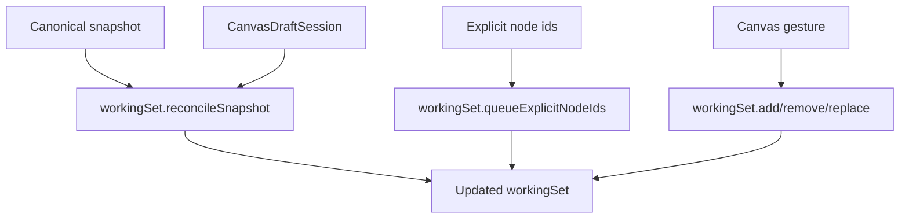

# Canvas Draft Session Component

## Purpose

Define the local component model for Canvas draft-session state in `apps/web`.

This page is intentionally narrower than the broader Canvas architecture reviews.
It explains:

- what `canvasDraftSession` is
- which files make up the component
- how the files relate to each other
- which API is public to the rest of the Canvas slice
- which invariants and transitions the component owns

## Governing Sources

- [Canvas Controller Current To Target Architecture](./canvas-controller-current-to-target-architecture.md)
- [Canvas Component Map And Modernization Review](./canvas-component-map-and-modernization-review.md)
- [Graph Sequences And State Machines](./graph-sequences-and-state-machines.md)
- [canvasDraftSession.ts](../../../../../../apps/web/src/app/views/canvas/canvasDraftSession.ts)
- [canvasDraftSession.types.ts](../../../../../../apps/web/src/app/views/canvas/canvasDraftSession.types.ts)
- [canvasDraftSessionMachine.ts](../../../../../../apps/web/src/app/views/canvas/canvasDraftSessionMachine.ts)
- [canvasDraftSessionBaseline.ts](../../../../../../apps/web/src/app/views/canvas/canvasDraftSessionBaseline.ts)
- [canvasDraftSessionWorkingSet.ts](../../../../../../apps/web/src/app/views/canvas/canvasDraftSessionWorkingSet.ts)
- [canvasDraftSession.test.ts](../../../../../../apps/web/src/app/views/canvas/canvasDraftSession.test.ts)
- [canvasDraftSession.architecture.test.ts](../../../../../../apps/web/src/app/views/canvas/canvasDraftSession.architecture.test.ts)

## Component Reading Rule

Read the component in this order:

1. `canvasDraftSession.ts`
   the public API entrypoint for the component
2. `canvasDraftSession.types.ts`
   the aggregate vocabulary
3. `canvasDraftSessionMachine.ts`
   the sync-state transitions and baseline replacement rules
4. `canvasDraftSessionBaseline.ts`
   deterministic baseline serialization and baseline creation
5. `canvasDraftSessionWorkingSet.ts`
   visible-node, visible-edge, and pending-explicit-node policy

If a change does not fit one of those concerns, it probably belongs in another
Canvas seam instead of this component.

## Why This Component Exists

`CanvasDraftSession` is the authoritative route-local draft aggregate for Canvas
authoring. It is the local truth for:

- sync posture
- remote draft baseline
- visible working-set scope
- pending explicit-node admission
- draft revision tracking

It is not responsible for:

- React Flow event translation
- transport or repository calls
- route wiring
- shell startup publication
- render projection

## Public API

The public entrypoint is `canvasDraftSession`.

It is a namespaced API, not a loose set of top-level helper exports. The
component is read through three explicit sub-surfaces:

- `canvasDraftSession.baseline`
  deterministic draft serialization and baseline creation
- `canvasDraftSession.machine`
  aggregate state transitions
- `canvasDraftSession.workingSet`
  aggregate working-set mutation and reconcile policy

This is a hard-cut shape. New call sites should use the namespaced API instead
of reintroducing flat helper imports.

## File Responsibilities

<!-- markdownlint-disable MD060 -->

| File                              | Owned concern                                                       | Public to other modules |
| --------------------------------- | ------------------------------------------------------------------- | ----------------------- |
| `canvasDraftSession.ts`           | component entrypoint and namespaced API export                      | yes                     |
| `canvasDraftSession.types.ts`     | aggregate types and transition argument vocabulary                  | yes                     |
| `canvasDraftSessionBaseline.ts`   | deterministic baseline serialization and baseline creation          | baseline API only       |
| `canvasDraftSessionMachine.ts`    | sync-state transitions over the aggregate                           | machine API only        |
| `canvasDraftSessionWorkingSet.ts` | visible scope mutation, reconcile, and pending explicit-node policy | working-set API only    |

<!-- markdownlint-enable MD060 -->

## Topology

## Transition Model

## Working-Set Policy Model

## Invariants

- `CanvasDraftSession` remains the authoritative route-local draft aggregate.
- Baseline serialization is deterministic for the same draft payload.
- Working-set mutation does not own transport concerns.
- Sync-state transitions do not own React Flow adapter semantics.
- The public API stays namespaced under `canvasDraftSession`; no parallel flat
  helper API should be reintroduced.

## Consumer Rules

- Runtime and lifecycle seams may call `canvasDraftSession.machine`.
- Authoring command seams may call `canvasDraftSession.workingSet`.
- Payload projection and save-signature logic may call
  `canvasDraftSession.baseline`.
- Consumers should not reach into subordinate files directly unless they are the
  component owner and are changing the component itself.

## Drift To Watch

- if `machine` starts accumulating serialization or payload shaping concerns,
  that logic should move back into `baseline` or another narrower seam
- if `workingSet` starts owning UI fallout, selection, or inspector policy, the
  command seam is regressing
- if `canvasDraftSession.ts` becomes a passive re-export barrel again, the
  component loses semantic entrypoint value
