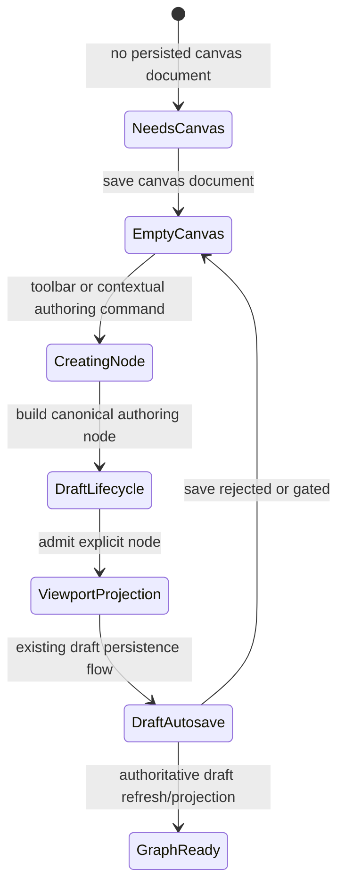
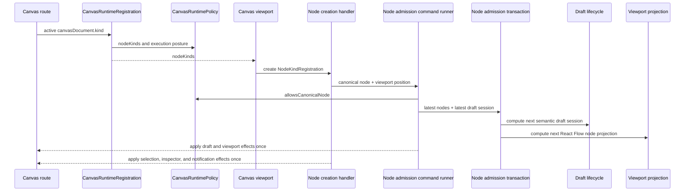

# Canvas Empty Authoring Entrypoint Component

## Purpose

This component owns the graph-first behavior that lets an operator create the
first Canvas node from an empty protected authoring draft without covering the
work surface with a passive onboarding card.

It is intentionally not a project-creation flow and not a source-import
fallback. Project/resource inventory may enrich later authoring, but the empty
Canvas state must be productive when the workspace has no nodes yet.

The sibling ready-canvas entrypoint is documented in
[Canvas Ready Node Authoring Entrypoint Component](./canvas-ready-node-authoring-entrypoint-component.md).
Both entrypoints share the same `onCreateAuthoringNode` command and governed
node admission path.

## Public API

The public API is the route/shell command seam:

```ts
type CreateCanvasAuthoringNode = (
  registration: NodeKindRegistration,
  position?: { x: number; y: number }
) => void;
```

The command is exposed through:

- `canvasGraphHandlerContracts.ts`
- `useCanvasAuthoringNodeCreationHandlers.ts`
- `canvasShellGraphCommandsBuilder.ts`
- `canvasShellLayoutBuilder.tsx`
- `CanvasCenterSurface.tsx`
- `CanvasViewport.tsx` when the command is invoked from the background context
  menu

The visible authoring catalog is the governed
`CanvasRuntimeRegistration.nodeKinds` catalog for the active
`canvasDocument.kind`. UI surfaces must not define a second ad hoc node-kind
list. Runtime admission is enforced by `CanvasRuntimePolicy`, not by the
visible list alone. For the `transformation` canvas kind, that catalog
currently resolves to `DVT_AUTHORING_NODE_KINDS`.

An existing empty Canvas renders the same viewport and governed authoring
commands as a populated Canvas. Loading, transport error, and read-only status
remain explicit route surfaces, but typed-empty state does not introduce a
second presentation or preference.

## Invariants

- Empty Canvas is a productive authoring state when mutations are allowed.
- Empty Canvas is read-only when mutations are denied.
- Empty authoring is only reachable after the host persists a canvas document.
- The empty catalog must resolve from the active `canvasDocument.kind`.
- The node catalog, graph strategy, and execution posture must resolve from the
  same `CanvasRuntimeRegistration`.
- First-node admission must call `CanvasRuntimePolicy.admission` before
  `CanvasGraphLifecycle` mutates the draft session.
- A node whose `kind`, `pluginId`, or role is not owned by the active runtime
  catalog must be rejected before any viewport or draft effect runs.
- Typed-empty state must leave the Canvas viewport unobstructed.
- First-node authoring remains available when source import is unavailable;
  source import is an optional capability, not the only route out of empty
  Canvas.
- Read-only empty posture uses the standard read-only banner and removes
  mutating node choices and commands without adding another center surface.
- Node creation must pass through the existing draft graph lifecycle.
- Context-menu node creation may supply a caller-owned flow position, but it
  must not fork node admission or identity generation.
- Consecutive node creation or drop commands in the same event turn must
  preserve every admitted node in both viewport state and the draft session.
- The first-node path must not fabricate startup nodes or local-only success.
- React Flow nodes are projection state; they are not semantic authority.
- `Import sources` remains a separate capability-gated command.
- Loose or disconnected authoring nodes are valid draft state.
- Run/preview must later depend on explicit execution selection, not whole-draft
  compile-by-default behavior.

## Transitions



## Component Flow

```mermaid
flowchart LR
  Host["CanvasPlaygroundHost"] --> Draft["Persist canvas document"]
  Draft --> Center["CanvasCenterSurface"]
  Center --> Workbench["canvasCenterSurfaceWorkbench"]
  Workbench --> Runtime["CanvasRuntimeRegistration"]
  Runtime --> Catalog["nodeKinds"]
  Runtime --> Execution["executionStrategy"]
  Runtime --> Policy["CanvasRuntimePolicy"]
  Catalog --> Command["handleCreateAuthoringNode"]
  Command --> Builder["canvasAuthoringNodeCommand"]
  Builder --> Runner["useCanvasNodeAdmissionCommandRunner"]
  Policy --> Runner
  Runner --> Transaction["resolveCanvasNodeAdmissionTransaction"]
  Transaction --> Admission["admitCanonicalNodeToCanvas"]
  Transaction --> Lifecycle["canvasGraphLifecycle.node.admitExplicit"]
  Transaction --> Projection["mapDroppedCanonicalNodeToCanvasNode"]
  Projection --> Viewport["Canvas viewport projection"]
  Lifecycle --> Autosave["protected authoring draft save"]
```



## Sequence



## Consumers

- `CanvasCenterSurface.tsx` leaves typed-empty posture on the normal Canvas
  viewport while still rendering loading and error states.
- `CanvasViewport.tsx` exposes the governed contextual authoring commands.
- `CanvasShell.tsx` and `CanvasShellMainPanel.tsx` carry shell composition.
- `useCanvasNodeAuthoringHandlers.ts` composes drop, creation, and removal
  authoring commands.
- `canvasControllerViewModel.ts` exposes the command to route composition.

## Fowler / DDD Reading

This is an application-service entrypoint over an aggregate mutation. The UI
selects a governed node kind and invokes a command. The command builds a
canonical authoring node, then delegates admission to a local command runner.
The runner calls the pure transaction over its latest local nodes and draft
session snapshot before applying React effects once. This keeps the same
aggregate lifecycle used by drop operations while avoiding stale-handler drift
between rapid commands.

Mature graph systems such as NiFi, Dagster, and dbt editors do not require a
whole project or a compile-valid graph before the first node can exist. They
allow partial authoring state, then validate execution on the selected runnable
unit. This component follows that split, but now does so behind a host-owned
canvas document identity rather than a route-global transformation default.

## Drift To Prevent

- Do not route first-node creation through project setup.
- Do not create another catalog beside the plugin-owned `CanvasKindRegistration`
  node kinds.
- Do not restore a passive typed-empty overlay or a preference whose only job is
  to hide that overlay.
- Do not bypass `admitCanonicalNodeToCanvas` or `canvasGraphLifecycle`.
- Do not bypass `useCanvasNodeAdmissionCommandRunner` when a handler needs to
  mutate both viewport nodes and the draft session.
- Do not bypass `CanvasRuntimePolicy.admission` for catalog-created nodes;
  visible catalog membership is not enough unless the command also validates
  the active runtime policy.
- Do not move viewport projection back into the canonical admission aggregate.
- Do not make `CanvasCenterSurface.tsx` own transport, workbench, and empty
  authoring decisions in one large method again.
- Do not skip the `needs_canvas` host posture by inventing a default document
  client-side.
- Do not make import capability the only path out of empty Canvas.
- Do not split the first-node catalog, graph strategy, and execution posture
  into separate route-level truth sources.
- Do not fork the first-node command from the ready-canvas create command.
