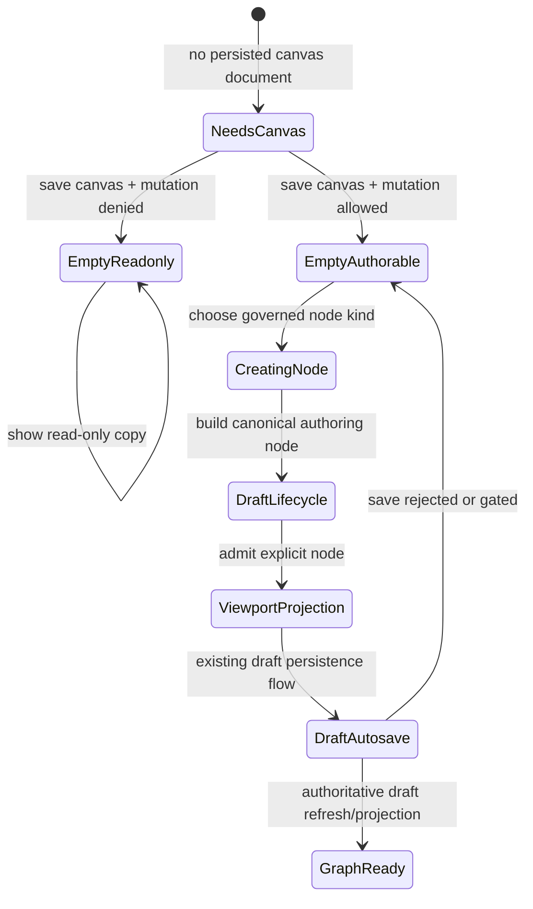
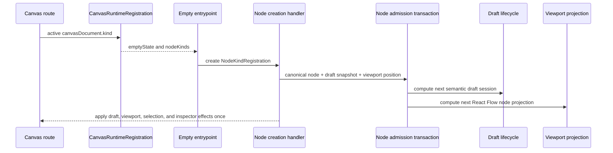

# Canvas Empty Authoring Entrypoint Component

## Purpose

This component owns the graph-first entrypoint that lets an operator create the
first Canvas node from an empty protected authoring draft.

It is intentionally not a project-creation flow and not a source-import
fallback. Project/resource inventory may enrich later authoring, but the empty
Canvas state must be productive when the workspace has no nodes yet.

## Public API

The public API is the route/shell command seam:

```ts
type CreateCanvasAuthoringNode = (registration: NodeKindRegistration) => void;
```

The command is exposed through:

- `canvasGraphHandlerContracts.ts`
- `useCanvasAuthoringNodeCreationHandlers.ts`
- `canvasShellGraphCommandsBuilder.ts`
- `canvasShellLayoutBuilder.tsx`
- `CanvasCenterSurface.tsx`

The visible authoring catalog is the governed
`CanvasRuntimeRegistration.nodeKinds` catalog for the active
`canvasDocument.kind`. UI surfaces must not define a second ad hoc node-kind
list. For the `transformation` canvas kind, that catalog currently resolves to
`DVT_AUTHORING_NODE_KINDS`.

The visible editable empty-state copy is also governed by the active
`CanvasRuntimeRegistration.emptyState`. The host may still own blocked or
read-only messages, but it must not flatten typed editable empty-state copy
back into one route-global fallback once the canvas kind is known.

## Invariants

- Empty Canvas is a productive authoring state when mutations are allowed.
- Empty Canvas is read-only when mutations are denied.
- Empty authoring is only reachable after the host persists a canvas document.
- The empty catalog must resolve from the active `canvasDocument.kind`.
- The empty catalog, empty copy, graph strategy, and execution posture must
  resolve from the same `CanvasRuntimeRegistration`.
- The typed editable empty-state title and first-node copy must resolve from
  `CanvasRuntimeRegistration.emptyState`.
- First-node authoring remains available when source import is unavailable;
  source import is an optional capability, not the only route out of empty
  Canvas.
- Read-only empty posture keeps typed copy visible but removes mutating node
  choices and commands.
- Node creation must pass through the existing draft graph lifecycle.
- The first-node path must not fabricate startup nodes or local-only success.
- React Flow nodes are projection state; they are not semantic authority.
- `Import sources` remains a separate capability-gated command.
- Loose or disconnected authoring nodes are valid draft state.
- Run/preview must later depend on explicit execution selection, not whole-draft
  compile-by-default behavior.

## Transitions



## Component Flow

```mermaid
flowchart LR
  Host["CanvasPlaygroundHost"] --> Draft["Persist canvas document"]
  Draft --> Center["CanvasCenterSurface"]
  Center --> Workbench["canvasCenterSurfaceWorkbench"]
  Workbench --> Runtime["CanvasRuntimeRegistration"]
  Runtime --> Copy["emptyState"]
  Runtime --> Catalog["nodeKinds"]
  Runtime --> Execution["executionStrategy"]
  Copy --> Catalog
  Catalog --> Command["handleCreateAuthoringNode"]
  Command --> Builder["canvasAuthoringNodeCommand"]
  Builder --> Transaction["resolveCanvasNodeAdmissionTransaction"]
  Transaction --> Admission["admitCanonicalNodeToCanvas"]
  Transaction --> Lifecycle["canvasGraphLifecycle.node.admitExplicit"]
  Transaction --> Projection["mapDroppedCanonicalNodeToCanvasNode"]
  Projection --> Viewport["Canvas viewport projection"]
  Lifecycle --> Autosave["protected authoring draft save"]
```



## Sequence



## Consumers

- `CanvasCenterSurface.tsx` renders the empty authoring surface from canonical
  route posture.
- `CanvasStateViews.tsx` renders the governed node-kind choices.
- `CanvasShell.tsx` and `CanvasShellMainPanel.tsx` carry shell composition.
- `useCanvasNodeAuthoringHandlers.ts` composes drop, creation, and removal
  authoring commands.
- `canvasControllerViewModel.ts` exposes the command to route composition.

## Fowler / DDD Reading

This is an application-service entrypoint over an aggregate mutation. The UI
selects a governed node kind and invokes a command. The command builds a
canonical authoring node and delegates to the same aggregate lifecycle used by
drop operations.

Mature graph systems such as NiFi, Dagster, and dbt editors do not require a
whole project or a compile-valid graph before the first node can exist. They
allow partial authoring state, then validate execution on the selected runnable
unit. This component follows that split, but now does so behind a host-owned
canvas document identity rather than a route-global transformation default.

## Drift To Prevent

- Do not route first-node creation through project setup.
- Do not create another catalog beside the plugin-owned `CanvasKindRegistration`
  node kinds.
- Do not flatten typed editable empty-state copy back into one route-global
  fallback once `canvasDocument.kind` is known.
- Do not bypass `admitCanonicalNodeToCanvas` or `canvasGraphLifecycle`.
- Do not move viewport projection back into the canonical admission aggregate.
- Do not make `CanvasCenterSurface.tsx` own transport, workbench, and empty
  authoring decisions in one large method again.
- Do not skip the `needs_canvas` host posture by inventing a default document
  client-side.
- Do not make import capability the only path out of empty Canvas.
- Do not split empty copy, first-node catalog, graph strategy, and execution
  posture into separate route-level truth sources.
