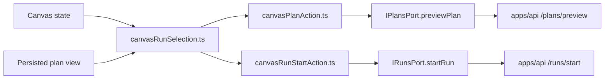
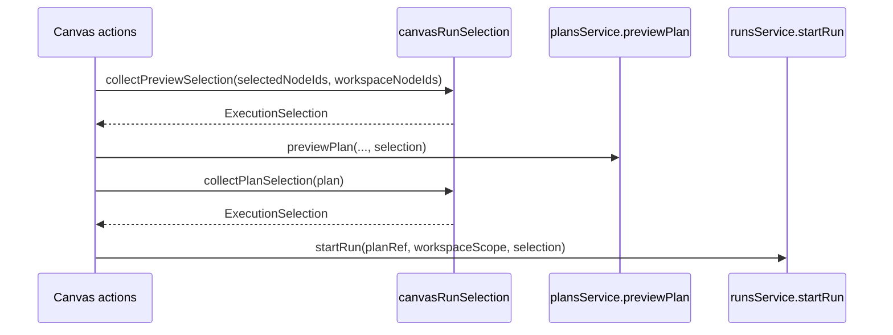

# Canvas execution selection component

This local guide documents the `apps/web` Canvas seam that turns authoring and
plan context into canonical `ExecutionSelection` for preview and run.

It exists so the browser emits one governed selection shape and does not invent
frontend-only execution DTOs.

Use this together with:

- [Execution selection component](../../planner/execution-selection-component.md)
- [Start-run client identity boundary](../runs/start-run-client-identity-boundary.md)
- [Graph Architecture Docs](./index.md)

## Owned concern

The component owns exactly one concern:

- derive caller-owned preview/run selection from Canvas state and persisted plan
  state as canonical `ExecutionSelection`

It does **not** own:

- planner executability rules
- protected draft reads
- runtime execution identity
- preview/result transport parsing

## Public API

- `collectPreviewSelection(selectedNodeIds, workspaceNodeIds)`
  Resolve preview intent from current Canvas selection or workspace fallback.
- `collectPlanSelection(plan)`
  Resolve run intent from the persisted plan view.
- `executeCanvasPlanAction(...)`
  Uses `collectPreviewSelection(...)` before calling `plansService.previewPlan`.
- `executeCanvasRunStartAction(...)`
  Uses `collectPlanSelection(...)` before calling `runsService.startRun`.

## Invariants

- `canvasRunSelection.ts` is the only module in this component that builds the
  canonical selection payload.
- `collectPreviewSelection(...)` and `collectPlanSelection(...)` both emit
  canonical `ExecutionSelection` via `parseExecutionSelection(...)`.
- preview and run actions import the named selection seam instead of redoing
  local array shaping inline.
- preview selection falls back from explicit selected nodes to visible
  workspace node ids only inside the same canonical seam.
- run selection preserves persisted plan order while deduplicating node ids.

## Component map

## Transitions

## Consumers

- `apps/web/src/app/views/canvas/canvasRunSelection.ts`
- `apps/web/src/app/views/canvas/canvasPlanAction.ts`
- `apps/web/src/app/views/canvas/canvasRunStartAction.ts`
- `apps/web/src/app/ports/runs.ts`
- `apps/web/src/app/services/runs/runsService.api.ts`
- `apps/web/src/app/services/plans/plansService.api.ts`
- `apps/web/src/app/views/canvas/canvasExecutionSelection.architecture.test.ts`
- `apps/web/src/app/views/canvas/canvasRunStartIdentity.architecture.test.ts`

## Extension rules

- keep canonical selection parsing in `canvasRunSelection.ts`
- do not add a web-local preview/run selection DTO
- do not push planner-local diagnostics into the browser selection seam
- keep preview and run consumers importing the named seam instead of shaping
  ad hoc payloads inline
