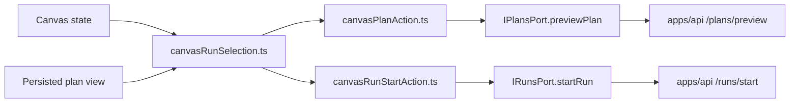
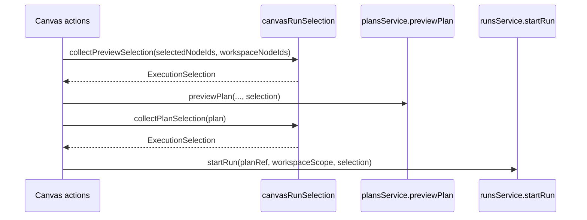
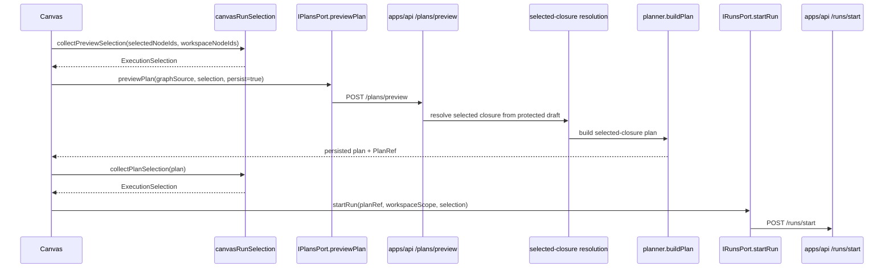
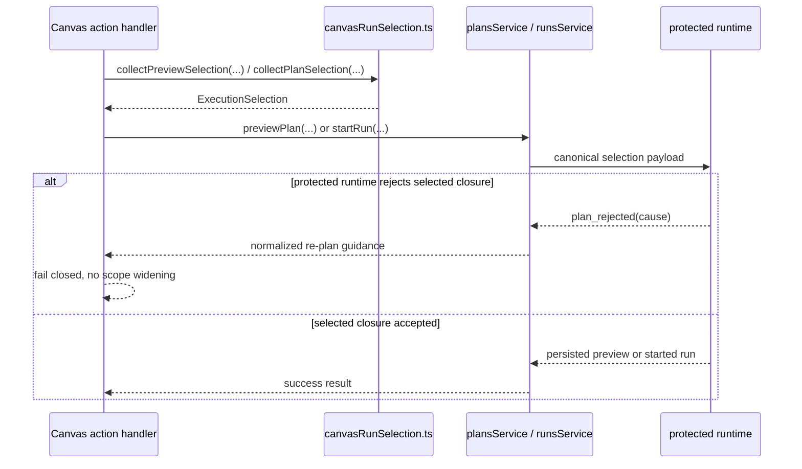
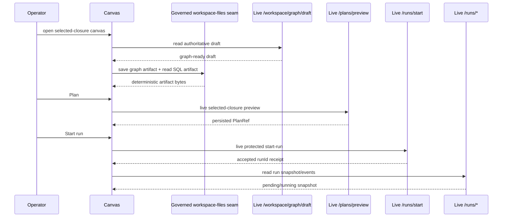

# Canvas execution selection component

This local guide documents the `apps/web` Canvas seam that turns authoring and
plan context into canonical `ExecutionSelection` for preview and run.

It exists so the browser emits one governed selection shape and does not invent
frontend-only execution DTOs.

Use this together with:

- [Execution selection component](../../planner/execution-selection-component.md)
- [Start-run client identity boundary](../runs/start-run-client-identity-boundary.md)
- [Graph Architecture Docs](./index.md)

## Owned concern

The component owns exactly one concern:

- derive caller-owned preview/run selection from Canvas state and persisted plan
  state as canonical `ExecutionSelection`

It does **not** own:

- planner executability rules
- protected draft reads
- runtime execution identity
- preview/result transport parsing

## Public API

- `collectPreviewSelection(selectedNodeIds, workspaceNodeIds)`
  Resolve preview intent from current Canvas selection or workspace fallback.
- `collectPlanSelection(plan)`
  Resolve run intent from the persisted plan view.
- `executeCanvasPlanAction(...)`
  Uses `collectPreviewSelection(...)` before calling `plansService.previewPlan`.
- `executeCanvasRunStartAction(...)`
  Uses `collectPlanSelection(...)` before calling `runsService.startRun`.

## Invariants

- `canvasRunSelection.ts` is the only module in this component that builds the
  canonical selection payload.
- `IRunsPort.startRun(...)` returns a presentation receipt
  (`RunStartReceipt`) containing `runId` plus acceptance posture, not an
  engine-owned provider run reference.
- `collectPreviewSelection(...)` and `collectPlanSelection(...)` both emit
  canonical `ExecutionSelection` via `parseExecutionSelection(...)`.
- preview and run actions import the named selection seam instead of redoing
  local array shaping inline.
- preview selection falls back from explicit selected nodes to visible
  workspace node ids only inside the same canonical seam.
- run selection preserves persisted plan order while deduplicating node ids.
- protected runtime rejection causes are normalized in the plans and runs
  service adapters, not inside the selection seam.
- the live-runtime browser lane may keep `workspace/files` on a governed
  support seam while that backend surface does not exist, but it must not stub
  `workspace/graph/draft`, `plans/preview`, `runs/start`, or run reads.

## Component map

## Transitions

## End-to-end preview-persist-run sequence

This keeps the browser on one narrow posture:

- preview emits intent plus graph source for the selected closure
- preview persistence creates the authoritative `PlanRef`
- run start reuses that persisted proof and never invents client-owned run
  identity or whole-draft execution scope

## Fail-closed runtime rejection posture

Protected runtime rejection causes stay outside `canvasRunSelection.ts`.

The browser contract is:

1. selection seam emits canonical `ExecutionSelection`
2. service adapters normalize protected runtime rejection envelopes into
   user-facing error messages
3. Canvas actions surface those messages without widening scope or retrying
   against the full draft

Browser proof for this posture now lives in:

- `apps/web/cypress/e2e/canvas/canvas-preview-run-persisted.cy.ts`
- `apps/web/cypress/e2e/canvas/canvas-preview-run-live.cy.ts`
- `apps/web/src/app/services/plans/plansService.test.ts`
- `apps/web/src/app/services/runs/runsService.test.ts`

## Live-runtime browser truth boundary

`TF-E2-E-D` is now closed with one hybrid live-runtime lane:

- protected authoring/runtime routes are live:
  - `GET /workspace/graph/draft`
  - `PUT /workspace/graph/draft`
  - `POST /plans/preview`
  - `POST /runs/start`
  - `GET /runs`
  - `GET /runs/:runId`
  - `GET /runs/:runId/events`
- `workspace/files` remains on one governed test-support seam until the backend
  actually owns that artifact surface

That boundary remains intentional. The browser lane proves the real protected
runtime without inventing a fake backend for the authoritative draft or
execution route, and it does not overclaim live proof for seams the repo does
not yet implement.

The governed proof surface for that lane is:

- `apps/web/cypress/e2e/canvas/canvas-preview-run-live.cy.ts`
- `apps/web/cypress/support/liveProtectedRuntime.ts`
- `apps/web/cypress/support/canvasExecutionSelection.ts`
- `apps/web/cypress/support/canvasPreviewArtifacts.ts`
- `scripts/run-selected-closure-live-proof.cjs`

## Consumers

- `apps/web/src/app/views/canvas/canvasRunSelection.ts`
- `apps/web/src/app/views/canvas/canvasPlanAction.ts`
- `apps/web/src/app/views/canvas/canvasRunStartAction.ts`
- `apps/web/src/app/ports/runs.ts`
- `apps/web/src/app/services/runs/runsService.api.ts`
- `apps/web/src/app/services/plans/plansService.api.ts`
- `apps/web/src/app/services/api/protectedRuntimeRejection.ts`
- `apps/web/src/app/views/canvas/canvasExecutionSelection.architecture.test.ts`
- `apps/web/src/app/views/canvas/canvasRunStartIdentity.architecture.test.ts`
- `apps/web/cypress/e2e/canvas/canvas-preview-run-persisted.cy.ts`
- `apps/web/cypress/e2e/canvas/canvas-preview-run-live.cy.ts`
- `apps/web/cypress/support/liveProtectedRuntime.ts`
- `scripts/run-selected-closure-live-proof.cjs`

## Extension rules

- keep canonical selection parsing in `canvasRunSelection.ts`
- do not add a web-local preview/run selection DTO
- do not push planner-local diagnostics into the browser selection seam
- keep protected runtime rejection normalization in service adapters, not in
  `canvasRunSelection.ts`
- keep preview and run consumers importing the named seam instead of shaping
  ad hoc payloads inline
