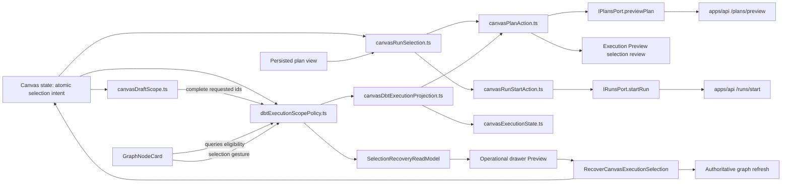
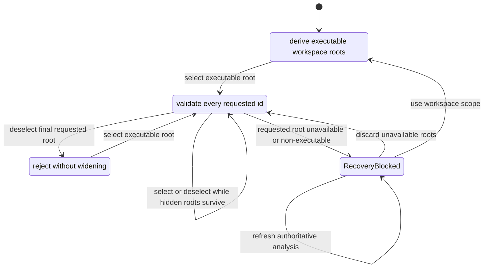
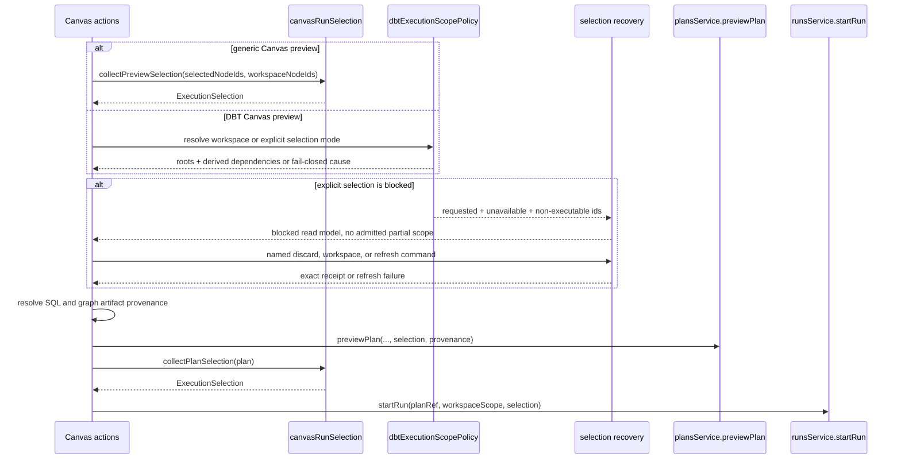
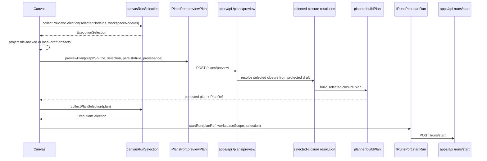
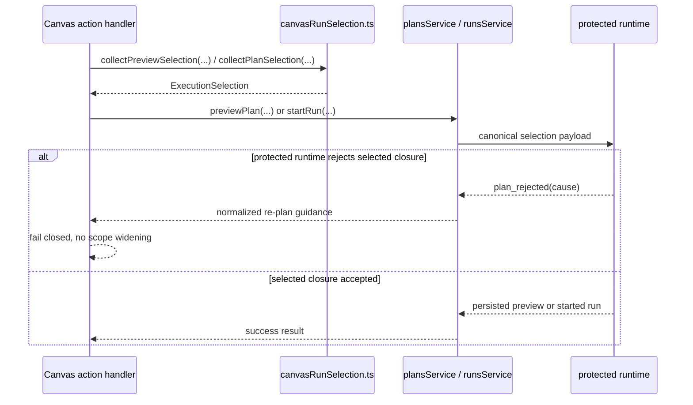
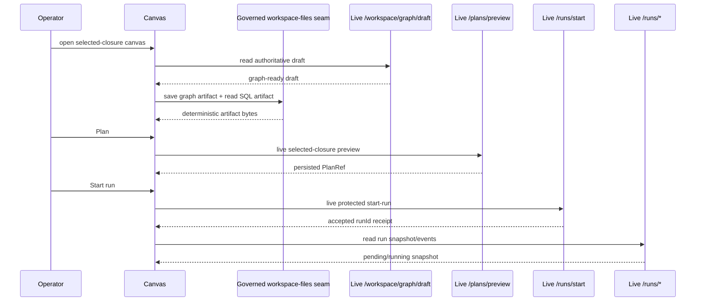

# Canvas execution selection component

This local guide projects the Planning DB component that turns authoring and
plan context into canonical `ExecutionSelection` for preview and run while
preserving the difference between absent selection and invalid explicit intent.

It exists so the browser emits one governed selection shape and does not invent
frontend-only execution DTOs.

Use this together with:

- [Execution selection component](../../planner/execution-selection-component.md)
- [Start-run client identity boundary](../runs/start-run-client-identity-boundary.md)
- [Graph Architecture Docs](./index.md)

## Owned concern

The component owns exactly one concern:

- derive caller-owned preview/run selection from Canvas state and persisted plan
  state as canonical `ExecutionSelection`
- classify which DBT resources are valid execution-selection roots
- derive DBT executable scope without dropping or widening non-empty explicit
  selection intent
- distinguish roots requested by the user from executable dependencies included
  by closure
- project blocked selection facts and execute only explicit recovery strategies
  with immutable action receipts

It does **not** own:

- planner executability rules
- graph-node-card rendering
- protected draft reads
- runtime execution identity
- preview/result transport parsing

## Public API

- `collectPreviewSelection(selectedNodeIds, workspaceNodeIds)`
  Resolve preview intent from current Canvas selection or workspace fallback.
- `collectPlanSelection(plan)`
  Resolve run intent from the persisted plan view.
- `resolveDbtExecutionScope(...)`
  Resolve executable DBT roots and dependencies while rejecting any explicit
  selection that contains an unavailable or non-executable resource.
- `isDbtExecutionSelectableNode(...)`
  Report whether a canonical DBT node can be an explicit execution root. The
  graph card consumes this query; it does not reimplement the kind policy.
- `canOfferDbtExecutionSelectionToggle(...)`
  Expose `Select` only for executable roots while preserving `Deselect` as the
  recovery action for an invalid resource selected by an older client.
- `applyDbtExecutionSelectionToggle(...)`
  Apply a user selection gesture to the complete requested-id set and return
  one atomic explicit intent. Hidden requested ids survive visible-node
  toggles and selecting another available root; deselecting the final root
  remains explicit-empty.
- `buildCanvasExecutionSelectionRecoveryReadModel(...)`
  Classify requested, unavailable, non-executable, derived, and admitted ids
  without admitting a partial scope.
- `recoverCanvasExecutionSelection(...)`
  Execute one named `RecoverCanvasExecutionSelection` strategy and return the
  resulting atomic intent plus an exact receipt.
- `useCanvasExecutionSelectionRecovery(...)`
  Adapt recovery commands to the existing selection store and authoritative
  graph refresh without owning either authority.
- `buildDbtExecutionIntentDraftSignature(...)`
  Bind preview identity to selection mode and requested roots as well as the
  executable graph projection, so equal dependency closure does not erase a
  caller-intent change.
- `buildCanvasDbtExecutionProjection(...)`
  Build the one DBT projection consumed by both Preview and readiness.
- `executeCanvasPlanAction(...)`
  Uses `collectPreviewSelection(...)` before calling `plansService.previewPlan`.
  For SQL-first transformation canvases, it also requires preview provenance to
  resolve through workspace artifacts. File-backed transforms read the existing
  SQL file; canvas-authored transforms without a path first project a
  deterministic SQL artifact and design-graph artifact through the workspace
  file-content command rail.
- `executeCanvasRunStartAction(...)`
  Uses `collectPlanSelection(...)` before calling `runsService.startRun`.

## Invariants

- `canvasRunSelection.ts` owns generic preview/run selection payloads;
  `dbtExecutionScopePolicy.ts` owns DBT executable-scope intent.
- `IRunsPort.startRun(...)` returns a presentation receipt
  (`RunStartReceipt`) containing `runId` plus acceptance posture, not an
  engine-owned provider run reference.
- `collectPreviewSelection(...)` and `collectPlanSelection(...)` both emit
  canonical `ExecutionSelection` via `parseExecutionSelection(...)`.
- preview and run actions import the named selection seam instead of redoing
  local array shaping inline.
- absent preview selection may default to visible workspace node ids.
- workspace fallback and explicit empty intent are different states. Explicit
  empty intent fails closed and never expands to the executable workspace.
- every id in a non-empty explicit DBT selection must be an available executable
  root; source, seed, macro, exposure, metric, unknown, and out-of-workspace ids
  make the complete selection fail closed.
- a rejected explicit selection is never filtered into a smaller successful
  selection and never defaults to the whole workspace.
- raw non-empty DBT selection intent reaches execution validation before UI
  visibility reconciliation; presentation may hide unavailable ids but cannot
  silently remove them from the execution request.
- DBT selection gestures mutate the complete requested-id set rather than the
  filtered visible selection. Deselecting one visible root therefore preserves
  hidden requested ids.
- selecting an available executable root never discards unavailable requested
  ids. Replacement happens only through an explicit recovery command.
- blocked recovery never exposes a filtered admitted scope: requested,
  unavailable, and non-executable ids remain visible while admitted scope is
  empty.
- the three recovery strategies are disjoint: discard removes unavailable ids
  only; workspace replacement changes mode explicitly; refresh preserves the
  complete intent until authoritative analysis completes.
- every successful recovery command emits a receipt naming the strategy,
  affected ids, retained ids, and resulting mode. Refresh failure emits an
  error and never fabricates a receipt.
- successful DBT scope resolution exposes requested root ids separately from
  dependency ids that were included by transitive closure.
- DBT draft identity includes selection mode and requested roots in addition to
  the derived executable closure. Selecting a downstream root is not identical
  to selecting that root and its already-included dependency.
- the execution-projection compositor is the only authority that builds DBT
  draft identity; the lower-level graph-source projector cannot emit a partial
  signature without caller intent.
- DBT node cards render `Select` only for roots admitted by
  `isDbtExecutionSelectableNode(...)`; an already-selected invalid resource
  renders only `Deselect` so the caller can recover without scope widening.
- `canvasDbtExecutionProjection.ts` is shared by Preview and readiness so the
  enabled action and the emitted request cannot disagree.
- route state commands, scope projectors, readiness, and Preview consume one
  `CanvasExecutionSelectionIntent`; they never transport mode and requested ids
  as independently mutable parameters.
- SQL-first Plan never calls `previewPlan` with browser-only graph state:
  `GenerateTransformationWorkspaceArtifacts` must provide SQL and graph
  artifact provenance first.
- Non-authoring SQL transforms without a workspace path still fail closed;
  only canvas-authored nodes can receive deterministic local-draft artifact
  paths during Plan.
- run selection preserves persisted plan order while deduplicating node ids.
- protected runtime rejection causes are normalized in the plans and runs
  service adapters, not inside the selection seam.
- the live-runtime browser lane may keep `workspace/files` on a governed
  support seam while that backend surface does not exist, but it must not stub
  `workspace/graph/draft`, `plans/preview`, `runs/start`, or run reads.

## Component map



## Transitions

The route-local state forms a closed selection algebra:



Visibility is a presentation projection, not another selection state. It cannot
turn `ExplicitNonEmpty` into `Workspace` or remove hidden requested ids.

Recovery is a named command, not a side effect of ordinary selection. The
`CollectCanvasExecutionSelection` query and `RecoverCanvasExecutionSelection`
command therefore remain separate rails.



## End-to-end preview-persist-run sequence



This keeps the browser on one narrow posture:

- preview emits intent plus graph source for the selected closure
- preview persistence creates the authoritative `PlanRef`
- run start reuses that persisted proof and never invents client-owned run
  identity or whole-draft execution scope

## Fail-closed runtime rejection posture

Protected runtime rejection causes stay outside `canvasRunSelection.ts`.

The browser contract is:

1. selection seam emits canonical `ExecutionSelection`
2. service adapters normalize protected runtime rejection envelopes into
   user-facing error messages
3. Canvas actions surface those messages without widening scope or retrying
   against the full draft



Browser proof for this posture now lives in:

- `apps/web/cypress/e2e/canvas/canvas-dbt-author-code-run-live.cy.ts`
- `apps/web/cypress/e2e/canvas/canvas-dbt-selection-recovery-live.cy.ts`
- `apps/web/src/app/services/plans/plansService.test.ts`
- `apps/web/src/app/services/runs/runsService.test.ts`

## Demanding-user E2E story matrix

These stories are the regression checklist for the product promise. They must
stay tied to executable browser proof instead of remaining a loose QA note.

| Story       | User intent                                                                                                    | Proof surface                                                                     |
| ----------- | -------------------------------------------------------------------------------------------------------------- | --------------------------------------------------------------------------------- |
| `UX-E2E-01` | Create the first graph/canvas node through the UI and restore it.                                              | `apps/web/cypress/e2e/canvas/canvas-first-authoring-live.cy.ts`                   |
| `UX-E2E-02` | Build a dbt graph, plan the selected closure, execute it, and see result.                                      | `apps/web/cypress/e2e/canvas/canvas-dbt-author-code-run-live.cy.ts`               |
| `UX-E2E-03` | Return from a dbt run result, plan again, and execute again.                                                   | `apps/web/cypress/e2e/dbt/dbt-project-preview-run-live.cy.ts`                     |
| `UX-E2E-04` | Recover a selected dbt closure against the protected runtime.                                                  | `apps/web/cypress/e2e/canvas/canvas-dbt-selection-recovery-live.cy.ts`            |
| `UX-E2E-05` | Configure dbt-compatible Models, select origin, view generated code, and run.                                  | `apps/web/cypress/e2e/canvas/canvas-dbt-author-code-run-live.cy.ts`               |
| `UX-E2E-06` | Preserve authored graph and code through a project snapshot round trip.                                        | `apps/web/cypress/e2e/canvas/canvas-project-snapshot-roundtrip.cy.ts`             |
| `UX-E2E-07` | See explicit re-plan guidance instead of raw transport failures.                                               | `apps/web/src/app/views/canvas/useCanvasExecutionActions.runStartGuards.test.tsx` |
| `UX-E2E-08` | Select only executable DBT roots and verify Preview distinguishes requested resources from dependency closure. | `apps/web/cypress/e2e/dbt/dbt-project-preview-run-live.cy.ts`                     |

Minimum local product gate for this component:

```bash
pnpm --filter @dvt/web test:e2e:native -- --spec cypress/e2e/canvas/canvas-dbt-author-code-run-live.cy.ts
```

Live protected-runtime lanes remain separate because they require the local
backend and authorization context:

```bash
pnpm --filter @dvt/web test:e2e:first-authoring:live
pnpm --filter @dvt/web test:e2e:selected-closure:live
```

## Live-runtime browser truth boundary

`TF-E2-E-D` is now closed with one hybrid live-runtime lane:

- protected authoring/runtime routes are live:
  - `GET /workspace/graph/draft`
  - `PUT /workspace/graph/draft`
  - `POST /plans/preview`
  - `POST /runs/start`
  - `GET /runs`
  - `GET /runs/:runId`
  - `GET /runs/:runId/events`
- `workspace/files` remains on one governed test-support seam until the backend
  actually owns that artifact surface

That boundary remains intentional. The browser lane proves the real protected
runtime without inventing a fake backend for the authoritative draft or
execution route, and it does not overclaim live proof for seams the repo does
not yet implement.



The governed proof surface for that lane is:

- `apps/web/cypress/e2e/canvas/canvas-dbt-author-code-run-live.cy.ts`
- `apps/web/cypress/e2e/canvas/canvas-dbt-selection-recovery-live.cy.ts`
- `apps/web/cypress/support/liveProtectedRuntime.ts`
- `apps/web/cypress/support/canvasExecutionSelection.ts`
- `apps/web/cypress/support/canvasPreviewArtifacts.ts`
- `scripts/run-selected-closure-live-proof.cjs`

## Consumers

- `apps/web/src/app/views/canvas/canvasRunSelection.ts`
- `apps/web/src/app/types/canvasExecutionSelection.ts`
- `apps/web/src/app/stores/canvasInteractionStore.ts`
- `apps/web/src/app/views/canvas/canvasDraftScope.ts`
- `apps/web/src/app/views/canvas/dbtExecutionScopePolicy.ts`
- `apps/web/src/app/views/canvas/canvasExecutionSelectionRecovery.ts`
- `apps/web/src/app/views/canvas/useCanvasExecutionSelectionRecovery.ts`
- `apps/web/src/app/components/shell/OperationalDrawerSelectionRecoveryView.tsx`
- `apps/web/src/app/views/canvas/canvasPlanAction.ts`
- `apps/web/src/app/views/canvas/useCanvasControllerReadModel.ts`
- `apps/web/src/app/views/canvas/useDbtProjectFileCanvasController.ts`
- `apps/web/src/app/components/Modals.tsx`
- `apps/web/src/app/views/canvas/canvasRunStartAction.ts`
- `apps/web/src/app/ports/runs.ts`
- `apps/web/src/app/services/runs/runsService.api.ts`
- `apps/web/src/app/services/plans/plansService.api.ts`
- `apps/web/src/app/services/api/protectedRuntimeRejection.ts`
- `apps/web/src/app/views/canvas/canvasRunSelection.test.ts`
- `apps/web/src/app/views/canvas/canvasRunStartIdentity.architecture.test.ts`
- `apps/web/cypress/e2e/canvas/canvas-dbt-author-code-run-live.cy.ts`
- `apps/web/cypress/e2e/canvas/canvas-dbt-selection-recovery-live.cy.ts`
- `apps/web/cypress/support/liveProtectedRuntime.ts`
- `scripts/run-selected-closure-live-proof.cjs`

## Extension rules

- keep canonical selection parsing in `canvasRunSelection.ts`
- keep DBT root eligibility and closure classification in
  `dbtExecutionScopePolicy.ts`; renderers and controllers only consume it
- keep the atomic discriminated intent in `canvasExecutionSelection.ts` and its
  sole route-local snapshot in the pre-existing `canvasInteractionStore.ts`
- never split intent mode and requested ids into independently mutable state,
  and never create a second selection store
- use the explicit intent replacement command for DBT selection gestures; do
  not pass optional mode flags through generic selected-node setters
- do not silently filter invalid ids from a non-empty explicit selection
- do not infer workspace fallback from an empty requested-id array without also
  reading the intent mode
- apply DBT selection gestures through `applyDbtExecutionSelectionToggle(...)`;
  do not rebuild requested intent from the visible-node projection
- use `RecoverCanvasExecutionSelection` for discard, workspace replacement, or
  authoritative refresh; ordinary selection gestures cannot perform recovery
- reconcile visible selection and inspector state without mutating raw DBT
  execution intent before validation
- keep requested roots and derived dependencies distinct in the Preview read
  model even though the canonical server selection contains their complete
  authorized closure
- do not add a web-local preview/run selection DTO
- do not push planner-local diagnostics into the browser selection seam
- keep protected runtime rejection normalization in service adapters, not in
  `canvasRunSelection.ts`
- keep preview and run consumers importing the named seam instead of shaping
  ad hoc payloads inline
