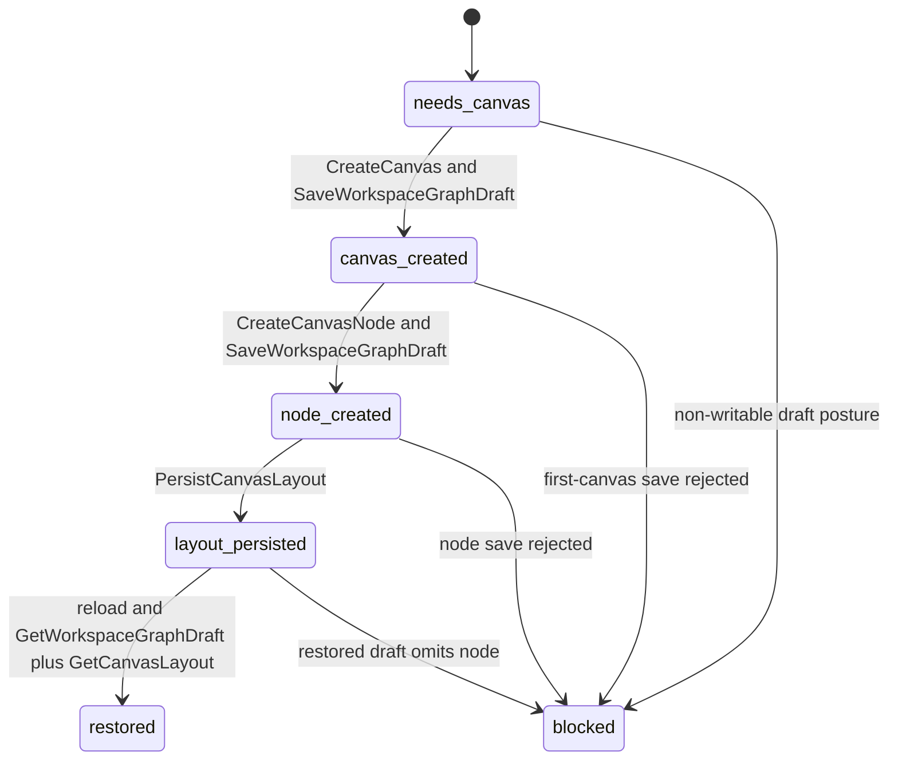
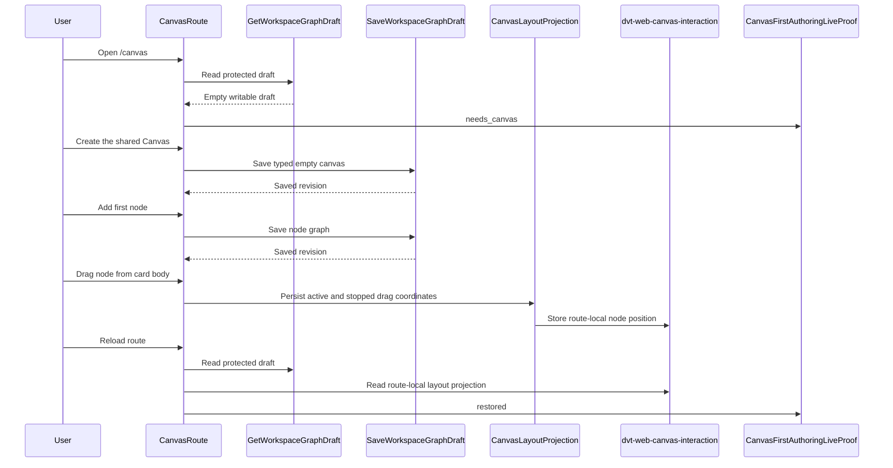

# Canvas First Authoring Live Proof Component

## Purpose

This component defines the implemented design for `TF-E2-M-C`.

It owns the semantic proof that Canvas can move from a clean protected draft
read to the first typed canvas, first node, persisted drag position, and
restored route state through the live runtime. It exists to keep product
acceptance, unit tests, architecture tests, and Cypress coverage aligned on the
same feature boundary.

## Governing Sources

- `AGENTS.md`
- `docs/planning/status/governance-document-rule-inventory.md`
- `docs/guides/ai-work-protocol.md`
- `docs/architecture/command-query-rail-governance.md`
- `docs/architecture/fowler-opportunity-planning-governance.md`
- `docs/planning/state/github-mvp-issue-workflow.md`
- `docs/planning/proposals/mandatory/frontend-and-ux/tf-e2-m-c-first-canvas-first-node-live-proof-implementation-plan-20260501.md`
- `docs/planning/proposals/mandatory/frontend-and-ux/tf-e2-k-playground-complete-cycle-stories-20260424.md`
- `docs/architecture/components/web/graph/canvas-layout-persistence-component.md`
- `docs/architecture/components/web/graph/canvas-draft-access-posture-component.md`
- `packages/@dvt/contracts/src/contracts/planner/WorkspaceGraphDraft.v1.ts`

## Owned Concern

Owned concern: describe and verify the route-local product transition from an
empty authoritative Canvas draft to a restored first authored graph.

The component does not own:

- protected runtime authentication;
- backend workspace graph draft storage;
- planner preview or run-start behavior;
- plugin execution behavior;
- React Flow rendering internals;
- tenant or project onboarding.

Those concerns stay behind their existing ports and component guides.

## Closed Defaults

The component treats the first-node defaults as domain facts for this feature,
not as implementation-time choices.

| Canvas runtime registration | First node kind | First node id     | First node label | Registration source                                |
| --------------------------- | --------------- | ----------------- | ---------------- | -------------------------------------------------- |
| `transformation`            | `dvt:transform` | `dvt-transform-1` | `Transform 1`    | `apps/web/src/app/plugins/dvt/dvtContributions.ts` |

`canvasAuthoringNodeCommand.ts` owns the id and label construction. This
component guide fixes the implemented first values so later changes cannot pick
a different node kind without updating the rail and tests.

## Public API

The implementation owns a small pure proof module family and Cypress-owned
live proof helpers. Each proof module has one owned concern: vocabulary,
first-node defaults, restored-layout matching, invariant checks, or transition
derivation.

| API                                                 | Owner                                         | Responsibility                                                           |
| --------------------------------------------------- | --------------------------------------------- | ------------------------------------------------------------------------ |
| `CanvasFirstAuthoringLiveProof`                     | `canvasFirstAuthoringLiveProof.types.ts`      | Closed discriminated state for first-authoring proof.                    |
| `CanvasFirstAuthoringLiveProofInput`                | `canvasFirstAuthoringLiveProof.types.ts`      | Named input object for draft, active canvas, node, layout, and reload.   |
| `CanvasFirstAuthoringLiveProofTransition`           | `canvasFirstAuthoringLiveProof.types.ts`      | Allowed transition names used by tests and diagnostics.                  |
| `FIRST_AUTHORING_DEFAULTS`                          | `canvasFirstAuthoringFirstNodePolicy.ts`      | Closed first-node default for the shared first-authored Canvas.          |
| `resolveExpectedFirstNode(canvas)`                  | `canvasFirstAuthoringFirstNodePolicy.ts`      | Resolves the expected first node for the registered Canvas runtime.      |
| `matchesExpectedFirstNode(node, expectedNode)`      | `canvasFirstAuthoringFirstNodePolicy.ts`      | Compares actual first-node identity, kind, and label.                    |
| `hasRestoredLayout(restoredDraft, layout)`          | `canvasFirstAuthoringRestoredLayoutPolicy.ts` | Verifies restored route-local coordinates match persisted coordinates.   |
| `deriveCanvasFirstAuthoringLiveProof(input)`        | `canvasFirstAuthoringLiveProof.ts`            | Pure decision function for current proof transition state.               |
| `isCanvasFirstAuthoringProofComplete(proof)`        | `canvasFirstAuthoringProofInvariant.ts`       | Boolean completion helper for tests and route diagnostics.               |
| `assertCanvasFirstAuthoringInvariant(proof)`        | `canvasFirstAuthoringProofInvariant.ts`       | Test helper that fails on impossible transition combinations.            |
| `requireLiveProtectedRuntimeEnv()`                  | `canvasFirstAuthoring.ts`                     | Fails the mandatory live proof when API runtime env is missing.          |
| `skipWhenFirstAuthoringLiveEnvIsMissing(ctx)`       | `canvasFirstAuthoring.ts`                     | Allows optional local Cypress runs to skip only when live env is absent. |
| `resolveLiveFirstAuthoringWorkspaceSession()`       | `canvasFirstAuthoring.ts`                     | Cypress-only test-owned, run-unique workspace session resolver.          |
| `assertLiveFirstAuthoringDraftScopeIsClean()`       | `canvasFirstAuthoring.ts`                     | Cypress-only preflight that fails dirty scopes without mutating them.    |
| `waitForLiveFirstAuthoringDraftNode()`              | `canvasFirstAuthoring.ts`                     | Cypress-only protected query wait for the created graph node.            |
| `waitForLiveFirstAuthoringLayoutPositionChange()`   | `canvasFirstAuthoring.ts`                     | Cypress-only route-local layout wait using `dvt-web-canvas-interaction`. |
| `scripts/run-canvas-first-authoring-live-proof.cjs` | proof runner                                  | Boots protected runtime, web, grants, and Cypress for mandatory proof.   |

The pure proof module is intentionally passive. It does not mutate graph state,
call HTTP, call TanStack Query, or read browser storage. The Cypress helpers
may issue protected `GET /workspace/graph/draft` reads and inspect
`dvt-web-canvas-interaction`; they must not mutate authoritative graph state
outside the UI-owned command flow.

## Command And Query Rails

| Rail                                 | Type    | DDD owner                                | Component rule                                                                     |
| ------------------------------------ | ------- | ---------------------------------------- | ---------------------------------------------------------------------------------- |
| `GetWorkspaceGraphDraft`             | query   | `WorkspaceGraphDraft` read boundary      | source of clean, created, and restored graph-authoritative truth                   |
| `CreateCanvas`                       | command | `CanvasDocument` aggregate               | creates the first typed document from `needs_canvas`                               |
| `CreateCanvasNode`                   | command | `CanvasAuthoringGraph` aggregate         | creates a node inside an existing active canvas                                    |
| `SaveWorkspaceGraphDraft`            | command | `WorkspaceGraphDraft` write boundary     | persists document and node graph through existing CAS behavior                     |
| `PersistCanvasLayout`                | command | `CanvasLayoutProjection` value object    | persists active and stopped drag coordinates outside graph authority               |
| `GetCanvasLayout`                    | query   | `CanvasLayoutProjection` value object    | restores coordinates after route revisit or hard reload                            |
| `RunCanvasFirstAuthoringLiveProof`   | command | repository proof runner                  | executes the protected-runtime Cypress proof without zero-pass skips               |
| `ConfigureCanvasViewportPreferences` | command | `CanvasViewportPreferences` value object | changes grid visibility, grid color, and snap-to-grid locally without graph writes |

No new command or query may be implemented for this component unless the
implementation plan and repo command-query catalog are updated first.

## DDD Objects

| Object                          | Type                 | Invariant                                                        |
| ------------------------------- | -------------------- | ---------------------------------------------------------------- |
| `WorkspaceGraphDraft`           | Aggregate boundary   | only protected draft reads provide route graph authority         |
| `CanvasDocument`                | Aggregate            | first canvas is typed and created once from empty draft truth    |
| `CanvasAuthoringGraph`          | Aggregate            | nodes cannot exist without an active canvas document             |
| `CanvasNodeDraft`               | Entity               | node id, type, and canvas ownership survive save and reload      |
| `CanvasLayoutProjection`        | Value object         | coordinates are renderer-local and never replace graph authority |
| `CanvasFirstAuthoringLiveProof` | Domain service model | transition state is pure, closed, and covered by tests           |
| `CanvasDraftAccessPosture`      | Policy model         | commands execute only when draft posture is writable             |

## Invariants

- A clean startup with no authoritative draft must render the create-canvas
  entrypoint and no seeded project nodes.
- Live Cypress proof scopes must be unique per Cypress run and stable inside a
  spec so reruns do not fail because a previous run already saved a draft.
- The live proof runner must assert every run-unique first-authoring project in
  the local protected-runtime bearer and must seed matching backend grants
  before Cypress starts.
- Route startup must preserve the variant-specific preselected workspace when
  `/workspace/context` lists it in `availableWorkspaces`; otherwise later
  variants can inherit an earlier variant's saved draft.
- `CreateCanvas` is valid only from `needs_canvas` with writable draft posture.
- `CreateCanvasNode` is valid only after the first-canvas draft save settles.
- `SaveWorkspaceGraphDraft` remains the only graph-authoritative write.
- `PersistCanvasLayout` stores renderer coordinates only.
- Route-local layout persistence must wait for automatic
  `dvt-web-canvas-interaction` hydration; node positions captured before
  hydration must be queued and flushed after hydration.
- Cypress must prove node creation by polling the protected draft and prove
  drag persistence by polling the route-local `dvt-web-canvas-interaction`
  layout key.
- Drag persistence uses active `onNodeDrag` and `onNodeDragStop` payload
  coordinates, not stale React Flow node arrays.
- React Flow nodes omit a `dragHandle` selector, so the whole node card is the
  governed drag surface when `CanvasViewport` allows node mutation.
- The first catalog-created node on an empty canvas starts at the visible
  authoring slot `{ x: 160, y: 120 }`; `0,0` is not the first-node default
  because it can land under chrome or outside the operator's current focus.
- Grid visibility, grid color, and snap-to-grid preferences are route-local
  viewport preferences. They are not written to `SaveWorkspaceGraphDraft`.
- When snap-to-grid is enabled, drag and auto-layout coordinates may align to
  the configured grid, but node ids, node kinds, edge semantics, and protected
  draft authority remain unchanged.
- The restored route state must be derived from a real protected draft query
  and route-local layout read.
- Cypress proof must not intercept draft read or write endpoints.
- Cypress proof must not seed success with a direct draft `PUT` before the UI
  create command runs.
- The mandatory live proof must run through
  `pnpm --filter @dvt/web test:e2e:first-authoring:live`, set
  `CYPRESS_requireLiveProtectedRuntime=1`, and fail rather than skip when live
  runtime configuration is missing.
- The API composition root must allow browser CORS preflight for
  `PUT /workspace/graph/draft`, because the proof exercises the UI-owned
  `SaveWorkspaceGraphDraft` command instead of Cypress seeding.

## Transitions

## Consumers

- `CanvasPlaygroundHost.tsx` consumes first-authoring route state but does not
  own proof logic.
- `useCanvasController.ts` orchestrates existing authoring commands and passes
  proof inputs to tests and diagnostics.
- `useCanvasNodeAuthoringHandlers.ts` sends first-node command intent through
  controller seams.
- `canvasNodeMapper.ts` owns the absence of a React Flow drag-handle selector.
- `GraphNodeRenderer.tsx` renders the shared node card without a separate
  grip-only drag affordance.
- `useCanvasLayoutPersistence.ts` persists route-local coordinates after
  automatic store hydration.
- `canvasStartupBootstrapPublication.architecture.test.ts` guards semantic
  ownership and prevents seeded startup nodes.
- `canvas-first-authoring-live.cy.ts` proves the user-visible live journey.
- `scripts/run-canvas-first-authoring-live-proof.cjs` executes the mandatory
  protected-runtime proof lane.
- `resolveProtectedRouteSessionContext()` preserves the variant workspace from
  local session storage when the backend grants it, so one Cypress spec can
  prove multiple first-authoring workspaces without scope bleed.

## User Stories

- `US-CANVAS-FIRST-AUTHORING-001`: as a user, I open a clean protected Canvas
  draft. The route shows the create-canvas entrypoint, no seeded project nodes
  appear, and blocked draft postures prevent creation.
- `US-CANVAS-FIRST-AUTHORING-002`: as a user, I create the first shared Canvas.
  The document uses the internal `transformation` runtime registration, saves
  through `SaveWorkspaceGraphDraft`, and duplicate creation is rejected. dbt
  authority or provenance does not select a second Canvas runtime.
- `US-CANVAS-FIRST-AUTHORING-003`: as a user opening a retired persisted Canvas
  kind, I receive a fail-closed unsupported state instead of an alias to the
  shared Canvas runtime.
- `US-CANVAS-FIRST-AUTHORING-004`: as a user, I add the first node after the
  canvas save settles. The command creates the canonical `dvt:transform`
  first node, rendered as `Transform 1`; premature or wrong-kind nodes fail.
- `US-CANVAS-FIRST-AUTHORING-005`: as a user, I drag the first node from the
  node card body. Active and stopped coordinates persist to route-local layout
  state, and the proof does not depend on a separate grip-only affordance.
- `US-CANVAS-FIRST-AUTHORING-006`: as a user, I reload after moving the node.
  Protected draft truth restores the canvas and node, route-local layout
  restores position, and missing restored truth blocks completion.
- `US-CANVAS-FIRST-AUTHORING-007`: as a maintainer, I run the mandatory live
  proof. The proof uses live protected runtime configuration and missing live
  runtime environment fails the mandatory command rather than skipping.
- `US-CANVAS-FIRST-AUTHORING-008`: as a reviewer, I inspect Cypress proof
  boundaries. Cypress polls protected `GET` draft reads and route-local layout
  storage only; `cy.intercept()` and direct draft `PUT` seeding are forbidden.

## Scenario Coverage Matrix

- Clean draft startup:
  `GetWorkspaceGraphDraft`, `deriveCanvasFirstAuthoringLiveProof()`,
  `canvasFirstAuthoringLiveProof.test.ts`.
- First canvas command:
  `CreateCanvas`, `SaveWorkspaceGraphDraft`, Canvas controller command seams,
  `canvasStartupBootstrapPublication.architecture.test.ts`.
- First-node defaults:
  `CreateCanvasNode`, `resolveExpectedFirstNode()`,
  `matchesExpectedFirstNode()`, `canvasFirstAuthoringLiveProof.test.ts`.
- Layout persistence:
  `PersistCanvasLayout`, `hasRestoredLayout()`,
  `canvasFirstAuthoringLiveProof.test.ts`, and Cypress live proof.
- Restored route state:
  `GetWorkspaceGraphDraft`, `GetCanvasLayout`,
  `CanvasFirstAuthoringLiveProof` restored state, and
  `canvasFirstAuthoringLiveProof.test.ts`.
- Protected-runtime proof boundary:
  `RunCanvasFirstAuthoringLiveProof`, Cypress support helpers, live proof
  runner, and `canvasStartupBootstrapPublication.architecture.test.ts`.
- No seeded draft shortcuts:
  `SaveWorkspaceGraphDraft`, UI-owned command path only,
  `check-feature-mechanization.test.cjs`, and Cypress guard checks.

## TDD Traceability

The semantic architecture assertion for this guide was added red before these
stories existed. The expected failure was:
`expected component guide to contain ## User Stories`. The green step added
local user stories, scenario coverage, and TDD traceability so the component
guide now records public API, invariants, transitions, consumers, scenarios,
negative paths, and proof boundaries in one local surface.

## Negative Coverage

The implementation proves these failures:

- duplicate first-canvas creation is rejected when an authoritative document
  already exists;
- first-node creation is rejected before first-canvas save settles;
- first-node creation using any kind other than the registered
  `dvt:transform` default fails proof;
- retired persisted Canvas kinds such as `dbt` fail closed and are not aliased
  to the shared Canvas runtime;
- read-only, unauthenticated, forbidden-scope, pending, and format-error draft
  postures block first authoring;
- drag attempts from the node card body count as first-authoring proof;
- layout persistence remains queued rather than lost if a drag observation is
  captured before local store hydration finishes;
- restored draft without the created node fails proof;
- Cypress fails if draft endpoints are intercepted instead of using the live
  protected runtime.
- Cypress fails if the first-authored draft is pre-seeded through direct
  `PUT /workspace/graph/draft` rather than created through the UI path.

## Fowler And SOLID Alignment

- SRP: proof logic is split by owned concern; the transition derivation does
  not own proof vocabulary, first-node defaults, restored-layout matching, or
  invariant assertions.
- Open/Closed: authority and provenance profiles can add behavior without
  adding another Canvas runtime or changing proof semantics.
- Hexagonal boundary: protected draft read/write and local layout projection
  remain ports consumed by route code.
- DDD: document, graph, node, layout projection, and proof state are named
  objects with explicit invariants.
- Fowler walking skeleton: one real product route crosses browser, route,
  query, command, persistence, and reload boundaries.
- Interaction boundary: dragging is a governed whole-node affordance, not a
  hidden grip-only gesture.

## Drift Watch

- Seed data in Canvas startup must not replace clean first-authoring proof.
- Cypress fixtures must not intercept the authoritative draft endpoints.
- Cypress setup must not write the authoritative draft before the first UI
  create command.
- Cypress live proof setup must not grant dynamic workspaces without also
  asserting those project ids in the local bearer token.
- The workspace context gate must not collapse all proof variants to the first
  default workspace when the backend lists multiple granted workspaces.
- Cypress layout assertions must not poll `draft.nodePositions` for drag
  movement. The protected draft proves graph authority only; route-local layout
  proof belongs to `dvt-web-canvas-interaction`.
- Route-local layout state must not become graph authority.
- The whole node drag surface must not drift back to a grip-only selector.
- Copy-only changes must not claim this feature is implemented.
- Planner preview and run behavior must stay outside this component unless a
  new plan extends the command-query rails.
