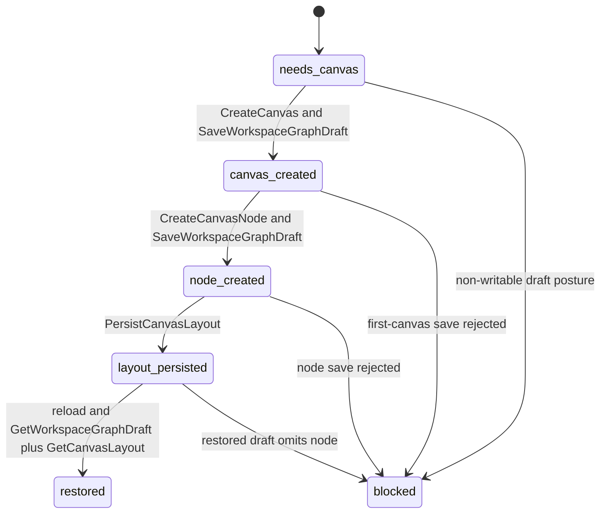
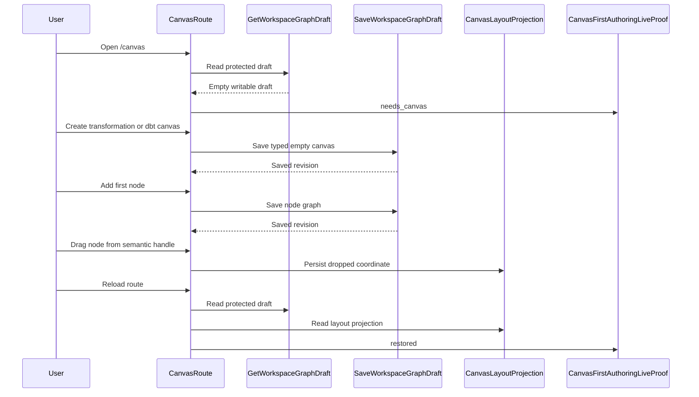

# Canvas First Authoring Live Proof Component

## Purpose

This component defines the target design for `TF-E2-M-C`.

It owns the semantic proof that Canvas can move from a clean protected draft
read to the first typed canvas, first node, persisted drag position, and
restored route state through the live runtime. It exists to keep product
acceptance, unit tests, architecture tests, and Cypress coverage aligned on the
same feature boundary.

## Governing Sources

- `AGENTS.md`
- `docs/planning/status/governance-document-rule-inventory.md`
- `docs/guides/ai-work-protocol.md`
- `docs/architecture/command-query-rail-governance.md`
- `docs/architecture/fowler-opportunity-planning-governance.md`
- `docs/planning/state/agent-lane-e.yaml`
- `docs/planning/proposals/mandatory/frontend-and-ux/tf-e2-m-c-first-canvas-first-node-live-proof-implementation-plan-20260501.md`
- `docs/planning/proposals/mandatory/frontend-and-ux/tf-e2-k-playground-complete-cycle-stories-20260424.md`
- `docs/architecture/components/web/graph/canvas-layout-persistence-component.md`
- `docs/architecture/components/web/graph/canvas-draft-access-posture-component.md`
- `packages/@dvt/contracts/src/contracts/planner/WorkspaceGraphDraft.v1.ts`

## Owned Concern

Owned concern: describe and verify the route-local product transition from an
empty authoritative Canvas draft to a restored first authored graph.

The component does not own:

- protected runtime authentication;
- backend workspace graph draft storage;
- planner preview or run-start behavior;
- plugin execution behavior;
- React Flow rendering internals;
- tenant or project onboarding.

Those concerns stay behind their existing ports and component guides.

## Closed Defaults

The component treats the first-node defaults as domain facts for this feature,
not as implementation-time choices.

| Canvas kind      | First node kind | First node id  | First node label | Registration source                                |
| ---------------- | --------------- | -------------- | ---------------- | -------------------------------------------------- |
| `transformation` | `dvt:source`    | `dvt-source-1` | `Source 1`       | `apps/web/src/app/plugins/dvt/dvtContributions.ts` |
| `dbt`            | `dbt:source`    | `dbt-source-1` | `Source 1`       | `apps/web/src/app/plugins/dbt/dbtContributions.ts` |

`canvasAuthoringNodeCommand.ts` owns the id and label construction. This
component guide fixes the expected first values so the implementation is
mechanical and tests cannot pick a different node kind.

## Public API

The implementation introduces one pure proof module.

| API                                           | Owner                              | Responsibility                                                         |
| --------------------------------------------- | ---------------------------------- | ---------------------------------------------------------------------- |
| `CanvasFirstAuthoringLiveProof`               | `canvasFirstAuthoringLiveProof.ts` | Closed discriminated state for first-authoring proof.                  |
| `CanvasFirstAuthoringLiveProofInput`          | `canvasFirstAuthoringLiveProof.ts` | Named input object for draft, active canvas, node, layout, and reload. |
| `CanvasFirstAuthoringLiveProofTransition`     | `canvasFirstAuthoringLiveProof.ts` | Allowed transition names used by tests and diagnostics.                |
| `deriveCanvasFirstAuthoringLiveProof(input)`  | `canvasFirstAuthoringLiveProof.ts` | Pure decision function for current proof state.                        |
| `isCanvasFirstAuthoringProofComplete(proof)`  | `canvasFirstAuthoringLiveProof.ts` | Boolean completion helper for tests and route diagnostics.             |
| `assertCanvasFirstAuthoringInvariant(proof)`  | `canvasFirstAuthoringLiveProof.ts` | Test helper that fails on impossible transition combinations.          |
| `resolveLiveFirstAuthoringWorkspaceSession()` | `canvasFirstAuthoring.ts`          | Cypress-only test-owned workspace session resolver.                    |
| `assertLiveFirstAuthoringDraftScopeIsClean()` | `canvasFirstAuthoring.ts`          | Cypress-only preflight that fails dirty scopes without mutating them.  |

The API is intentionally passive. It does not mutate graph state, call HTTP,
call TanStack Query, or read browser storage.

## Command And Query Rails

| Rail                      | Type    | DDD owner                             | Component rule                                                 |
| ------------------------- | ------- | ------------------------------------- | -------------------------------------------------------------- |
| `GetWorkspaceGraphDraft`  | query   | `WorkspaceGraphDraft` read boundary   | source of clean, created, and restored authoritative truth     |
| `CreateCanvas`            | command | `CanvasDocument` aggregate            | creates the first typed document from `needs_canvas`           |
| `CreateCanvasNode`        | command | `CanvasAuthoringGraph` aggregate      | creates a node inside an existing active canvas                |
| `SaveWorkspaceGraphDraft` | command | `WorkspaceGraphDraft` write boundary  | persists document and node graph through existing CAS behavior |
| `PersistCanvasLayout`     | command | `CanvasLayoutProjection` value object | persists drag-stop coordinates outside graph authority         |
| `GetCanvasLayout`         | query   | `CanvasLayoutProjection` value object | restores coordinates after route revisit or hard reload        |

No new command or query may be implemented for this component unless the
implementation plan and repo command-query catalog are updated first.

## DDD Objects

| Object                          | Type                 | Invariant                                                        |
| ------------------------------- | -------------------- | ---------------------------------------------------------------- |
| `WorkspaceGraphDraft`           | Aggregate boundary   | only protected draft reads provide route graph authority         |
| `CanvasDocument`                | Aggregate            | first canvas is typed and created once from empty draft truth    |
| `CanvasAuthoringGraph`          | Aggregate            | nodes cannot exist without an active canvas document             |
| `CanvasNodeDraft`               | Entity               | node id, type, and canvas ownership survive save and reload      |
| `CanvasLayoutProjection`        | Value object         | coordinates are renderer-local and never replace graph authority |
| `CanvasFirstAuthoringLiveProof` | Domain service model | transition state is pure, closed, and covered by tests           |
| `CanvasDraftAccessPosture`      | Policy model         | commands execute only when draft posture is writable             |

## Invariants

- A clean startup with no authoritative draft must render the create-canvas
  entrypoint and no seeded project nodes.
- `CreateCanvas` is valid only from `needs_canvas` with writable draft posture.
- `CreateCanvasNode` is valid only after the first-canvas draft save settles.
- `SaveWorkspaceGraphDraft` remains the only graph-authoritative write.
- `PersistCanvasLayout` stores renderer coordinates only.
- Drag persistence uses the drag-stop payload coordinate, not stale React Flow
  node arrays.
- `CANVAS_NODE_DRAG_HANDLE_SELECTOR` points to a visible semantic handle inside
  the node shell, not to the whole node card.
- The restored route state must be derived from a real protected draft query
  and route-local layout read.
- Cypress proof must not intercept draft read or write endpoints.
- Cypress proof must not seed success with a direct draft `PUT` before the UI
  create command runs.

## Transitions

## Consumers

- `CanvasPlaygroundHost.tsx` consumes first-authoring route state but does not
  own proof logic.
- `useCanvasController.ts` orchestrates existing authoring commands and passes
  proof inputs to tests and diagnostics.
- `useCanvasNodeAuthoringHandlers.ts` sends first-node command intent through
  controller seams.
- `canvasNodeMapper.ts` owns the React Flow drag-handle selector.
- `DbtNodeComponent.tsx` renders the visible node drag handle consumed by the
  selector.
- `useCanvasLayoutPersistence.ts` persists route-local coordinates.
- `canvasStartupAndDraftRecovery.architecture.test.ts` guards semantic
  ownership and prevents seeded startup nodes.
- `canvas-first-authoring-live.cy.ts` proves the user-visible live journey.

## Negative Coverage

The implementation must prove these failures:

- duplicate first-canvas creation is rejected when an authoritative document
  already exists;
- first-node creation is rejected before first-canvas save settles;
- first-node creation using any kind other than `dvt:source` for
  transformation or `dbt:source` for dbt fails proof;
- read-only, unauthenticated, forbidden-scope, pending, and format-error draft
  postures block first authoring;
- drag attempts outside the intended handle do not count as first-authoring
  proof;
- restored draft without the created node fails proof;
- Cypress fails if draft endpoints are intercepted instead of using the live
  protected runtime.
- Cypress fails if the first-authored draft is pre-seeded through direct
  `PUT /workspace/graph/draft` rather than created through the UI path.

## Fowler And SOLID Alignment

- SRP: proof logic stays in one pure module; controller and templates only
  orchestrate and render.
- Open/Closed: adding a new canvas type updates command data and tests without
  changing proof semantics.
- Hexagonal boundary: protected draft read/write and local layout projection
  remain ports consumed by route code.
- DDD: document, graph, node, layout projection, and proof state are named
  objects with explicit invariants.
- Fowler walking skeleton: one real product route crosses browser, route,
  query, command, persistence, and reload boundaries.
- Interaction boundary: dragging is a semantic node-shell affordance, not an
  accidental side effect of the whole card being draggable.

## Drift Watch

- Seed data in Canvas startup must not replace clean first-authoring proof.
- Cypress fixtures must not intercept the authoritative draft endpoints.
- Cypress setup must not write the authoritative draft before the first UI
  create command.
- Route-local layout state must not become graph authority.
- The drag-handle selector must not drift back to the whole node card.
- Copy-only changes must not claim this feature is implemented.
- Planner preview and run behavior must stay outside this component unless a
  new plan extends the command-query rails.
